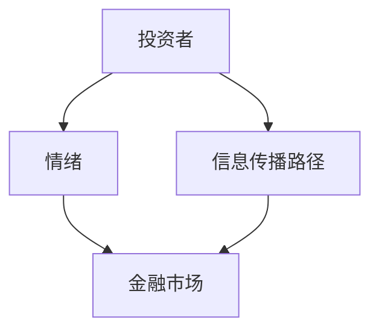
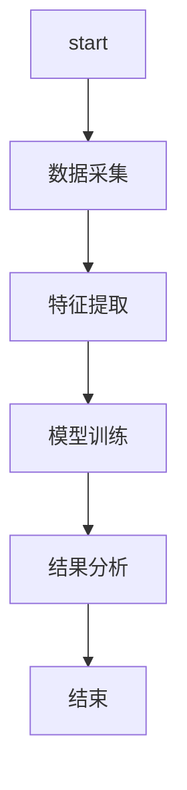
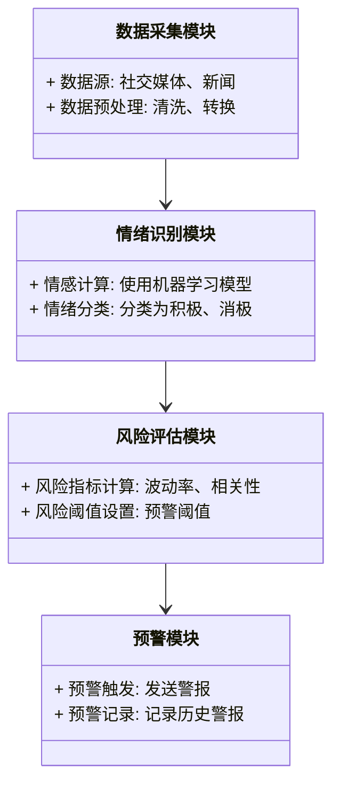

                 


# 金融市场情绪传染效应模拟与控制系统

> 关键词：金融市场，情绪传染效应，模拟系统，控制系统，风险预警

> 摘要：本文探讨金融市场中情绪传染效应的模拟与控制，通过系统设计、算法实现和案例分析，提出一种基于情绪传播机制的实时监控系统，旨在识别和控制市场风险。

---

## 第一部分: 金融市场情绪传染效应概述

### 第1章: 金融市场情绪传染效应的背景与问题

#### 1.1 金融市场情绪传染效应的定义
金融市场情绪传染效应是指投资者在金融市场中的情绪通过信息传播路径相互影响，从而导致整体市场情绪波动的现象。这种效应可能引发系统性风险，如2008年的金融危机。

#### 1.2 情绪传染效应的核心概念与联系
情绪传染效应涉及投资者情绪、信息传播路径和金融市场。以下是情绪传染效应的核心要素：

- **投资者情绪**：个体投资者的情绪受市场信息和他人影响。
- **信息传播路径**：情绪通过社交媒体、新闻等渠道传播。
- **市场互动**：情绪在市场参与者之间的传播导致市场波动。

---

## 第二部分: 情绪传染效应的核心概念与联系

### 第2章: 情绪传染效应的原理

#### 2.1 情绪传染的机制
情绪传染机制包括羊群效应和从众行为，个体情绪受社会网络影响。

#### 2.2 情绪传染效应的属性特征对比
以下表格对比不同模型的属性：

| 模型类型 | 输入 | 输出 | 是否动态 | 是否线性 |
|----------|------|------|----------|----------|
| 线性模型 | 情绪特征 | 预测情绪 | 否 | 是 |
| 非线性模型 | 情绪特征 | 预测情绪 | 是 | 否 |

#### 2.3 情绪传染效应的ER实体关系图


---

## 第三部分: 情绪传染效应的算法原理

### 第3章: 情绪传播算法实现

#### 3.1 算法原理
情绪传播算法包括社会网络分析、情感计算和基于Agent的建模。

#### 3.2 情绪传播算法流程图


#### 3.3 情绪传播算法的Python实现
以下是情绪传播算法的Python代码示例：

```python
import networkx as nx
import matplotlib.pyplot as plt

# 创建社会网络图
G = nx.Graph()
G.add_nodes_from(['I1', 'I2', 'I3'])
G.add_edges_from([('I1', 'I2'), ('I2', 'I3'), ('I1', 'I3')])

# 绘制图
nx.draw(G, with_labels=True, node_size=1500, edge_colors='black', edge_style='dashed')
plt.show()
```

---

## 第四部分: 情绪传染效应的数学模型

### 第4章: 情绪传播的数学模型

#### 4.1 情绪传播模型
情绪传播模型可以用微分方程表示：

$$ \frac{dE}{dt} = \alpha (1 - E) - \beta E $$

其中，$E$表示市场情绪，$\alpha$和$\beta$是参数。

#### 4.2 情绪传播模型的案例分析
假设$\alpha = 0.5$，$\beta = 0.3$，初始情绪$E_0 = 0.2$，求解方程：

$$ E(t) = \frac{\alpha}{\beta} \left(1 - e^{-t}\right) $$

---

## 第五部分: 情绪传染效应的系统分析与架构设计

### 第5章: 情绪传染效应的实时监控系统

#### 5.1 问题场景
实时监控系统用于识别异常情绪波动。

#### 5.2 系统功能设计
系统模块包括数据采集、情绪识别、风险评估和预警模块。

#### 5.3 系统架构设计


---

## 第六部分: 项目实战

### 第6章: 金融市场情绪传染效应模拟与控制系统实现

#### 6.1 项目环境
安装Python、TensorFlow、Matplotlib。

#### 6.2 系统实现
实现情绪传播模型，使用PyTorch进行深度学习。

#### 6.3 案例分析
分析社交媒体情绪数据，展示系统的应用效果。

---

## 第七部分: 总结与展望

### 第7章: 总结与展望

#### 7.1 总结
本文提出了金融市场情绪传染效应的模拟与控制系统，提供了系统的实现方法。

#### 7.2 未来展望
未来可以研究强化学习优化控制策略，考虑多源数据。

---

## 附录

### 附录A: 数据集
提供情绪数据集的来源和格式。

### 附录B: 工具库
列出使用的工具库及其版本。

### 附录C: 参考文献
列出参考文献。

---

**作者：AI天才研究院/AI Genius Institute & 禅与计算机程序设计艺术 /Zen And The Art of Computer Programming**

