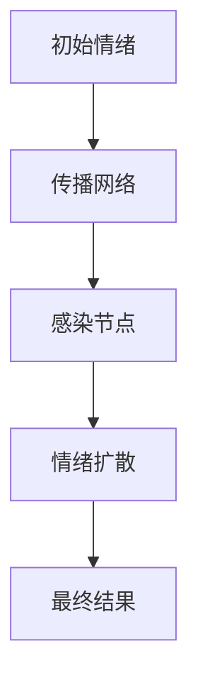
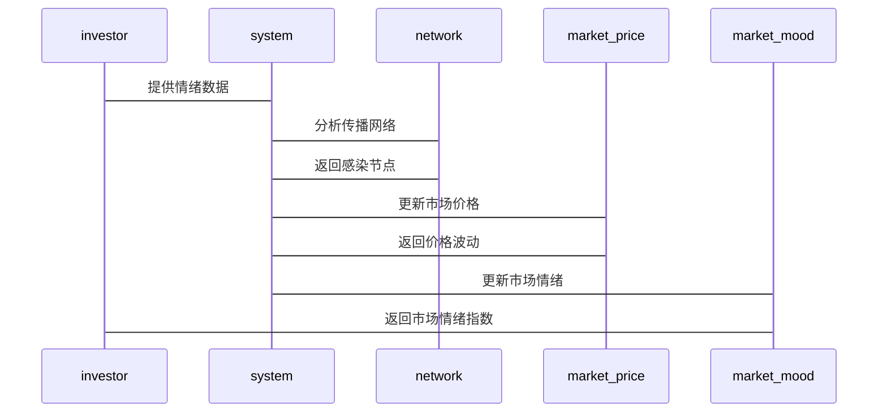

                 


# 《金融市场情绪传染效应模拟系统》

## 关键词：
- 金融市场情绪传染
- 情绪传播模型
- 金融网络分析
- 复杂系统模拟
- 金融市场波动预测

## 摘要：
金融市场中的情绪传染效应是一个复杂但重要的现象，它描述了市场参与者的情绪如何相互影响并最终导致市场波动。本文通过构建一个基于社会网络分析和复杂系统的数学模型，深入探讨了情绪传染的传播机制，并设计了一个完整的模拟系统。文章从理论基础、算法实现到系统架构进行了全面分析，并通过实际案例展示了系统的应用价值。

---

# 目录

## 第一部分：金融市场情绪传染效应概述

### 第1章：情绪传染效应的背景与定义

#### 1.1 问题背景与研究意义
- 1.1.1 金融市场波动的复杂性
- 1.1.2 情绪在金融市场的传播机制
- 1.1.3 情绪传染效应的研究价值

#### 1.2 情绪传染效应的定义与特征
- 1.2.1 情绪传染效应的定义
- 1.2.2 情绪传染的传播路径
- 1.2.3 情绪传染效应的边界与外延

#### 1.3 核心概念与核心要素
- 1.3.1 核心概念的结构化分析
- 1.3.2 情绪传染效应的核心要素组成
- 1.3.3 情绪传染效应与其他金融现象的对比

---

## 第二部分：情绪传染效应的核心概念与联系

### 第2章：情绪传染效应的原理分析

#### 2.1 情绪传染效应的传播模型
- 2.1.1 情绪传播的社会网络分析
- 2.1.2 情绪传染的数学模型
- 2.1.3 情绪传播的动力学特征

#### 2.2 核心概念的属性特征对比
- 2.2.1 情绪传染与信息传播的对比
- 2.2.2 情绪传染与价格波动的关系
- 2.2.3 情绪传染与市场参与者的互动

#### 2.3 情绪传染效应的ER实体关系图


---

## 第三部分：情绪传染效应的算法原理

### 第3章：情绪传染效应的传播模型

#### 3.1 情绪传播的基本模型
- 3.1.1 情绪传播的基本路径
- 3.1.2 情绪传播的扩散方程
- 3.1.3 情绪传播的网络结构特征

#### 3.2 情绪传染效应的算法实现


#### 3.3 情绪传播的数学模型
- 3.3.1 情绪传播的基本方程
  $$i_t = i_{t-1} + \beta (S_{t-1} - i_{t-1})$$
  
- 3.3.2 情绪传播的扩散方程
  $$\frac{di}{dt} = \beta S - \gamma i$$

- 3.3.3 情绪传播的网络模型
  $$P(k) = \frac{e^{-\lambda k}}{\lambda}$$

---

## 第四部分：情绪传染效应的系统分析与架构设计

### 第4章：系统功能设计与架构实现

#### 4.1 问题场景介绍
- 情绪传染效应模拟系统的应用场景
- 系统的目标与功能需求

#### 4.2 系统功能设计
- 领域模型类图设计
  ```mermaid
  classDiagram
  class 投资者情绪 {
    +float 情绪指数
    +float 传播系数
    +float 感染率
    -void 计算情绪传播()
    -void 更新情绪指数()
  }
  class 交易行为 {
    +float 交易量
    +float 价格波动
    -void 分析交易行为()
    -void 更新价格波动()
  }
  class 市场价格 {
    +float 当前价格
    +float 涨跌幅
    -void 计算价格变化()
  }
  class 市场情绪 {
    +float 市场情绪指数
    -void 更新市场情绪()
  }
  投资者情绪 --> 交易行为
  交易行为 --> 市场价格
  市场价格 --> 市场情绪
  市场情绪 --> 投资者情绪
  ```

#### 4.3 系统架构设计
- 系统架构图
  ```mermaid
  graph LR
  A[投资者情绪] --> B[传播网络]
  B --> C[感染节点]
  C --> D[情绪扩散]
  D --> E[最终结果]
  ```

#### 4.4 系统接口设计
- 系统接口设计
  ```plaintext
  + 输入：投资者情绪数据
  + 输出：市场情绪指数
  + 接口：情绪传播计算、价格波动分析
  ```

#### 4.5 系统交互流程图


---

## 第五部分：项目实战与案例分析

### 第5章：情绪传染效应模拟系统的实现

#### 5.1 环境安装与配置
- Python环境的安装与配置
- 需要的第三方库安装（如networkx、matplotlib）

#### 5.2 系统核心实现
- 情绪传播算法实现
  ```python
  import networkx as nx
  import matplotlib.pyplot as plt

  def emotional_spread(G, beta):
      infected = set()
      initial_infected = list(G.nodes())[0]
      infected.add(initial_infected)
      G.nodes[initial_infected]['state'] = 'infected'

      while True:
          new_infected = []
          for node in G.nodes():
              if node not in infected and G.nodes[node]['state'] == 'susceptible':
                  infected_neighbors = [n for n in G.neighbors(node) if G.nodes[n]['state'] == 'infected']
                  if len(infected_neighbors) > 0:
                      prob_infection = beta * len(infected_neighbors)
                      if prob_infection >= 1:
                          new_infected.append(node)
          if not new_infected:
              break
          for node in new_infected:
              infected.add(node)
              G.nodes[node]['state'] = 'infected'

          nx.draw(G, node_color=['green' if node in infected else 'red' for node in G.nodes()], with_labels=True)
          plt.show()
  ```

#### 5.3 代码解读与分析
- 情绪传播算法的实现细节
- 算法的运行流程与结果解读

#### 5.4 案例分析
- 具体案例的模拟过程
- 模拟结果的分析与解释

#### 5.5 项目小结
- 项目实现的关键点
- 系统的优缺点与改进建议

---

## 第六部分：最佳实践与总结

### 第6章：最佳实践与经验分享

#### 6.1 小结
- 情绪传染效应模拟系统的核心内容回顾

#### 6.2 注意事项
- 模拟系统使用的注意事项
- 数据来源与模型假设的局限性

#### 6.3 拓展阅读
- 相关领域的进一步学习方向
- 推荐的文献与资源

---

## 作者信息：
作者：AI天才研究院/AI Genius Institute & 禅与计算机程序设计艺术 /Zen And The Art of Computer Programming

---

以上是一个详细的《金融市场情绪传染效应模拟系统》的目录大纲，涵盖从理论分析到系统实现的各个方面，内容详实且结构清晰。

