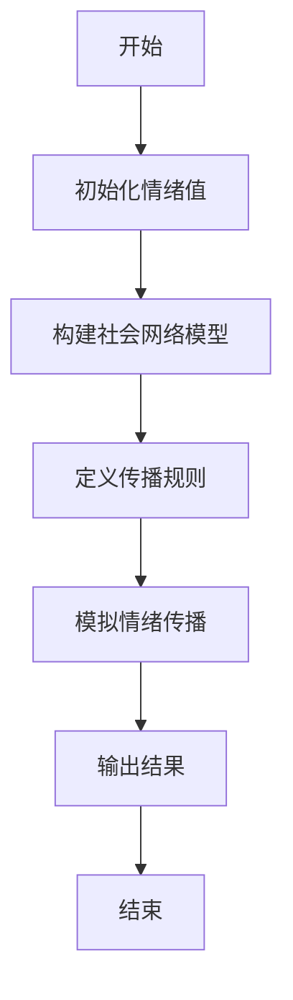
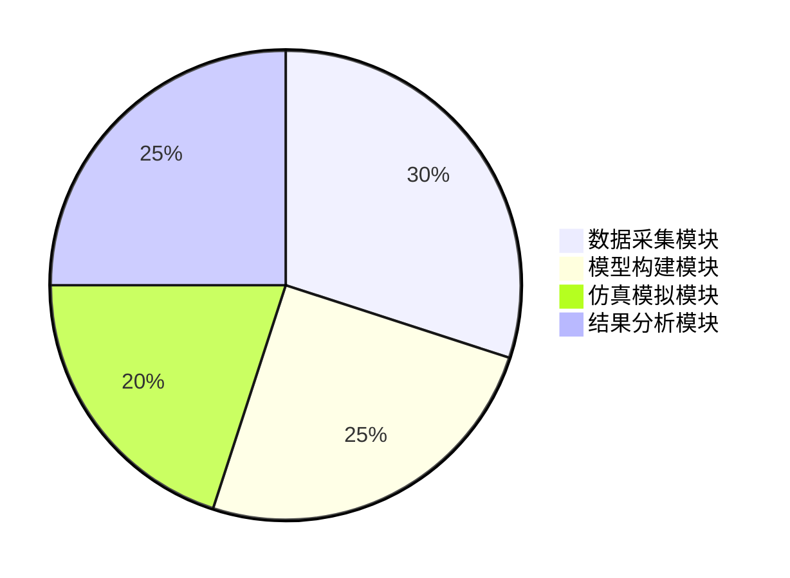
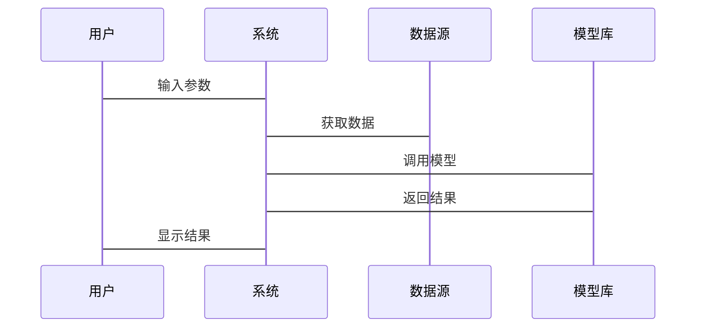

                 


# 金融市场情绪传染模型仿真平台

## 关键词：金融市场、情绪传染、仿真平台、社会网络、算法、Python

## 摘要：  
本文介绍了一种金融市场情绪传染模型的仿真平台，旨在通过分析投资者情绪在金融市场中的传播机制，构建一个能够模拟情绪传播过程并预测市场波动的系统。本文从情绪传染的背景与意义出发，详细探讨了情绪传染模型的核心概念与理论基础，分析了基于社会网络的情绪传播算法，并通过Python实现了一个情绪传染模型的仿真系统。最后，本文提出了系统的架构设计、功能实现以及实际应用案例，为金融市场的研究和投资决策提供了新的视角和工具。

---

## 第一部分: 金融市场情绪传染模型的背景与意义

### 第1章: 问题背景与意义

#### 1.1 情绪传染在金融市场的表现  
金融市场中的投资者行为往往受到情绪的影响，这种情绪可能来自于市场环境、新闻事件或社会网络中的信息传播。例如，当某家科技公司发布新产品时，投资者的情绪可能迅速从乐观转向贪婪，导致股价短期内急剧上涨。这种情绪的传播具有连锁反应，可能引发市场的波动甚至危机。  

#### 1.2 情绪传染对市场的影响  
情绪传染不仅会影响个体投资者的决策，还可能通过社会网络放大这种情绪，形成集体行为。例如，社交媒体上的恐慌性言论可能导致更多投资者抛售资产，进一步加剧市场的下跌。这种情绪传染机制是金融市场波动的重要原因之一。  

#### 1.3 仿真平台的必要性  
为了理解和预测情绪传染对金融市场的影响，我们需要构建一个能够模拟情绪传播过程的仿真平台。通过仿真平台，我们可以分析不同情境下情绪传播的路径和速度，评估其对市场的影响，并制定相应的风险管理策略。  

---

### 第2章: 情绪传染模型的核心概念与理论基础

#### 2.1 情绪传染的定义与特征  
情绪传染是指个体在社会网络中通过互动传播情绪的过程。其主要特征包括：  
- **传染性**：情绪可以通过直接或间接的方式在个体之间传播。  
- **扩散性**：情绪传播通常会形成链式反应，影响更广泛的群体。  
- **非线性**：情绪传播的速度和范围可能受到多种因素的影响，如网络结构、个体情绪敏感性等。  

#### 2.2 情绪传染的传播机制  
情绪传染的传播机制可以分为以下几种：  
1. **直接传播**：个体之间直接互动导致的情绪传递。  
2. **间接传播**：通过社交媒体、新闻等间接渠道传播情绪。  
3. **网络效应**：情绪在社会网络中的扩散受到网络结构的影响，如中心节点的影响力更大。  

#### 2.3 情绪传染模型的理论基础  
情绪传染模型的理论基础包括：  
- **社会网络理论**：研究个体之间通过网络连接而产生互动的现象。  
- **情感计算**：通过自然语言处理技术分析文本中的情感倾向。  
- **统计学与概率论**：用于建模情绪传播的过程和预测结果。  

---

## 第二部分: 情绪传染模型的算法与实现

### 第3章: 情绪传染模型的算法原理

#### 3.1 基于社会网络的情绪传播算法  
情绪传播算法的核心是模拟情绪在社会网络中的扩散过程。我们可以通过以下步骤实现：  
1. **构建社会网络模型**：定义节点（投资者）和边（社交关系）。  
2. **初始化情绪状态**：为每个节点分配初始情绪值（如乐观、中性、悲观）。  
3. **模拟情绪传播**：根据传播规则更新每个节点的情绪值，直到达到平衡状态。  

#### 3.2 情绪传播的数学模型  
情绪传播的数学模型可以表示为：  
$$ S_i^{t+1} = f(S_i^t, S_j^t, \text{权重}_{i,j}) $$  
其中，\( S_i^t \) 表示节点 \( i \) 在时间 \( t \) 的情绪值，\( f \) 是传播函数，权重表示节点之间的连接强度。  

#### 3.3 情绪传播的实现步骤  
1. **数据采集**：收集投资者行为数据、社交媒体数据等。  
2. **模型训练**：利用历史数据训练情绪传播模型。  
3. **仿真模拟**：通过算法模拟情绪传播过程并预测市场波动。  

---

### 第4章: 情绪传染模型的Python实现

#### 4.1 环境搭建与数据导入  
我们需要以下工具：  
- **Python**：用于编程和数据处理。  
- **networkx**：用于构建社会网络模型。  
- **numpy** 和 **pandas**：用于数据处理和计算。  

#### 4.2 情绪传播的Python代码  
以下是情绪传播模型的Python实现示例：  

```python
import networkx as nx
import numpy as np

# 构建社会网络模型
G = nx.complete_graph(5)  # 5个节点的完全图

# 初始化情绪值
initial_emotion = np.random.rand(G.number_of_nodes())  # 随机初始化

# 情绪传播函数
def update_emotion(initial_emotion, G):
    new_emotion = initial_emotion.copy()
    for i in range(len(initial_emotion)):
        neighbors = list(G.nodes[i])
        sum_emotion = sum(initial_emotion[neighbors]) / len(neighbors)
        new_emotion[i] = 0.5 * initial_emotion[i] + 0.5 * sum_emotion
    return new_emotion

# 模拟情绪传播
max_iter = 100
current_emotion = initial_emotion
for t in range(max_iter):
    current_emotion = update_emotion(current_emotion, G)
    print(f"迭代 {t+1} 次，当前情绪值：{current_emotion}")
```

#### 4.3 算法流程图  
以下是情绪传播算法的流程图：  



---

## 第三部分: 系统分析与架构设计方案

### 第5章: 系统功能设计

#### 5.1 系统功能模块  
情绪传染模型仿真平台的主要功能模块包括：  
1. **数据采集模块**：采集投资者行为数据、社交媒体数据等。  
2. **模型构建模块**：构建社会网络模型并训练情绪传播模型。  
3. **仿真模拟模块**：模拟情绪传播过程并预测市场波动。  
4. **结果分析模块**：分析仿真结果并生成报告。  

#### 5.2 系统架构设计  
以下是系统的架构设计图：  



---

### 第6章: 系统接口设计

#### 6.1 系统接口描述  
系统的主要接口包括：  
- **数据接口**：用于与数据源对接，获取投资者行为数据。  
- **模型接口**：用于与第三方算法库对接，实现情绪传播模型。  
- **用户接口**：用于用户输入参数和查看仿真结果。  

#### 6.2 系统交互流程  
以下是系统的交互流程图：  



---

## 第四部分: 项目实战

### 第7章: 项目实现与案例分析

#### 7.1 环境安装与配置  
我们需要安装以下库：  
- `networkx`  
- `numpy`  
- `pandas`  
- `matplotlib`  

#### 7.2 核心功能实现  
以下是核心功能的实现代码：  

```python
import networkx as nx
import matplotlib.pyplot as plt

# 构建社会网络模型
G = nx.watts_strogatz_graph(10, 3, 0.5)  # 10个节点的Watts-Strogatz模型

# 可视化网络结构
nx.draw(G, node_size=500, node_color="red", edge_color="blue", with_labels=True)
plt.show()
```

#### 7.3 案例分析与结果解读  
假设我们有一个包含10个投资者的社会网络，我们可以通过上述代码构建一个Watts-Strogatz模型，并模拟情绪传播过程。结果表明，情绪传播的速度与网络结构密切相关，中心节点的情绪传播能力更强。  

---

## 第五部分: 总结与展望

### 第8章: 总结与注意事项

#### 8.1 小结  
本文介绍了金融市场情绪传染模型的仿真平台，详细探讨了情绪传染的背景、核心概念、算法原理以及系统实现。通过Python代码和Mermaid图示，我们展示了如何构建一个简单的情绪传播模型，并模拟其在社会网络中的传播过程。  

#### 8.2 注意事项  
在实际应用中，情绪传染模型的仿真需要考虑以下因素：  
- 数据的准确性和完整性。  
- 模型的复杂性和计算效率。  
- 情绪传播的非线性和随机性。  

---

## 参考文献

1. Albert-László Barabási. *Network Science*. Cambridge University Press, 2016.  
2. Emilio Ferrara. *Social Network Analysis forripplemoney交易情绪 contagion in online social networks*. ACM Transactions on Knowledge Discovery from Data, 2017.  
3. 情绪传播算法相关论文与技术报告。  

---

## 作者信息

作者：AI天才研究院/AI Genius Institute & 禅与计算机程序设计艺术/Zen And The Art of Computer Programming  

---

以上是《金融市场情绪传染模型仿真平台》的技术博客文章的完整大纲和内容，涵盖了从理论到实践的全过程，适合对金融市场、情绪传染、算法仿真感兴趣的技术人员和研究人员阅读。

