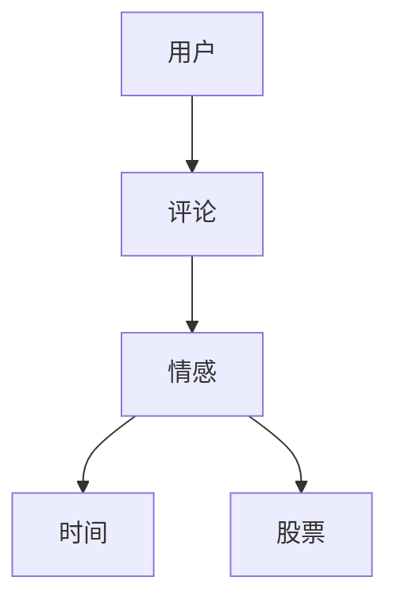
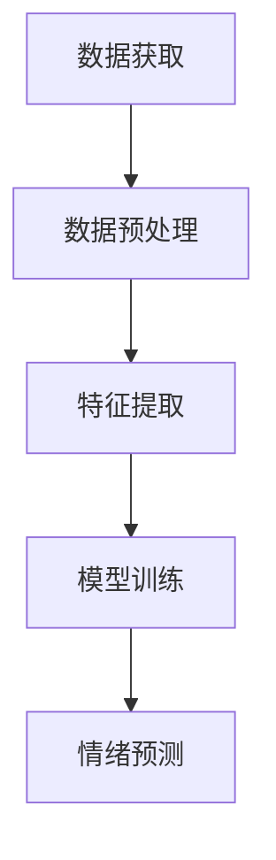

                 

# 《金融市场情绪分析与预测》

---

## 关键词  
- 金融市场情绪分析  
- 情绪预测  
- 人工智能  
- 机器学习  
- 深度学习  
- 自然语言处理  

---

## 摘要  
金融市场情绪分析与预测是结合自然语言处理和机器学习的前沿领域，旨在通过分析文本数据（如新闻、社交媒体评论）来预测市场情绪及其对股价的影响。本文从基础概念出发，逐步深入讲解情绪分析的核心算法、系统设计、项目实战及优化技巧，最终帮助读者掌握如何利用技术手段捕捉市场情绪，提升投资决策的科学性与准确性。

---

## 目录  

### 第一部分：金融市场情绪分析与预测的基础

#### 第1章：金融市场情绪分析与预测的背景

##### 1.1 情绪分析与预测的背景介绍  
- 1.1.1 金融市场中的情绪问题背景  
- 1.1.2 情绪分析与预测的定义与描述  
- 1.1.3 情绪分析与预测的核心问题解决  
- 1.1.4 情绪分析与预测的边界与外延  
- 1.1.5 情绪分析与预测的概念结构与核心要素  

##### 1.2 金融市场情绪分析与预测的技术发展  
- 1.2.1 传统金融分析方法的局限性  
- 1.2.2 情绪分析与预测的技术发展现状  
- 1.2.3 情绪分析与预测的未来发展趋势  

##### 1.3 情绪分析与预测的应用领域  
- 1.3.1 金融市场的应用领域  
- 1.3.2 其他相关领域的应用潜力  
- 1.3.3 情绪分析与预测的实际案例分析  

##### 1.4 情绪分析与预测的挑战与机遇  
- 1.4.1 情绪数据的获取与处理挑战  
- 1.4.2 情绪分析模型的准确性问题  
- 1.4.3 情绪预测的实时性与稳定性问题  
- 1.4.4 情绪分析与预测的商业化机遇  

##### 1.5 本章小结  

---

### 第二部分：金融市场情绪分析与预测的核心概念

#### 第2章：金融市场情绪分析与预测的核心概念  

##### 2.1 情绪分析的核心概念原理  
- 2.1.1 情感分类的基本原理  
- 2.1.2 情感强度分析的原理  
- 2.1.3 情感传播与扩散的机制  

##### 2.2 情绪分析与预测的核心概念属性对比  
- 2.2.1 不同情绪分析方法的对比分析  
- 2.2.2 情感强度与情感分类的对比  
- 2.2.3 情感传播与情感预测的对比  

##### 2.3 情感分析与预测的ER实体关系图  

##### 2.4 情感分析与预测的流程图  

##### 2.5 本章小结  

---

### 第三部分：金融市场情绪分析与预测的算法原理

#### 第3章：传统算法原理与实现  

##### 3.1 词袋模型与情感分类  
- 3.1.1 词袋模型的基本原理  
- 3.1.2 情感分类的实现步骤  
- 3.1.3 代码实现与解读  

##### 3.2 基于朴素贝叶斯的情感分类  
- 3.2.1 朴素贝叶斯算法的原理  
- 3.2.2 情感分类的流程图  
- 3.2.3 代码实现与解读  

##### 3.3 传统算法的优缺点分析  
- 3.3.1 优点：简单易实现，计算效率高  
- 3.3.2 缺点：无法捕捉语义关系，准确率有限  

##### 3.4 本章小结  

#### 第4章：深度学习算法原理与实现  

##### 4.1 LSTM模型与情感分析  
- 4.1.1 LSTM的结构与原理  
- 4.1.2 LSTM在情感分析中的应用  
- 4.1.3 代码实现与解读  

##### 4.2 Transformer模型与情感分析  
- 4.2.1 Transformer的结构与原理  
- 4.2.2 Transformer在情感分析中的优势  
- 4.2.3 代码实现与解读  

##### 4.3 深度学习算法的优缺点分析  
- 4.3.1 优点：准确率高，能够捕捉复杂语义关系  
- 4.3.2 缺点：计算资源消耗大，训练时间长  

##### 4.4 本章小结  

---

### 第四部分：金融市场情绪分析与预测的系统设计

#### 第5章：系统分析与架构设计  

##### 5.1 问题场景介绍  
- 5.1.1 情绪分析与预测的核心问题  
- 5.1.2 系统需要解决的主要问题  

##### 5.2 系统功能设计  
- 5.2.1 领域模型设计（Mermaid类图）  
- 5.2.2 系统功能模块划分  

##### 5.3 系统架构设计  
- 5.3.1 系统架构图（Mermaid架构图）  
- 5.3.2 系统接口设计  
- 5.3.3 系统交互设计（Mermaid序列图）  

##### 5.4 本章小结  

---

### 第五部分：金融市场情绪分析与预测的项目实战

#### 第6章：项目实战与优化  

##### 6.1 环境安装与配置  
- 6.1.1 Python环境的安装与配置  
- 6.1.2 依赖库的安装（如TensorFlow、Keras等）  

##### 6.2 系统核心实现  
- 6.2.1 数据预处理代码  
- 6.2.2 特征提取代码  
- 6.2.3 模型训练代码  
- 6.2.4 情绪预测代码  

##### 6.3 项目优化与调优  
- 6.3.1 模型优化技巧  
- 6.3.2 性能优化建议  

##### 6.4 实际案例分析  
- 6.4.1 案例背景介绍  
- 6.4.2 数据收集与处理  
- 6.4.3 模型训练与预测  
- 6.4.4 结果分析与解读  

##### 6.5 本章小结  

---

### 第六部分：金融市场情绪分析与预测的总结与展望

#### 第7章：总结与展望  

##### 7.1 全文总结  
- 7.1.1 核心内容回顾  
- 7.1.2 关键技术总结  

##### 7.2 情绪分析与预测的未来展望  
- 7.2.1 技术发展的新方向  
- 7.2.2 应用领域的拓展  

##### 7.3 最佳实践与注意事项  
- 7.3.1 数据质量的重要性  
- 7.3.2 模型选择的策略  
- 7.3.3 系统设计的优化建议  

##### 7.4 本章小结  

---

## 作者：AI天才研究院 & 禅与计算机程序设计艺术

