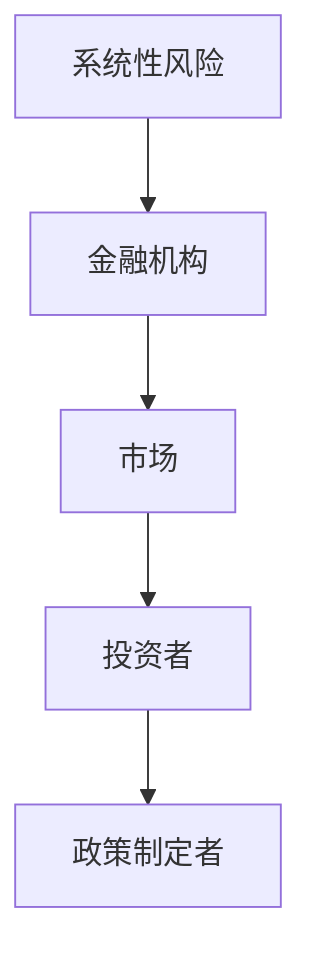
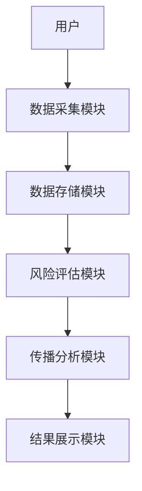
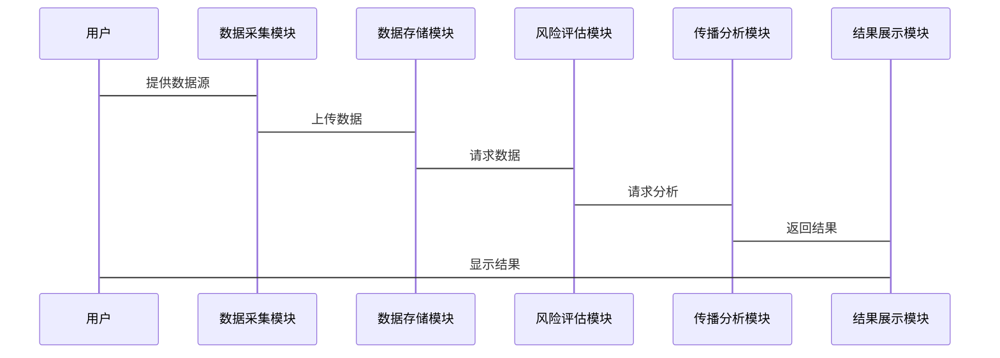

                 


# 《金融市场系统性风险评估工具》

---

## 文章关键词  
金融市场、系统性风险、风险评估、算法、数据科学、金融稳定性

---

## 摘要  
本文深入探讨了金融市场中系统性风险的评估工具及其应用场景。通过分析系统性风险的核心概念、评估算法、系统架构和实际案例，本文为金融从业者、数据科学家和政策制定者提供了理论支持和实践指导。文章结合数学模型、算法流程图和代码示例，详细阐述了如何利用现代技术手段构建有效的系统性风险评估工具，以应对金融市场中的潜在风险。

---

# 第一部分: 系统性风险概述

## 第1章: 系统性风险的基本概念

### 1.1 系统性风险的定义与特征  
系统性风险是指可能影响整个金融系统的风险，具有广泛性、传染性和难以分散的特点。它与非系统性风险（特定于单个资产或机构）不同，系统性风险会影响整个市场的稳定性。

### 1.2 系统性风险的来源  
系统性风险主要来源于以下几个方面：  
1. **市场风险**：如股票市场的波动性。  
2. **信用风险**：金融机构违约的可能性。  
3. **流动性风险**：市场参与者难以快速买卖资产的风险。  
4. **操作风险**：由于人为错误或技术故障导致的损失。

### 1.3 系统性风险的传播机制  
系统性风险的传播机制包括：  
1. **金融机构之间的传染**：一家机构的失败可能导致其他机构受到影响。  
2. **市场波动的放大效应**：恐慌情绪可能导致市场崩盘。  
3. **政策干预的影响**：不当的政策可能加剧系统性风险。

---

## 第2章: 系统性风险评估工具的背景与需求  

### 2.1 金融市场风险评估的现状  
随着金融市场的复杂化，传统的风险管理方法已不足以应对系统性风险。近年来，数据科学和人工智能技术的发展为系统性风险评估提供了新的工具和方法。

### 2.2 系统性风险评估工具的重要性  
系统性风险评估工具在以下几个方面发挥重要作用：  
1. **保护金融系统的稳定性**：通过早期预警和干预，避免系统性危机的发生。  
2. **提高金融机构的风险管理能力**：帮助机构更好地识别和应对潜在风险。  
3. **为政策制定者提供决策支持**：帮助政府制定有效的监管政策。

---

# 第二部分: 系统性风险评估的核心概念与联系

## 第3章: 系统性风险评估的核心要素  

### 3.1 系统性风险评估的框架  
系统性风险评估通常包括以下几个步骤：  
1. **风险识别**：识别可能影响金融系统的风险因素。  
2. **风险量化**：通过数学模型量化风险的影响程度。  
3. **风险传播分析**：分析风险在金融系统中的传播路径。  
4. **风险缓解策略**：制定应对风险的策略和措施。

### 3.2 核心概念的属性对比  
以下是系统性风险与非系统性风险的对比表：

| 属性         | 系统性风险               | 非系统性风险             |
|--------------|--------------------------|--------------------------|
| 影响范围       | 整个金融系统             | 单个资产或机构           |
| 传染性       | 高                      | 低                      |
| 可分散性     | 无法通过分散投资降低     | 可通过分散投资降低       |
| 示例         | 金融危机、市场崩盘       | 单一股票价格波动         |

### 3.3 实体关系图  



---

# 第三部分: 系统性风险评估的算法原理

## 第4章: 常见的系统性风险评估算法  

### 4.1 VaR（Value at Risk）模型  
VaR模型用于估计在给定置信水平下，资产组合可能遭受的最大损失。其公式为：  
$$ VaR = \text{损失金额} \times \text{置信水平} $$  

#### VaR模型的实现步骤  
1. **数据准备**：收集历史价格数据。  
2. **计算收益率**：计算资产收益率的分布。  
3. **计算VaR**：根据收益率分布计算VaR值。  

#### VaR模型的Python实现  

```python
import numpy as np

def calculate_var(data, confidence_level=0.95):
    # 计算收益率
    returns = np.log(data / data.shift(1)).dropna()
    # 排序收益率
    sorted_returns = np.sort(returns)
    # 计算VaR
    var = sorted_returns[int(len(sorted_returns) * (1 - confidence_level))]
    return var

# 示例数据
data = np.random.lognormal(mean=0, sigma=1, size=1000)
print("VaR值:", calculate_var(data))
```

### 4.2 CVaR（Conditional Value at Risk）模型  
CVaR模型是VaR模型的改进版本，用于估计在VaR水平下的平均损失。其公式为：  
$$ CVaR = \frac{1}{n} \sum_{i=k}^{n} r_i $$  
其中，$k$ 是VaR对应的分位数位置。

---

## 第5章: 系统性风险传播的网络模型  

### 5.1 系统性风险传播的网络分析  
通过构建金融机构之间的网络关系，可以分析系统性风险的传播路径。  

#### 网络模型的实现步骤  
1. **数据收集**：收集金融机构之间的交易数据。  
2. **构建网络图**：使用图论方法构建金融机构之间的关系网络。  
3. **分析传播路径**：使用网络算法（如广度优先搜索）分析风险传播路径。  

#### 网络模型的Python实现  

```python
import networkx as nx

# 创建网络图
G = nx.DiGraph()
G.add_nodes_from(["Bank1", "Bank2", "Bank3", "Bank4"])
G.add_edges_from([("Bank1", "Bank2"), ("Bank2", "Bank3"), ("Bank3", "Bank4")])

# 分析传播路径
def spread_analysis(start_node):
    visited = []
    queue = [start_node]
    while queue:
        node = queue.pop(0)
        if node not in visited:
            visited.append(node)
            for neighbor in G.neighbors(node):
                if neighbor not in visited:
                    queue.append(neighbor)
    return visited

print("传播路径:", spread_analysis("Bank1"))
```

---

# 第四部分: 系统性风险评估系统的架构设计

## 第6章: 系统架构设计  

### 6.1 系统功能设计  
系统功能包括：  
1. **数据采集模块**：收集金融市场数据。  
2. **风险评估模块**：应用VaR、CVaR等算法进行风险评估。  
3. **传播分析模块**：分析系统性风险的传播路径。  
4. **结果展示模块**：以可视化方式展示评估结果。

### 6.2 系统架构图  



---

## 第7章: 系统交互设计  

### 7.1 系统交互流程  
1. 用户输入数据源。  
2. 系统采集数据并存储。  
3. 系统应用算法进行风险评估。  
4. 系统分析传播路径并展示结果。

### 7.2 系统交互图  



---

# 第五部分: 系统性风险评估工具的实战应用

## 第8章: 项目实战  

### 8.1 环境安装  
需要安装以下工具：  
1. Python 3.x  
2. NumPy  
3. Pandas  
4. NetworkX  
5. Matplotlib  

### 8.2 核心代码实现  

```python
import numpy as np
import pandas as pd
import networkx as nx
import matplotlib.pyplot as plt

# 数据准备
data = pd.read_csv("market_data.csv")

# VaR计算
def calculate_var(data, confidence_level=0.95):
    returns = np.log(data / data.shift(1)).dropna()
    sorted_returns = np.sort(returns)
    var = sorted_returns[int(len(sorted_returns) * (1 - confidence_level))]
    return var

# 网络分析
def network_analysis(data):
    G = nx.Graph()
    nodes = data.columns.tolist()
    for i in range(len(nodes)):
        for j in range(i+1, len(nodes)):
            G.add_edge(nodes[i], nodes[j])
    return G

# 可视化
def visualize_graph(G):
    nx.draw(G, with_labels=True, node_color="red", edge_color="blue")
    plt.show()

# 示例运行
print("VaR值:", calculate_var(data))
G = network_analysis(data)
visualize_graph(G)
```

---

## 第9章: 实战案例分析  

### 9.1 案例背景  
假设我们有四个金融机构的市场数据，需要评估它们的系统性风险。

### 9.2 数据分析  
使用VaR模型和网络分析模型进行风险评估。  

### 9.3 结果展示  
通过可视化工具展示风险评估结果和传播路径。

---

## 第10章: 最佳实践与总结  

### 10.1 最佳实践  
1. 数据质量是关键，确保数据的完整性和准确性。  
2. 根据实际需求选择合适的算法。  
3. 定期更新模型以适应市场变化。  

### 10.2 注意事项  
1. 系统性风险评估工具是辅助决策工具，不能完全消除风险。  
2. 在实际应用中，需结合具体市场环境和政策背景。  

### 10.3 拓展阅读  
建议阅读以下书籍：  
1. 《金融市场与机构投资者》  
2. 《系统性风险与金融稳定》  

---

## 作者：AI天才研究院/AI Genius Institute & 禅与计算机程序设计艺术/Zen And The Art of Computer Programming

