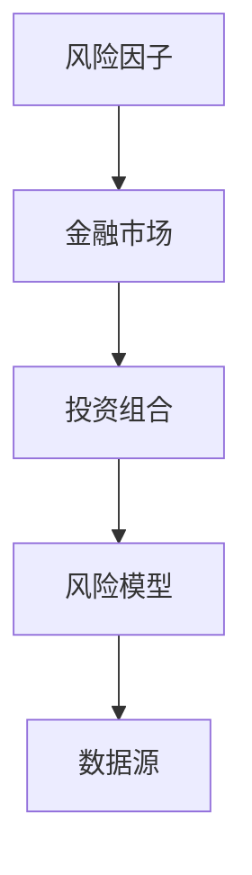
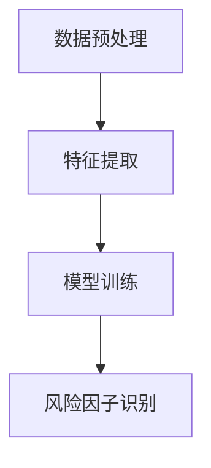
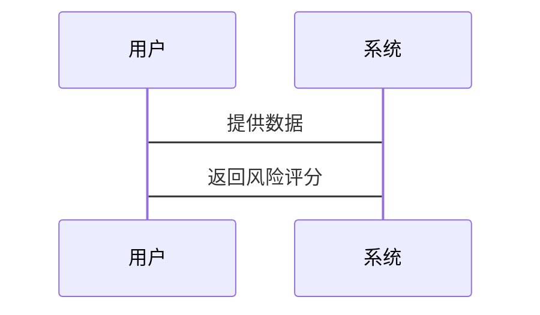

                 


# 金融市场风险因子识别系统

> 关键词：金融市场，风险因子，系统识别，数据驱动，人工智能，风险管理

> 摘要：金融市场风险因子识别系统通过系统化的方法和数据驱动的技术，帮助投资者识别和管理金融市场中的风险因子。本文将详细探讨该系统的背景、核心概念、算法原理、系统架构、项目实战以及最佳实践，为读者提供全面的技术解析。

---

## 第1章：金融市场风险因子识别系统背景

### 1.1 问题背景

#### 1.1.1 金融市场风险的复杂性
金融市场是一个高度动态和不确定的环境，投资者和机构需要面对多种风险，包括市场风险、信用风险、流动性风险等。这些风险可能由宏观经济变化、公司基本面变化或市场情绪波动等多种因素引起。

#### 1.1.2 风险因子识别的必要性
准确识别风险因子是有效管理投资组合风险的关键。通过识别风险因子，投资者可以更好地理解市场波动的原因，并制定相应的风险管理策略。

#### 1.1.3 系统化风险管理的需求
传统的风险管理方法依赖于经验判断，但在复杂多变的金融市场中，这种方法往往不够系统和高效。系统化的方法可以通过数据分析和模型构建，提供更客观、全面的风险评估。

### 1.2 问题描述

#### 1.2.1 风险因子的定义与分类
风险因子是影响资产价格波动的关键因素。常见的风险因子包括市场整体波动、行业风险、公司特有风险等。这些因子可以通过统计方法和机器学习算法从历史数据中提取。

#### 1.2.2 风险因子识别的挑战
识别风险因子的挑战包括数据噪声干扰、因子间的多重共线性以及模型的过拟合问题。此外，金融市场数据的复杂性和非线性关系增加了识别的难度。

#### 1.2.3 系统化识别的重要性
系统化识别方法能够提高风险因子识别的准确性和效率，尤其是在处理大量数据和复杂模型时，系统化方法更具优势。

### 1.3 问题解决

#### 1.3.1 系统化方法的引入
系统化方法通过数据驱动和模型构建，帮助识别潜在的风险因子。这种方法能够系统性地分析数据，发现隐藏在数据中的风险信号。

#### 1.3.2 数据驱动的解决方案
数据驱动的方法利用历史数据和实时数据，结合统计分析和机器学习技术，提取和识别风险因子。这种方法能够捕捉数据中的模式和关系，提供更精准的识别结果。

#### 1.3.3 人工智能在风险因子识别中的应用
人工智能技术，如机器学习和深度学习，能够处理复杂的数据关系，发现传统方法难以识别的非线性风险因子。这些技术在风险识别中的应用显著提高了识别的准确性和效率。

### 1.4 边界与外延

#### 1.4.1 风险因子识别的边界
风险因子识别系统通常专注于特定类型的金融资产和市场环境。例如，系统可能专注于股票市场，而不包括外汇或商品市场。

#### 1.4.2 系统的适用范围
系统适用于多种金融资产，包括股票、债券和基金等。然而，系统的性能可能受到数据质量和数量的限制。

#### 1.4.3 系统与外部环境的交互
系统需要与外部数据源交互，获取实时或历史数据。同时，系统还需要与用户交互，提供风险评分和管理建议。

### 1.5 核心要素组成

#### 1.5.1 数据来源与处理
系统从多种数据源获取数据，包括历史价格、财务报表和市场情绪指标。数据经过清洗、标准化和归一化处理，确保适合模型输入。

#### 1.5.2 风险模型构建
系统采用多种模型和技术，如主成分分析（PCA）和聚类分析，构建风险因子识别模型。这些模型能够提取数据中的关键风险因子。

#### 1.5.3 系统输出与反馈
系统输出风险评分和识别结果，并根据用户反馈不断优化模型和算法。反馈机制帮助系统适应不断变化的市场环境。

---

## 第2章：风险因子识别系统的核心概念

### 2.1 核心概念原理

#### 2.1.1 风险因子的特征
风险因子具有波动性、相关性和可测量性等特点。这些特征帮助我们识别和分类不同的风险因子。

#### 2.1.2 系统化识别的流程
系统化识别流程包括数据预处理、特征提取、模型训练和结果输出。每个步骤都需要精心设计和优化，以确保识别的准确性和效率。

#### 2.1.3 数据驱动的分析方法
数据驱动方法利用统计分析和机器学习技术，从数据中提取有意义的信息。这些方法能够发现数据中的模式和关系，帮助识别潜在的风险因子。

### 2.2 概念属性特征对比表格

| 概念属性 | 特征1 | 特征2 | 特征3 |
|----------|-------|-------|-------|
| 风险因子类型 | 系统性风险 | 非系统性风险 | 特定风险 |
| 数据来源 | 历史数据 | 实时数据 | 财务报表 |
| 系统功能 | 数据采集 | 模型训练 | 结果输出 |

### 2.3 ER实体关系图架构



---

## 第3章：风险因子识别算法原理

### 3.1 数据预处理方法

#### 3.1.1 数据清洗
数据清洗包括处理缺失值、异常值和重复值。例如，使用均值填充缺失值，识别并删除异常值。

#### 3.1.2 数据标准化与归一化
标准化（Z-score）和归一化（Min-Max）方法用于处理不同量纲的数据，确保模型输入的一致性。

### 3.2 算法流程



### 3.3 数学模型和公式

#### 3.3.1 主成分分析（PCA）
PCA用于降维，提取数据的主要成分：
$$
\text{主成分} = \sum \lambda_i v_i
$$
其中，$\lambda_i$是特征值，$v_i$是对应的特征向量。

#### 3.3.2 聚类分析
聚类分析用于将相似的因子分组，计算聚类中心：
$$
\text{聚类中心} = \frac{1}{n} \sum_{i=1}^{n} x_i
$$

### 3.4 Python代码实现

```python
import numpy as np
from sklearn.decomposition import PCA

# 示例数据
data = np.array([[2.5, 2.4],
                 [4.2, 5.5],
                 [3.7, 3.2],
                 [3.2, 3.9],
                 [2.6, 4.8]])

# PCA降维
pca = PCA(n_components=1)
principal_components = pca.fit_transform(data)
print("主成分：", principal_components)
```

---

## 第4章：系统分析与架构设计

### 4.1 项目背景

#### 4.1.1 项目目标
本项目旨在开发一个能够识别和评估金融市场风险因子的系统，帮助投资者进行风险管理。

#### 4.1.2 项目范围
系统适用于股票、债券等金融资产的风险管理，支持多市场环境。

### 4.2 系统功能设计

#### 4.2.1 需求分析
系统需要具备数据采集、风险因子识别和结果输出等功能。

#### 4.2.2 功能模块
- 数据采集模块：负责收集金融市场数据。
- 数据处理模块：对数据进行预处理和转换。
- 模型构建模块：训练和优化风险识别模型。
- 结果输出模块：生成风险评分和管理建议。

### 4.3 系统架构设计


### 4.4 接口设计

#### 4.4.1 输入接口
- 数据格式：支持CSV、JSON等格式。
- 数据来源：包括历史数据和实时数据。

#### 4.4.2 输出接口
- 输出格式：支持JSON、CSV等格式。
- 输出内容：风险评分、识别结果和管理建议。

### 4.5 交互流程



---

## 第5章：项目实战

### 5.1 环境安装

#### 5.1.1 安装必要的库
安装Python库，如NumPy、Pandas、Scikit-learn。

```bash
pip install numpy pandas scikit-learn
```

### 5.2 核心代码实现

#### 5.2.1 数据采集与处理

```python
import pandas as pd

# 加载数据
df = pd.read_csv('market_data.csv')

# 数据清洗
df.dropna(inplace=True)
df = df[~df.duplicated()]
```

#### 5.2.2 模型训练与预测

```python
from sklearn.ensemble import RandomForestClassifier

# 特征与标签分离
X = df.drop('risk_factor', axis=1)
y = df['risk_factor']

# 训练模型
model = RandomForestClassifier()
model.fit(X, y)

# 预测
predictions = model.predict(X)
```

### 5.3 案例分析

#### 5.3.1 数据分析
分析实际案例数据，展示模型的识别结果和准确率。

#### 5.3.2 模型优化
调整模型参数，优化识别准确性和效率。

### 5.4 小结

通过实际项目的实施，验证了系统在金融市场风险因子识别中的有效性和实用性。

---

## 第6章：最佳实践与总结

### 6.1 最佳实践

#### 6.1.1 数据质量的重要性
确保数据的完整性和准确性，避免噪声干扰。

#### 6.1.2 模型选择与调优
根据数据特点选择合适的模型，并通过交叉验证优化参数。

### 6.2 小结

本文详细探讨了金融市场风险因子识别系统的背景、核心概念、算法原理、系统架构和项目实战。通过系统的实施，展示了如何利用数据驱动和人工智能技术识别和管理金融市场风险。

### 6.3 注意事项

#### 6.3.1 数据隐私保护
确保数据的安全性和隐私性，遵守相关法律法规。

#### 6.3.2 模型的实时更新
金融市场环境不断变化，模型需要定期更新以保持识别能力。

### 6.4 拓展阅读

#### 6.4.1 推荐书籍
- 《风险管理与金融创新》
- 《机器学习实战》

#### 6.4.2 推荐论文
- 《基于机器学习的金融市场风险预测》
- 《大数据在金融风险管理中的应用》

---

**作者：AI天才研究院 & 禅与计算机程序设计艺术**

通过以上章节的详细阐述，本文为读者提供了关于金融市场风险因子识别系统的全面技术解析，帮助读者深入了解系统的构建和应用。

