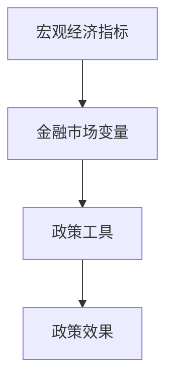
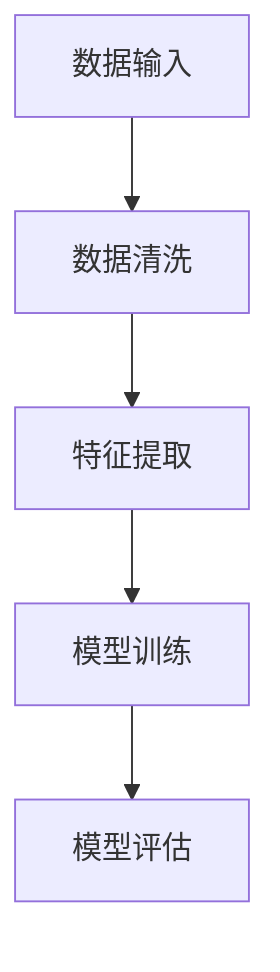
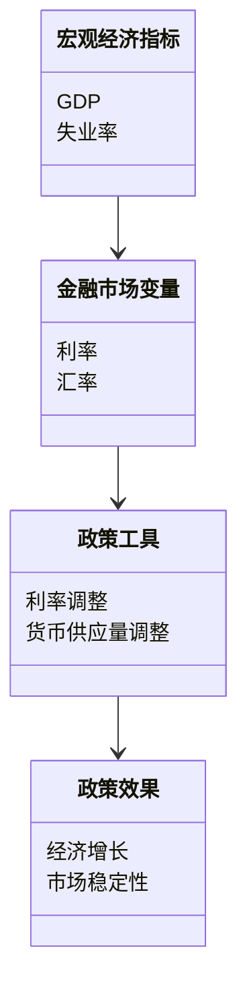

                 


# 《金融政策影响评估模型》

> 关键词：金融政策，影响评估，经济模型，政策工具，金融市场

> 摘要：本文详细探讨了金融政策影响评估模型的构建与应用，从背景、核心概念、算法原理、系统架构到项目实战，全面分析了金融政策如何通过模型影响经济与市场。文章结合理论与实践，提供了详细的模型设计思路与代码实现，为金融政策的研究与应用提供了新的视角。

---

## 第1章: 金融政策影响评估模型的背景与核心概念

### 1.1 金融政策的基本概念

#### 1.1.1 金融政策的定义
金融政策是指政府或中央银行为实现特定经济目标而采取的调节金融体系运行的政策手段。其核心目标是维护金融稳定、促进经济增长和优化资源配置。

#### 1.1.2 金融政策的主要类型
金融政策主要包括货币政策、财政政策和监管政策三大类：
1. **货币政策**：通过调整利率、货币供应量等手段影响市场流动性。
2. **财政政策**：通过政府支出和税收调节经济活动。
3. **监管政策**：通过法律法规规范金融市场行为。

#### 1.1.3 金融政策的目标与作用
- **目标**：促进经济稳定增长、控制通货膨胀、优化金融体系运行。
- **作用**：调节市场供需、引导资金流向、防范金融风险。

---

### 1.2 金融政策影响评估的必要性

#### 1.2.1 金融政策对企业的影响
金融政策直接影响企业的融资成本、投资决策和运营环境。例如，降低基准利率可以降低企业的贷款成本，刺激投资和生产。

#### 1.2.2 金融政策对市场的调节作用
通过金融政策可以调节市场供需关系，例如，通过提高存款准备金率可以减少银行可贷资金，从而降低市场流动性。

#### 1.2.3 金融政策对经济稳定的重要性
金融政策是维护经济稳定的重要工具，尤其是在经济危机或衰退时期，金融政策能够起到稳定市场、提振信心的作用。

---

### 1.3 金融政策影响评估模型的定义与特点

#### 1.3.1 模型的定义
金融政策影响评估模型是一种通过量化分析方法，评估金融政策对经济和市场产生影响的工具。它能够预测政策调整后的经济表现和市场反应。

#### 1.3.2 模型的核心特点
1. **量化性**：通过数学模型量化政策效果。
2. **动态性**：能够模拟政策调整后的短期和长期影响。
3. **多维度**：涵盖宏观经济、金融市场等多个维度的变量。

#### 1.3.3 模型与传统评估方法的区别
| 特性 | 传统评估方法 | 模型评估方法 |
|------|---------------|---------------|
| 方法 | 定性分析为主 | 定量分析为主 |
| 时间 | 单一时点分析 | 动态模拟分析 |
| 范围 | 局部影响为主 | 全局影响为主 |

---

### 1.4 金融政策影响评估模型的边界与外延

#### 1.4.1 模型的适用范围
适用于评估货币政策、财政政策和监管政策对经济和市场的影响。

#### 1.4.2 模型的局限性
1. **数据依赖性**：模型结果高度依赖数据的准确性和完整性。
2. **假设限制**：模型假设条件可能与现实存在差异。
3. **复杂性**：模型本身可能过于复杂，难以被非专业人士理解。

#### 1.4.3 模型的扩展与应用
- **扩展**：结合机器学习算法，提升模型的预测精度。
- **应用**：用于政策制定、市场分析和风险预警。

---

## 第2章: 金融政策影响评估模型的核心概念与联系

### 2.1 核心概念原理

#### 2.1.1 宏观经济指标
- **GDP**：衡量经济总体规模的重要指标。
- **失业率**：反映经济健康状况的关键指标。

#### 2.1.2 金融市场变量
- **利率**：影响企业融资成本和居民消费行为。
- **汇率**：影响进出口贸易和国际资本流动。

#### 2.1.3 政策工具与效果
- **政策工具**：货币政策工具（如利率、货币供应量）和财政政策工具（如政府支出、税收）。
- **政策效果**：政策实施后的经济表现和市场反应。

---

### 2.2 核心概念属性特征对比表格

| 概念 | 属性 | 特征 |
|------|------|------|
| 宏观经济指标 | GDP | 数量化、周期性 |
| 金融市场变量 | 利率 | 波动性、相关性 |
| 政策工具 | 货币政策 | 调节性、滞后性 |

---

### 2.3 ER实体关系图架构



---

## 第3章: 金融政策影响评估模型的算法原理

### 3.1 算法原理概述

#### 3.1.1 数据预处理
- 数据清洗：处理缺失值、异常值。
- 数据标准化：统一数据尺度。

#### 3.1.2 模型构建
- 线性回归模型：用于预测政策调整后的经济指标变化。
- 随机森林模型：用于分类问题，如政策效果的二分类（正面/负面）。

#### 3.1.3 模型评估
- 评估指标：准确率、召回率、F1分数。

---

### 3.2 算法流程图



---

### 3.3 算法实现代码

```python
import pandas as pd
from sklearn.model import LinearRegression

# 数据加载
data = pd.read_csv('financial_policy.csv')

# 数据预处理
data_clean = data.dropna()
data_clean['normalized_feature'] = (data_clean['feature'] - data_clean['feature'].mean()) / data_clean['feature'].std()

# 模型构建
model = LinearRegression()
model.fit(data_clean[['normalized_feature']], data_clean['target'])

# 模型预测
predictions = model.predict(data_clean[['normalized_feature']])
```

---

## 第4章: 金融政策影响评估模型的系统分析与架构设计

### 4.1 系统功能设计

#### 4.1.1 领域模型


---

## 项目实战

### 4.2 项目实战

#### 4.2.1 环境安装
```bash
pip install pandas scikit-learn
```

#### 4.2.2 核心代码实现
```python
import pandas as pd
from sklearn.model import LinearRegression

# 数据加载
data = pd.read_csv('financial_policy.csv')

# 数据预处理
data_clean = data.dropna()

# 模型构建
model = LinearRegression()
model.fit(data_clean[['GDP', '失业率']], data_clean['政策效果'])

# 模型预测
new_data = pd.DataFrame({'GDP': [5.5], '失业率': [6.5]})
predictions = model.predict(new_data)
print(predictions)
```

---

## 总结与展望

### 4.3 总结
金融政策影响评估模型是一种强大的工具，能够帮助政策制定者和市场参与者更好地理解政策效果。通过模型的构建与应用，可以实现对政策影响的量化分析，为决策提供科学依据。

### 4.4 展望
未来，随着人工智能和大数据技术的发展，金融政策影响评估模型将更加精准和智能化。结合机器学习算法，模型可以更好地捕捉市场动态，为政策制定提供更有力的支持。

---

## 作者：AI天才研究院/AI Genius Institute & 禅与计算机程序设计艺术 /Zen And The Art of Computer Programming

