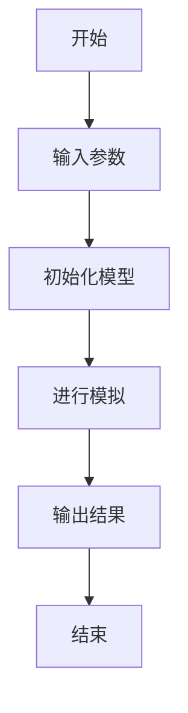
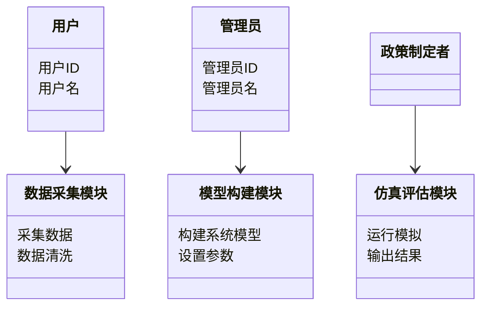

                 


# 《金融政策效果评估仿真平台》

> 关键词：金融政策、仿真平台、系统动力学、蒙特卡洛模拟、政策评估、数据建模

> 摘要：本文介绍了一种基于系统动力学和蒙特卡洛模拟的金融政策效果评估仿真平台。通过构建多层次的金融模型和评估指标，该平台能够模拟不同政策下的市场反应，为政策制定者提供科学决策依据。本文详细阐述了平台的核心算法、系统架构、项目实现及最佳实践。

---

## 第一部分: 金融政策效果评估仿真平台概述

### 第1章: 金融政策效果评估仿真平台的背景与意义

#### 1.1 问题背景
在金融领域，政策的制定和实施往往面临高度复杂性和不确定性。例如，货币政策、财政政策等的实施可能会对市场产生深远影响，但传统评估方法（如静态分析、单变量回归）难以捕捉系统性风险和非线性关系。因此，需要一种动态、多维度的仿真平台来评估政策效果。

#### 1.2 问题描述
金融政策的效果评估通常涉及多个变量的相互作用，例如利率变化对企业和消费者行为的影响、财政支出对经济增速的推动等。传统方法难以量化这些复杂关系，导致政策评估结果的准确性和可靠性不足。

#### 1.3 解决思路
基于系统动力学（System Dynamics）和蒙特卡洛模拟（Monte Carlo Simulation）的方法，构建一个金融政策效果评估仿真平台。该平台能够模拟不同政策情景下的市场反应，帮助政策制定者优化决策。

#### 1.4 本章小结
本章通过分析金融政策评估的复杂性，提出了构建仿真平台的必要性，并概述了平台的核心思路。

---

### 第2章: 核心概念与联系

#### 2.1 核心概念原理
仿真平台的核心在于构建金融系统的动态模型，通过数据驱动的方式模拟政策实施后的市场反应。具体包括以下几个方面：
1. 数据采集与预处理：收集金融市场的相关数据，如GDP、利率、企业利润等。
2. 模型构建：基于系统动力学，建立各变量之间的动态关系。
3. 仿真与评估：通过蒙特卡洛模拟，生成多种政策情景，并评估其效果。

#### 2.2 核心概念属性对比表
| 概念         | 数据采集 | 模型构建 | 评估指标 |
|--------------|----------|----------|----------|
| 属性         | 来源     | 方法     | 类型     |
| 示例         | GDP数据 | 微分方程 | 收益率    |

#### 2.3 实体关系图
```mermaid
erDiagram
    用户 {
        用户ID
        用户名
    }
    管理员 {
        管理员ID
        管理员名
    }
    政策制定者 {
        政策制定者ID
        政策制定者名
    }
    数据 [
        数据ID
        数据名称
        数据值
    ]
    模型 [
        模型ID
        模型名称
        模型参数
    ]
    评估指标 [
        指标ID
        指标名称
        指标值
    ]
    用户 -->> 数据 : 提供数据
    管理员 -->> 模型 : 管理模型
    政策制定者 -->> 评估指标 : 查看指标
```

---

## 第二部分: 算法原理与数学模型

### 第3章: 算法原理

#### 3.1 系统动力学模型
系统动力学是一种模拟复杂系统动态行为的方法。其核心是通过微分方程描述变量之间的动态关系。

#### 3.2 蒙特卡洛模拟
蒙特卡洛模拟是一种基于概率分布的随机模拟方法，用于评估系统在不同情景下的表现。

#### 3.3 算法流程图


#### 3.4 核心代码实现
```python
import numpy as np

def monte_carlo_simulation(parameters):
    np.random.seed(42)
    results = []
    for _ in range(1000):
        # 随机选择参数组合
        params = {k: np.random.choice(v) for k, v in parameters.items()}
        # 模拟结果
        result = system_dynamics_model(params)
        results.append(result)
    return results

# 示例参数
parameters = {
    'interest_rate': [0.02, 0.03, 0.04],
    'government_spending': [100, 200, 300]
}

# 运行模拟
results = monte_carlo_simulation(parameters)
```

---

### 第4章: 数学模型

#### 4.1 系统动力学模型
系统动力学模型通过微分方程描述变量之间的关系。例如，GDP增长模型可以表示为：
$$
\frac{dGDP}{dt} = α \cdot (投资 - 消费)
$$

#### 4.2 蒙特卡洛模拟模型
蒙特卡洛模拟通过随机采样生成可能的结果分布。例如，假设政策效果的评估指标服从正态分布：
$$
X \sim N(\mu, \sigma^2)
$$

---

## 第三部分: 系统分析与架构设计

### 第5章: 系统分析

#### 5.1 问题场景
政策制定者需要评估不同货币政策对市场的影响，例如调整基准利率对企业和消费者行为的影响。

#### 5.2 领域模型


---

## 第四部分: 项目实战

### 第6章: 环境安装与系统实现

#### 6.1 环境安装
需要安装以下工具和库：
- Python 3.8+
- NumPy, Pandas, Matplotlib
- System Dynamics 库（自定义或开源）

#### 6.2 核心代码实现
```python
import numpy as np
from system_dynamics import Model

def main():
    # 初始化模型
    model = Model(initial_conditions={
        'GDP': 1000,
        'interest_rate': 0.02
    })
    # 运行模拟
    results = model.simulate(100)
    # 可视化结果
    plt.plot(results['time'], results['GDP'])
    plt.xlabel('时间')
    plt.ylabel('GDP')
    plt.show()

if __name__ == '__main__':
    main()
```

---

## 第五部分: 最佳实践

### 第7章: 小结与注意事项

#### 7.1 小结
本文详细介绍了金融政策效果评估仿真平台的设计与实现，结合系统动力学和蒙特卡洛模拟的方法，为政策制定者提供了科学决策工具。

#### 7.2 注意事项
- 数据质量对仿真结果影响重大，需确保数据的准确性和完整性。
- 模型的复杂度与计算效率之间需权衡，避免过度复杂的模型。

#### 7.3 拓展阅读
- 米尔顿·弗里德曼的《货币政策论》
- 约翰·威灵斯的《系统动力学入门》

---

## 作者

作者：AI天才研究院/AI Genius Institute & 禅与计算机程序设计艺术 /Zen And The Art of Computer Programming

---

本文通过系统动力学和蒙特卡洛模拟的方法，构建了一个金融政策效果评估仿真平台。该平台能够模拟不同政策情景下的市场反应，为政策制定者提供科学决策依据。

