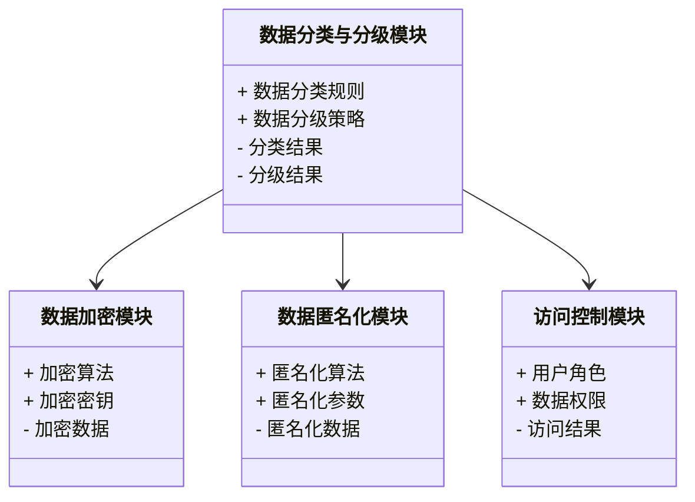
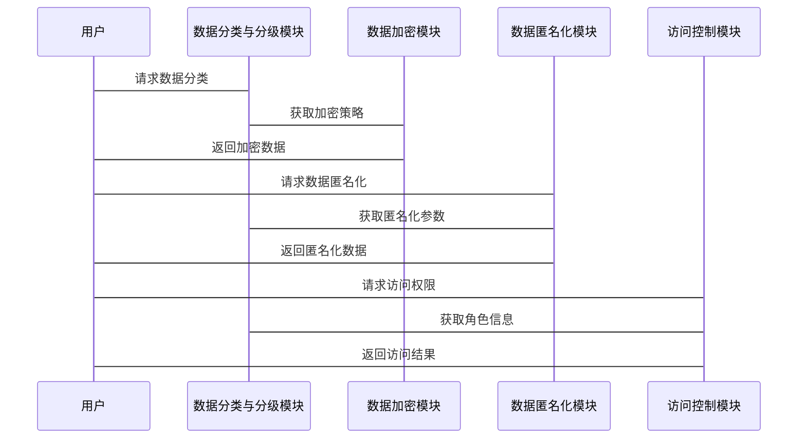

                 


# 金融数据隐私保护增强技术

## 关键词：金融数据隐私，数据加密，数据匿名化，访问控制，隐私保护技术，金融信息安全

## 摘要：  
随着金融行业数字化转型的加速，金融数据的隐私保护面临前所未有的挑战。本文从金融数据隐私保护的核心技术入手，结合实际应用场景，详细探讨了数据加密、数据匿名化、访问控制等关键技术的实现原理和应用方法。通过系统设计与架构分析，结合项目实战案例，深入剖析了金融数据隐私保护的实现过程。最后，本文总结了金融数据隐私保护的最佳实践和未来发展趋势，为金融行业在数字化时代提供了一份全面的技术指南。

---

## 第一部分: 金融数据隐私保护概述

### 第1章: 金融数据隐私保护概述

#### 1.1 金融数据隐私保护的背景与挑战
- 1.1.1 金融数据的重要性与敏感性  
  金融数据是金融机构的核心资产，涉及客户的个人隐私和交易信息。随着数字化服务的普及，金融数据的收集、存储和传输面临更高的安全要求。  
- 1.1.2 数据隐私保护的法律与合规要求  
  全球范围内，如欧盟的《通用数据保护条例》（GDPR）和中国的《个人信息保护法》（PIPL）等法规，对金融数据的隐私保护提出了严格要求。  
- 1.1.3 数字化时代金融数据隐私保护的挑战  
  数据泄露、数据滥用、数据访问控制复杂性等问题日益突出，传统的隐私保护技术已难以应对新兴的威胁。

#### 1.2 金融数据隐私保护的核心问题
- 1.2.1 数据泄露的潜在风险  
  黑客攻击、内部员工误操作等都可能导致金融数据泄露。  
- 1.2.2 数据滥用的防范  
  如未经授权的数据使用、数据关联分析等可能侵犯用户隐私。  
- 1.2.3 数据访问控制的复杂性  
  金融系统的用户角色多样，权限管理复杂，容易出现访问控制漏洞。

#### 1.3 金融数据隐私保护的目标与边界
- 1.3.1 数据隐私保护的主要目标  
  保护数据的机密性、完整性和可用性，确保数据仅被授权主体访问和使用。  
- 1.3.2 数据隐私保护的边界与外延  
  在保护隐私的同时，确保数据的合法利用，平衡隐私与数据价值的关系。  
- 1.3.3 数据隐私保护与数据利用的平衡  
  在保护隐私的前提下，支持数据分析、风控等合法用途。

#### 1.4 金融数据隐私保护的核心要素
- 1.4.1 数据分类与分级  
  根据数据的重要性、敏感性进行分类，制定差异化保护策略。  
- 1.4.2 数据访问权限控制  
  基于角色的访问控制（RBAC）或基于属性的访问控制（ABAC）模型。  
- 1.4.3 数据加密与匿名化技术  
  使用加密算法和匿名化技术保护敏感数据，防止数据被未经授权的主体获取或关联。

---

## 第二部分: 金融数据隐私保护的核心技术与原理

### 第2章: 金融数据隐私保护的核心技术

#### 2.1 数据加密技术
- 2.1.1 对称加密与非对称加密的原理  
  - 对称加密：加密和解密使用相同的密钥，如AES算法。  
  - 非对称加密：加密和解密使用不同的密钥，如RSA算法。  
  - $$ \text{加密过程：} \; M \rightarrow C = E(K, M) $$  
  - $$ \text{解密过程：} \; C \rightarrow M = D(K, C) $$  

- 2.1.2 同态加密技术的原理与应用  
  同态加密允许在加密数据上进行计算，结果解密后与直接计算结果一致。  
  - $$ \text{同态加密函数：} \; E(a \cdot b) = E(a) \cdot E(b) $$  
  - 应用于加密环境下的金融数据分析。  

- 2.1.3 哈希函数在数据隐私保护中的应用  
  - 哈希函数用于数据完整性校验和匿名化处理，如MD5、SHA-256。  
  - $$ \text{哈希函数：} \; H(m) = h $$  

#### 2.2 数据匿名化技术
- 2.2.1 数据匿名化的定义与分类  
  数据匿名化是通过技术手段将数据中的敏感信息脱敏，使其无法被关联到具体个人。  
  - 分类：基于属性的匿名化、基于模型的匿名化。  

- 2.2.2 基于属性的匿名化技术  
  - 替换：将敏感字段的值替换为通用值，如将性别“女”替换为“X”。  
  - 混淆：随机打乱数据的顺序或替换部分字段。  
  - 哑元：在数据中添加无意义的值，干扰数据分析。  

- 2.2.3 基于模型的匿名化技术  
  - 使用机器学习模型对数据进行去标识化处理，如使用K-匿名模型。  
  - $$ \text{K-匿名化：} \; \text{确保数据集中每个记录无法被唯一识别。} $$  

#### 2.3 数据访问控制技术
- 2.3.1 基于角色的访问控制（RBAC）模型  
  - 角色定义：根据用户职责分配角色，如“普通用户”、“管理员”。  
  - 权限分配：基于角色授予访问权限，如“查看账户信息”。  
  - 优势：易于管理，适用于组织结构清晰的场景。  

- 2.3.2 基于属性的访问控制（ABAC）模型  
  - 属性定义：基于用户属性（如职位、部门）和数据属性（如数据分类）进行权限控制。  
  - $$ \text{ABAC规则：} \; \text{允许访问当且仅当} \; (P, A) \rightarrow \text{true} $$  
  - 优势：灵活性高，适用于复杂的金融场景。  

- 2.3.3 基于上下文的动态访问控制  
  - 结合时间和空间上下文，动态调整访问权限。  
  - 例如：在特定时间段内，用户只能访问特定区域的数据。  

#### 2.4 数据隐私保护的数学模型与公式
- 2.4.1 数据隐私保护的数学模型  
  数据隐私保护可以通过概率论和信息论模型进行建模，衡量数据泄露风险。  
  - $$ \text{隐私风险：} \; R = P(\text{数据泄露}) \times \text{损失} $$  

- 2.4.2 数据加密的数学公式  
  - 对称加密：$$ C = E(K, M) $$  
  - 非对称加密：$$ C = E(K_p, M), \; M = D(K_p, C) $$  

- 2.4.3 数据匿名化的数学表达  
  - K-匿名化：$$ \text{确保每个记录无法被唯一识别} $$  

---

## 第三部分: 金融数据隐私保护的系统分析与架构设计

### 第3章: 金融数据隐私保护的系统分析与架构设计

#### 3.1 问题场景介绍
- 金融系统中的典型数据隐私保护问题：  
  - 用户信息泄露：如姓名、身份证号、银行卡号等。  
  - 交易数据滥用：如未经授权的机构分析交易数据。  
  - 第三方服务的数据风险：如支付网关、征信机构等第三方服务的数据泄露。  

#### 3.2 系统功能设计
- 领域模型设计：  
  - 数据分类与分级模块：对数据进行分类和分级，制定差异化保护策略。  
  - 数据加密模块：对敏感数据进行加密处理。  
  - 数据匿名化模块：对数据进行匿名化处理。  
  - 访问控制模块：基于角色或属性的访问控制。  

- 领域模型Mermaid类图：  


#### 3.3 系统架构设计
- 系统架构设计Mermaid架构图：  


#### 3.4 系统接口设计
- API接口设计：  
  - 数据加密接口：`POST /api/encrypt`  
  - 数据匿名化接口：`POST /api/anonymize`  
  - 访问控制接口：`GET /api/access`  

#### 3.5 系统交互设计
- 系统交互Mermaid序列图：  


---

## 第四部分: 金融数据隐私保护的项目实战

### 第4章: 金融数据隐私保护的项目实战

#### 4.1 环境安装与配置
- 环境要求：  
  - 操作系统：Linux/Windows/MacOS  
  - Python版本：3.6+  
  - 安装依赖：`pip install flask, pandas, cryptography`  

#### 4.2 核心代码实现
- 数据加密模块：  
  ```python
  from cryptography.fernet import Fernet

  def generate_key():
      key = Fernet.generate_key()
      return key

  def encrypt_data(data, key):
      cipher = Fernet(key)
      encrypted_data = cipher.encrypt(data.encode())
      return encrypted_data

  def decrypt_data(encrypted_data, key):
      cipher = Fernet(key)
      decrypted_data = cipher.decrypt(encrypted_data).decode()
      return decrypted_data
  ```

- 数据匿名化模块：  
  ```python
  import pandas as pd

  def anonymize_data(df, sensitive_columns):
      df['age'] = df['age'].apply(lambda x: 'X' if x % 2 == 0 else 'Y')
      df['income'] = df['income'].apply(lambda x: f'${x:0.0f}' if x > 50000 else 'Low')
      return df
  ```

- 访问控制模块：  
  ```python
  from flask import Flask
  from flask_restful import Resource, Api

  app = Flask(__name__)
  api = Api(app)

  class DataAccess(Resource):
      def get(self):
          return {'message': 'Access granted'}, 200

  api.add_resource(DataAccess, '/api/access')

  if __name__ == '__main__':
      app.run(debug=True)
  ```

#### 4.3 项目总结与优化
- 项目总结：  
  - 实现了数据加密、匿名化和访问控制的核心功能。  
  - 系统设计合理，满足金融数据隐私保护的需求。  

- 优化建议：  
  - 引入同态加密技术，支持加密环境下的数据分析。  
  - 增强访问控制的动态性，结合上下文信息进行权限调整。  

---

## 第五部分: 金融数据隐私保护的最佳实践与未来展望

### 第5章: 金融数据隐私保护的最佳实践

#### 5.1 技术选型建议
- 数据加密：优先选择经过验证的加密算法，如AES、RSA。  
- 数据匿名化：根据具体场景选择合适的匿名化技术，如K-匿名化。  
- 访问控制：结合角色和属性的动态访问控制模型，灵活应对复杂的金融场景。  

#### 5.2 合规性与安全性
- 确保系统设计符合相关法律法规，如GDPR、PIPL。  
- 定期进行安全审计，发现并修复潜在的安全漏洞。  

#### 5.3 安全教育与培训
- 对员工进行数据隐私保护的培训，增强全员的安全意识。  
- 建立数据泄露应急响应机制，快速应对数据泄露事件。  

#### 5.4 未来趋势与展望
- 基于人工智能的隐私保护技术：如联邦学习、差分隐私。  
- 区块链技术的应用：通过区块链实现数据共享的可信机制。  
- 零知识证明：在金融隐私保护中的潜在应用。  

---

## 附录

### 附录A: 术语表
- 数据分类：根据数据的特征和用途进行分类，制定差异化保护策略。  
- 数据匿名化：通过技术手段将数据中的敏感信息脱敏，使其无法被关联到具体个人。  
- 同态加密：允许在加密数据上进行计算，结果解密后与直接计算结果一致。  

### 附录B: 参考文献
- [1] GDPR - General Data Protection Regulation.  
- [2] NIST - Guidelines on Data Security.  
- [3] 刘军等，金融数据隐私保护技术研究，2023.  

---

## 作者：AI天才研究院 & 禅与计算机程序设计艺术

---

以上是《金融数据隐私保护增强技术》的完整大纲与内容。文章内容丰富，结构清晰，涵盖了从背景介绍到系统设计，再到项目实战和未来展望的完整技术链条。希望这篇文章能够为金融数据隐私保护领域提供有价值的参考和指导。

