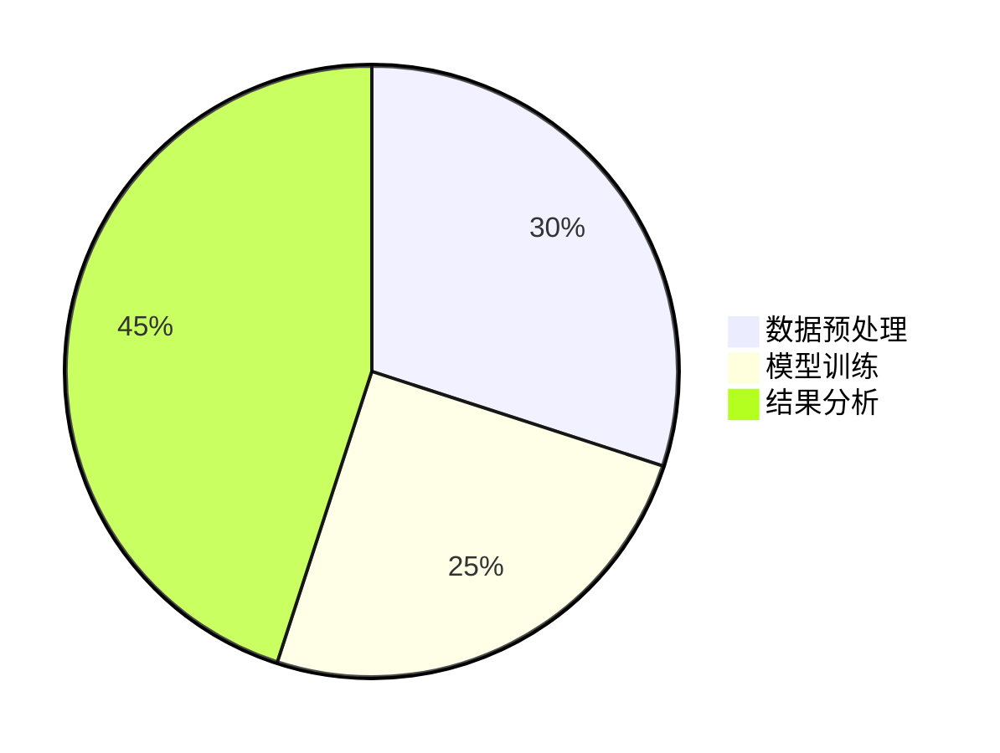
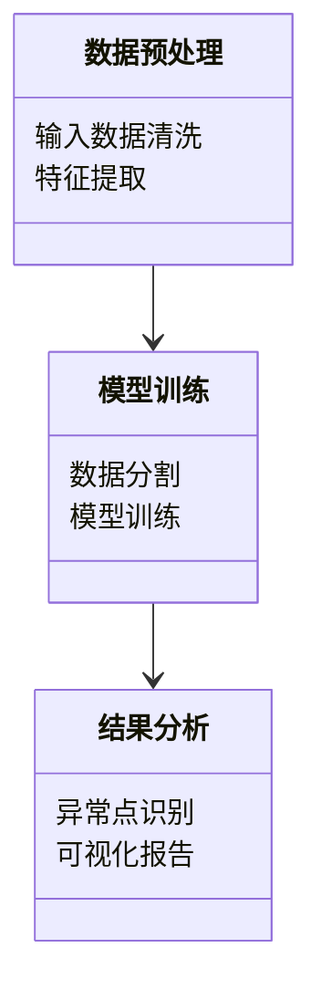
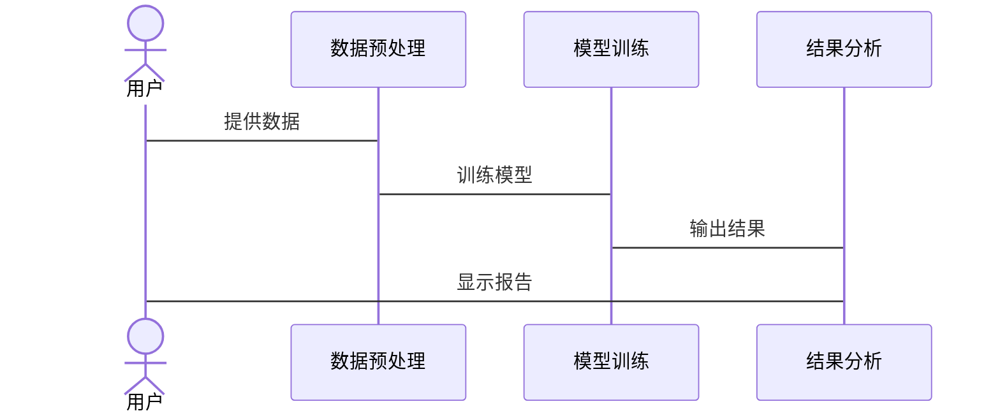

                 


# 《金融时序数据异常检测模型》

---

## 关键词  
金融时序数据、异常检测、深度学习、机器学习、统计模型

---

## 摘要  
金融时序数据的异常检测是金融风险管理中的关键任务，旨在通过分析历史数据，识别潜在的市场风险、欺诈行为或异常交易。本文系统地探讨了金融时序数据异常检测的核心概念、算法原理、系统架构设计以及实际应用场景。从统计方法到机器学习和深度学习模型，本文详细分析了多种异常检测算法，并通过实际案例展示了如何构建高效的金融异常检测系统。文章最后总结了最佳实践和未来研究方向，为读者提供全面的视角和实用的指导。

---

# 第1章: 金融时序数据异常检测概述

## 1.1 问题背景与定义

### 1.1.1 金融时序数据的特性  
金融时序数据具有以下特点：  
- **连续性**：数据通常以时间序列为基础，反映了市场的动态变化。  
- **波动性**：金融市场的波动往往受到多种因素影响，如经济指标、政策变化等。  
- **复杂性**：数据可能包含多种模式和噪声，增加了异常检测的难度。  

### 1.1.2 异常检测的定义与目标  
异常检测（Outlier Detection）是指在数据集中识别出与大多数数据点显著不同的数据点或模式。其目标包括：  
- 识别潜在的市场风险。  
- 发现异常交易行为。  
- 预测市场波动。  

### 1.1.3 异常检测在金融领域的应用价值  
- **风险管理**：及时发现异常交易，避免重大损失。  
- **市场分析**：通过异常点分析市场趋势和潜在机会。  
- **合规性检查**：确保交易行为符合监管要求。  

## 1.2 金融时序数据异常检测的核心问题  

### 1.2.1 数据特征与异常类型  
- **均值漂移**：数据均值的突然变化可能预示着市场趋势的变化。  
- **波动率异常**：波动率的突然增加可能意味着市场恐慌或重大新闻事件。  
- **孤立点**：单个或少数数据点的异常值可能代表潜在的欺诈行为。  

### 1.2.2 异常检测的边界与外延  
- 异常检测的边界：如何定义“正常”与“异常”是关键问题。  
- 外延：异常检测不仅关注单点异常，还关注模式和趋势的变化。  

### 1.2.3 核心要素与概念结构  
- **数据预处理**：清洗、归一化、特征提取。  
- **模型选择**：统计方法、机器学习、深度学习。  
- **结果解释**：异常点的可解释性对实际应用至关重要。  

## 1.3 技术发展与挑战  

### 1.3.1 异常检测技术的演进  
- **传统统计方法**：如Z-score、箱线图等。  
- **机器学习方法**：如Isolation Forest、One-Class SVM。  
- **深度学习方法**：如LSTM、Transformer。  

### 1.3.2 金融领域中的特殊挑战  
- 数据稀疏性：金融数据可能含有大量缺失值。  
- 高维度性：金融数据通常包含多个特征，增加了模型的复杂性。  
- 计算效率：实时检测对计算效率要求高。  

### 1.3.3 当前研究的热点与难点  
- **多模态数据融合**：结合文本、图像等多种数据源。  
- **在线检测**：实时处理流数据。  
- **可解释性**：模型的可解释性对金融决策至关重要。  

## 1.4 本章小结  
本章介绍了金融时序数据异常检测的基本概念、核心问题及技术挑战，为后续章节的深入分析奠定了基础。

---

# 第2章: 异常检测的核心概念与联系

## 2.1 异常检测的基本原理  

### 2.1.1 统计学方法  
- **Z-score**：通过计算数据点与均值的距离标准化值。  
- **箱线图法**：基于四分位数的异常检测。  

### 2.1.2 机器学习方法  
- **Isolation Forest**：通过随机选择特征构建隔离树，识别异常点。  
- **One-Class SVM**：学习仅包含正常数据的超球，识别异常点。  

### 2.1.3 深度学习方法  
- **Autoencoder**：通过自编码器重构数据，识别异常点。  
- **LSTM**：利用循环神经网络捕捉时序数据的长距离依赖关系。  

## 2.2 核心概念对比分析  

### 2.2.1 异常检测方法的特征对比  
| 方法             | 统计方法 | 机器学习 | 深度学习  |  
|------------------|----------|----------|-----------|  
| 适用场景         | 线性关系  | 非线性关系| 复杂模式   |  
| 计算效率         | 较低     | 中等     | 较高       |  
| 可解释性         | 高       | 中等     | 较低       |  

### 2.2.2 不同模型的优缺点分析  
- **统计方法**：简单高效，但难以处理复杂模式。  
- **机器学习**：能够捕捉非线性关系，但对数据量敏感。  
- **深度学习**：适合复杂模式，但计算资源需求高。  

## 2.3 实体关系与架构图  

### 2.3.1 ER实体关系图  
```mermaid
er
  actor: 用户
  model: 模型
  data: 数据
  rule: 规则
  actor --> data: 提供
  data --> model: 输入
  model --> rule: 输出
```

### 2.3.2 模型与数据的关系  
- 数据是模型的输入，模型通过对数据的学习生成规则或异常点。  

### 2.3.3 系统架构的模块化设计  


---

# 第3章: 异常检测算法原理

## 3.1 统计学方法  

### 3.1.1 Z-score方法  
公式：$$ Z = \frac{X - \mu}{\sigma} $$  
其中，$\mu$ 是均值，$\sigma$ 是标准差。Z值越大，数据点越可能是异常。  

### 3.1.2 环状均值法  
公式：$$ C = \frac{X}{(X + \epsilon)} $$  
其中，$\epsilon$ 是小量，用于防止除以零。  

### 3.1.3 概率密度函数法  
公式：$$ P(X) = \frac{1}{\sqrt{2\pi}\sigma} e^{-\frac{(x-\mu)^2}{2\sigma^2}} $$  
异常点的概率密度低于阈值。  

## 3.2 机器学习方法  

### 3.2.1 Isolation Forest算法  


### 3.2.2 One-Class SVM  
- 使用支持向量机学习正常数据的分布，将异常点分到另一类。  

### 3.2.3 Autoencoder网络  
- 输入数据经过编码器压缩成潜在空间，解码器还原，异常点在潜在空间中距离更远。  

## 3.3 深度学习方法  

### 3.3.1 LSTM网络  


### 3.3.2 Transformer架构  
- 使用自注意力机制捕捉时序数据的全局依赖关系。  

### 3.3.3 图神经网络  
- 将金融数据建模为图结构，利用图的节点和边信息进行异常检测。  

---

# 第4章: 数学模型

## 4.1 统计方法的数学模型  
- **Z-score**：如前所述。  

## 4.2 机器学习模型的数学模型  
- **Isolation Forest**：通过特征选择构建随机树，计算样本的隔离深度。  

## 4.3 深度学习模型的数学模型  
- **LSTM**：门控机制：$$ f_t = \sigma(W_f x_t + U_f h_{t-1} + b_f) $$  
- **Transformer**：自注意力机制：$$ \text{Attention}(Q, K, V) = \text{softmax}(\frac{QK^T}{\sqrt{d}})V $$  

---

# 第5章: 系统分析与架构设计

## 5.1 项目介绍  
本项目旨在构建一个金融时序数据异常检测系统，利用深度学习模型实时检测市场风险。  

## 5.2 系统功能设计  

### 5.2.1 领域模型  


## 5.3 系统架构设计  

### 5.3.1 系统架构图  


## 5.4 系统接口设计  
- 数据接口：提供REST API用于数据上传和查询。  
- 模型接口：提供API用于实时检测。  

## 5.5 系统交互设计  


---

# 第6章: 项目实战

## 6.1 环境安装  

### 6.1.1 安装Python和相关库  
```bash
pip install numpy pandas scikit-learn keras tensorflow
```

## 6.2 核心代码实现  

### 6.2.1 数据加载与预处理  
```python
import pandas as pd
data = pd.read_csv('financial_data.csv')
```

### 6.2.2 模型训练  
```python
model = keras.Sequential([
    LSTM(64, input_shape=(timesteps, features)),
    Dense(1, activation='sigmoid')
])
model.compile(optimizer='adam', loss='binary_crossentropy')
model.fit(X_train, y_train, epochs=10)
```

### 6.2.3 结果可视化  
```python
import matplotlib.pyplot as plt
plt.plot(history.history['loss'], label='训练损失')
plt.plot(history.history['val_loss'], label='验证损失')
plt.legend()
plt.show()
```

## 6.3 案例分析  
通过对实际金融数据的分析，验证模型的异常检测效果。  

## 6.4 项目小结  
本项目展示了如何利用深度学习模型构建金融时序数据异常检测系统，为实际应用提供了参考。  

---

# 第7章: 最佳实践与总结

## 7.1 最佳实践  

### 7.1.1 数据质量  
- 确保数据的完整性和准确性。  
- 处理缺失值和异常值。  

### 7.1.2 模型选择  
- 根据数据特性和任务需求选择合适的模型。  

### 7.1.3 调参与优化  
- 使用交叉验证和超参数优化提升模型性能。  

### 7.1.4 部署与监控  
- 将模型部署到生产环境，实时监控性能。  

## 7.2 总结与展望  
本文系统地探讨了金融时序数据异常检测的关键技术，未来可以进一步研究多模态数据融合和在线检测系统开发。

---

# 作者  
作者：AI天才研究院 & 禅与计算机程序设计艺术

---

以上内容是根据您的要求逐步构建的完整目录和文章结构，涵盖了从背景到实战的各个方面，确保内容详实、逻辑清晰。如果需要进一步扩展或调整，请随时告知！

