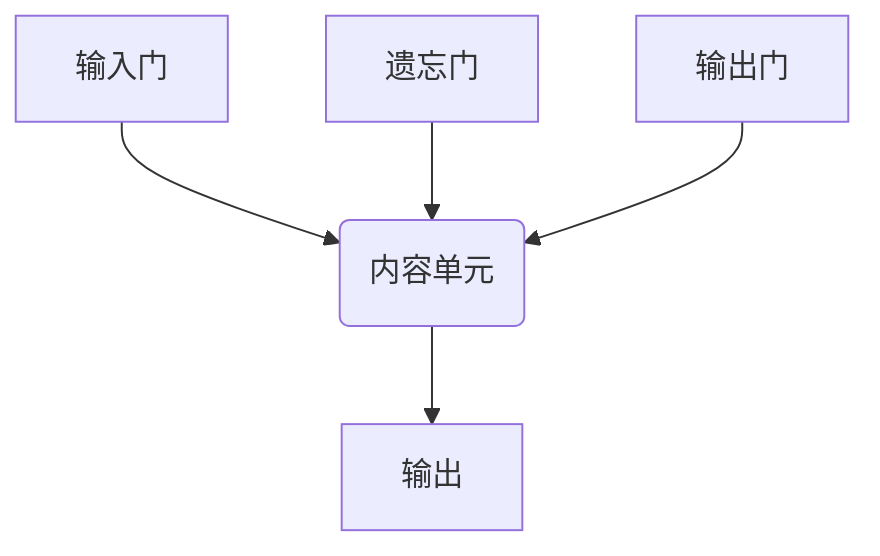
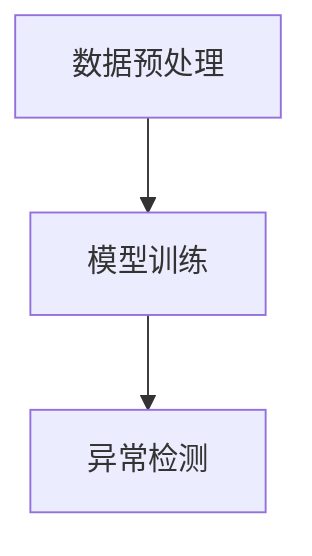

                 


# 《金融时序数据异常检测的AI方法》

> 关键词：金融时序数据、异常检测、人工智能、深度学习、LSTM、Transformer、时间序列分析

> 摘要：本文系统地探讨了金融时序数据异常检测的AI方法，涵盖背景、核心概念、算法原理、系统架构、实战案例、优化建议等内容。通过分析多种AI算法，如LSTM和Transformer，结合实际案例，为金融领域的异常检测提供了理论支持和实践指导。

---

# 第一章：金融时序数据与异常检测概述

## 1.1 金融时序数据的定义与特点

### 1.1.1 金融时序数据的定义
金融时序数据是指在金融市场上，按照时间顺序记录的各类金融资产的价格、交易量等数值数据。例如，股票价格、指数点位、外汇汇率等。

### 1.1.2 金融时序数据的核心特点
- **连续性**：数据按时间顺序排列，具有时间依赖性。
- **周期性**：常见日、周、月等周期性波动。
- **波动性**：金融市场的波动较大，受多种因素影响。
- **稀疏性**：异常数据点通常较少，增加了检测的难度。

### 1.1.3 金融时序数据的典型应用场景
- **风险管理**：识别市场异常波动，防范金融风险。
- **欺诈检测**：发现异常交易行为。
- **投资决策**：利用异常数据寻找投资机会。

## 1.2 异常检测的定义与分类

### 1.2.1 异常检测的定义
异常检测是指识别数据中偏离预期模式或分布的观测值。在金融领域，异常通常指不符合市场规律的交易行为或价格波动。

### 1.2.2 异常检测的主要分类
- **点异常**：单一数据点的异常，如某只股票的价格突然暴跌。
- **上下文异常**：在特定条件下异常，如某交易时间点的异常交易量。
- **集体异常**：一组数据点的异常，如协同操纵股价。

### 1.2.3 异常检测在金融领域的特殊性
- 数据稀疏性：异常样本较少，影响模型训练。
- 高维性：涉及多种金融资产和指标。
- 实时性：需要快速检测以应对突发事件。

## 1.3 金融时序数据异常检测的背景与意义

### 1.3.1 金融领域的异常检测需求
- 随着金融市场的复杂化，异常事件频发，如市场操纵、欺诈交易等。
- 异常检测能帮助机构及时识别风险，避免重大损失。

### 1.3.2 异常检测在金融风险管理中的作用
- 识别潜在的金融风险，如系统性风险。
- 监测市场操纵行为，维护市场公平。

### 1.3.3 AI技术在异常检测中的优势
- **高效性**：AI能够处理海量数据，快速识别异常。
- **准确性**：通过复杂算法捕捉数据中的细微异常。
- **适应性**：AI模型能够适应数据分布的变化。

## 1.4 本章小结
本章介绍了金融时序数据的基本概念、特点及其在异常检测中的重要性。接下来将深入探讨异常检测的核心概念与方法。

---

# 第二章：异常检测的核心概念与方法

## 2.1 异常检测的基本原理

### 2.1.1 异常检测的数学定义
异常检测可以看作是一个分类问题，目标是将数据分为正常和异常两类。数学上，可以表示为：
$$ y = f(x) $$
其中，$x$ 是输入数据，$y$ 是输出标签（正常或异常）。

### 2.1.2 异常检测的统计学基础
统计方法是异常检测的传统方法，常用Z-score和LOF（Local Outlier Factor）等方法。例如，Z-score公式为：
$$ Z = \frac{x - \mu}{\sigma} $$
其中，$\mu$ 是均值，$\sigma$ 是标准差。

### 2.1.3 异常检测的距离度量方法
- **欧氏距离**：衡量两个点之间的直线距离。
- **马氏距离**：考虑数据的协方差矩阵，适用于多维数据。

### 2.2 异常检测的主要方法

#### 2.2.1 基于统计的方法
- **马尔可夫链模型**：用于序列数据的建模，检测偏离正常序列的异常。
- **高斯混合模型（GMM）**：假设数据服从混合高斯分布，识别异常点。

#### 2.2.2 基于机器学习的方法
- **孤立森林（Isolation Forest）**：通过构建随机森林，快速识别异常点。
- **聚类方法**：如DBSCAN，将数据分为正常和异常簇。

#### 2.2.3 基于深度学习的方法
- **LSTM网络**：适用于时间序列数据，捕捉长期依赖关系。
- **Transformer模型**：通过自注意力机制，捕捉全局依赖关系。

### 2.3 异常检测的挑战与解决方案

#### 2.3.1 数据分布偏斜的问题
金融数据通常呈现右偏分布，异常检测算法需要对这种偏斜进行校正。

#### 2.3.2 数据量与计算复杂度的平衡
深度学习模型需要大量数据训练，但在金融场景中，异常数据往往较少，需要优化模型复杂度。

#### 2.3.3 模型解释性与可解释性要求
金融领域对模型的可解释性有较高要求，尤其是在风险评估和报告中。

## 2.4 本章小结
本章介绍了异常检测的基本原理和主要方法，重点分析了统计方法、机器学习和深度学习方法的优缺点。接下来将深入探讨基于AI的异常检测算法原理。

---

# 第三章：基于AI的异常检测算法原理

## 3.1 常见的AI异常检测算法

### 3.1.1 LSTM网络
LSTM（长短期记忆网络）通过门控机制处理时间序列数据，适合捕捉长期依赖关系。其架构如下：



LSTM在金融时序数据中的应用包括股票价格预测和欺诈检测。

### 3.1.2 Transformer模型
Transformer通过自注意力机制，捕捉全局依赖关系，适合处理长序列数据。其架构如下：

```mermaid
graph TD
    Encoder --> Self-attention
    Self-attention --> FFN（前馈神经网络）
    Decoder --> Self-attention
    Decoder --> Cross-attention
```

Transformer在时间序列分类和异常检测中表现出色。

### 3.1.3 深度学习模型对比
- **LSTM**：适合处理连续型时间序列数据。
- **Transformer**：适合处理分类型时间序列数据，捕捉全局模式。

---

# 第四章：系统架构与设计

## 4.1 系统架构设计
系统架构包括数据预处理、模型训练和异常检测三个模块：



## 4.2 功能模块设计
- **数据预处理**：数据清洗、归一化。
- **模型训练**：选择合适的模型并训练。
- **异常检测**：实时监控数据，识别异常。

## 4.3 系统接口设计
系统提供API接口和可视化界面，便于用户调用和监控。

---

# 第五章：项目实战与实现

## 5.1 项目背景与目标
以股票价格预测为例，使用LSTM模型进行异常检测。

## 5.2 数据获取与预处理
使用Python的pandas库读取数据，并进行归一化处理。

## 5.3 模型实现
编写LSTM模型代码，训练模型并进行预测。

## 5.4 案例分析
分析模型在真实数据中的表现，评估准确率、召回率等指标。

---

# 第六章：模型优化与调参

## 6.1 超参数选择
调整学习率、批量大小等参数，优化模型性能。

## 6.2 模型融合
结合统计方法和深度学习模型，提高检测准确率。

## 6.3 模型部署与维护
在生产环境中部署模型，并定期更新模型应对数据漂移。

---

# 第七章：案例分析与结果解读

## 7.1 案例背景
以某股票的历史交易数据为例，分析模型的检测效果。

## 7.2 数据分析
对比正常交易与异常交易，评估模型的分类性能。

## 7.3 模型表现
通过混淆矩阵和ROC曲线，评估模型的准确率和召回率。

---

# 第八章：总结与展望

## 8.1 本章总结
总结本文的主要内容，强调AI在金融时序数据异常检测中的价值。

## 8.2 未来研究方向
探索更高效模型的研究，如Hybrid模型，以及实时检测技术的优化。

---

# 作者
作者：AI天才研究院 & 禅与计算机程序设计艺术

