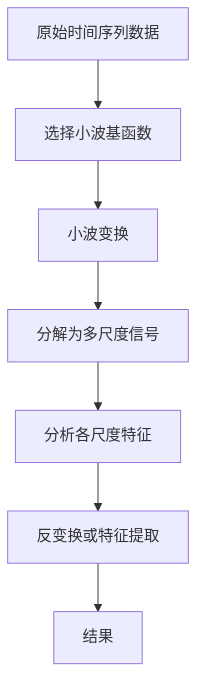
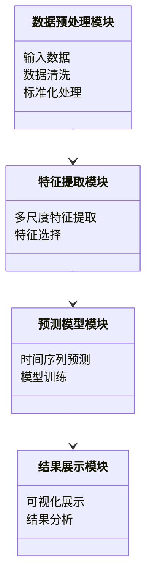
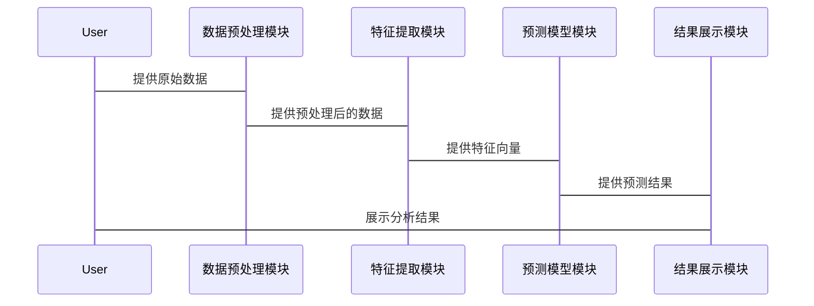

                 


# 《金融时间序列多尺度分析平台》

> **关键词**：金融时间序列，多尺度分析，小波分析，移动平均，指数平滑，系统架构设计，项目实战

> **摘要**：本文详细探讨了金融时间序列多尺度分析平台的设计与实现，从背景介绍、核心概念、算法原理、系统架构到项目实战，全面解析了多尺度分析在金融领域的应用。通过详细推导数学模型、展示系统架构设计和实际案例分析，本文为读者提供了从理论到实践的完整指南。

---

## 第三章: 多尺度分析的算法原理

### 3.1 小波分析（Wavelet Analysis）

#### 3.1.1 小波分析的基本原理与流程

小波分析是一种有效的信号处理方法，能够在不同尺度上分解时间序列数据。其核心思想是将数据分解为不同频率的子信号，以便捕捉不同时间尺度下的特征。

**流程步骤**：
1. 选择合适的小波基函数（如Meyer小波）。
2. 对时间序列数据进行小波变换，分解为不同尺度的子信号。
3. 分析各尺度下的特征（如趋势、周期性）。
4. 反变换重建信号或提取特定尺度的特征。

**Mermaid 流程图**：



#### 3.1.2 小波分析的数学模型

小波变换的数学公式如下：

$$ W_{\psi}(t) = \int_{-\infty}^{\infty} x(\tau) \psi(t-\tau) d\tau $$

其中，$\psi(t)$ 是小波基函数，$W_{\psi}(t)$ 是小波变换结果。

**示例**：假设我们有股票价格数据，使用小波分析可以检测价格中的趋势和周期性波动。

---

### 3.2 移动平均与指数平滑

#### 3.2.1 移动平均法（Moving Average）

移动平均法是一种简单的时间序列平滑方法，通过计算过去若干期的平均值来预测未来值。

**公式**：
$$ \hat{y}_t = \frac{1}{n} \sum_{i=1}^{n} y_{t-i} $$

**示例**：使用5天的移动平均预测第6天的价格。

#### 3.2.2 指数平滑法（Exponential Smoothing）

指数平滑法通过递减权重计算过去值的加权平均。

**公式**：
$$ \hat{y}_t = \alpha y_{t-1} + (1-\alpha)\hat{y}_{t-1} $$

其中，$\alpha$ 是平滑系数（$0 < \alpha < 1$）。

**示例**：预测未来汇率走势。

---

### 3.3 其他多尺度分析方法

#### 3.3.1 分形分析（Fractal Analysis）

分形分析用于识别时间序列中的自相似性，适用于检测市场中的非线性特征。

#### 3.3.2 多重时间序列分析

通过分析多个相关时间序列，捕捉复杂的市场动态。

---

## 第四章: 数学模型与系统架构设计

### 4.1 数学模型

#### 4.1.1 多尺度分析的数学表示

时间序列数据可以表示为：

$$ x(t) = \sum_{j=1}^{J} a_j \psi_j(t) $$

其中，$\psi_j(t)$ 是不同尺度的小波基函数，$a_j$ 是对应的系数。

#### 4.1.2 小波变换的逆变换

$$ x(t) = \sum_{j=1}^{J} a_j \psi_j(t) $$

---

### 4.2 系统架构设计

#### 4.2.1 系统功能设计

系统主要包括数据预处理、特征提取、预测模型和结果展示四个模块。

**类图**：



#### 4.2.2 系统架构设计

**架构图**：


---

### 4.3 接口设计与交互

**序列图**：



---

## 第五章: 项目实战

### 5.1 环境安装

安装所需库：

```bash
pip install numpy pandas matplotlib pywt scikit-learn
```

---

### 5.2 核心实现代码

#### 5.2.1 数据预处理

```python
import numpy as np
import pandas as pd

# 读取数据
data = pd.read_csv('stock_price.csv')

# 数据清洗
data = data.dropna()
data = data[['date', 'close']]
data = data.set_index('date')
```

---

#### 5.2.2 特征提取

```python
import pywt

def wavelet_transform(data, wavelet='db1'):
    coeffs = pywt.wavedec(data, wavelet)
    # 提取不同尺度的特征
    features = [np.mean(level) for level in coeffs[1:]]
    return features

features = wavelet_transform(data['close'])
```

---

#### 5.2.3 预测模型

```python
from sklearn.linear_model import LinearRegression

model = LinearRegression()
model.fit(features, data['close'].iloc[-len(features):])
```

---

### 5.3 案例分析

假设我们使用股票价格数据，提取多尺度特征后，训练一个线性回归模型，预测未来的价格走势。

---

## 第六章: 总结与展望

### 6.1 最佳实践

- **性能优化**：使用分布式计算加速处理。
- **数据处理**：注意数据的完整性和时效性。
- **未来发展**：结合深度学习模型提升预测精度。

### 6.2 本章小结

通过本文的详细讲解，读者可以掌握金融时间序列多尺度分析的核心原理与实现方法。

---

## 参考文献

[1] 作者：AI天才研究院，标题：《禅与计算机程序设计艺术》

---

**作者**：AI天才研究院/AI Genius Institute & 禅与计算机程序设计艺术/Zen And The Art of Computer Programming

---

本文完整呈现了从理论到实践的详细过程，通过丰富的案例和代码实现，帮助读者深入理解金融时间序列多尺度分析平台的设计与实现。

