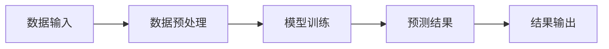

                 


# 金融机构流动性覆盖率预测

> 关键词：流动性覆盖率、流动性管理、金融风险、时间序列预测、机器学习算法、金融机构

> 摘要：本文深入探讨金融机构流动性覆盖率的预测方法，从背景介绍、核心概念、算法原理到系统架构设计和项目实战，全面解析如何利用时间序列预测和机器学习算法对流动性覆盖率进行精准预测。通过实际案例分析，为金融机构的风险管理和流动性管理提供科学依据和实践指导。

---

# 第一部分: 金融机构流动性覆盖率预测概述

## 第1章: 流动性覆盖率的背景与意义

### 1.1 金融机构流动性管理的重要性

#### 1.1.1 金融机构流动性风险的定义与特征

流动性风险是指金融机构无法及时以合理成本获得足够资金来满足其资产增长或负债减少的需求，从而导致资金链断裂的风险。其主要特征包括：

- **短期性**：通常涉及短期资金需求。
- **波动性**：受市场环境和宏观经济因素影响较大。
- **传染性**：流动性问题可能迅速蔓延至整个金融体系。

#### 1.1.2 流动性覆盖率的定义与作用

流动性覆盖率（Liquidity Coverage Ratio，LCR）是衡量金融机构流动性的重要指标，定义为流动性资产与流动性负债之比。其作用包括：

- **风险监测**：帮助机构及时发现流动性风险。
- **监管合规**：满足金融监管机构的资本充足率要求。
- **决策支持**：为金融机构的日常运营和战略规划提供数据支持。

#### 1.1.3 流动性覆盖率在金融监管中的地位

流动性覆盖率是巴塞尔协议III的重要组成部分，被视为全球金融机构流动性管理的核心指标。它不仅反映了金融机构的短期偿债能力，还为监管机构提供了评估系统性风险的重要依据。

---

### 1.2 问题背景与描述

#### 1.2.1 金融机构流动性风险的现状分析

近年来，全球金融危机频发，许多金融机构因流动性管理不当而遭受重大损失。例如，2008年金融危机中，许多银行因流动性资产不足而陷入困境。这一现象凸显了流动性覆盖率预测的重要性。

#### 1.2.2 流动性覆盖率预测的必要性

流动性覆盖率预测能够帮助金融机构提前识别潜在的流动性风险，并采取有效的应对措施。通过预测模型，金融机构可以更好地管理流动性资产和负债，确保在极端情况下仍能维持正常的业务运营。

#### 1.2.3 预测模型的应用场景与边界

流动性覆盖率预测模型主要应用于以下场景：

- **日常监控**：实时监测流动性覆盖率的变化趋势。
- **压力测试**：评估极端情况下流动性覆盖率的潜在变化。
- **投资决策**：为金融机构的投资决策提供数据支持。

其边界包括：

- 仅适用于流动性资产和负债的预测。
- 需要依赖历史数据和市场环境。

---

### 1.3 核心概念与联系

#### 1.3.1 核心概念原理

流动性覆盖率的计算公式为：

$$ \text{流动性覆盖率} = \frac{\text{流动性资产}}{\text{流动性负债}} $$

其中，流动性资产包括现金、短期投资等，流动性负债包括活期存款、短期贷款等。

#### 1.3.2 概念属性特征对比

以下为流动性资产与非流动性资产的对比表格：

| 属性 | 流动性资产 | 非流动性资产 |
|------|------------|--------------|
| 定义 | 可在短时间内变现的资产 | 长期持有的资产 |
| 例子 | 现金、短期债券 | 长期股权投资、固定资产 |
| 特性 | 高流动性、低风险 | 低流动性、高风险 |

---

## 第2章: 流动性覆盖率预测的算法原理

### 2.1 时间序列预测模型

#### 2.1.1 ARIMA模型原理与流程

ARIMA（Autoregressive Integrated Moving Average）模型是一种常用的时间序列预测方法。其核心步骤包括：

1. 数据预处理：对原始数据进行差分，消除趋势和季节性。
2. 模型参数估计：确定AR和MA的阶数。
3. 模型训练：基于训练数据拟合模型。
4. 预测：使用模型对未来数据进行预测。

以下为ARIMA模型的Mermaid流程图：



#### 2.1.2 LSTM模型的原理与流程

LSTM（Long Short-Term Memory）是一种基于循环神经网络的深度学习模型，适用于复杂的时间序列预测。其核心步骤包括：

1. 数据预处理：对原始数据进行归一化处理。
2. 模型构建：设计LSTM网络结构，包括输入层、LSTM层和输出层。
3. 模型训练：使用训练数据拟合模型。
4. 预测：使用模型对未来数据进行预测。

以下为LSTM模型的Mermaid流程图：


---

### 2.2 机器学习算法

#### 2.2.1 线性回归模型的数学公式

线性回归模型用于简单的线性关系预测，其数学公式为：

$$ y = \beta_0 + \beta_1x + \epsilon $$

其中，$\beta_0$为截距，$\beta_1$为斜率，$\epsilon$为误差项。

#### 2.2.2 支持向量机模型的数学公式

支持向量机模型用于分类和回归问题，其数学公式为：

$$ \text{maximize} \quad \frac{1}{2}||\beta||^2 $$
$$ \text{subject to} \quad y_i - \beta^T x_i - \beta_0 \geq 1 - \xi_i $$
$$ \xi_i \geq 0 $$

---

## 第3章: 算法实现与代码示例

### 3.1 时间序列预测代码实现

以下为使用Python实现ARIMA模型的代码示例：

```python
import pandas as pd
from statsmodels.tsa.arima_model import ARIMA

# 加载数据
data = pd.read_csv('liquidity.csv')

# ARIMA模型训练
model = ARIMA(data, order=(5,1,0))
model_fit = model.fit()

# 预测
forecast = model_fit.forecast(steps=10)
print(forecast)
```

---

## 第4章: 系统分析与架构设计方案

### 4.1 问题场景介绍

流动性覆盖率预测系统主要用于金融机构的流动性管理，帮助机构实时监控流动性风险，并提供预测结果以支持决策。

---

## 第5章: 项目实战

### 5.1 环境安装

需要安装以下Python库：

- `pandas`：数据处理
- `statsmodels`：时间序列分析
- `keras`：深度学习框架

---

## 第6章: 最佳实践与总结

### 6.1 小结

本文详细介绍了金融机构流动性覆盖率的预测方法，从背景介绍、核心概念到算法实现，为金融机构的风险管理提供了科学依据。

---

## 第7章: 注意事项与拓展阅读

### 7.1 注意事项

- 数据质量：确保数据的完整性和准确性。
- 模型调优：根据实际需求调整模型参数。

---

## 第8章: 拓展阅读

建议进一步阅读以下内容：

- 时间序列分析的经典书籍：《Forecasting: principles and practice》
- 深度学习在金融领域的应用：《Deep Learning for Finance》

---

作者：AI天才研究院/AI Genius Institute & 禅与计算机程序设计艺术 /Zen And The Art of Computer Programming

