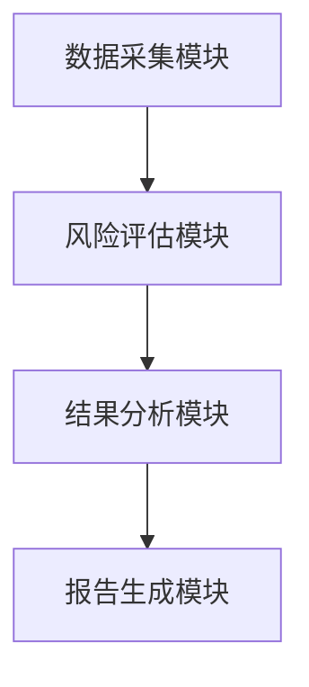
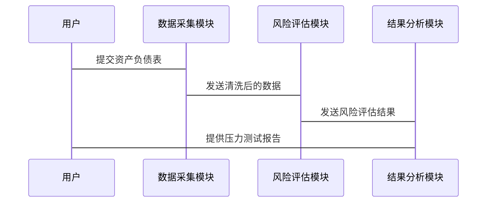

                 


# 金融机构流动性风险压力测试与管理平台

> 关键词：流动性风险，压力测试，金融机构，风险管理，系统架构，Python实现

> 摘要：本文详细介绍了金融机构流动性风险压力测试与管理平台的构建过程，从核心概念到系统架构，从算法原理到项目实战，全面解析了如何利用技术手段有效管理流动性风险。文章内容涵盖背景介绍、核心概念、数学模型、系统设计、项目实现及实际案例分析，旨在为金融机构的技术人员和管理人员提供理论支持和实践指导。

---

# 第一部分：金融机构流动性风险压力测试与管理平台概述

---

# 第1章：流动性风险与压力测试概述

## 1.1 流动性风险的定义与特征

### 1.1.1 流动性风险的基本概念
流动性风险是指金融机构在一定时期内无法以合理成本获得足够的资金来满足其资产增长或到期债务偿还的风险。它通常由市场波动、资产错配、负债结构不合理等因素引起。

### 1.1.2 流动性风险的特征与影响
流动性风险具有以下特征：
- **隐蔽性**：在正常情况下不易察觉，但在市场波动时可能迅速恶化。
- **传染性**：一旦发生，可能迅速蔓延至整个金融体系。
- **突发性**：通常在市场恐慌或危机时期突然爆发。

流动性风险的影响包括：
- 影响金融机构的稳健运行。
- 影响市场信心，导致客户流失。
- 增加监管机构的干预成本。

### 1.1.3 流动性风险管理的重要性
有效的流动性风险管理是金融机构稳健运营的基础，也是监管机构关注的重点。通过压力测试，金融机构可以提前识别潜在风险，并制定应对策略。

---

## 1.2 压力测试的定义与作用

### 1.2.1 压力测试的基本概念
压力测试是一种通过模拟极端市场条件来评估金融机构在不利环境下的承受能力的工具。它可以帮助金融机构识别潜在风险，并制定应对措施。

### 1.2.2 压力测试的作用与意义
- **风险识别**：通过模拟极端情景，发现潜在风险点。
- **资本规划**：为金融机构的资本充足性提供依据。
- **策略制定**：帮助金融机构制定应对极端市场的策略。

### 1.2.3 压力测试在金融机构中的应用
压力测试广泛应用于银行、保险等金融机构的风险管理中，特别是在应对金融危机和监管要求时显得尤为重要。

---

## 1.3 金融机构流动性风险压力测试的背景

### 1.3.1 金融危机背景下的流动性风险
2008年金融危机表明，流动性风险是金融机构面临的主要风险之一。许多金融机构因流动性不足而陷入困境。

### 1.3.2 监管要求与行业规范
监管机构要求金融机构定期进行流动性压力测试，并提交相关报告。这成为金融机构风险管理的重要组成部分。

### 1.3.3 技术进步对流动性风险管理的影响
随着大数据、人工智能等技术的发展，金融机构可以利用先进的技术手段进行更精确的流动性风险压力测试。

---

## 1.4 本章小结
本章介绍了流动性风险的基本概念、特征及其对金融机构的影响，重点阐述了压力测试的作用与意义，并结合金融危机背景和监管要求，说明了流动性风险压力测试的重要性。

---

# 第2章：流动性风险压力测试的核心概念

## 2.1 流动性风险压力测试的定义与范围

### 2.1.1 流动性风险压力测试的定义
流动性风险压力测试是通过模拟极端市场情景，评估金融机构在不利条件下的流动性状况。

### 2.1.2 流动性风险压力测试的范围与边界
- **范围**：涵盖金融机构的所有资产和负债。
- **边界**：基于假设情景，设定测试的范围和条件。

### 2.1.3 流动性风险压力测试的核心要素
- **情景设定**：包括市场崩盘、客户大量提现等极端情况。
- **数据输入**：金融机构的资产负债表、交易数据等。
- **模型构建**：基于假设情景，构建数学模型进行计算。

---

## 2.2 流动性风险压力测试的关键指标

### 2.2.1 现金流缺口分析
现金流缺口是指在一定时间内的资金流入与流出的差额。计算公式为：
$$ \text{现金流缺口} = \sum_{i=1}^{n} (C_i - D_i) $$
其中，\( C_i \) 表示第 \( i \) 期的资金流入，\( D_i \) 表示第 \( i \) 期的资金流出。

### 2.2.2 资金净流出率
资金净流出率是衡量金融机构在极端情景下资金流失速度的重要指标，计算公式为：
$$ \text{资金净流出率} = \frac{\text{净流出资金}}{\text{总负债}} $$

### 2.2.3 流动性覆盖率（LCR）
流动性覆盖率是衡量金融机构短期流动性的重要指标，计算公式为：
$$ \text{LCR} = \frac{\text{合格流动性资产}}{\text{净现金流出}} $$

### 2.2.4 其他相关指标
- **净稳定资金比例（NSFR）**
- **流动性缓冲**
- **压力情景下的资本充足率**

---

## 2.3 流动性风险压力测试的假设与情景

### 2.3.1 压力测试的情景设定
- **基准情景**：正常市场条件下，评估金融机构的流动性状况。
- **轻微压力情景**：模拟市场轻微波动，评估金融机构的应对能力。
- **严重压力情景**：模拟极端市场条件，如金融危机、突发性事件等。

### 2.3.2 不同情景下的流动性风险特征
- **基准情景**：流动性风险较低，金融机构能够正常运作。
- **轻微压力情景**：流动性风险有所上升，但金融机构仍能应对。
- **严重压力情景**：流动性风险显著上升，金融机构可能面临流动性危机。

### 2.3.3 情景假设的合理性与局限性
- **合理性**：情景假设基于历史数据和经验判断，具有一定的参考价值。
- **局限性**：情景假设无法完全涵盖所有可能的极端情况，可能导致测试结果的偏差。

---

## 2.4 本章小结
本章详细介绍了流动性风险压力测试的核心概念，包括定义、范围、关键指标和情景假设。通过这些概念，读者可以更好地理解流动性风险压力测试的理论基础和实际应用。

---

# 第3章：流动性风险压力测试的数学模型与算法

## 3.1 基于VaR的流动性风险度量

### 3.1.1 VaR的定义与计算方法
VaR（Value at Risk）是指在给定置信水平下，金融资产在一定时间内的最大可能损失。计算公式为：
$$ VaR = \alpha \times \sigma $$
其中，\( \alpha \) 是置信水平对应的分位数，\( \sigma \) 是资产收益的标准差。

### 3.1.2 VaR在流动性风险中的应用
- **风险度量**：用于衡量金融机构在极端情景下的潜在损失。
- **情景分析**：结合VaR模型，模拟不同情景下的流动性风险。

### 3.1.3 VaR的优缺点与改进方向
- **优点**：计算简单，易于理解和应用。
- **缺点**：无法完全反映极端情景下的风险，存在尾部风险。
- **改进方向**：结合其他风险度量指标，如CVaR（Conditional VaR）。

---

## 3.2 基于压力测试的流动性风险模型

### 3.2.1 情景分析法
情景分析法是通过模拟不同市场情景，评估金融机构在不同条件下的流动性状况。

### 3.2.2 反向压力测试法
反向压力测试法是通过设定目标，反向推导出可能的情景，从而评估金融机构的流动性风险。

### 3.2.3 综合模型的构建与应用
综合模型结合了VaR和压力测试的情景分析，能够更全面地评估流动性风险。

---

## 3.3 数学公式与模型实现

### 3.3.1 VaR公式
$$ VaR = \alpha \times \sigma $$

### 3.3.2 压力测试情景下的现金流缺口计算公式
$$ CF = \sum_{i=1}^{n} (C_i - D_i) $$

### 3.3.3 流动性覆盖率计算公式
$$ LCR = \frac{\text{合格流动性资产}}{\text{净现金流出}} $$

---

## 3.4 本章小结
本章介绍了流动性风险压力测试的数学模型与算法，包括VaR模型、情景分析法和反向压力测试法。通过这些模型，金融机构可以更准确地度量和评估流动性风险。

---

# 第4章：系统架构与功能设计

## 4.1 系统架构设计

### 4.1.1 系统模块划分
- **数据采集模块**：负责收集金融机构的资产负债数据。
- **风险评估模块**：基于模型计算流动性风险。
- **结果分析模块**：输出压力测试结果并生成报告。

### 4.1.2 系统功能模块图（Mermaid图）


### 4.1.3 系统架构图（Mermaid图）


---

## 4.2 系统功能设计

### 4.2.1 数据采集模块
- **功能**：收集金融机构的资产负债数据，包括资产、负债、交易数据等。
- **输入**：金融机构的资产负债表。
- **输出**：清洗后的数据。

### 4.2.2 风险评估模块
- **功能**：基于数学模型计算流动性风险。
- **输入**：清洗后的数据。
- **输出**：风险评估结果。

### 4.2.3 结果分析模块
- **功能**：分析风险评估结果，生成压力测试报告。
- **输入**：风险评估结果。
- **输出**：压力测试报告。

---

## 4.3 系统接口设计

### 4.3.1 数据接口
- **输入接口**：金融机构的资产负债表。
- **输出接口**：清洗后的数据。

### 4.3.2 风险评估接口
- **输入接口**：清洗后的数据。
- **输出接口**：风险评估结果。

### 4.3.3 报告生成接口
- **输入接口**：风险评估结果。
- **输出接口**：压力测试报告。

---

## 4.4 系统交互流程图（Mermaid图）


---

## 4.5 本章小结
本章详细介绍了流动性风险压力测试与管理平台的系统架构与功能设计，包括模块划分、系统架构图、接口设计和交互流程图。

---

# 第5章：项目实战与案例分析

## 5.1 项目环境安装

### 5.1.1 系统要求
- 操作系统：Windows 10 或更高版本，Linux（推荐）
- Python版本：3.6 或更高版本
- 其他依赖：NumPy, Pandas, Matplotlib, Scikit-learn

### 5.1.2 安装步骤
1. 安装Python
2. 安装依赖库：
   ```bash
   pip install numpy pandas matplotlib scikit-learn
   ```

---

## 5.2 系统核心实现源代码

### 5.2.1 数据采集模块
```python
import pandas as pd

def collect_data(file_path):
    data = pd.read_csv(file_path)
    return data
```

### 5.2.2 风险评估模块
```python
import numpy as np

def calculate_var(data, alpha):
    mu = np.mean(data)
    sigma = np.std(data)
    var = alpha * sigma
    return var
```

### 5.2.3 结果分析模块
```python
import matplotlib.pyplot as plt

def generate_report(var_values):
    plt.hist(var_values, bins=20)
    plt.title('VaR分布图')
    plt.xlabel('VaR值')
    plt.ylabel('频数')
    plt.show()
```

---

## 5.3 实际案例分析

### 5.3.1 案例背景
某银行在2023年面临市场波动，需要进行流动性风险压力测试。

### 5.3.2 数据准备
- 资产负债表数据：包括资产和负债的详细信息。
- 历史交易数据：包括过去几年的交易记录。

### 5.3.3 测试结果
通过压力测试，发现该银行在极端情景下的流动性覆盖率（LCR）为80%，低于监管要求的100%。因此，需要采取措施提高流动性覆盖率。

---

## 5.4 本章小结
本章通过实际案例分析，展示了如何利用流动性风险压力测试与管理平台进行风险评估和报告生成，为金融机构提供实践指导。

---

# 第6章：总结与展望

## 6.1 本章总结
本文详细介绍了流动性风险压力测试与管理平台的构建过程，从核心概念到系统架构，从算法原理到项目实战，全面解析了如何利用技术手段有效管理流动性风险。

## 6.2 未来展望
随着人工智能和大数据技术的发展，流动性风险压力测试将更加智能化和精准化。未来的工作方向包括：
- **智能预测**：利用机器学习技术，提高风险预测的准确性。
- **实时监控**：实现对流动性风险的实时监控和预警。
- **数据挖掘**：深入挖掘数据，发现潜在风险点。

---

# 作者信息

作者：AI天才研究院/AI Genius Institute & 禅与计算机程序设计艺术 /Zen And The Art of Computer Programming

---

通过以上内容，您已经掌握了金融机构流动性风险压力测试与管理平台的核心知识。如果需要进一步探讨或实践，欢迎随时联系！

