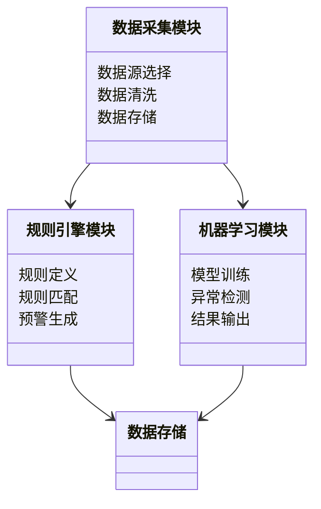

                 


# 金融监管合规自动化工具

> 关键词：金融监管、合规自动化、人工智能、规则引擎、区块链

> 摘要：本文详细探讨了金融监管合规自动化工具的设计与实现，结合实际案例分析，阐述了其在反洗钱、风险管理等领域的应用。通过技术分析和系统架构设计，展示了如何利用规则引擎、机器学习和区块链等技术实现金融监管的智能化与自动化。

---

# 第一部分：金融监管合规自动化工具概述

## 第1章：金融监管合规自动化工具的背景与现状

### 1.1 金融监管的背景与挑战

#### 1.1.1 金融监管的基本概念
金融监管是指通过法律法规和规章制度，对金融机构的经营行为进行监督和管理，以确保金融市场的稳定和投资者权益的保护。

#### 1.1.2 传统金融监管的痛点与不足
- **效率低下**：传统监管方式依赖人工审核，效率低且易出错。
- **成本高昂**：需要大量的人力和时间投入。
- **合规难度大**：法律法规不断更新，合规要求日益复杂。

#### 1.1.3 金融监管合规的重要性
合规是金融机构生存和发展的基础，不合规可能导致罚款、声誉损失甚至法律风险。

### 1.2 金融监管合规自动化的需求与趋势

#### 1.2.1 合规自动化的需求分析
- **提高效率**：自动化工具可以快速处理大量数据。
- **降低成本**：减少人工干预，降低运营成本。
- **实时监控**：实现对金融交易的实时监管。

#### 1.2.2 金融科技的发展对金融监管的影响
金融科技（FinTech）的发展推动了金融监管技术的创新，如人工智能、大数据和区块链等技术的应用。

#### 1.2.3 金融监管合规自动化工具的市场现状
目前，市场上已经涌现出多种金融监管合规自动化工具，但仍存在技术不成熟、适应性差等问题。

### 1.3 本章小结
本章介绍了金融监管的背景与挑战，分析了合规自动化的需求与趋势，为后续章节奠定了基础。

---

## 第2章：金融监管合规的基础知识

### 2.1 金融监管的主要领域

#### 2.1.1 反洗钱（AML）
反洗钱是金融监管的重要组成部分，主要通过监控和分析异常交易行为，识别和阻止非法资金流动。

#### 2.1.2 内部控制与风险管理
内部控制是金融机构防范风险的重要手段，包括制度设计、流程控制和内部审计等。

#### 2.1.3 证券合规
证券合规涉及信息披露、交易合规和市场操纵等方面，确保证券市场的公平与透明。

### 2.2 金融监管的法律法规框架

#### 2.2.1 主要金融监管法规介绍
- 《反洗钱法》
- 《证券法》
- 《公司治理准则》

#### 2.2.2 不同国家的监管差异
不同国家的金融监管法规和标准存在差异，例如欧盟的《通用数据保护条例》（GDPR）和美国的《多德-弗兰克法案》。

#### 2.2.3 合规要求的动态变化
金融监管法规会随着经济环境的变化不断更新，合规要求也随之调整。

### 2.3 数据在金融监管中的作用

#### 2.3.1 数据的采集与处理
数据采集是金融监管的基础，包括交易数据、客户信息和市场数据等。

#### 2.3.2 数据的分析与应用
通过对数据的分析，可以识别异常交易行为，评估风险并制定相应的监管策略。

#### 2.3.3 数据安全与隐私保护
数据安全是金融监管中的重要问题，需要通过加密技术和访问控制来保护客户隐私。

### 2.4 本章小结
本章介绍了金融监管的主要领域、法律法规框架以及数据在金融监管中的作用，为后续章节的分析提供了理论基础。

---

## 第3章：金融监管合规自动化工具的核心概念

### 3.1 合规自动化工具的基本原理

#### 3.1.1 自动化工具的工作流程
1. 数据采集与预处理
2. 规则匹配与异常检测
3. 预警与报告生成

#### 3.1.2 规则引擎的定义与作用
规则引擎是一种用于定义、管理和执行业务规则的软件组件，可以将复杂的合规规则转化为可执行的逻辑。

#### 3.1.3 机器学习在合规自动化中的应用
机器学习可以通过对历史数据的学习，识别潜在的异常交易模式。

### 3.2 合规自动化工具的关键技术

#### 3.2.1 自然语言处理（NLP）在文档分析中的应用
NLP技术可以用于解析复杂的法律文本和合规文档。

#### 3.2.2 数据挖掘与分析技术
数据挖掘技术可以发现数据中的隐藏模式，帮助识别潜在的合规风险。

#### 3.2.3 区块链技术在合规记录中的应用
区块链技术可以提供不可篡改的交易记录，增强合规数据的真实性。

### 3.3 合规自动化工具的功能模块

#### 3.3.1 数据采集与预处理模块
负责从多种数据源采集数据，并进行清洗和转换。

#### 3.3.2 合规规则匹配模块
将采集到的数据与预先定义的合规规则进行匹配，识别不符合要求的交易行为。

#### 3.3.3 异常检测与预警模块
通过机器学习模型或统计方法，检测异常交易行为，并发出预警。

#### 3.3.4 报告生成与输出模块
根据检测结果生成合规报告，并输出给监管机构或相关责任人。

### 3.4 本章小结
本章详细介绍了金融监管合规自动化工具的核心概念，包括工作原理、关键技术及其功能模块。

---

## 第4章：金融监管合规自动化工具的核心算法原理

### 4.1 基于规则的异常检测

#### 4.1.1 规则引擎的实现
规则引擎通过定义一系列规则，对交易行为进行匹配和判断。

#### 4.1.2 规则的优先级与执行顺序
规则引擎需要考虑规则的优先级和执行顺序，确保检测的准确性。

#### 4.1.3 规则的动态更新
合规规则会随着法律法规的变化而更新，规则引擎需要支持动态调整。

### 4.2 基于机器学习的异常检测

#### 4.2.1 机器学习模型的选择
常用的模型包括随机森林、支持向量机（SVM）和深度学习模型。

#### 4.2.2 异常检测的数学模型
异常检测可以通过概率分布模型（如高斯分布）或距离度量模型（如K-近邻）实现。

#### 4.2.3 模型训练与优化
通过历史数据训练模型，并通过交叉验证优化模型参数。

### 4.3 规则引擎与机器学习的结合

#### 4.3.1 规则引擎与机器学习的协同工作
规则引擎用于快速过滤明显违规行为，机器学习模型用于检测潜在的异常行为。

#### 4.3.2 结合的优势与挑战
结合规则引擎和机器学习可以提高检测的准确性和效率，但也需要解决规则冲突和模型解释性等问题。

### 4.4 本章小结
本章详细讲解了金融监管合规自动化工具中的核心算法原理，包括基于规则和机器学习的异常检测方法及其结合方式。

---

## 第5章：金融监管合规自动化工具的系统架构设计

### 5.1 系统功能设计

#### 5.1.1 领域模型设计
领域模型通过类图描述系统的功能模块及其交互关系。



#### 5.1.2 系统架构设计
系统架构设计需要考虑高可用性和扩展性。


#### 5.1.3 接口设计
系统需要提供API接口，供外部调用。

#### 5.1.4 交互流程设计
```mermaid
sequenceDiagram
    客户端 -> 数据采集模块: 发起请求
    数据采集模块 -> 数据处理模块: 提交数据
    数据处理模块 -> 规则引擎模块: 进行规则匹配
    规则引擎模块 -> 数据存储模块: 更新数据库
    并发
    数据处理模块 -> 机器学习模块: 进行异常检测
    机器学习模块 -> 数据存储模块: 更新数据库
    数据存储模块 -> 报告生成模块: 生成报告
    报告生成模块 -> 客户端: 返回报告
```

### 5.2 本章小结
本章详细描述了金融监管合规自动化工具的系统架构设计，包括功能模块、架构图和交互流程图。

---

## 第6章：金融监管合规自动化工具的项目实战

### 6.1 环境安装

#### 6.1.1 安装Python环境
使用Anaconda安装Python 3.8以上版本。

#### 6.1.2 安装依赖库
安装必要的库，如`pandas`, `numpy`, `scikit-learn`, `pyod`等。

### 6.2 核心代码实现

#### 6.2.1 数据采集与预处理
```python
import pandas as pd
import numpy as np

# 数据采集
data = pd.read_csv('transactions.csv')

# 数据清洗
data = data.dropna()
data = data[~data['amount'].isin([np.nan, np.inf])]
```

#### 6.2.2 规则匹配与异常检测
```python
from pyod.models.kmeans import KMeans

# 异常检测
 clf = KMeans(n_clusters=2, random_state=42)
 clf.fit(data)
 anomalies = clf.predict(data)
```

#### 6.2.3 报告生成
```python
from datetime import datetime

def generate_report(anomalies):
    report = pd.DataFrame(columns=['transaction_id', 'is_anomaly'])
    report['transaction_id'] = data.index
    report['is_anomaly'] = anomalies
    report.to_csv('compliance_report.csv', index=False)
```

### 6.3 实际案例分析

#### 6.3.1 案例背景
某银行的交易数据中发现可疑的交易行为，需要通过自动化工具进行检测。

#### 6.3.2 数据分析与结果解读
通过规则引擎和机器学习模型的结合，检测出多笔异常交易，并生成详细报告。

#### 6.3.3 项目小结
通过项目实战，验证了金融监管合规自动化工具的有效性和实用性。

### 6.4 本章小结
本章通过实际案例分析，展示了金融监管合规自动化工具的实现过程和应用效果。

---

## 第7章：金融监管合规自动化工具的最佳实践与未来展望

### 7.1 最佳实践

#### 7.1.1 系统集成与扩展
金融监管合规自动化工具需要与现有系统集成，并支持扩展。

#### 7.1.2 数据安全与隐私保护
在数据采集和处理过程中，必须严格遵守数据安全和隐私保护的相关规定。

#### 7.1.3 持续优化与更新
根据监管法规的变化和业务需求的调整，持续优化工具的功能和性能。

### 7.2 未来展望

#### 7.2.1 技术发展
人工智能和大数据技术的进一步发展，将推动金融监管合规自动化工具的智能化和自动化。

#### 7.2.2 应用场景扩展
合规自动化工具的应用场景将从反洗钱扩展到更多的金融监管领域。

#### 7.2.3 行业合作与标准化
行业内的合作与标准化建设，将促进金融监管合规自动化工具的广泛应用和协同发展。

### 7.3 本章小结
本章总结了金融监管合规自动化工具的最佳实践，并展望了未来的发展方向。

---

## 第8章：总结与致谢

### 8.1 总结
金融监管合规自动化工具通过技术手段实现了金融监管的智能化和自动化，提高了监管效率和准确性。

### 8.2 致谢
感谢读者的关注与支持，也感谢在写作过程中给予帮助的同事和朋友。

---

## 作者信息

作者：AI天才研究院/AI Genius Institute & 禅与计算机程序设计艺术 /Zen And The Art of Computer Programming

