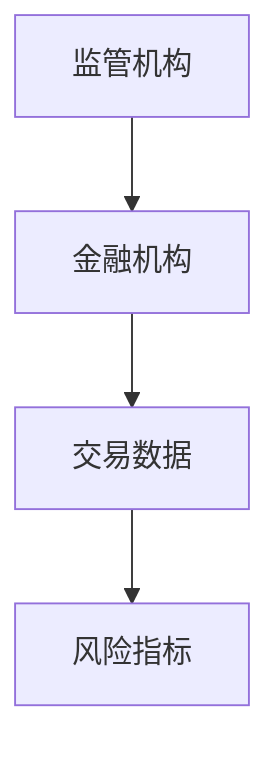
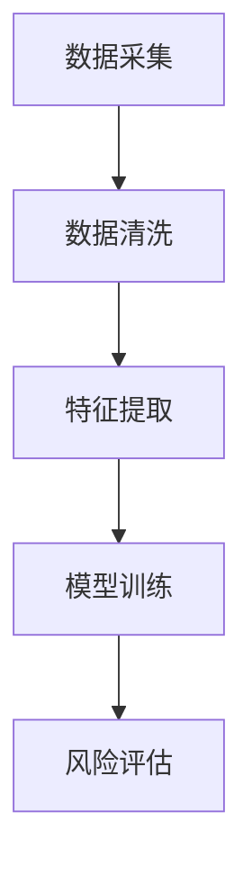

                 


# 《金融监管合规风险评估自动化平台》

## 关键词：金融监管、合规风险、自动化平台、大数据、AI、区块链

## 摘要：  
随着金融市场的快速发展和复杂性增加，传统的金融监管方式面临巨大挑战。本文提出了一种基于大数据、人工智能和区块链技术的金融监管合规风险评估自动化平台。该平台通过整合多源数据，利用先进的数据分析和机器学习算法，实现对金融机构的实时监控和风险评估。本文详细探讨了平台的核心概念、算法原理、系统架构，并通过实际案例展示了平台的实现过程和应用效果，为金融监管部门提供了高效的工具和方法。

---

## 第一部分: 金融监管合规风险评估自动化平台背景与概述

### 第1章: 金融监管的现状与挑战

#### 1.1 传统金融监管的痛点
传统金融监管依赖人工审核和线下流程，存在效率低、覆盖面窄、风险滞后等问题。金融机构的业务复杂性和数据分散性使得监管难度加大，容易出现监管盲区和合规漏洞。

#### 1.2 合规风险的定义与分类
合规风险是指金融机构在经营过程中违反相关法律法规、监管规定或内部政策而导致的法律纠纷、财务损失或声誉损害。常见的合规风险包括操作风险、市场风险、信用风险和流动性风险。

#### 1.3 金融监管数字化转型的必要性
随着金融科技（FinTech）的快速发展，金融机构的业务模式和交易行为发生了巨大变化，传统的监管手段已无法满足需求。数字化转型是提升监管效率、降低合规风险的必然选择。

---

### 第2章: 自动化平台的核心概念

#### 2.1 金融监管合规风险评估的定义
金融监管合规风险评估是指通过分析金融机构的业务数据、交易记录和行为模式，识别潜在的合规风险，并评估其对金融系统稳定性的影响。

#### 2.2 核心概念与问题背景
- **监管机构**：负责制定和执行金融监管政策的主体。
- **金融机构**：受监管的银行、证券公司、保险公司等。
- **交易数据**：金融机构的交易记录、日志和客户信息。
- **风险指标**：衡量合规风险的量化指标，如风险评分、合规性等。

#### 2.3 问题描述与解决思路
金融机构的合规风险具有隐蔽性、多样性和动态性特点，传统的监管方式难以实现实时监控和精准识别。自动化平台通过技术手段实现数据的实时采集、分析和预警，解决了传统监管的痛点。

#### 2.4 平台的边界与外延
- **边界**：平台仅关注金融机构的合规风险评估，不涉及具体监管执法。
- **外延**：平台可以扩展到其他领域，如企业合规风险评估、供应链风险管理等。

---

## 第二部分: 核心概念与技术基础

### 第3章: 核心概念与联系

#### 3.1 实体关系图（ER图）


#### 3.2 核心概念属性对比表
| 概念 | 属性 | 描述 |
|------|------|------|
| 监管机构 | 主体 | 政府或监管机构 |
| 金融机构 | 客体 | 银行、证券公司等 |
| 交易数据 | 数据 | 交易记录、日志等 |
| 风险指标 | 指标 | 风险评分、合规性等 |

---

## 第三部分: 算法原理与系统架构

### 第4章: 算法原理与实现

#### 4.1 风险评估算法流程图


#### 4.2 风险评估模型的数学公式
风险评分模型可以表示为：
$$
R = \alpha \cdot X + \beta \cdot Y + \gamma
$$
其中，$X$ 和 $Y$ 分别是交易频率和交易金额，$\alpha$、$\beta$ 是权重系数，$\gamma$ 是常数项。

---

## 第四部分: 项目实战

### 第5章: 环境安装与系统实现

#### 5.1 环境安装
- 安装Python和必要的库（如Pandas、Scikit-learn、TensorFlow）。
- 配置Jupyter Notebook用于数据可视化和模型训练。

#### 5.2 核心代码实现
```python
import pandas as pd
from sklearn.model_selection import train_test_split
from sklearn.metrics import accuracy_score

# 加载数据
data = pd.read_csv('transaction.csv')

# 数据预处理
X = data[['amount', 'frequency']]
y = data['is_fraud']

# 划分训练集和测试集
X_train, X_test, y_train, y_test = train_test_split(X, y, test_size=0.2)

# 模型训练
from sklearn.tree import DecisionTreeClassifier
model = DecisionTreeClassifier()
model.fit(X_train, y_train)

# 模型评估
y_pred = model.predict(X_test)
print("Accuracy:", accuracy_score(y_test, y_pred))
```

---

## 第五部分: 最佳实践与小结

### 第6章: 最佳实践与总结

#### 6.1 项目总结
通过本项目，我们成功构建了一个基于机器学习的金融监管合规风险评估平台，实现了对金融机构的实时监控和风险预警。

#### 6.2 注意事项
- 数据隐私和安全是平台设计中的重要考量。
- 模型的可解释性和鲁棒性需要进一步优化。

#### 6.3 拓展阅读
- 《大数据金融》
- 《区块链技术及应用》
- 《人工智能在金融领域的应用》

---

## 作者：AI天才研究院 & 禅与计算机程序设计艺术

