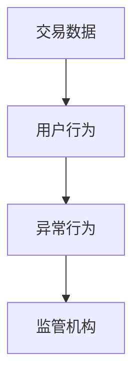
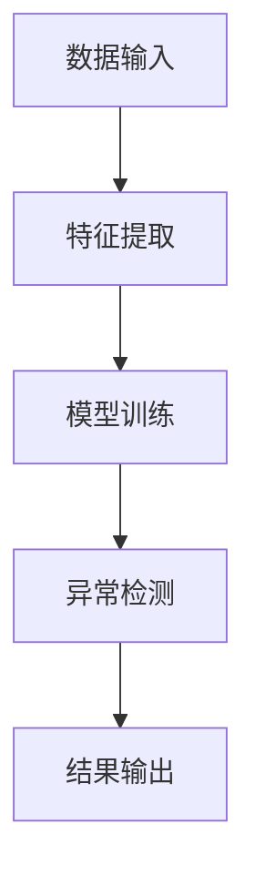
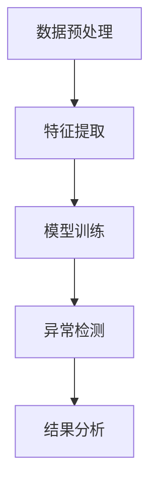
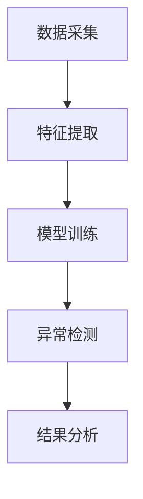

                 


# 金融监管科技异常行为检测系统

> 关键词：金融监管科技，异常行为检测，时间序列分析，机器学习，LSTM，金融监管，实时监控

> 摘要：本文详细探讨了金融监管科技异常行为检测系统的构建与应用。通过分析金融监管科技的背景与意义，阐述了异常行为检测的核心概念与技术原理，重点介绍了基于时间序列分析和机器学习的异常检测算法，并通过实际案例展示了系统的架构设计与项目实战。本文旨在为金融监管科技领域提供一种高效、可靠的异常行为检测解决方案。

---

# 第一部分: 金融监管科技异常行为检测系统概述

# 第1章: 金融监管科技与异常行为检测概述

## 1.1 金融监管科技的背景与意义

### 1.1.1 金融监管科技的定义与特点

- **定义**：金融监管科技（FinTech）是指利用技术手段（如人工智能、大数据、区块链等）来优化和创新金融服务和监管方式。
- **特点**：
  - 数据驱动
  - 实时性
  - 智能化
  - 高效性

### 1.1.2 金融监管科技的核心目标

- 提升金融交易的透明度
- 优化金融监管效率
- 预防金融风险
- 保障金融市场的稳定性

### 1.1.3 异常行为检测在金融监管中的重要性

- 异常行为检测是金融监管的核心环节
- 及时发现和预警金融风险
- 保障金融市场公平与秩序

## 1.2 异常行为检测的基本概念

### 1.2.1 异常行为的定义与分类

- **定义**：异常行为是指在金融交易中偏离正常模式或规律的交易行为。
- **分类**：
  - 突发性异常
  - 累积性异常
  - 关联性异常

### 1.2.2 异常行为检测的特征与挑战

- **特征**：
  - 数据的实时性
  - 异常行为的复杂性
  - 数据量的庞大性
- **挑战**：
  - 数据噪声干扰
  - 异常行为的隐蔽性
  - 模型的可解释性

### 1.2.3 异常行为检测在金融监管中的应用场景

- **交易监控**：实时监测交易行为，发现异常交易
- **风险管理**：识别潜在的金融风险
- **反洗钱（AML）**：检测可疑的金融交易

## 1.3 本章小结

- 本章介绍了金融监管科技的背景与意义，阐述了异常行为检测的核心概念与重要性，为后续章节的深入分析奠定了基础。

---

# 第二部分: 异常行为检测的核心概念与技术原理

# 第2章: 异常行为检测的核心概念与联系

## 2.1 异常行为检测的核心概念

### 2.1.1 异常行为检测的数学模型

- **定义**：异常行为检测是基于数学模型对数据进行建模和分析的过程。
- **模型类型**：
  - 基于统计的方法
  - 基于机器学习的方法
  - 基于深度学习的方法

### 2.1.2 异常行为检测的特征提取方法

- **特征提取**：从金融交易数据中提取有效的特征，用于模型训练和异常检测。
- **特征选择**：通过特征选择算法（如LASSO、随机森林）筛选重要特征。

### 2.1.3 异常行为检测的分类与对比

- **分类**：
  - 监督学习：基于标注数据的异常检测
  - 无监督学习：基于未标注数据的异常检测
  - 半监督学习：结合标注和未标注数据的异常检测

## 2.2 异常行为检测的核心要素与ER实体关系图

### 2.2.1 ER实体关系图的构建



## 2.3 异常行为检测的流程图



## 2.4 本章小结

- 本章详细介绍了异常行为检测的核心概念与技术原理，通过ER实体关系图和流程图展示了异常行为检测的系统架构与流程。

---

# 第三部分: 异常行为检测的算法原理与数学模型

# 第3章: 异常行为检测的算法原理

## 3.1 时间序列分析算法

### 3.1.1 时间序列分析的基本原理

- **定义**：时间序列分析是一种基于时间数据的统计分析方法。
- **目的**：识别时间序列中的模式与趋势，预测未来值。

### 3.1.2 基于ARIMA的异常检测

- **ARIMA模型**：
  - **ARIMA(p, d, q)**：p为自回归阶数，d为差分阶数，q为移动平均阶数。
  - **数学公式**：
    $$ ARIMA(p, d, q) = \phi(B) \cdot (1 - B)^d \cdot X_t = \theta(B) \cdot \epsilon_t $$

### 3.1.3 基于LSTM的时间序列异常检测

- **LSTM网络**：
  - **结构**：由输入门、遗忘门和输出门组成。
  - **数学公式**：
    $$ LSTM(t, h_t, c_t) = (f_t, i_t, o_t) \cdot [\text{输入}] $$
    $$ f_t = \sigma(W_f \cdot [h_{t-1}, x_t] + b_f) $$
    $$ i_t = \sigma(W_i \cdot [h_{t-1}, x_t] + b_i) $$
    $$ o_t = \sigma(W_o \cdot [h_{t-1}, x_t] + b_o) $$
    $$ c_t = f_t \cdot c_{t-1} + i_t \cdot \tilde{c}_t $$
    $$ h_t = o_t \cdot \text{tanh}(c_t) $$

## 3.2 机器学习算法

### 3.2.1 基于监督学习的异常检测

- **算法**：随机森林、支持向量机（SVM）
- **流程**：
  1. 数据预处理：标准化、特征选择
  2. 模型训练：训练监督学习模型
  3. 异常检测：基于模型预测结果判断异常

### 3.2.2 基于无监督学习的异常检测

- **算法**：K-Means、DBSCAN
- **流程**：
  1. 数据预处理：降维、标准化
  2. 聚类分析：将数据分为正常和异常两类
  3. 异常检测：基于聚类结果判断异常

## 3.3 算法流程图



## 3.4 数学模型与公式

### 3.4.1 时间序列模型的数学公式

$$ ARIMA(p, d, q) = \phi(B) \cdot (1 - B)^d \cdot X_t = \theta(B) \cdot \epsilon_t $$

### 3.4.2 LSTM网络的数学公式

$$ LSTM(t, h_t, c_t) = (f_t, i_t, o_t) \cdot [\text{输入}] $$
$$ f_t = \sigma(W_f \cdot [h_{t-1}, x_t] + b_f) $$
$$ i_t = \sigma(W_i \cdot [h_{t-1}, x_t] + b_i) $$
$$ o_t = \sigma(W_o \cdot [h_{t-1}, x_t] + b_o) $$
$$ c_t = f_t \cdot c_{t-1} + i_t \cdot \tilde{c}_t $$
$$ h_t = o_t \cdot \text{tanh}(c_t) $$

## 3.5 本章小结

- 本章详细介绍了异常行为检测的算法原理，重点讲解了时间序列分析和机器学习算法的数学模型与实现方法。

---

# 第四部分: 系统架构与项目实战

# 第4章: 异常行为检测系统的架构设计

## 4.1 系统架构设计

### 4.1.1 系统功能设计

- **模块划分**：
  - 数据采集模块
  - 特征提取模块
  - 模型训练模块
  - 异常检测模块
  - 结果分析模块

### 4.1.2 系统架构图



## 4.2 项目实战

### 4.2.1 环境安装

- **工具**：Python、TensorFlow、Keras、Pandas
- **安装命令**：
  ```bash
  pip install numpy pandas scikit-learn tensorflow keras
  ```

### 4.2.2 系统核心实现源代码

```python
import pandas as pd
import numpy as np
from sklearn.model_selection import train_test_split
from sklearn.ensemble import IsolationForest
from tensorflow.keras.models import Sequential
from tensorflow.keras.layers import LSTM, Dense, Dropout

# 数据加载
data = pd.read_csv('transaction_data.csv')

# 数据预处理
X = data.drop('label', axis=1).values
y = data['label'].values

# 数据分割
X_train, X_test, y_train, y_test = train_test_split(X, y, test_size=0.2)

# 模型训练
model = Sequential()
model.add(LSTM(64, return_sequences=True, input_shape=(X_train.shape[1], 1)))
model.add(Dropout(0.2))
model.add(LSTM(32, return_sequences=False))
model.add(Dense(1, activation='sigmoid'))
model.compile(loss='binary_crossentropy', optimizer='adam', metrics=['accuracy'])

model.fit(X_train, y_train, epochs=10, batch_size=32, validation_data=(X_test, y_test))

# 异常检测
y_pred = model.predict(X_test)
```

### 4.2.3 代码应用解读与分析

- **数据加载**：读取交易数据集
- **数据预处理**：数据标准化、特征选择
- **模型训练**：使用LSTM网络训练异常检测模型
- **异常检测**：基于训练好的模型预测异常行为

### 4.2.4 实际案例分析

- **案例背景**：某银行交易数据中发现可疑交易
- **数据特征**：交易金额、时间、地点、交易方式
- **异常检测**：模型识别出异常交易行为并发出预警

## 4.3 本章小结

- 本章通过实际案例展示了异常行为检测系统的架构设计与项目实战，详细讲解了系统的实现过程与代码应用。

---

# 第五部分: 总结与展望

# 第5章: 总结与展望

## 5.1 本章总结

- 本文详细探讨了金融监管科技异常行为检测系统的构建与应用，重点介绍了异常行为检测的核心概念、算法原理与系统架构。

## 5.2 未来展望

- **技术发展**：
  - 增强模型的可解释性
  - 提升模型的实时性与准确性
- **应用拓展**：
  - 智能化监管
  - 多模态数据融合
  - 全球化监管

## 5.3 最佳实践 tips

- 数据预处理是关键
- 模型选择需结合实际场景
- 结果分析需结合业务背景

## 5.4 本章小结

- 本文为金融监管科技领域提供了一种高效、可靠的异常行为检测解决方案，未来将继续优化模型与算法，推动金融监管科技的发展。

---

# 作者

作者：AI天才研究院/AI Genius Institute & 禅与计算机程序设计艺术 /Zen And The Art of Computer Programming

---

通过以上目录结构，您可以根据实际需求逐步展开每个章节的内容，确保文章逻辑清晰、结构紧凑、内容丰富。

