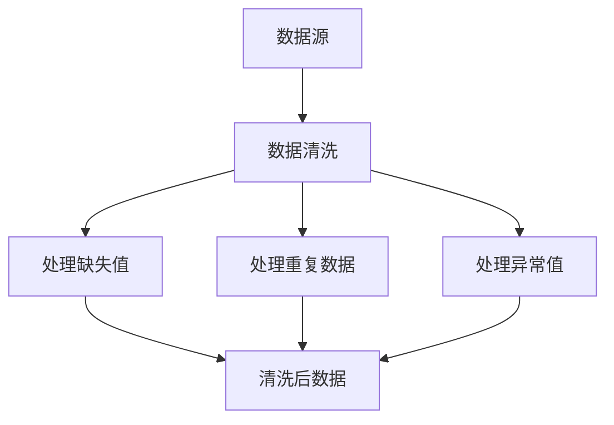
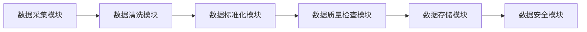
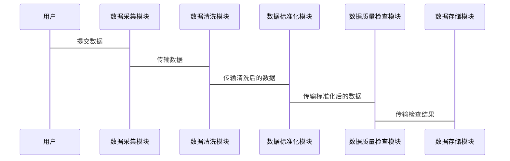

                 


# 金融监管科技数据质量控制

> 关键词：金融监管科技, 数据质量控制, 数据清洗, 数据标准化, 数据安全

> 摘要：本文深入探讨了金融监管科技中的数据质量控制问题，分析了数据在金融监管中的重要性，详细讲解了数据质量控制的核心概念、算法原理、系统架构设计以及实际项目中的应用。通过案例分析和最佳实践，为金融监管科技从业者提供了实用的指导和建议。

---

## 目录大纲

### 第一章：金融监管科技与数据质量控制概述

#### 1.1 金融监管科技的背景与发展趋势
- 1.1.1 金融监管科技的定义与特点
- 1.1.2 金融监管科技的发展历程
- 1.1.3 数据在金融监管中的重要性

#### 1.2 数据质量控制的定义与核心要素
- 1.2.1 数据质量的定义
- 1.2.2 数据质量的核心要素
- 1.2.3 数据质量控制的目标与意义

### 第二章：金融监管科技中的数据质量问题

#### 2.1 数据质量问题的背景与挑战
- 2.1.1 金融数据的特点与复杂性
- 2.1.2 数据质量问题对金融监管的影响
- 2.1.3 数据质量管理的难点与痛点

#### 2.2 数据质量问题的解决方案
- 2.2.1 数据清洗与预处理
- 2.2.2 数据标准化与规范化
- 2.2.3 数据质量管理的工具与技术

### 第三章：数据质量控制的核心概念与联系

#### 3.1 数据质量控制的核心原理
- 3.1.1 数据质量评估的指标体系
- 3.1.2 数据质量管理的流程与方法
- 3.1.3 数据质量控制的标准化框架

#### 3.2 核心概念的属性特征对比
- 3.2.1 数据完整性与数据准确性对比
- 3.2.2 数据一致性与数据及时性对比
- 3.2.3 数据规范性与数据唯一性对比

#### 3.3 数据质量控制的ER实体关系图
```mermaid
er
    %% 数据质量控制的ER图
    entity 数据源 {
        id 数据源ID
        名称 数据源名称
        类型 数据源类型
    }
    entity 数据字段 {
        id 字段ID
        名称 字段名称
        类型 数据类型
    }
    entity 数据记录 {
        id 记录ID
        值 数据值
        状态 数据状态
    }
    entity 数据质量规则 {
        id 规则ID
        名称 规则名称
        类型 规则类型
        描述 规则描述
    }
    entity 数据质量检查结果 {
        id 检查结果ID
        名称 检查结果名称
        类型 检查结果类型
        状态 检查结果状态
    }
    数据源 -[通过数据字段关联]-> 数据记录
    数据质量规则 -[应用于数据记录]-> 数据质量检查结果
```

### 第四章：数据质量控制的算法原理

#### 4.1 数据清洗算法
- 4.1.1 数据清洗的定义与目标
- 4.1.2 数据清洗的常用算法
  - 删除重复数据
  - 处理缺失值
  - 标识和处理异常值
- 4.1.3 数据清洗流程的Mermaid图


#### 4.2 数据异常检测算法
- 4.2.1 基于统计的方法
  - Z-score
  - IQR（四分位距）
- 4.2.2 基于机器学习的方法
  - Isolation Forest
  - One-Class SVM
- 4.2.3 异常检测的数学模型
  - Z-score公式: $$ Z = \frac{x - \mu}{\sigma} $$
  - IQR公式: $$ IQR = Q3 - Q1 $$

#### 4.3 数据标准化算法
- 4.3.1 数据标准化的定义与目标
- 4.3.2 常见的数据标准化方法
  - Min-Max标准化
  - Z-score标准化
  - Robust标准化
- 4.3.3 数据标准化的Python实现
```python
import pandas as pd
from sklearn.preprocessing import MinMaxScaler, StandardScaler

# 示例数据
data = pd.DataFrame({
    'A': [1, 2, 3, 4, 5],
    'B': [6, 7, 8, 9, 10]
})

# Min-Max标准化
min_max_scaler = MinMaxScaler()
normalized_min_max = min_max_scaler.fit_transform(data)
print(normalized_min_max)

# Z-score标准化
standard_scaler = StandardScaler()
normalized_z = standard_scaler.fit_transform(data)
print(normalized_z)
```

### 第五章：数据质量控制的系统架构设计

#### 5.1 问题场景介绍
- 金融监管中的数据来源多样，包括银行、证券、保险等机构的数据
- 数据格式、编码、命名不统一，导致数据难以整合和分析
- 数据中存在缺失、重复、异常值等问题，影响监管分析的准确性

#### 5.2 系统功能设计
- 数据采集与清洗模块
- 数据标准化与转换模块
- 数据质量检查与报告模块
- 数据安全与隐私保护模块

#### 5.3 系统架构设计


#### 5.4 系统接口设计
- 数据输入接口
- 数据处理接口
- 数据输出接口
- 数据报告接口

#### 5.5 系统交互流程图


### 第六章：数据质量控制的项目实战

#### 6.1 环境安装与配置
- 安装Python和必要的库（Pandas, NumPy, Scikit-learn）
- 安装数据可视化工具（Matplotlib, Seaborn）
- 安装版本控制工具（Git）

#### 6.2 核心代码实现
- 数据清洗代码
```python
import pandas as pd

# 示例数据
data = pd.DataFrame({
    'id': [1, 2, 3, 4, 5],
    'name': ['A', 'B', 'C', 'D', 'E'],
    'value': [10, 20, 30, 40, 50]
})

# 删除重复数据
data.drop_duplicates(subset=['id'], inplace=True)

# 处理缺失值
data.dropna(inplace=True)
```

- 数据标准化代码
```python
from sklearn.preprocessing import StandardScaler

# 示例数据
data = pd.DataFrame({
    'A': [1, 2, 3, 4, 5],
    'B': [6, 7, 8, 9, 10]
})

# Z-score标准化
scaler = StandardScaler()
normalized_data = scaler.fit_transform(data)
print(normalized_data)
```

#### 6.3 案例分析与解读
- 案例背景：银行交易数据中的异常交易检测
- 数据清洗与预处理步骤
- 数据标准化与转换过程
- 异常交易检测的算法实现
- 检测结果分析与报告生成

#### 6.4 项目小结
- 项目目标的实现
- 项目中的关键点总结
- 项目中的问题与解决方法

### 第七章：数据质量控制的最佳实践与注意事项

#### 7.1 小结
- 数据质量控制的重要性
- 数据质量管理的关键步骤
- 数据质量管理的工具与技术

#### 7.2 注意事项
- 数据安全与隐私保护
- 数据质量控制的持续性
- 数据质量管理的团队协作

#### 7.3 拓展阅读
- 数据质量管理的行业标准
- 数据治理框架
- 数据科学与机器学习中的数据质量控制

### 作者简介

作者：AI天才研究院/AI Genius Institute & 禅与计算机程序设计艺术/Zen And The Art of Computer Programming

---

通过以上目录大纲，文章将系统地讲解金融监管科技中的数据质量控制问题，从理论到实践，为读者提供全面而深入的指导。

