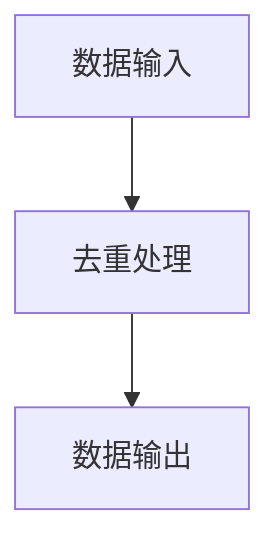
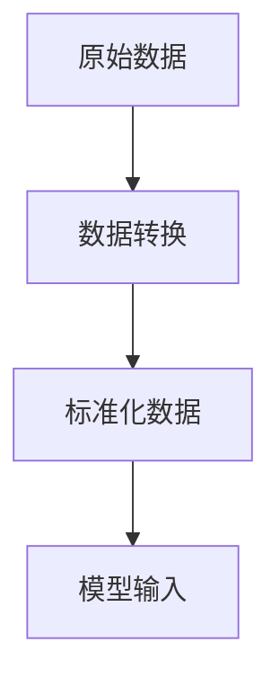
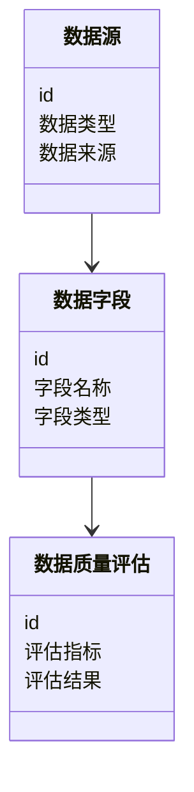

                 


```markdown
# 金融监管科技数据质量控制平台

## 关键词：金融监管科技，数据质量控制，数据清洗，系统架构，项目实战，最佳实践

## 摘要：本文详细探讨了金融监管科技数据质量控制平台的构建与应用。从背景介绍到系统设计，再到项目实战，全面解析了数据质量控制的重要性、核心概念、算法原理、系统架构以及实际案例。文章还总结了最佳实践和未来发展方向，为读者提供了全面的指导。

---

## 目录

# 第1章: 金融监管科技数据质量控制平台概述

## 1.1 金融监管科技的背景与意义
### 1.1.1 金融监管科技的定义与特点
### 1.1.2 金融监管科技的发展现状
### 1.1.3 数据质量控制在金融监管中的重要性

## 1.2 数据质量控制的背景与问题
### 1.2.1 数据质量问题的现状
### 1.2.2 数据质量问题对金融监管的影响
### 1.2.3 数据质量控制的目标与挑战

## 1.3 本章小结

# 第2章: 数据质量控制的核心概念与联系

## 2.1 数据质量控制的核心要素
### 2.1.1 数据的准确性
### 2.1.2 数据的完整性
### 2.1.3 数据的及时性
### 2.1.4 数据的唯一性

## 2.2 数据质量控制的原理与流程
### 2.2.1 数据质量管理的流程
### 2.2.2 数据清洗与转换的步骤
### 2.2.3 数据验证与评估的方法

## 2.3 数据质量控制的ER实体关系图
```mermaid
er
    entity 数据源 {
        id
        数据类型
        数据来源
    }
    entity 数据字段 {
        id
        字段名称
        字段类型
    }
    entity 数据质量评估 {
        id
        评估指标
        评估结果
    }
    数据源 --> 数据字段
    数据字段 --> 数据质量评估
```

## 2.4 本章小结

# 第3章: 数据质量控制的算法原理与实现

## 3.1 数据清洗算法
### 3.1.1 数据去重算法


### 3.1.2 数据填充算法
```python
def fill_missing_values(df):
    # 使用均值填充数值型缺失值
    df['收入'] = df['收入'].fillna(df['收入'].mean())
    # 使用众数填充分类型缺失值
    df['性别'] = df['性别'].fillna(df['性别'].mode()[0])
    return df
```

## 3.2 数据标准化算法
### 3.2.1 数据标准化的数学模型
$$
X_{std} = \frac{X - \mu}{\sigma}
$$
其中，$\mu$ 是均值，$\sigma$ 是标准差。

### 3.2.2 数据标准化的实现
```python
from sklearn.preprocessing import StandardScaler

def standardize_data(df):
    scaler = StandardScaler()
    df_standard = scaler.fit_transform(df[['数值型字段1', '数值型字段2']])
    return df_standard
```

## 3.3 数据转换算法
### 3.3.1 数据转换的步骤


## 3.4 本章小结

# 第4章: 系统分析与架构设计

## 4.1 系统功能设计
### 4.1.1 领域模型设计


### 4.1.2 系统架构设计


## 4.2 本章小结

# 第5章: 项目实战

## 5.1 环境搭建
### 5.1.1 开发环境安装
```bash
pip install pandas numpy scikit-learn
```

## 5.2 核心代码实现
### 5.2.1 数据清洗代码
```python
import pandas as pd
import numpy as np

def data_cleaning(df):
    # 删除重复数据
    df = df.drop_duplicates()
    # 填充缺失值
    df = fill_missing_values(df)
    return df
```

### 5.2.2 数据标准化代码
```python
from sklearn.preprocessing import StandardScaler

def data_standardization(df):
    scaler = StandardScaler()
    df_standard = scaler.fit_transform(df)
    return df_standard
```

## 5.3 实际案例分析
### 5.3.1 数据采集与预处理
### 5.3.2 数据清洗与标准化
### 5.3.3 数据评估与报告生成

## 5.4 本章小结

# 第6章: 最佳实践与总结

## 6.1 最佳实践
### 6.1.1 数据清洗的注意事项
### 6.1.2 数据标准化的优化建议
### 6.1.3 系统架构的设计原则

## 6.2 小结与展望
### 6.2.1 本文总结
### 6.2.2 未来发展方向
### 6.2.3 拓展阅读推荐

## 6.3 本章小结

# 第7章: 未来发展方向与技术趋势

## 7.1 数据质量控制的未来挑战
### 7.1.1 大数据环境下的数据质量管理
### 7.1.2 人工智能在数据质量控制中的应用

## 7.2 技术趋势分析
### 7.2.1 自动化数据清洗工具的发展
### 7.2.2 数据质量管理的智能化

## 7.3 本章小结

---

## 作者：AI天才研究院/AI Genius Institute & 禅与计算机程序设计艺术 /Zen And The Art of Computer Programming
```

