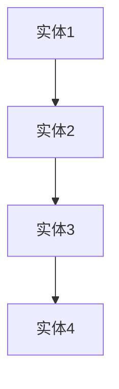
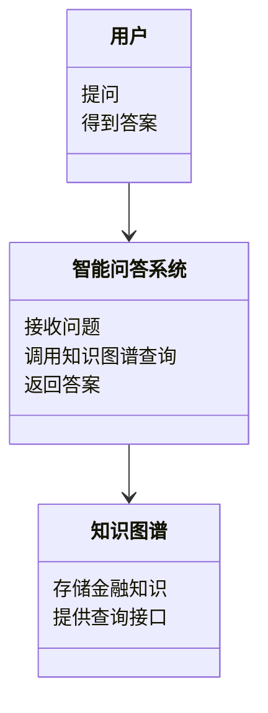

                 

# 金融知识图谱在智能问答中的应用

> 关键词：金融知识图谱、智能问答、自然语言处理、知识表示、深度学习

> 摘要：本文详细探讨了金融知识图谱在智能问答中的应用，从背景介绍、核心概念、算法原理到系统设计和项目实战，全面分析了如何利用知识图谱提升金融智能问答系统的性能和准确性。文章还讨论了相关的数学模型、系统架构以及最佳实践，为读者提供了深入的技术见解。

---

## 目录大纲

# 第1章 金融知识图谱与智能问答的背景

## 1.1 知识图谱的起源与发展
### 1.1.1 知识图谱的定义与特点
### 1.1.2 知识图谱在金融领域的应用
### 1.1.3 金融知识图谱的构建与挑战

## 1.2 智能问答的起源与发展
### 1.2.1 智能问答的定义与特点
### 1.2.2 智能问答的技术演进
### 1.2.3 金融智能问答的现状与趋势

## 1.3 金融知识图谱与智能问答的结合
### 1.3.1 金融知识图谱在智能问答中的作用
### 1.3.2 金融智能问答的核心问题与解决方案
### 1.3.3 金融知识图谱与智能问答的边界与外延

## 1.4 本章小结

---

# 第2章 金融知识图谱的核心概念与原理

## 2.1 金融知识图谱的构建流程
### 2.1.1 数据收集与预处理
### 2.1.2 知识抽取与表示
### 2.1.3 知识融合与推理

## 2.2 金融知识图谱的属性特征对比
### 2.2.1 实体类型对比
### 2.2.2 关系类型对比
### 2.2.3 属性类型对比

## 2.3 金融知识图谱的ER实体关系图

---

# 第3章 智能问答的核心概念与原理

## 3.1 智能问答的流程
### 3.1.1 问题理解
### 3.1.2 知识检索
### 3.1.3 答案生成

## 3.2 智能问答的算法原理
### 3.2.1 基于规则的问答系统
### 3.2.2 基于检索的问答系统
### 3.2.3 基于生成的问答系统

## 3.3 智能问答的数学模型
### 3.3.1 基于向量空间模型的问答
### 3.3.2 基于概率论的问答
### 3.3.3 基于深度学习的问答

---

# 第4章 金融知识图谱与智能问答的联系

## 4.1 金融知识图谱在智能问答中的应用
### 4.1.1 知识图谱作为问答的知识库
### 4.1.2 知识图谱辅助问答的准确性
### 4.1.3 知识图谱提升问答的效率

## 4.2 金融知识图谱与智能问答的结合案例
### 4.2.1 金融领域的问答场景
### 4.2.2 知识图谱在金融问答中的具体应用
### 4.2.3 案例分析与效果评估

## 4.3 本章小结

---

# 第5章 金融知识图谱与智能问答的算法实现

## 5.1 知识图谱构建的算法
### 5.1.1 实体识别与抽取
### 5.1.2 关系抽取与推理
### 5.1.3 属性抽取与表示

## 5.2 智能问答的算法实现
### 5.2.1 基于规则的问答系统实现
### 5.2.2 基于检索的问答系统实现
### 5.2.3 基于生成的问答系统实现

## 5.3 算法的数学模型与公式
### 5.3.1 向量空间模型的公式
$$ \text{相似度} = \frac{\vec{a} \cdot \vec{b}}{|\vec{a}| |\vec{b}|} $$
### 5.3.2 概率论模型的公式
$$ P(\text{答案} | \text{问题}) = \frac{P(\text{问题} | \text{答案}) P(\text{答案})}{P(\text{问题})} $$
### 5.3.3 深度学习模型的公式
$$ f(x) = \text{softmax}(xW + b) $$

---

# 第6章 系统分析与架构设计

## 6.1 问题场景介绍
### 6.1.1 金融智能问答的场景
### 6.1.2 系统目标与功能
### 6.1.3 系统边界与范围

## 6.2 系统功能设计
### 6.2.1 领域模型设计

## 6.3 系统架构设计
### 6.3.1 分层架构设计

## 6.4 系统接口设计
### 6.4.1 系统接口描述
### 6.4.2 接口交互流程
### 6.4.3 接口规范与协议

---

# 第7章 项目实战：基于金融知识图谱的智能问答系统实现

## 7.1 项目环境安装
### 7.1.1 环境要求
### 7.1.2 安装依赖
### 7.1.3 环境配置

## 7.2 系统核心实现
### 7.2.1 知识图谱的构建
### 7.2.2 智能问答系统的实现
### 7.2.3 系统集成与测试

## 7.3 项目代码示例
### 7.3.1 数据预处理代码
### 7.3.2 知识抽取代码
### 7.3.3 智能问答代码

## 7.4 实际案例分析
### 7.4.1 案例背景
### 7.4.2 系统实现
### 7.4.3 结果分析与优化

---

# 第8章 最佳实践与总结

## 8.1 最佳实践
### 8.1.1 数据质量的重要性
### 8.1.2 知识图谱的维护与更新
### 8.1.3 模型的调优与优化

## 8.2 未来发展方向
### 8.2.1 多模态知识图谱的应用
### 8.2.2 智能问答的实时性提升
### 8.2.3 更加智能化的金融知识图谱构建

## 8.3 本章小结

---

作者：AI天才研究院 & 禅与计算机程序设计艺术

---

**注**：以上目录大纲仅展示了文章的框架和核心内容，具体实施时需要根据实际情况调整各个章节的详细内容，确保文章逻辑清晰、内容详实。

