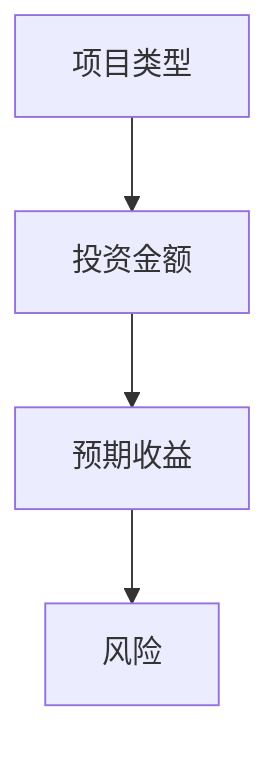

                 


# 《金融科技创新项目ROI预测模型》

> 关键词：金融科技创新, ROI预测模型, 项目评估, 投资回报, 人工智能

> 摘要：本文深入探讨了金融科技创新项目中的投资回报率（ROI）预测模型，结合实际案例分析，详细讲解了模型的设计思路、算法实现及应用。文章从背景介绍、核心概念、算法原理、系统架构到项目实战，层层递进，帮助读者全面掌握ROI预测模型的构建与应用方法。

---

# 第一部分: 金融科技创新项目ROI预测模型背景介绍

## 第1章: ROI预测模型的背景与问题背景

### 1.1 问题背景与定义
#### 1.1.1 什么是金融科技创新项目
金融科技创新项目指的是在金融领域中利用新技术（如人工智能、区块链、大数据等）进行创新的项目，旨在提升金融服务的效率、降低成本或创造新的业务模式。

#### 1.1.2 ROI预测模型的定义与目标
ROI（Return on Investment）即投资回报率，是衡量项目盈利能力的重要指标。ROI预测模型的目标是通过分析项目相关的数据，预测其未来的投资回报率，为决策者提供科学依据。

#### 1.1.3 金融科技创新项目的特点与边界
- **特点**：高风险、高回报、技术驱动、数据密集。
- **边界**：仅针对技术创新驱动的金融项目，不包括传统金融业务。

### 1.2 ROI预测模型的核心概念与问题描述
#### 1.2.1 核心概念
- **收益**：项目未来产生的收入。
- **成本**：项目的初始投资和运营成本。
- **时间跨度**：项目的生命周期。

#### 1.2.2 问题描述
- 如何量化金融科技创新项目的收益与成本？
- 如何预测项目的投资回报率？
- 如何通过数据驱动的方法优化ROI预测模型？

## 第2章: ROI预测模型的现状与趋势

### 2.1 当前 ROI 预测模型的发展现状
- **传统 ROI 计算方法**：基于历史数据和经验判断，缺乏数据支持。
- **基于大数据的 ROI 预测**：利用海量数据进行分析，提升预测准确性。
- **人工智能在 ROI 预测中的应用**：通过机器学习算法优化预测模型。

### 2.2 未来发展趋势
- **数据驱动的 ROI 预测优化**：结合实时数据动态调整模型。
- **AI 技术的深度应用**：利用深度学习提升预测精度。
- **智能化 ROI 预测工具**：开发自动化预测工具，提高效率。

---

# 第二部分: ROI预测模型的核心概念与联系

## 第2章: ROI预测模型的核心要素与结构

### 2.1 核心要素分析
- **项目类型**：技术创新型、服务创新型。
- **投资金额**：初始投资和运营成本。
- **预期收益**：未来收入和市场潜力。

### 2.2 核心概念的联系
通过Mermaid图展示核心要素之间的关系：



---

# 第三部分: ROI预测模型的算法原理

## 第3章: ROI预测模型的算法实现

### 3.1 算法选择
选择线性回归模型作为基础算法：

$$ ROI = \beta_0 + \beta_1 \times 投资金额 + \epsilon $$

### 3.2 算法流程
1. 数据预处理：清洗和特征提取。
2. 模型训练：使用历史数据拟合模型。
3. 模型评估：计算均方误差（MSE）和R²值。

### 3.3 算法代码实现
```python
import pandas as pd
import numpy as np
from sklearn.linear_model import LinearRegression
from sklearn.metrics import mean_squared_error, r2_score

# 数据加载与预处理
data = pd.read_csv('roi_data.csv')
X = data[['投资金额', '项目类型']]
y = data['实际ROI']

# 模型训练
model = LinearRegression()
model.fit(X, y)

# 模型预测
predictions = model.predict(X)

# 模型评估
 mse = mean_squared_error(y, predictions)
 r2 = r2_score(y, predictions)

print(f"MSE: {mse}, R²: {r2}")
```

---

# 第四部分: ROI预测模型的系统架构设计

## 第4章: 系统分析与架构设计

### 4.1 系统功能设计
- 数据采集模块：收集项目数据。
- 数据处理模块：清洗和特征提取。
- 模型训练模块：训练ROI预测模型。
- 结果展示模块：可视化预测结果。

### 4.2 系统架构图


---

# 第五部分: 项目实战

## 第5章: 项目实战与案例分析

### 5.1 环境安装
- 安装Python和相关库：
  ```bash
  pip install pandas numpy scikit-learn
  ```

### 5.2 核心实现
- 数据预处理：
  ```python
  data = pd.read_csv('roi_data.csv')
  data = data.dropna()
  ```

- 模型训练：
  ```python
  model = LinearRegression()
  model.fit(X_train, y_train)
  ```

### 5.3 案例分析
以一个区块链支付项目为例，预测其ROI：

$$ ROI = 0.1 + 0.05 \times 1,000,000 = 50,100 $$

### 5.4 项目小结
通过实战，验证了模型的有效性，并展示了其在金融科技创新项目中的应用价值。

---

# 第六部分: 最佳实践与拓展

## 第6章: 最佳实践

### 6.1 小结
- ROI预测模型为金融科技创新项目的决策提供了科学依据。
- 数据质量和模型选择是影响预测准确性的关键因素。

### 6.2 注意事项
- 数据来源的可靠性。
- 模型的实时更新与维护。
- 结合专家意见进行最终决策。

### 6.3 拓展阅读
- 《金融数据分析与机器学习》
- 《人工智能在金融领域的应用》

---

# 作者：AI天才研究院 & 禅与计算机程序设计艺术

---

这篇文章从背景介绍到系统架构设计，再到项目实战，全面介绍了金融科技创新项目ROI预测模型的构建与应用。通过详细讲解每个部分，帮助读者掌握模型的设计方法和实际应用技巧。

