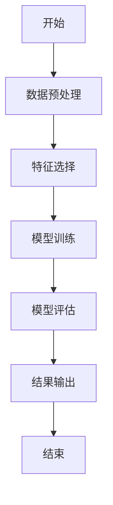
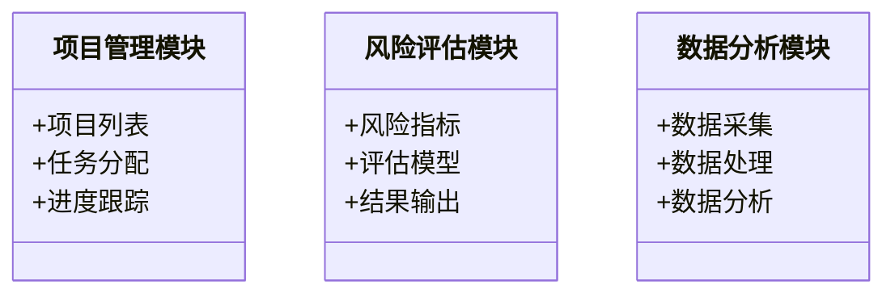
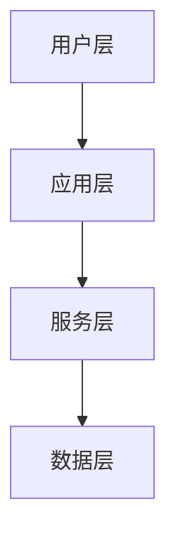
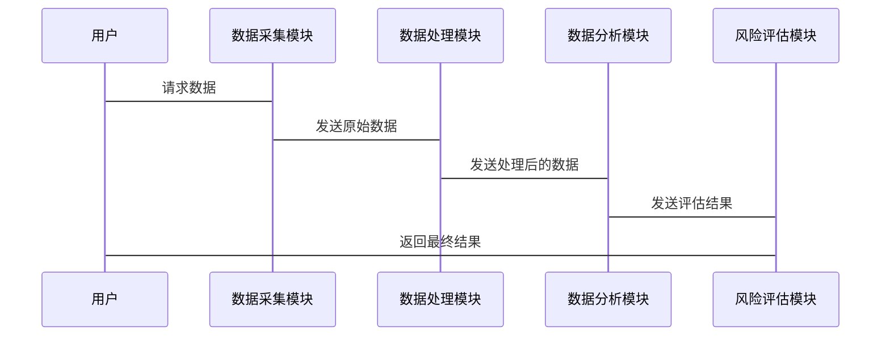

                 


# 《金融科技创新项目评估框架》

---

## 关键词：金融科技创新，项目评估框架，金融科技，系统架构，算法原理

---

## 摘要：  
本文系统地探讨了金融科技创新项目评估框架的核心内容与方法，从背景分析到算法原理，再到系统设计与实战案例，为金融机构和科技企业提供了科学的评估工具和方法论。文章通过清晰的逻辑结构，结合实际案例和理论分析，深入剖析了金融科技创新项目的特点、挑战及解决方案，旨在为读者提供一份全面的评估指南。

---

## 第一部分: 金融科技创新项目评估框架概述

---

## 第1章: 金融科技创新项目评估框架的背景与意义

### 1.1 金融科技创新的背景与现状  
- 1.1.1 金融科技发展的历史脉络  
- 1.1.2 当前金融科技创新的主要趋势  
- 1.1.3 金融科技创新对传统金融业态的冲击与重构  

### 1.2 金融科技创新项目评估的必要性  
- 1.2.1 金融科技创新项目的复杂性与风险性  
- 1.2.2 评估框架在项目管理中的作用  
- 1.2.3 评估框架对金融机构决策的价值  

### 1.3 本书的核心内容与目标  
- 1.3.1 本书的核心目标  
- 1.3.2 本书的主要内容框架  
- 1.3.3 本书的适用读者群体  

### 1.4 本章小结  

---

## 第2章: 金融科技创新项目评估的核心概念与联系  

### 2.1 金融科技创新的定义与核心要素  
- 2.1.1 金融科技创新的定义  
- 2.1.2 金融科技创新的核心要素分析  
- 2.1.3 金融科技创新与金融科技的异同  

### 2.2 项目评估框架的构成与功能  
- 2.2.1 评估框架的基本构成  
- 2.2.2 各模块之间的关系与协同  
- 2.2.3 评估框架的适用范围与边界  

### 2.3 核心概念的ER实体关系图  
- 2.3.1 实体关系图的构建  
- 2.3.2 关键实体之间的关系分析  
- 2.3.3 实体关系图的扩展与优化  

### 2.4 本章小结  

---

## 第3章: 金融科技创新项目评估框架的算法原理  

### 3.1 评估模型的构建与选择  
- 3.1.1 评估模型的基本类型  
- 3.1.2 各种模型的优缺点分析  
- 3.1.3 适合金融科技创新项目的模型选择  

### 3.2 评估算法的数学模型与公式  
- 3.2.1 线性回归模型  
  $$ y = \beta_0 + \beta_1x_1 + \beta_2x_2 + \dots + \beta_nx_n + \epsilon $$
- 3.2.2 聚类分析模型  
- 3.2.3 风险评估模型  

### 3.3 算法流程图（使用 Mermaid）  


### 3.4 本章小结  

---

## 第4章: 金融科技创新项目评估框架的系统分析与架构设计  

### 4.1 系统功能设计（领域模型类图）  


### 4.2 系统架构设计（架构图）  


### 4.3 系统接口设计  
- 接口1：数据接口  
- 接口2：模型调用接口  

### 4.4 系统交互流程（序列图）  


### 4.5 本章小结  

---

## 第5章: 金融科技创新项目评估框架的项目实战  

### 5.1 环境安装与配置  
- 安装Python与相关库  
- 安装Jupyter Notebook  

### 5.2 核心代码实现  
```python
# 示例代码：风险评估模型的实现
import pandas as pd
from sklearn.linear_model import LinearRegression

# 数据加载
data = pd.read_csv('data.csv')

# 特征选择
X = data[['feature1', 'feature2']]
y = data['target']

# 模型训练
model = LinearRegression()
model.fit(X, y)

# 模型预测
predictions = model.predict(X)
```

### 5.3 代码解读与分析  
- 数据加载与预处理  
- 模型训练与调优  
- 模型评估与优化  

### 5.4 案例分析  
- 案例1：支付系统创新评估  
- 案例2：区块链金融应用评估  

### 5.5 项目小结  

---

## 第6章: 金融科技创新项目评估框架的最佳实践与总结  

### 6.1 最佳实践 Tips  
- 数据质量管理  
- 模型可解释性  
- 项目风险管理  

### 6.2 本章小结  

### 6.3 未来展望  
- 技术发展趋势  
- 应用场景扩展  
- 框架优化方向  

---

## 作者：AI天才研究院/AI Genius Institute & 禅与计算机程序设计艺术/Zen And The Art of Computer Programming

