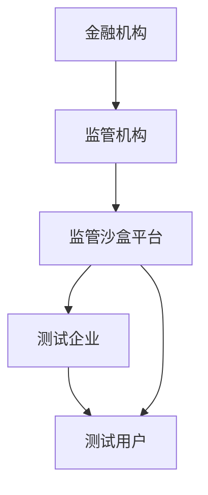
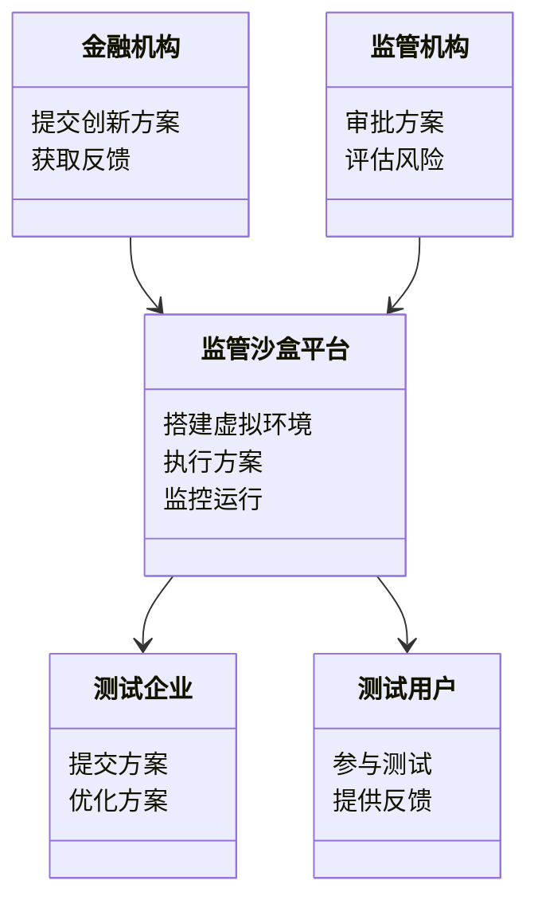
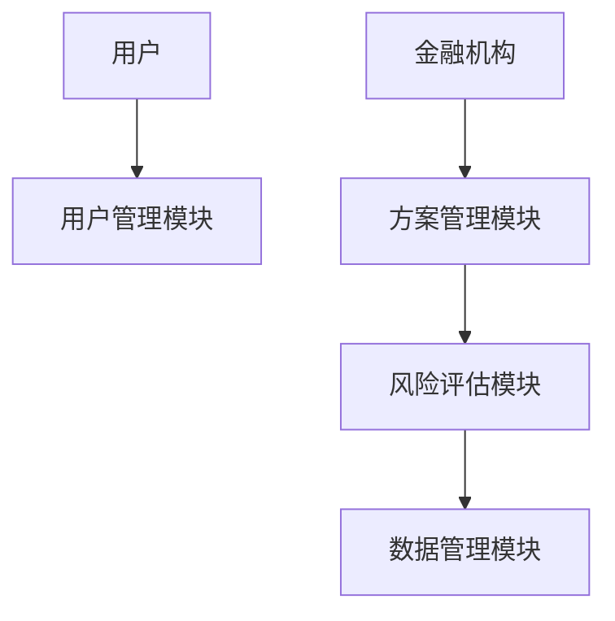
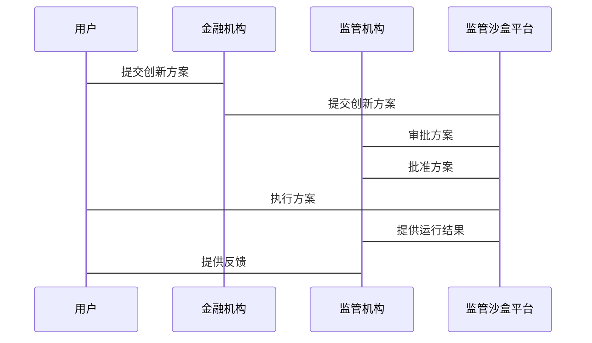

                 


# 金融科技监管沙盒模拟系统

> 关键词：金融科技监管沙盒、模拟系统、监管创新、风险管理、金融科技创新

> 摘要：本文详细探讨了金融科技监管沙盒模拟系统的构建与应用，从背景、核心概念、算法原理到系统架构、项目实战及最佳实践，全面解析了如何通过模拟系统实现金融科技创新与合规的平衡。文章内容涵盖监管沙盒的定义、运行原理、算法实现、系统架构设计以及实际案例分析，旨在为金融科技领域的从业者提供理论与实践相结合的深度解析。

---

## 第一部分: 金融科技监管沙盒模拟系统概述

### 第1章: 金融科技监管沙盒的背景与概念

#### 1.1 监管沙盒的起源与发展
##### 1.1.1 监管沙盒的定义与核心理念
监管沙盒（Regulatory Sandbox）是一种创新的监管工具，旨在为金融机构和 fintech 公司提供一个受控的环境，允许其在遵守监管框架的前提下，测试创新的金融产品、服务和技术。其核心理念在于通过缩小化的模拟环境，降低创新试错成本，同时确保创新活动不会对整体金融体系造成系统性风险。

##### 1.1.2 监管沙盒在金融科技领域的应用
金融科技的快速发展催生了大量创新的金融产品和服务，如区块链、人工智能、大数据等技术的应用。然而，这些创新往往伴随着较高的风险。监管沙盒通过提供一个隔离的测试环境，使得金融机构和 fintech 公司可以在安全的环境中测试其创新方案，同时监管机构能够实时监控和评估其风险。

##### 1.1.3 监管沙盒的重要性和必要性
- **重要性**：监管沙盒为金融创新提供了一个“安全空间”，既保护消费者和金融机构免受潜在风险的影响，又为监管机构提供了评估创新的工具。
- **必要性**：在传统监管模式下，金融创新往往需要经过漫长的审批流程，监管沙盒的引入能够加速创新进程，同时降低监管成本。

---

#### 1.2 金融科技监管沙盒的核心要素
##### 1.2.1 金融科技的定义与特点
金融科技（FinTech）是指通过技术手段优化或替代传统金融服务模式的创新活动。其特点包括：
1. **技术驱动**：依赖于新兴技术（如区块链、人工智能、大数据等）。
2. **效率提升**：通过技术手段提高金融服务的效率和用户体验。
3. **创新性强**：不断推出新的金融产品和服务模式。

##### 1.2.2 监管沙盒在金融科技中的作用
监管沙盒在金融科技中的作用主要体现在以下几个方面：
1. **风险控制**：通过模拟环境测试创新方案，降低实际操作中的风险。
2. **加速创新**：为金融机构和 fintech 公司提供快速测试和验证的环境。
3. **监管合规**：帮助创新方案在合规的前提下快速落地。

##### 1.2.3 金融科技监管沙盒的边界与外延
- **边界**：监管沙盒的边界通常由监管机构定义，包括参与方、测试范围、数据隔离等。
- **外延**：监管沙盒的应用范围可以扩展到跨境支付、智能合约、数字身份识别等领域。

---

#### 1.3 监管沙盒模拟系统的意义
##### 1.3.1 提供安全的测试环境
监管沙盒模拟系统为金融机构和 fintech 公司提供了一个隔离的测试环境，确保创新方案在模拟的真实金融环境中运行，同时避免对实际金融体系造成影响。

##### 1.3.2 促进金融创新与合规的平衡
通过监管沙盒模拟系统，金融机构可以在合规的前提下进行创新，避免因监管不确定性而阻碍创新进程。

##### 1.3.3 降低监管成本与风险
监管沙盒模拟系统通过模拟环境和实时监控，帮助监管机构降低监管成本，同时快速识别和应对潜在风险。

---

### 第2章: 监管沙盒模拟系统的核心概念与联系

#### 2.1 监管沙盒模拟系统的定义与原理
##### 2.1.1 系统的定义
监管沙盒模拟系统是一种通过虚拟化技术构建的受控环境，模拟真实金融市场的运行，允许金融机构和 fintech 公司在其中测试创新的金融产品和服务。

##### 2.1.2 系统的运行原理
监管沙盒模拟系统的运行原理包括以下几个步骤：
1. **环境搭建**：构建一个虚拟的金融市场环境，包括参与者（如金融机构、用户）、交易数据、市场规则等。
2. **测试方案提交**：金融机构或 fintech 公司提交创新方案到监管沙盒平台。
3. **方案执行**：在模拟环境中执行创新方案，实时监控运行状态。
4. **风险评估**：监管机构对方案的运行结果进行评估，识别潜在风险。
5. **结果反馈**：根据评估结果，提供反馈意见，帮助优化创新方案。

##### 2.1.3 系统的核心要素
1. **虚拟化环境**：通过虚拟化技术构建的受控环境。
2. **参与者角色**：包括金融机构、用户、监管机构等。
3. **数据流**：模拟环境中的数据流动和交互。

---

#### 2.2 监管沙盒模拟系统与传统监管的对比
##### 2.2.1 监管方式的差异
- **传统监管**：基于事后监管，注重对金融机构的合规性检查。
- **监管沙盒模拟系统**：基于事前监管，注重对创新方案的风险评估和实时监控。

##### 2.2.2 监管效率的对比
- **传统监管**：效率较低，创新方案的审批周期长。
- **监管沙盒模拟系统**：效率较高，创新方案可以在模拟环境中快速测试和验证。

##### 2.2.3 监管成本的分析
- **传统监管**：监管成本高，主要体现在人力和时间成本上。
- **监管沙盒模拟系统**：监管成本较低，通过自动化技术降低监管资源的消耗。

---

#### 2.3 监管沙盒模拟系统的ER实体关系图


---

### 第3章: 监管沙盒模拟系统的算法原理

#### 3.1 监管沙盒模拟系统的算法流程
##### 3.1.1 系统输入与初始化
1. **输入数据**：包括金融机构提交的创新方案、用户数据、市场规则等。
2. **初始化环境**：构建虚拟化环境，配置测试参数。

##### 3.1.2 算法执行步骤
1. **方案执行**：在模拟环境中执行创新方案，记录运行状态。
2. **实时监控**：对方案的运行进行实时监控，识别潜在风险。
3. **风险评估**：根据监控结果，评估创新方案的风险。

##### 3.1.3 系统输出与结果分析
1. **输出结果**：包括创新方案的运行结果、风险评估报告等。
2. **结果分析**：对输出结果进行分析，提供反馈意见。

---

#### 3.2 监管沙盒模拟系统的核心算法
##### 3.2.1 算法原理的数学模型
$$ y = f(x) $$
其中，$x$ 表示输入数据，$y$ 表示输出结果，$f$ 表示算法函数。

##### 3.2.2 算法实现的Python代码
```python
def regulatory_sandbox_algorithm(x):
    # 算法实现
    return f(x)
```

---

#### 3.3 算法的优化与改进
##### 3.3.1 算法优化的必要性
通过优化算法，可以提高监管沙盒模拟系统的运行效率和准确性，降低计算成本。

##### 3.3.2 算法优化的具体措施
1. **并行计算**：利用多线程或多进程技术，提高计算效率。
2. **模型优化**：优化算法模型，提高风险评估的准确性。

---

## 第四部分: 系统分析与架构设计方案

### 第4章: 系统分析与架构设计

#### 4.1 问题场景介绍
在金融科技监管沙盒模拟系统中，我们需要解决以下问题：
1. 如何构建一个安全的虚拟化环境？
2. 如何实现金融机构与监管机构之间的高效交互？
3. 如何实时监控创新方案的运行状态？

---

#### 4.2 项目介绍
##### 4.2.1 项目目标
构建一个基于虚拟化技术的金融科技监管沙盒模拟系统，实现金融机构和监管机构之间的高效交互，实时监控创新方案的运行状态。

##### 4.2.2 项目范围
包括系统设计、开发、测试和部署。

---

#### 4.3 系统功能设计
##### 4.3.1 领域模型


---

#### 4.4 系统架构设计
##### 4.4.1 微服务架构
监管沙盒模拟系统采用微服务架构，包括以下几个模块：
1. **用户管理模块**：负责用户身份验证和权限管理。
2. **方案管理模块**：负责创新方案的提交、审批和执行。
3. **风险评估模块**：负责实时监控方案运行状态，评估风险。
4. **数据管理模块**：负责数据存储和查询。

##### 4.4.2 系统架构图


---

#### 4.5 系统接口设计
##### 4.5.1 接口描述
1. **提交创新方案接口**：金融机构提交创新方案到方案管理模块。
2. **获取反馈接口**：金融机构获取创新方案的运行结果和风险评估报告。

##### 4.5.2 接口实现
1. **RESTful API**：采用 RESTful API 实现接口通信。
2. **API 文档**：提供详细的 API 文档，方便开发者调用。

---

#### 4.6 系统交互流程
##### 4.6.1 交互流程图


---

## 第五部分: 项目实战

### 第5章: 项目实战

#### 5.1 环境安装
##### 5.1.1 安装Python
```bash
python --version
pip install --upgrade pip
```

##### 5.1.2 安装区块链框架
```bash
pip install ethereum
```

---

#### 5.2 系统核心实现
##### 5.2.1 核心代码实现
```python
class Regulator:
    def __init__(self):
        self.sandbox = Sandbox()

    def approve_scheme(self, scheme):
        # 审批创新方案
        return self.sandbox.execute(scheme)

class Sandbox:
    def __init__(self):
        self.environment = self.create_virtual_environment()

    def create_virtual_environment(self):
        # 创建虚拟环境
        pass

    def execute(self, scheme):
        # 执行创新方案
        pass
```

##### 5.2.2 代码应用解读与分析
- **Regulator 类**：负责审批创新方案，并调用 Sandbox 执行方案。
- **Sandbox 类**：负责创建虚拟环境，并执行创新方案。

---

#### 5.3 实际案例分析
##### 5.3.1 案例背景
某 fintech 公司提出了一种基于区块链的智能合约解决方案，需要在监管沙盒模拟系统中进行测试。

##### 5.3.2 案例实现
```python
scheme = {
    'name': '区块链智能合约',
    'description': '基于区块链的智能合约解决方案'
}
regulator = Regulator()
result = regulator.approve_scheme(scheme)
```

##### 5.3.3 案例分析
1. **方案执行**：智能合约在监管沙盒模拟系统中运行，实时监控其运行状态。
2. **风险评估**：监管机构评估智能合约的风险，并提供反馈意见。

---

## 第六部分: 最佳实践

### 第6章: 最佳实践

#### 6.1 小结
监管沙盒模拟系统为金融科技领域的创新提供了重要的支持工具，通过模拟环境和实时监控，帮助金融机构和监管机构实现创新与合规的平衡。

#### 6.2 注意事项
1. **数据安全**：确保模拟环境中的数据安全，避免数据泄露。
2. **系统稳定性**：确保监管沙盒模拟系统的稳定性，避免因系统故障导致测试失败。
3. **合规性**：确保创新方案的测试过程符合相关法律法规。

#### 6.3 拓展阅读
1. **监管沙盒的国际实践**：研究其他国家和地区的监管沙盒实践，借鉴经验。
2. **金融科技的前沿技术**：关注人工智能、区块链等技术在金融科技中的最新应用。

---

## 作者：AI天才研究院/AI Genius Institute & 禅与计算机程序设计艺术 /Zen And The Art of Computer Programming

