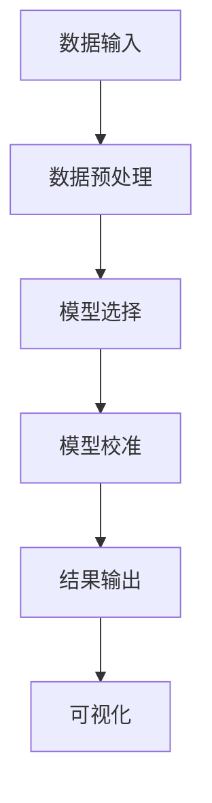

                 


# 《金融衍生品定价模型校准》

> **关键词**：金融衍生品，定价模型，蒙特卡洛模拟，数值方法，模型校准，随机过程

> **摘要**：  
> 本文系统地介绍金融衍生品定价模型校准的核心概念、方法和实际应用。通过理论分析和案例研究，探讨蒙特卡洛模拟、数值方法及机器学习在模型校准中的作用，帮助读者掌握高效准确的金融衍生品定价策略。

---

# 第1章：金融衍生品与定价模型校准概述

## 1.1 金融衍生品的定义与分类

### 1.1.1 金融衍生品的定义  
金融衍生品（Financial Derivatives）是以基础金融资产（如股票、债券、外汇、利率等）为标的资产，在未来某一特定时间以约定价格买卖的合约。其价值来源于基础资产的价格波动。

### 1.1.2 金融衍生品的主要分类  
1. **期权（Options）**：买方有权在特定时间以约定价格买入或卖出标的资产。  
2. **期货（Futures）**：买方和卖方约定在未来特定时间以约定价格买卖标的资产。  
3. **掉期（Swaps）**：双方约定在未来特定时间交换现金流的协议。  
4. **远期合约（Forwards）**：定制化协议，与期货类似，但通常不在交易所交易。

### 1.1.3 金融衍生品的市场现状  
金融衍生品市场是全球最大的金融市场之一，广泛应用于风险管理和投机交易。市场规模庞大，交易品种多样，对模型定价和校准的需求日益增加。

---

## 1.2 定价模型校准的背景与意义

### 1.2.1 校准的背景  
金融衍生品的定价依赖于复杂的数学模型，但实际市场中存在不确定性（如波动率、流动性等）。为了使模型更准确地反映市场情况，需要通过校准调整模型参数。

### 1.2.2 校准的目标与方法  
- **目标**：通过调整模型参数，使模型预测价格与市场实际价格尽可能一致。  
- **方法**：参数估计、最小二乘法、蒙特卡洛模拟等。

### 1.2.3 校准的重要性  
校准是确保定价模型准确性的关键步骤，直接影响交易决策和风险管理效果。

---

## 1.3 本书的核心内容与结构

### 1.3.1 核心内容概述  
- 理论基础：介绍金融衍生品定价的基本原理和常见模型。  
- 校准方法：探讨蒙特卡洛模拟、数值方法和机器学习在模型校准中的应用。  
- 实战案例：通过具体案例展示如何实现模型校准并优化定价策略。

### 1.3.2 目录结构与学习路径  
- 第1章：背景知识。  
- 第2章：定价模型的基本原理。  
- 第3章：蒙特卡洛模拟与随机过程。  
- 第4章：数值方法与模型校准。  
- 第5章：机器学习在模型校准中的应用。  
- 第6章：系统架构与项目实战。  
- 第7章：最佳实践与未来展望。

---

# 第2章：金融衍生品定价模型的基本原理

## 2.1 金融衍生品定价的基本原理

### 2.1.1 无套利定价原理  
无套利定价（Arbitrage Pricing）是金融衍生品定价的基础。通过构建无风险套利组合，确保市场定价的合理性。

### 2.1.2 随机过程与随机微分方程  
- **随机过程**：描述金融资产价格的随机变化。  
- **随机微分方程（SDE）**：如几何布朗运动，用于建模资产价格的随机波动。

### 2.1.3 市场定价模型的构建  
基于无套利原则和随机过程，构建适合金融衍生品定价的数学模型。

---

## 2.2 常见金融衍生品定价模型

### 2.2.1 Black-Scholes模型  
- **公式**：  
  $$ C = S_0 \Phi(d_1) - K e^{-rT} \Phi(d_2) $$
  其中，$$ d_1 = \frac{\ln(S_0/K) + (r + \sigma^2/2)T}{\sigma \sqrt{T}} $$  
  $$ d_2 = d_1 - \sigma \sqrt{T} $$  
- **应用场景**：欧式期权定价。

### 2.2.2 二叉树模型  
通过构建二叉树状价格路径，模拟标的资产价格波动，计算期权的期望值。

### 2.2.3 外汇期权定价模型  
考虑汇率波动，结合随机过程进行定价。

---

## 2.3 模型校准的基本方法

### 2.3.1 参数估计方法  
通过历史数据估计模型参数，如波动率、漂移率等。

### 2.3.2 最小二乘法  
通过最小化预测价格与实际价格的平方差，求解最优参数。

### 2.3.3 蒙特卡洛模拟  
通过大量模拟试验，估计模型参数并校准模型。

---

# 第3章：蒙特卡洛模拟与随机过程

## 3.1 蒙特卡洛模拟的基本原理

### 3.1.1 蒙特卡洛模拟的定义  
通过随机采样和统计推断，模拟复杂系统行为的数值方法。

### 3.1.2 蒙特卡洛模拟的应用场景  
- 金融衍生品定价  
- 风险管理  
- 投资组合优化

### 3.1.3 蒙特卡洛模拟的实现步骤  
1. 确定随机变量分布。  
2. 生成随机数。  
3. 计算模拟结果。  
4. 统计分析模拟结果。

---

## 3.2 随机过程与随机微分方程

### 3.2.1 随机过程的基本概念  
随机过程是描述随机变量随时间变化的数学模型。

### 3.2.2 随机微分方程的定义与应用  
随机微分方程（SDE）描述随机变量的动态变化，常用于金融资产价格建模。

### 3.2.3 常见随机微分方程实例  
- 几何布朗运动：  
  $$ dS = \mu S dt + \sigma S dW $$

---

## 3.3 蒙特卡洛模拟的数学模型

### 3.3.1 蒙特卡洛模拟的数学基础  
- 随机数生成：均匀分布、正态分布等。  
- 方差缩减技术：分层抽样、重要抽样等。

### 3.3.2 随机数生成方法  
- 均匀分布：使用伪随机数生成器。  
- 正态分布：通过Box-Muller算法生成。

### 3.3.3 蒙特卡洛积分与方差缩减技术  
- 蒙特卡洛积分：通过随机采样计算积分值。  
- 方差缩减技术：降低模拟结果的方差，提高精度。

---

## 3.4 蒙特卡洛模拟的实现与应用

### 3.4.1 蒙特卡洛模拟的Python实现  
```python
import numpy as np

def monte_carlo_simulation(S0, K, T, r, sigma, steps):
    np.random.seed(42)
    dt = T / steps
    mu = r - 0.5 * sigma**2
    # 生成随机数
    W = np.random.randn(steps)
    S = np.zeros(steps+1)
    S[0] = S0
    for i in range(steps):
        S[i+1] = S[i] * np.exp((mu*dt) + sigma*np.sqrt(dt)*W[i])
    # 计算期权价格
    payoff = np.maximum(S[-1] - K, 0)
    return np.mean(payoff * np.exp(-r*T))
```

### 3.4.2 蒙特卡洛模拟在金融衍生品定价中的应用  
通过模拟标的资产价格路径，估计期权的期望值，并进行模型校准。

### 3.4.3 蒙特卡洛模拟的优缺点分析  
- **优点**：适用于高维问题，计算复杂性较低。  
- **缺点**：收敛速度较慢，需要大量模拟才能保证精度。

---

# 第4章：数值方法与模型校准

## 4.1 数值方法的基本原理

### 4.1.1 数值方法的定义  
通过数值计算近似求解数学问题的方法。

### 4.1.2 常见数值方法的分类  
- 有限差分法  
- 有限元法  
- 蒙特卡洛方法

### 4.1.3 数值方法在金融衍生品定价中的应用  
- 通过数值方法求解偏微分方程，如Black-Scholes方程。

---

## 4.2 有限差分法

### 4.2.1 有限差分法的基本原理  
将连续的数学问题离散化，通过差分方程近似求解。

### 4.2.2 有限差分法的实现步骤  
1. 将时间和空间离散化。  
2. 建立差分方程。  
3. 迭代求解差分方程。

---

## 4.3 数值方法在金融衍生品定价中的应用

### 4.3.1 偏微分方程的求解  
Black-Scholes方程：  
$$ \frac{\partial V}{\partial t} + \frac{1}{2}\sigma^2 S^2 \frac{\partial^2 V}{\partial S^2} + rS \frac{\partial V}{\partial S} - rV = 0 $$

### 4.3.2 数值方法的优缺点分析  
- **优点**：适用于解析解难以求得的情况。  
- **缺点**：计算复杂，需要选择合适的步长和时间步。

---

# 第5章：基于机器学习的模型校准

## 5.1 机器学习的基本概念

### 5.1.1 机器学习的定义  
通过数据训练模型，使其具备某种任务的决策或预测能力。

### 5.1.2 机器学习在金融中的应用  
- 风险管理  
- 交易策略  
- 模型校准

---

## 5.2 机器学习在模型校准中的应用

### 5.2.1 神经网络模型  
通过训练神经网络，预测模型参数或直接预测衍生品价格。

### 5.2.2 随机森林与梯度提升  
使用树模型进行非线性回归，校准模型参数。

### 5.2.3 机器学习的优势  
- 高度非线性关系的处理能力。  
- 自动学习特征的重要性。

---

## 5.3 基于机器学习的校准方法

### 5.3.1 数据准备  
- 收集历史价格、波动率等数据。  
- 标签化实际价格，用于监督学习。

### 5.3.2 模型训练与验证  
- 训练模型预测价格或参数。  
- 使用交叉验证评估模型性能。

### 5.3.3 模型优化  
通过超参数调优和特征选择，提高模型预测精度。

---

## 5.4 机器学习模型的实际应用

### 5.4.1 期权定价中的机器学习  
通过训练模型预测期权价格，校准Black-Scholes模型的波动率参数。

### 5.4.2 模型效果对比  
比较传统数值方法与机器学习方法的校准效果，分析其优缺点。

---

# 第6章：系统架构与项目实战

## 6.1 系统架构设计

### 6.1.1 系统功能模块  
- 数据输入与预处理。  
- 模型选择与校准。  
- 结果输出与可视化。

### 6.1.2 系统架构图  


---

## 6.2 项目实战

### 6.2.1 环境安装  
安装必要的Python库：NumPy、Pandas、Matplotlib、Scikit-learn。

### 6.2.2 核心代码实现

#### 使用蒙特卡洛模拟校准Black-Scholes模型  
```python
import numpy as np
import matplotlib.pyplot as plt

# 参数设置
S0 = 100
K = 100
T = 1
r = 0.05
sigma = 0.2
steps = 1000

# 蒙特卡洛模拟
np.random.seed(42)
dt = T / steps
mu = r - 0.5 * sigma**2
W = np.random.randn(steps)
S = np.zeros(steps+1)
S[0] = S0
for i in range(steps):
    S[i+1] = S[i] * np.exp((mu*dt) + sigma*np.sqrt(dt)*W[i])

# 期权 payoff
payoff = np.maximum(S[-1] - K, 0)
option_price = np.mean(payoff * np.exp(-r*T))

print("校准后的波动率：", sigma)
print("模拟期权价格：", option_price)
```

### 6.2.3 案例分析与结果解读  
通过模拟实验，展示如何通过蒙特卡洛模拟校准Black-Scholes模型的波动率参数，并验证模型预测与实际价格的偏差。

---

# 第7章：最佳实践与未来展望

## 7.1 最佳实践

### 7.1.1 数据选择与模型选择  
根据具体问题选择合适的模型和数据来源。

### 7.1.2 参数调优  
通过交叉验证和网格搜索优化模型参数。

### 7.1.3 模型解释性与可解释性  
选择可解释的模型，便于分析和调整。

---

## 7.2 未来展望

### 7.2.1 人工智能在模型校准中的应用  
深度学习和强化学习在金融衍生品定价中的潜力。

### 7.2.2 量子计算的影响  
量子计算可能对金融衍生品定价模型的计算效率带来革命性影响。

---

# 附录

## 附录A：完整Python代码示例  
提供各章节中使用的Python代码，方便读者复现和扩展。

## 附录B：数据资料与参考文献  
列出本书中引用的数据来源和参考文献，便于读者深入研究。

---

**作者：AI天才研究院/AI Genius Institute & 禅与计算机程序设计艺术/Zen And The Art of Computer Programming**

