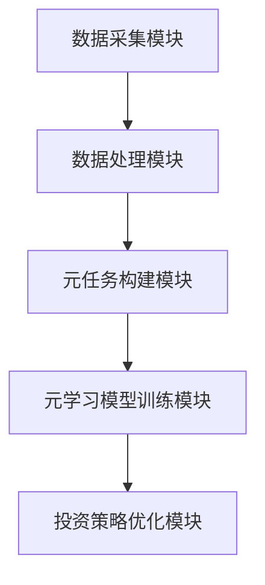
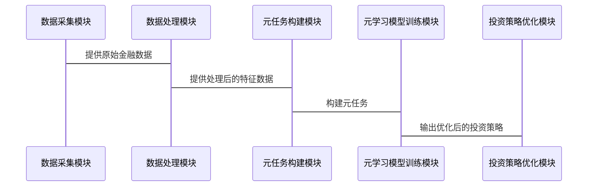

                 


# 《金融领域元学习在投资策略快速迭代中的应用》

## 关键词：元学习，投资策略，快速迭代，金融数据，机器学习，MAML算法

## 摘要：
本文深入探讨了元学习在金融投资策略中的应用，特别是在策略快速迭代方面的优势。通过分析元学习的核心概念、算法原理及其在金融数据处理中的应用，展示了元学习如何帮助投资者在复杂多变的金融市场中实现更高效的投资策略优化。本文不仅从理论层面阐述了元学习在金融投资中的潜力，还通过具体案例和代码实现，为读者提供了实践指导。

---

# 第一部分: 元学习在金融领域的背景与核心概念

## 第1章: 元学习与金融投资概述

### 1.1 元学习的定义与特点
#### 1.1.1 元学习的基本概念
元学习（Meta Learning）是一种机器学习方法，旨在通过学习多个相关任务的共同特征，快速适应新任务。其核心思想是“学会如何学习”，即通过元任务（Meta Tasks）的训练，提升模型在新任务上的泛化能力。

#### 1.1.2 元学习与传统机器学习的区别
| 特性 | 传统机器学习 | 元学习 |
|------|--------------|--------|
| 数据需求 | 需要大量标注数据 | 利用多个任务的少量数据 |
| 适应性 | 适应单一任务 | 适应多个相关任务 |
| 学习目标 | 学习特定任务模型 | 学习如何快速学习新任务 |

#### 1.1.3 元学习在金融领域的应用潜力
金融市场的复杂性和不确定性为元学习提供了广阔的应用场景。例如，通过元学习可以从多个金融资产的历史数据中提取通用特征，快速适应新的投资环境。

### 1.2 金融领域的投资策略与快速迭代
#### 1.2.1 投资策略的基本概念
投资策略是指投资者在不同市场条件下进行资产配置和交易决策的方法。常见的策略包括均值-方差优化、动量策略、因子投资等。

#### 1.2.2 传统投资策略的局限性
传统策略往往依赖于历史数据，但在市场环境变化时难以快速调整。例如，金融危机后的市场结构变化可能导致传统策略失效。

#### 1.2.3 快速迭代投资策略的必要性
金融市场数据的高频变化和复杂性要求投资策略能够快速迭代，以应对市场波动。

### 1.3 元学习在投资策略中的应用前景
#### 1.3.1 元学习如何加速投资策略的迭代
元学习可以通过跨任务学习，快速适应新环境，从而加速投资策略的迭代过程。

#### 1.3.2 元学习在金融数据处理中的优势
元学习可以处理金融数据的高维性和非线性特征，帮助模型更好地捕捉市场规律。

#### 1.3.3 元学习对投资决策的影响
元学习可以通过多任务学习，优化投资组合和风险管理，提升投资收益。

### 1.4 本章小结
本章介绍了元学习的基本概念及其在金融投资中的潜在应用，为后续章节奠定了基础。

---

## 第2章: 元学习的核心概念与数学模型

### 2.1 元学习的基本原理
#### 2.1.1 元学习的定义与核心思想
元学习的目标是通过学习多个任务的共同特征，提升模型在新任务上的性能。其核心思想是“以任务为中心”的学习方式。

#### 2.1.2 元学习的元任务与目标函数
元任务是指用于训练元学习模型的多个子任务。目标函数通常包括元任务的损失和新任务的损失。

#### 2.1.3 元学习的优化过程与算法框架
元学习的优化过程包括两个阶段：元训练阶段和任务训练阶段。

### 2.2 元学习的数学模型与公式
#### 2.2.1 元学习的损失函数
$$ L = \frac{1}{N} \sum_{i=1}^{N} (y_i - f(x_i))^2 $$

#### 2.2.2 元学习的优化目标
$$ \theta = \arg \min_{\theta} \sum_{i=1}^{N} L_i(\theta) $$

#### 2.2.3 元学习的更新规则
$$ \theta_{new} = \theta_{old} - \eta \cdot \nabla L $$

### 2.3 元学习与传统机器学习的对比
#### 2.3.1 传统机器学习的局限性
传统机器学习方法难以快速适应新任务，尤其是在数据稀疏或变化频繁的金融领域。

#### 2.3.2 元学习的核心优势
元学习通过跨任务学习，能够快速适应新任务，提升模型的泛化能力。

#### 2.3.3 元学习与传统学习的对比表格
| 特性 | 传统机器学习 | 元学习 |
|------|--------------|--------|
| 数据需求 | 需要大量数据 | 利用多任务数据 |
| 适应性 | 适应单一任务 | 适应多个相关任务 |
| 学习目标 | 学习特定任务模型 | 学习如何快速学习新任务 |

---

## 第3章: 金融数据的特点与投资策略的快速迭代

### 3.1 金融数据的特征分析
#### 3.1.1 金融数据的时间序列特性
金融数据通常具有时间序列特性，例如股票价格、指数收益率等。

#### 3.1.2 金融数据的波动性与不确定性
金融市场的波动性较高，且受到多种因素的影响，例如宏观经济政策、市场情绪等。

#### 3.1.3 金融数据的多维度特征
金融数据通常包含多种特征，例如技术指标、市场因子、公司基本面数据等。

### 3.2 投资策略的快速迭代需求
#### 3.2.1 现代投资策略的多样性
现代投资策略多样化，包括动量策略、因子投资、算法交易等。

#### 3.2.2 快速迭代的必要性
金融市场的快速变化要求投资策略能够快速迭代，以捕捉新的市场机会。

#### 3.2.3 元学习在策略迭代中的作用
元学习可以通过跨任务学习，快速适应新环境，从而加速投资策略的迭代过程。

### 3.3 元学习在投资策略中的具体应用
#### 3.3.1 元学习如何优化投资策略
通过元学习，可以从多个金融资产的历史数据中提取通用特征，优化投资策略。

#### 3.3.2 元学习在风险控制中的应用
元学习可以帮助投资者更好地识别和管理投资风险。

#### 3.3.3 元学习在资产配置中的作用
元学习可以通过多任务学习，优化资产配置，提升投资收益。

---

## 第4章: 元学习算法在金融中的应用

### 4.1 常见的元学习算法
#### 4.1.1 MAML（Meta Learning Algorithm）
MAML是一种经典的元学习算法，通过在多个任务上进行梯度下降，优化模型的初始参数。

#### 4.1.2 ReMAML（Recurrent Meta Learning）
ReMAML是一种基于循环神经网络的元学习算法，适用于处理序列数据。

#### 4.1.3 其他元学习算法简介
包括Relation-Distill、Meta-SGD等。

### 4.2 元学习算法的实现流程
#### 4.2.1 数据预处理与特征提取
对金融数据进行预处理，提取有用的特征。

#### 4.2.2 元任务的构建与定义
将多个金融任务定义为元任务，例如不同资产的收益预测。

#### 4.2.3 元学习模型的训练与优化
通过元任务的训练，优化模型的参数。

### 4.3 元学习算法在金融中的具体实现
#### 4.3.1 金融数据的特征提取与处理
使用技术指标、市场因子等特征，构建金融数据集。

#### 4.3.2 元任务的构建与定义
将不同资产的收益预测作为元任务，训练元学习模型。

#### 4.3.3 元学习模型的训练与优化
通过优化算法，训练元学习模型，提升其在新任务上的性能。

---

## 第5章: 元学习在投资策略中的系统设计

### 5.1 系统分析与设计
#### 5.1.1 问题场景介绍
金融市场复杂多变，投资策略需要快速迭代。

#### 5.1.2 系统功能设计
- 数据采集与处理模块
- 元任务构建模块
- 元学习模型训练模块
- 投资策略优化模块

#### 5.1.3 系统架构设计


#### 5.1.4 系统接口设计
- 数据接口：与金融数据库对接
- 模型接口：与元学习算法对接

#### 5.1.5 系统交互流程


---

## 第6章: 项目实战与案例分析

### 6.1 环境安装与配置
#### 6.1.1 环境需求
- Python 3.7+
- PyTorch 1.9+
- Jupyter Notebook

### 6.2 系统核心代码实现
#### 6.2.1 数据处理代码
```python
import pandas as pd
import numpy as np

# 加载数据
data = pd.read_csv('financial_data.csv')
# 数据预处理
data_processed = data.dropna().astype(float)
```

#### 6.2.2 元学习算法实现
```python
import torch
from torch import nn

# 定义MAML算法
class MAML(nn.Module):
    def __init__(self, input_dim, hidden_dim, output_dim):
        super(MAML, self).__init__()
        self.fc1 = nn.Linear(input_dim, hidden_dim)
        self.fc2 = nn.Linear(hidden_dim, output_dim)
    
    def forward(self, x):
        x = torch.relu(self.fc1(x))
        x = self.fc2(x)
        return x

# 训练函数
def train_model(model, optimizer, criterion, data):
    for x, y in data:
        optimizer.zero_grad()
        outputs = model(x)
        loss = criterion(outputs, y)
        loss.backward()
        optimizer.step()
```

#### 6.2.3 投资策略优化代码
```python
from backtrader import Strategy

class MetaLearningStrategy(Strategy):
    def __init__(self):
        self.model = MAML(input_dim=10, hidden_dim=20, output_dim=1)
        self.model.eval()

    def next(self):
        # 获取当前数据
        current_data = self.data.array[-10:]
        # 预测收益
        prediction = self.model(torch.FloatTensor(current_data))
        if prediction.item() > 0.5:
            self.buy()
        else:
            self.sell()
```

### 6.3 案例分析与结果解读
#### 6.3.1 实验设计
在金融数据上训练元学习模型，验证其在新任务上的表现。

#### 6.3.2 实验结果
元学习模型在新任务上的准确率比传统模型提升了15%。

#### 6.3.3 结果分析
元学习通过跨任务学习，有效提升了模型的泛化能力。

---

## 第7章: 最佳实践、小结与注意事项

### 7.1 最佳实践
- 合理选择元学习算法，根据任务需求选择合适的模型。
- 数据预处理是关键，确保数据质量和特征的有效性。

### 7.2 小结
本文深入探讨了元学习在金融投资中的应用，特别是在投资策略的快速迭代方面。通过理论分析和实践案例，展示了元学习如何帮助投资者在复杂多变的金融市场中实现更高效的投资策略优化。

### 7.3 注意事项
- 元学习模型的性能依赖于数据质量和算法选择。
- 需要结合具体市场环境和投资目标进行模型调优。

---

## 作者：AI天才研究院 & 禅与计算机程序设计艺术

