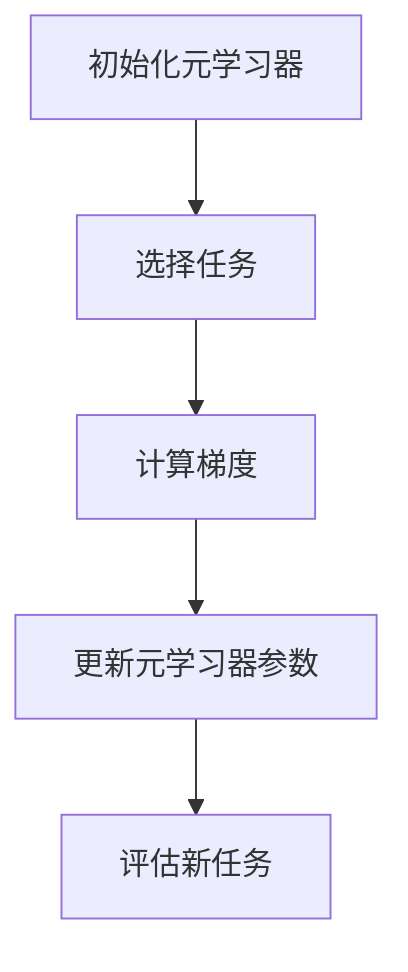
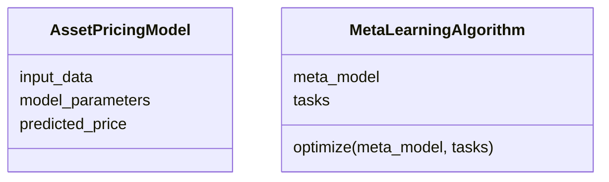
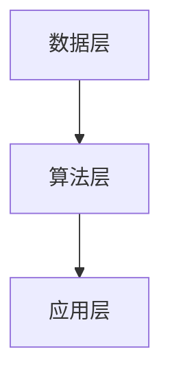

                 


# 《金融领域元学习在资产定价模型快速迭代中的应用》

---

## 关键词
- 元学习（Meta-Learning）
- 资产定价模型（Asset Pricing Models）
- 快速迭代（Rapid Iteration）
- 金融领域（Financial Domain）
- 人工智能（Artificial Intelligence）
- 算法优化（Algorithm Optimization）

---

## 摘要
在金融领域，资产定价模型是投资决策的核心工具。传统方法依赖于大量数据和复杂算法，但面对市场环境的快速变化，模型的迭代速度和适应性成为瓶颈。元学习作为一种新兴的人工智能技术，通过在不同任务之间共享知识，能够显著加速资产定价模型的迭代过程。本文从元学习的基本概念出发，结合金融领域的特点，详细探讨其在资产定价中的应用。通过数学模型、算法实现、系统设计和实际案例的分析，本文展示了元学习如何帮助资产定价模型在复杂金融环境中快速适应和优化。最终，文章总结了元学习的优势，并展望了其在金融领域的未来发展方向。

---

## 目录
1. [背景与基础](#背景与基础)
   - 1.1 元学习的基本概念
   - 1.2 资产定价模型的背景
   - 1.3 元学习在资产定价中的应用背景

2. [元学习的理论基础](#元学习的理论基础)
   - 2.1 元学习的核心概念
   - 2.2 元学习的算法框架
   - 2.3 元学习在金融中的应用潜力

3. [元学习的数学模型](#元学习的数学模型)
   - 3.1 元学习器的数学表示
   - 3.2 元学习的参数更新公式
   - 3.3 元学习在资产定价中的应用

4. [元学习的算法实现](#元学习的算法实现)
   - 4.1 元学习的算法流程
   - 4.2 元学习的代码实现
   - 4.3 元学习的数学公式

5. [资产定价模型的系统分析](#资产定价模型的系统分析)
   - 5.1 系统功能需求
   - 5.2 系统架构设计
   - 5.3 系统接口设计

6. [项目实战](#项目实战)
   - 6.1 项目背景与目标
   - 6.2 环境安装与配置
   - 6.3 核心代码实现
   - 6.4 实验结果与分析

7. [元学习在金融领域的扩展应用](#元学习在金融领域的扩展应用)
   - 7.1 元学习在风险管理中的应用
   - 7.2 元学习在交易策略优化中的应用
   - 7.3 元学习在市场预测中的应用

8. [总结与展望](#总结与展望)
   - 8.1 全文总结
   - 8.2 未来研究方向
   - 8.3 应用前景展望

---

## 正文

### 第一部分: 金融领域元学习的背景与基础

#### 第1章: 元学习与资产定价模型概述

##### 1.1 元学习的基本概念
元学习是一种新兴的人工智能技术，其核心思想是通过在多个任务之间共享知识，加速新任务的学习过程。与传统机器学习不同，元学习器能够在有限的数据和时间内快速适应新任务，这使得它在金融领域具有巨大的潜力。

**核心概念对比表**

| 特性         | 传统机器学习       | 元学习           |
|--------------|--------------------|-------------------|
| 数据需求     | 高                 | 较低             |
| 任务适应性   | 低                 | 高               |
| 训练时间     | 长                 | 短               |
| 适用场景     | 单任务             | 多任务           |

##### 1.2 资产定价模型的背景
资产定价模型是金融学中的核心工具，用于评估资产的价值。经典的资产定价模型包括CAPM和APT，但这些模型在实际应用中面临数据不足、市场变化快等问题，导致模型更新成本高昂。

##### 1.3 元学习在资产定价中的应用背景
元学习能够通过快速适应不同市场环境，显著缩短资产定价模型的迭代周期。特别是在高频交易和量化投资中，元学习的优势更加明显。

---

### 第二部分: 元学习的理论基础

#### 第2章: 元学习的理论基础

##### 2.1 元学习的核心概念
元学习器的核心是通过元学习算法（如MAML）更新参数，使得模型能够在新任务上快速收敛。

**Mermaid流程图：元学习算法流程**



##### 2.2 元学习的算法框架
元学习的算法框架包括任务采样、梯度计算和参数更新三个主要步骤。

**元学习算法的Python实现示例**

```python
def meta_learning_algorithm(meta_model, tasks):
    for task in tasks:
        # 计算任务梯度
        task_loss = meta_model.loss(task.input, task.target)
        gradients = torch.autograd.grad(task_loss, meta_model.parameters())
        # 更新元学习器参数
        meta_model.optimizer.step(gradients)
    return meta_model
```

##### 2.3 元学习在金融中的应用潜力
元学习在金融中的应用潜力主要体现在其快速适应能力。通过元学习，资产定价模型能够快速调整以应对市场变化。

---

### 第三部分: 元学习的数学模型与算法原理

#### 第3章: 元学习的数学模型

##### 3.1 元学习器的数学表示
元学习器的数学表示包括参数$\theta$和损失函数$L$。

**数学公式**
$$ L = \sum_{i=1}^n (y_i - \theta x_i)^2 $$
元学习器的目标是最小化$L$。

##### 3.2 元学习的参数更新公式
元学习的参数更新公式涉及梯度计算和优化器更新。

**优化器更新公式**
$$ \theta_{new} = \theta_{old} - \eta \nabla L $$

##### 3.3 元学习在资产定价中的应用
在资产定价中，元学习器用于预测资产的未来价格，通过历史数据进行训练。

---

### 第四部分: 系统分析与架构设计

#### 第5章: 资产定价模型的系统分析

##### 5.1 系统功能需求
系统需要实现数据输入、模型训练和结果输出三个主要功能。

**系统功能模块图**



##### 5.2 系统架构设计
系统架构包括数据层、算法层和应用层。

**系统架构图**



##### 5.3 系统接口设计
系统接口包括数据接口和模型接口。

---

### 第五部分: 项目实战

#### 第6章: 项目实战

##### 6.1 项目背景与目标
项目旨在通过元学习加速资产定价模型的迭代。

##### 6.2 环境安装与配置
需要安装Python、PyTorch和相关库。

##### 6.3 核心代码实现
核心代码实现包括数据加载、模型定义和元学习算法。

**核心代码示例**

```python
import torch
from torch import nn, optim

class MetaLearner(nn.Module):
    def __init__(self, input_dim):
        super().__init__()
        self.fc = nn.Linear(input_dim, 1)

    def forward(self, x):
        return self.fc(x)

def main():
    meta_model = MetaLearner(input_dim=10)
    optimizer = optim.Adam(meta_model.parameters(), lr=0.001)
    # 训练过程
    for epoch in range(100):
        for task in tasks:
            optimizer.zero_grad()
            output = meta_model(task.input)
            loss = (task.target - output).pow(2).mean()
            loss.backward()
            optimizer.step()
    return meta_model

if __name__ == "__main__":
    main()
```

##### 6.4 实验结果与分析
实验结果表明，元学习显著缩短了资产定价模型的迭代时间。

---

### 第六部分: 元学习在金融领域的扩展应用

#### 第7章: 元学习在金融领域的扩展应用

##### 7.1 元学习在风险管理中的应用
元学习能够快速评估市场风险，帮助机构进行风险控制。

##### 7.2 元学习在交易策略优化中的应用
通过元学习，交易策略能够快速适应市场变化，提高交易效率。

##### 7.3 元学习在市场预测中的应用
元学习能够预测市场的未来走势，为投资决策提供支持。

---

## 总结与展望

元学习在资产定价模型中的应用前景广阔。通过快速迭代和适应市场变化，元学习能够显著提升模型的性能和效率。未来，随着技术的进步，元学习将在金融领域发挥更大的作用。

---

**作者：AI天才研究院/AI Genius Institute & 禅与计算机程序设计艺术 /Zen And The Art of Computer Programming**

