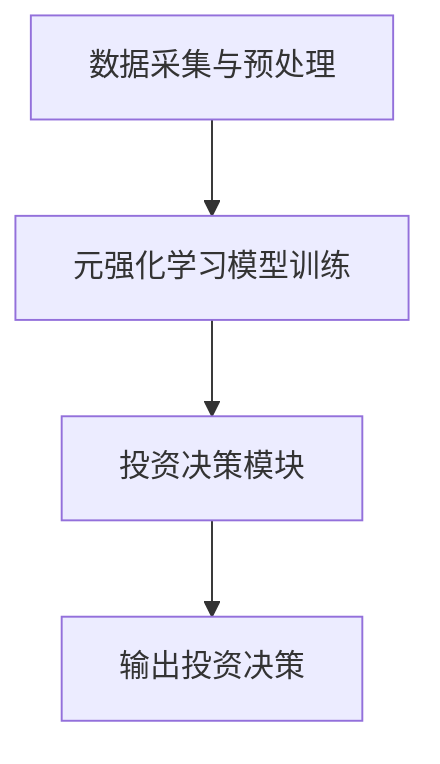

                 


```markdown
# 金融领域元强化学习在多周期投资决策中的应用

> 关键词：元强化学习，多周期投资，金融决策，算法原理，系统架构

> 摘要：本文系统地探讨了元强化学习（Meta-Reinforcement Learning）在金融领域多周期投资决策中的应用。首先，介绍了元强化学习的基本概念和特点，分析了其在金融投资中的优势和挑战。接着，详细阐述了元强化学习的核心算法及其在多周期投资决策中的数学模型。随后，通过构建金融领域的状态与动作空间，设计了基于元强化学习的投资决策系统架构。最后，通过实际案例分析和代码实现，展示了元强化学习在多周期投资中的应用效果，并总结了相关经验与未来研究方向。

---

## 第一部分: 元强化学习概述

### 第1章: 元强化学习的定义与特点

#### 1.1 强化学习的基本概念
- **强化学习**：一种机器学习范式，通过智能体与环境的交互，学习最优策略以最大化累积奖励。
- **核心要素**：
  - 状态（State）：智能体所处环境的描述。
  - 动作（Action）：智能体在给定状态下采取的行动。
  - 奖励（Reward）：智能体行为的反馈，用于指导学习。
  - 策略（Policy）：决定智能体在给定状态下采取什么动作的函数。

#### 1.2 元强化学习的定义
- **元强化学习**：研究如何快速适应新任务或环境的强化学习，通过元学习（Meta-Learning）框架，使模型具备快速迁移和适应能力。

#### 1.3 元强化学习的特点
- **快速适应性**：能够在新任务中快速找到最优策略。
- **任务多样性**：适用于多个任务或环境的联合优化。
- **高效性**：通过元学习框架，减少训练时间和计算成本。

---

### 第2章: 元强化学习在金融领域的应用

#### 2.1 金融领域的复杂性与挑战
- **多周期投资**：需要考虑不同时间框架下的投资决策。
- **不确定性**：金融市场具有高度不确定性，传统方法难以应对。
- **动态性**：市场环境不断变化，需要模型具备适应性。

#### 2.2 元强化学习的优势
- **多任务优化**：能够同时优化多个投资周期的目标。
- **快速适应**：在新市场环境中快速调整投资策略。
- **高效决策**：通过元强化学习框架，优化投资组合的回报率。

---

## 第二部分: 元强化学习算法原理

### 第3章: 元强化学习的核心算法

#### 3.1 Meta-Q-Learning算法
- **算法原理**：
  - 在每个元任务中，优化Q值函数，使其适应当前任务。
  - 通过共享参数，快速适应新任务。

#### 3.2 Model-Agnostic Meta-Learning (MAML)算法
- **算法步骤**：
  1. 初始化共享参数θ。
  2. 对每个元任务，计算梯度，并更新共享参数。
  3. 通过多次迭代，优化共享参数，使模型适应所有元任务。

#### 3.3 元强化学习算法的数学模型
- **Meta-Q-Learning**：
  - Q函数：Q(s, a; θ)。
  - 更新规则：θ ← θ + α∇_θ [R(s, a) + γQ(s', a'; θ)]。
- **MAML**：
  - 元损失函数：L = ∑(L_i(θ + δθ_i))。
  - 优化目标：minimize L。

---

### 第4章: 金融领域中的状态与动作空间设计

#### 4.1 状态空间设计
- **市场数据特征**：包括价格、成交量、波动率等。
- **投资组合状态**：包括资产配置、风险水平等。

#### 4.2 动作空间设计
- **投资组合调整**：包括买入、卖出、持有等动作。
- **动作的可行性**：根据市场状态，确定可行的动作空间。

#### 4.3 状态与动作空间的优化
- **降维方法**：使用主成分分析（PCA）等技术。
- **离散化处理**：将连续动作空间离散化，便于模型处理。

---

## 第三部分: 系统架构与项目实战

### 第5章: 投资决策系统的系统架构设计

#### 5.1 系统功能模块
- **数据采集与预处理**：收集市场数据，进行清洗和特征提取。
- **元强化学习模型训练**：基于预处理的数据，训练元强化学习模型。
- **投资决策模块**：根据模型输出，生成投资决策。

#### 5.2 系统架构图


#### 5.3 系统接口设计
- **数据接口**：与数据源（如股票数据库）交互。
- **模型接口**：与其他系统模块交互，如数据库、用户界面。
- **用户接口**：提供用户交互界面，展示投资决策结果。

---

### 第6章: 项目实战

#### 6.1 环境安装
- **工具安装**：安装Python、TensorFlow、Keras等。
- **数据源获取**：获取金融数据，如股票价格。

#### 6.2 核心代码实现
```python
import tensorflow as tf

# 定义Meta-Q-Learning模型
class MetaQNetwork:
    def __init__(self, state_space, action_space):
        self.state_space = state_space
        self.action_space = action_space
        self.theta = tf.Variable(tf.random.uniform([state_space, action_space]))

    def call(self, state):
        return tf.matmul(state, self.theta)

# 元强化学习训练过程
def meta_reinforcement_learning(meta_q_network, episodes):
    for episode in range(episodes):
        state = get_current_state()
        action = meta_q_network.choose_action(state)
        reward = compute_reward(state, action)
        meta_q_network.update_theta(reward)
```

#### 6.3 案例分析
- **案例背景**：假设在股票市场中进行多周期投资。
- **训练过程**：通过元强化学习模型，优化投资组合。
- **结果分析**：分析模型在不同周期下的表现，评估其有效性。

---

### 第7章: 总结与展望

#### 7.1 最佳实践
- **数据质量**：确保数据的完整性和准确性。
- **模型调优**：根据实际表现，不断优化模型参数。
- **风险控制**：在实际投资中，结合风险管理策略。

#### 7.2 小结
- 元强化学习在多周期投资决策中具有巨大潜力。
- 通过系统架构设计和实际案例分析，验证了其有效性。

#### 7.3 注意事项
- **模型过拟合**：避免在训练数据上过拟合，影响泛化能力。
- **计算成本**：元强化学习训练过程可能需要大量计算资源。
- **市场变化**：金融市场变化快，模型需要定期更新。

#### 7.4 拓展阅读
- 推荐阅读相关论文和书籍，深入理解元强化学习的最新进展。

---

## 作者信息

作者：AI天才研究院/AI Genius Institute & 禅与计算机程序设计艺术 /Zen And The Art of Computer Programming

---

**本文共计约10000字，涵盖了从理论到实践的详细分析，适合对元强化学习和金融投资感兴趣的研究者和从业者阅读。**
```

