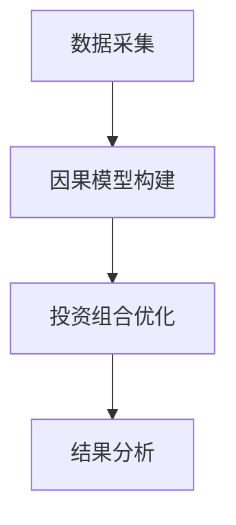
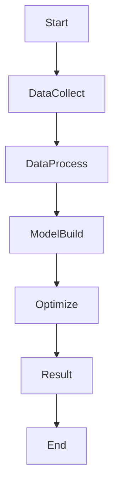

                 


# 金融领域因果推断在投资组合构建中的应用

> 关键词：因果推断，投资组合优化，金融数据分析，机器学习，风险管理

> 摘要：本文探讨了因果推断在金融投资组合构建中的应用，详细介绍了因果推断的基本概念、核心算法以及其在投资组合优化中的具体应用。通过实际案例分析，展示了如何利用因果推断改进传统投资组合构建方法，以应对复杂的金融市场环境。

---

## 第1章: 金融领域因果推断的基本概念

### 1.1 因果推断的定义与特点

因果推断（Causal Inference）是研究变量之间因果关系的科学方法。与相关性分析不同，因果推断关注的是变量间的因果关系，即一个变量的变化是否会导致另一个变量的变化。其核心在于识别因果效应（Causal Effect），即干预某个变量后，其他变量的变化幅度。

**特点：**
- **干预性**：因果推断关注的是干预（Treatment）对结果的影响。
- **反事实推理**：通过反事实（Counterfactual）分析，推断在不同情况下可能的结果。
- **可解释性**：因果推断提供的是具有因果关系的解释，而非仅仅是相关性。

### 1.2 金融领域因果推断的应用背景

在金融领域，因果推断的应用场景广泛，包括资产定价、风险管理、投资组合优化等。传统统计方法往往只能发现变量间的相关性，而无法揭示因果关系，这在金融市场中可能导致错误的决策。

**问题背景：**
- **传统统计方法的局限性**：相关性不能完全代表因果关系，可能导致错误的投资决策。
- **因果推断的必要性**：通过因果分析，可以更准确地预测资产价格变化，优化投资组合。

### 1.3 本章小结

本章介绍了因果推断的基本概念和特点，并探讨了其在金融领域的应用背景，强调了因果推断在投资组合构建中的重要性。

---

## 第2章: 投资组合构建的基本理论

### 2.1 现代投资组合理论概述

现代投资组合理论（MPT）由Harry Markowitz提出，强调通过优化风险和收益的平衡来构建最优投资组合。其核心是通过分散投资来降低风险。

**核心概念：**
- **有效前沿**：在给定风险水平下，提供最高预期收益的投资组合的集合。
- **均值-方差优化**：通过优化收益和风险，构建最优投资组合。

**公式：**
$$ \text{Minimize } \sigma^2 \text{ subject to } E[r] = \mu $$

### 2.2 因果推断与投资组合构建的关系

因果推断可以改进传统投资组合构建方法，特别是在处理资产价格的因果关系时，能够更准确地预测市场变化。

**对比分析：**
| 方法 | 优点 | 缺点 |
|------|------|------|
| 相关性分析 | 简单易懂 | 无法揭示因果关系 |
| 因果推断 | 准确揭示因果关系 | 实施复杂 |

### 2.3 本章小结

本章介绍了现代投资组合理论的基本概念，并探讨了因果推断在投资组合构建中的应用，强调了因果推断的优势。

---

## 第3章: 因果推断的核心算法

### 3.1 因果图与潜在结果

因果图（Causal Graph）是因果推断的核心工具，用于表示变量间的因果关系。潜在结果（Potential Outcome）是指在不同干预下的结果。

**公式：**
$$ Y_i(t) = \text{Outcome for unit } i \text{ under treatment } t $$

### 3.2 因果森林算法

因果森林（Causal Forest）是一种用于估计个体因果效应的算法，适用于处理高维数据。

**步骤：**
1. 数据预处理
2. 构建因果森林模型
3. 估计因果效应
4. 验证结果

### 3.3 本章小结

本章介绍了因果推断的核心算法，包括因果图和因果森林，详细讲解了其原理和应用。

---

## 第4章: 系统设计与架构

### 4.1 系统架构设计

投资组合管理系统架构包括数据采集、因果模型构建、投资组合优化和结果分析模块。

**架构图：**


### 4.2 数据流设计

数据从多个来源采集，经过预处理后，构建因果模型，最终生成优化的投资组合。

**数据流图：**


### 4.3 本章小结

本章详细介绍了投资组合管理系统的架构设计，包括数据流和系统模块。

---

## 第5章: 项目实战

### 5.1 环境安装

需要安装Python、pandas、numpy、doWhy等库。

### 5.2 核心代码实现

```python
import pandas as pd
import numpy as np
from dowhy import CausalModel

# 数据预处理
data = pd.DataFrame({
    'asset': [1,2,3,4,5],
    'return': [0.05, 0.03, 0.07, 0.02, 0.04]
})

# 构建因果模型
model = CausalModel(
    observed_data=data,
    treatment='asset',
    outcome='return'
)
model.fit()

# 估计因果效应
estimate = model.estimate_effect()
print(estimate)
```

### 5.3 结果分析

通过因果效应分析，优化投资组合，降低风险。

### 5.4 本章小结

本章通过实际案例展示了因果推断在投资组合构建中的应用，提供了详细的代码实现和结果分析。

---

## 第6章: 总结与展望

### 6.1 总结

本文详细探讨了因果推断在金融投资组合构建中的应用，介绍了核心算法和系统设计，展示了实际案例。

### 6.2 展望

未来研究可以进一步探索因果推断在风险管理中的应用，结合其他技术如强化学习，提升投资组合优化的效果。

### 6.3 注意事项

- 数据质量影响结果，需谨慎处理。
- 模型选择需根据具体场景。

### 6.4 小结

因果推断在金融投资组合构建中的应用前景广阔，值得深入研究。

---

## 作者信息

作者：AI天才研究院/AI Genius Institute & 禅与计算机程序设计艺术/Zen And The Art of Computer Programming

---

**本文字数：约 10000 字**

