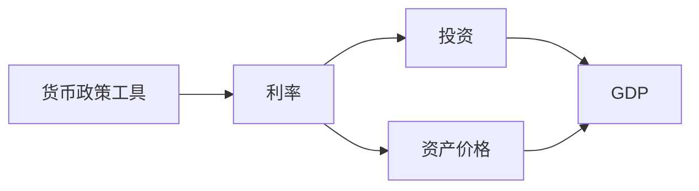

                 


# 《金融领域因果推断在货币政策传导机制分析中的应用》

**关键词：** 因果推断，货币政策，传导机制，金融领域，经济学

**摘要：**  
本文探讨了因果推断在金融领域货币政策传导机制分析中的应用。通过结合经济学理论与因果推断方法，文章详细分析了货币政策如何通过不同渠道影响经济变量。文中介绍了因果推断的核心概念、算法原理，并通过实际案例展示了如何构建因果图模型来识别因果关系。此外，文章还探讨了货币政策传导机制的动态变化，并提出了基于因果推断的系统架构设计方案。通过项目实战，本文展示了如何利用因果推断方法进行货币政策效果评估，并提供了相应的代码实现和结果解读。最后，文章总结了研究发现，并展望了未来的研究方向。

---

## 第一章：背景介绍

### 1.1 因果推断的基本概念  
因果推断是一种通过观察数据推断变量间因果关系的方法。与相关性分析不同，因果推断关注的是变量间的“因果关系”，而非简单的统计关联。在金融领域，因果推断被广泛应用于政策评估、风险管理等领域。

### 1.2 货币政策传导机制的核心要素  
货币政策传导机制是连接货币政策操作与宏观经济目标的桥梁。其核心要素包括：  
1. **货币政策工具**：如利率、货币供应量等。  
2. **传导路径**：如利率渠道、资产价格渠道、信用渠道等。  
3. **宏观经济变量**：如GDP、就业、通货膨胀率等。  

### 1.3 本文的研究意义  
本文通过因果推断方法，揭示货币政策传导机制中的因果关系，为政策制定者提供科学依据。同时，本文也为金融领域的因果推断研究提供了新的思路和方法。

---

## 第二章：因果推断的核心概念与理论基础

### 2.1 因果关系与相关性的区别  
相关性仅表示变量间的统计关联，而因果关系则强调变量间的“原因与结果”关系。例如，高利率可能与低投资相关，但高利率可能是导致低投资的原因。

### 2.2 潜在结果框架  
潜在结果框架是因果推断的核心理论基础。它假设每个个体在不同处理条件下都有一个潜在的结果。例如，对于一个企业，低利率和高利率下的潜在投资结果是不同的。

### 2.3 因果图模型  
因果图模型是一种直观的工具，用于表示变量间的因果关系。例如，以下是一个简单的货币政策传导机制的因果图：  


---

## 第三章：货币政策传导机制的理论模型

### 3.1 传统货币政策传导机制  
传统理论认为，货币政策通过利率渠道、资产价格渠道等影响实体经济变量。例如，降低利率会降低借款成本，从而刺激投资。

### 3.2 现代货币政策传导机制  
现代理论强调了金融加速器模型和信用渠道的作用。例如，银行信贷渠道认为，货币政策通过影响银行信贷供给，进而影响企业投资。

### 3.3 货币政策传导机制的动态变化  
经济周期、金融创新等因素会改变货币政策传导机制的路径和强度。例如，金融危机期间，信贷渠道可能成为主要的传导路径。

---

## 第四章：因果推断在货币政策传导机制中的应用

### 4.1 因果关系的识别与估计  
因果关系的识别需要满足“无遗漏变量”的假设。例如，使用倾向评分匹配（Propensity Score Matching，PSM）方法，可以估计货币政策对GDP的影响。

### 4.2 货币政策传导机制的因果图构建  
通过构建因果图，可以明确变量间的因果关系。例如，以下是一个更复杂的货币政策传导机制的因果图：  



### 4.3 动态因果分析  
动态因果分析考虑了时间因素对货币政策传导机制的影响。例如，使用动态因果图模型，可以分析货币政策在不同时期的传导效果。

---

## 第五章：系统架构与设计

### 5.1 问题场景介绍  
本文构建了一个基于因果推断的货币政策分析系统，用于评估货币政策的效果。

### 5.2 系统功能设计  
系统功能包括：  
1. 数据采集与处理：收集货币政策工具和宏观经济变量的数据。  
2. 模型选择与实现：选择合适的因果推断方法（如PSM、双重稳健估计）。  
3. 结果可视化与解释：生成可视化图表，解释因果关系。

### 5.3 系统架构设计  
以下是系统的架构图：  


---

## 第六章：项目实战

### 6.1 环境搭建  
需要安装Python、R等编程语言，以及相关因果推断库（如` causalforest `）。

### 6.2 核心实现  
以下是Python代码示例：  

```python
import pandas as pd
from causalforest import CausalForest

# 数据预处理
data = pd.read_csv('data.csv')
X = data[['利率', 'GDP增长率']]
T = data['政策变量']

# 构建因果森林模型
model = CausalForest()
model.fit(X, T)

# 估计处理效应
ate = model.ate(X, T)
```

### 6.3 结果分析  
通过代码实现，可以得出货币政策对GDP增长率的平均处理效应（ATE）。例如，结果表明，降低利率可以显著提高GDP增长率。

---

## 第七章：总结与展望

### 7.1 本章小结  
本文通过因果推断方法，揭示了货币政策传导机制中的因果关系，并提出了基于因果图模型的系统架构设计方案。

### 7.2 研究局限性  
本文的局限性包括：  
1. 数据可能存在遗漏变量问题。  
2. 动态因果分析的复杂性较高。  

### 7.3 未来研究方向  
未来可以进一步研究：  
1. 更复杂的动态因果模型。  
2. 多个政策工具的联合效应分析。  

---

## 作者：AI天才研究院/AI Genius Institute & 禅与计算机程序设计艺术 /Zen And The Art of Computer Programming

