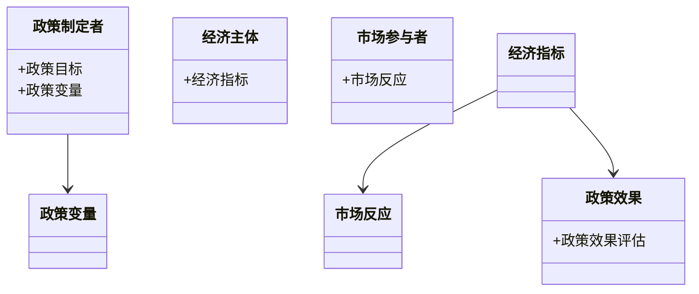

                 


# 《金融领域因果推理在宏观经济政策效果评估中的应用》

> 关键词：因果推理、宏观经济政策、金融领域、政策效果评估、机器学习

> 摘要：本文系统地探讨了因果推理在金融领域宏观经济政策效果评估中的应用，从基本概念、数学模型、算法实现到实际案例，详细介绍了因果推理如何帮助我们更好地理解和评估宏观经济政策的效果。文章通过理论与实践相结合的方式，展示了因果推理在金融领域的独特价值和广泛应用。

---

## 第一部分: 金融领域因果推理基础

### 第1章: 因果推理的基本概念

#### 1.1 因果关系与相关关系的区别
- **相关关系**：描述变量之间的关联性，但不涉及因果关系。
- **因果关系**：描述一个变量对另一个变量的影响，强调“原因和结果”的关系。
- **区别**：相关关系可以通过统计方法（如回归分析）量化，但无法证明因果关系；因果关系需要额外的假设和验证。

#### 1.2 宏观经济政策评估的背景与挑战
- **背景**：宏观经济政策（如货币政策、财政政策）的制定和评估需要考虑复杂的经济系统和变量之间的相互作用。
- **挑战**：政策评估需要在动态、非线性且存在外部干扰的环境中进行，传统统计方法往往难以准确捕捉因果关系。

#### 1.3 金融领域因果推理的独特性
- 金融领域数据的复杂性（如高频交易、市场波动）增加了因果关系的识别难度。
- 金融政策的滞后效应和多变量交互作用使得因果推理更具挑战性。

### 第2章: 因果推理的核心概念与数学模型

#### 2.1 潜在结果框架
- **定义**：对于每个个体（或单位），在政策实施前和实施后分别有一个潜在的结果。
- **数学表达**：$$ Y_i = \tau D_i + U_i $$
  - $Y_i$：个体$i$的政策效果。
  - $D_i$：政策变量（二元变量，1表示政策实施，0表示未实施）。
  - $\tau$：政策的平均处理效应（ATE）。
  - $U_i$：不可观测的干扰变量。

#### 2.2 结构方程模型
- **定义**：通过构建系统方程组来描述变量之间的因果关系。
- **参数估计**：使用最大似然估计或两阶段最小二乘法。
- **因果推断**：通过调整路径系数来识别因果关系。

### 第3章: 因果图与因果关系的可视化

#### 3.1 因果图的基本概念
- **定义**：用有向图表示变量之间的因果关系。
- **节点**：代表变量（如政策变量、经济指标）。
- **边**：代表因果关系的方向。

#### 3.2 因果关系的可视化工具
- **Mermaid因果图**：

- **实体关系图**：
```mermaid
erDiagram
    actor 政策制定者
    actor 经济主体
    actor 市场参与者
    actor 政策效果
    policy <---+ 政策制定者
    policy --> 经济指标
    经济指标 --> 市场反应
    经济指标 --> 政策效果
```

---

## 第二部分: 宏观经济政策评估中的因果推理应用

### 第4章: 宏观经济政策评估的因果推理框架

#### 4.1 宏观经济政策评估的基本流程
1. **确定政策目标**：明确政策的核心目标（如经济增长、通货膨胀控制）。
2. **构建因果模型**：根据政策目标选择合适的因果推理方法。
3. **估计政策效果**：通过模型计算政策的平均处理效应。
4. **验证模型的稳健性**：通过敏感性分析验证模型假设的合理性。

#### 4.2 因果推理在政策评估中的关键步骤
1. **数据收集与预处理**：收集宏观经济数据（GDP、失业率、通胀率等）并进行清洗。
2. **确定因果关系的方向**：通过因果图识别变量之间的因果关系。
3. **估计因果效应**：使用工具变量法或随机森林等方法估计政策效果。
4. **检验假设的合理性**：通过反事实分析验证假设的合理性。

### 第5章: 常用的因果推理算法与实现

#### 5.1 回归分析法
- **数学模型**：$$ Y = \beta_0 + \beta_1 X + \epsilon $$
- **Python代码实现**：
```python
import statsmodels.api as sm

# 数据准备
X = sm.add_constant(X)
model = sm.OLS(y, X)
results = model.fit()
print(results.summary())
```

#### 5.2 工具变量法
- **实现步骤**：
  1. 选择工具变量（与政策变量相关，但仅通过政策变量影响结果变量）。
  2. 使用工具变量进行两阶段回归。
  3. 估计政策的平均处理效应。

#### 5.3 随机森林因果推理
- **实现步骤**：
  1. 使用随机森林模型拟合结果变量与政策变量和其他控制变量。
  2. 计算政策变量的平均处理效应。

---

## 第三部分: 项目实战与系统架构设计

### 第6章: 系统架构设计

#### 6.1 项目介绍
- **目标**：构建一个基于因果推理的宏观经济政策评估系统。
- **功能需求**：
  - 数据采集与预处理。
  - 因果模型构建与参数估计。
  - 政策效果评估与可视化。

#### 6.2 领域模型设计


#### 6.3 系统架构设计


---

## 第四部分: 总结与展望

### 第7章: 总结与展望

#### 7.1 本文总结
- 本文系统地介绍了因果推理在金融领域宏观经济政策评估中的应用。
- 通过理论与实践相结合的方式，展示了因果推理的独特价值。

#### 7.2 未来展望
- 结合深度学习和强化学习进一步提升因果推理的精度和效率。
- 探索因果推理在其他宏观经济领域的应用潜力。

---

## 附录

### A. 参考文献
1. Pearl, J. (2009). Causality: Models, Reasoning, and Inference.
2. Hernán, M. A., & Robins, J. M. (2019). Causal Inference: What If.

### B. 技术支持
- Python代码示例：
```python
import numpy as np
import pandas as pd
import statsmodels.api as sm

# 示例数据
n = 100
X = np.random.randn(n, 1)
D = np.random.binomial(1, 0.5, n).reshape(-1, 1)
Y = 0.5 * D + 1 * X + np.random.randn(n, 1)

# 模型拟合
X = sm.add_constant(X)
model = sm.OLS(Y, X)
results = model.fit()
print(results.summary())
```

作者：AI天才研究院/AI Genius Institute & 禅与计算机程序设计艺术 /Zen And The Art of Computer Programming

