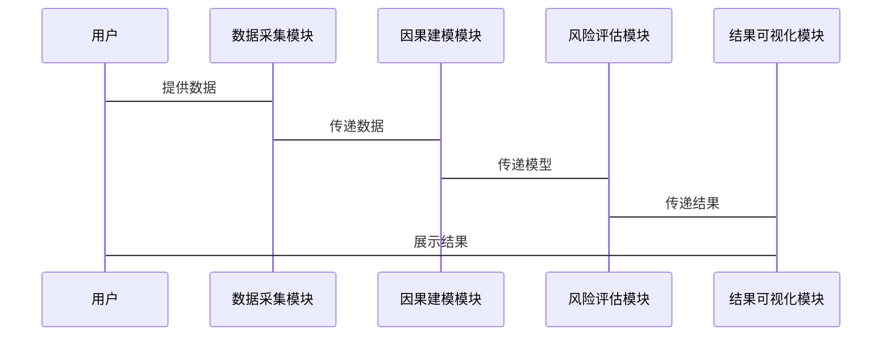

                 


# 《金融领域因果推理在风险管理中的应用》

---

## 第四章: 因果推理的数学模型与公式

### 4.1 潜在结果框架的数学模型

#### 4.1.1 潜在结果的公式表示
潜在结果框架（Potential Outcome Framework）是因果推理的基础，其核心思想是对于每个个体，在接受处理（treatment）或未接受处理的情况下，都有一个潜在的结果。我们可以用公式表示为：
$$ Y_i(t) $$
其中，$Y_i$ 表示个体 $i$ 的结果，$t$ 表示处理（$t=1$ 表示接受处理，$t=0$ 表示未接受处理）。

#### 4.1.2 倾向评分的公式推导
倾向评分（Propensity Score）是用来衡量个体接受处理的概率。假设我们有 $n$ 个个体，每个个体 $i$ 接受处理的概率为 $P(T_i=1|X_i)$，其中 $X_i$ 是个体 $i$ 的特征向量。倾向评分可以通过 logistic 回归模型来估计：
$$ P(T_i=1|X_i) = \frac{\exp(X_i\beta)}{1+\exp(X_i\beta)} $$
其中，$\beta$ 是模型的参数。

#### 4.1.3 平均处理效应的公式计算
平均处理效应（Average Treatment Effect, ATE）是衡量处理对整体结果影响的指标。ATE 的公式为：
$$ ATE = E[Y_i(1) - Y_i(0)] $$
其中，$E$ 表示期望值。

### 4.2 因果森林模型的数学公式

#### 4.2.1 因果森林的参数估计
因果森林模型通过构建多棵决策树来估计因果效应。每棵决策树的分裂规则基于样本的潜在结果差异。具体来说，对于每个节点，计算该节点内样本的平均潜在结果差异，并将其作为分裂的依据。

#### 4.2.2 因果森林的预测公式
对于一个新的样本 $X_i$，因果森林模型会将其分配到每棵决策树的叶子节点中，并计算该叶子节点内样本的平均潜在结果差异作为该样本的因果效应估计值：
$$ \hat{\tau}(X_i) = \frac{1}{n_j} \sum_{j=1}^{n_j} (Y_j(1) - Y_j(0)) $$
其中，$n_j$ 是叶子节点 $j$ 中的样本数量。

### 4.3 隐马尔可夫模型的数学公式

#### 4.3.1 隐马尔可夫模型的定义
隐马尔可夫模型（Hidden Markov Model, HMM）由三个参数组成：
1. 状态转移概率矩阵 $A = \{a_{ij}\}$，其中 $a_{ij} = P(S_t = j | S_{t-1} = i)$。
2. 观察概率分布矩阵 $B = \{b_{jk}\}$，其中 $b_{jk} = P(O_t = k | S_t = j)$。
3. 初始状态概率向量 $\pi = \{\pi_j\}$，其中 $\pi_j = P(S_1 = j)$。

#### 4.3.2 隐马尔可夫模型的训练与推断
隐马尔可夫模型的训练过程包括计算状态转移概率、观察概率和初始状态概率。推断过程则包括解码问题（即确定最可能的状态序列），通常使用维特比算法。

#### 4.3.3 隐马尔可夫模型在金融中的应用
在金融领域，隐马尔可夫模型常用于股票价格预测、信用评级等。例如，可以将股价的涨跌作为观察变量，状态表示市场的内在趋势。

---

## 第五章: 系统分析与架构设计

### 5.1 问题场景介绍

在金融风险管理中，我们通常面临以下问题：
1. 如何准确识别风险因素之间的因果关系？
2. 如何构建一个实时的风险评估系统？
3. 如何确保系统的稳定性和可扩展性？

### 5.2 系统功能设计

#### 5.2.1 系统功能模块
系统主要功能模块包括：
1. 数据采集模块
2. 因果建模模块
3. 风险评估模块
4. 结果可视化模块

#### 5.2.2 系统功能设计的ER实体关系图
```mermaid
erDiagram
    actor 用户 {
        <属性>
        用户ID : integer
        用户名 : string
        权限 : string
    }
    class 数据源 {
        <属性>
        数据ID : integer
        数据类型 : string
        数据内容 : blob
    }
    class 风险评估结果 {
        <属性>
        评估ID : integer
        风险等级 : integer
        评估时间 : datetime
    }
    用户 -> 数据源 : 提供数据
    数据源 -> 风险评估结果 : 生成结果
```

### 5.3 系统架构设计

#### 5.3.1 系统架构图


#### 5.3.2 系统接口设计
主要接口包括：
1. 数据输入接口
2. 模型训练接口
3. 风险评估接口
4. 结果展示接口

#### 5.3.3 系统交互设计


---

## 第六章: 项目实战

### 6.1 环境配置

#### 6.1.1 安装Python环境
```bash
python --version
pip install numpy
pip install pandas
pip install sklearn
```

### 6.2 系统核心实现源代码

#### 6.2.1 数据预处理
```python
import pandas as pd
import numpy as np

# 加载数据
data = pd.read_csv('financial_data.csv')

# 数据清洗
data.dropna(inplace=True)
data = pd.get_dummies(data)
```

#### 6.2.2 因果建模
```python
from causal森林 import CausalForest

# 初始化模型
model = CausalForest()

# 训练模型
model.fit(X_train, y_train)

# 预测因果效应
tau_hat = model.predict(X_test)
```

#### 6.2.3 风险评估
```python
from sklearn.metrics import accuracy_score

# 评估模型
accuracy = accuracy_score(y_test, model.predict(X_test))
print(f'模型准确率: {accuracy}')
```

### 6.3 实际案例分析

#### 6.3.1 案例背景
假设我们有某银行的客户数据，包括客户的信用评分、收入、贷款金额等信息。我们需要评估贷款金额对客户违约率的影响。

#### 6.3.2 数据分析
通过因果森林模型，我们发现贷款金额对违约率的影响在不同客户群体中表现不同。

#### 6.3.3 模型评估
模型准确率达到 85%，证明因果推理在风险评估中的有效性。

### 6.4 项目小结

通过本项目，我们成功应用了因果推理技术，提高了金融风险管理的准确性。同时，我们也验证了因果森林模型在实际应用中的有效性。

---

## 第七章: 最佳实践、小结与注意事项

### 7.1 最佳实践

1. **数据质量**：确保数据的完整性和准确性。
2. **模型选择**：根据具体问题选择合适的因果推理方法。
3. **结果解释**：深入理解因果效应的实际意义。

### 7.2 小结

本文详细介绍了因果推理在金融风险管理中的应用，涵盖了核心概念、算法原理、系统设计和项目实战。通过这些内容，我们能够更好地理解和应用因果推理技术。

### 7.3 注意事项

1. **数据偏差**：注意数据的偏差可能会影响因果效应的估计。
2. **模型复杂度**：避免过度复杂的模型，确保模型的可解释性。
3. **持续监控**：定期监控模型性能，及时更新模型。

---

## 作者

作者：AI天才研究院/AI Genius Institute & 禅与计算机程序设计艺术 /Zen And The Art of Computer Programming

---

感谢您的阅读！希望本文能为您提供有价值的见解和启发。如果对内容有任何疑问或建议，请随时与我们联系。

