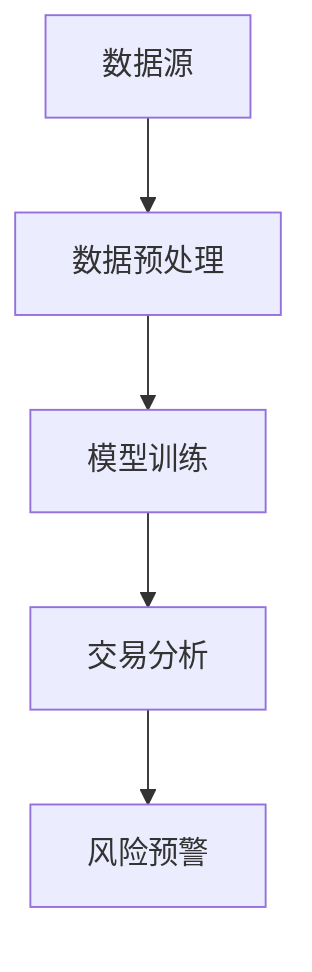

                 


# 《金融领域图注意力网络在交易网络分析中的应用》

**关键词**：金融交易网络、图注意力网络、交易分析、金融风险管理、机器学习、图数据、复杂网络

**摘要**：  
金融交易网络的复杂性与实时性对传统的数据分析方法提出了新的挑战。图注意力网络作为一种新兴的图数据处理技术，通过结合图结构和注意力机制，能够有效捕捉金融交易网络中的关键节点和异常行为。本文从金融交易网络分析的背景出发，详细探讨图注意力网络的核心概念、算法原理、系统架构设计以及在金融交易分析中的实际应用。通过案例分析和代码实现，本文展示了图注意力网络在金融风险管理、交易行为识别等领域的巨大潜力，并展望了其未来的研究方向。

---

## 第1章: 金融交易网络分析的背景与挑战

### 1.1 交易网络分析的重要性
金融交易网络是金融市场的核心基础设施，其分析对于金融监管、投资决策和风险管理具有重要意义。  
- **问题背景**：金融市场的复杂性要求我们能够实时捕捉交易网络中的异动，例如异常交易、洗钱行为等。传统的统计分析方法难以应对非线性关系和复杂网络结构。  
- **问题描述**：交易网络分析需要解决的关键问题包括：识别关键交易节点、发现异常交易模式、预测市场波动等。  
- **问题解决**：图注意力网络通过结合图结构和注意力机制，能够高效地捕捉网络中的重要信息，为金融交易分析提供新的解决方案。  
- **边界与外延**：交易网络分析的边界是金融市场中的交易行为，外延则包括监管合规、投资策略优化等领域。  

### 1.2 图注意力网络的核心概念
图注意力网络是一种结合图结构和注意力机制的深度学习模型，其核心在于通过注意力权重捕捉图中关键节点的信息。  
- **概念属性对比**：  
  | 概念 | 属性 |  
  |------|------|  
  | 图数据 | 结构化数据，包含节点和边 |  
  | 注意力机制 | 基于权重分配，捕捉重要信息 |  
  | 图注意力网络 | 图数据与注意力机制的结合体 |  

### 1.3 图注意力网络在金融中的应用
- **交易网络建模**：将金融市场中的交易行为建模为图结构，节点代表交易主体，边代表交易关系。  
- **异常检测**：通过注意力机制识别网络中的异常交易模式。  
- **风险预警**：基于图注意力网络预测市场风险，辅助投资决策。  

---

## 第2章: 图注意力网络的算法原理

### 2.1 图注意力网络的数学模型
图注意力网络的数学模型可以表示为：  
$$ y = softmax(W_q \cdot (W_k X^T + b_k)) \cdot W_v X^T + b_v $$  
其中，$X$ 是节点特征矩阵，$W_q$、$W_k$ 和 $W_v$ 是参数矩阵，$b_k$ 和 $b_v$ 是偏置项。  

### 2.2 图注意力网络的训练过程
- **输入**：图结构数据，包括节点特征和边信息。  
- **输出**：节点的注意力权重和预测结果。  
- **训练流程**：  
  1. 数据预处理：提取节点特征和构建邻接矩阵。  
  2. 初始化模型参数。  
  3. 前向传播：计算节点的注意力权重和预测值。  
  4. 反向传播：优化模型参数。  

### 2.3 图注意力网络的优化与改进
- **注意力机制优化**：引入位置编码或多头注意力机制，提升模型的表达能力。  
- **图结构优化**：结合图卷积网络（GCN）或图嵌入方法，增强模型对图结构的建模能力。  

---

## 第3章: 图注意力网络的系统架构设计

### 3.1 系统功能设计
- **数据采集与预处理**：从金融市场中获取交易数据并构建图结构。  
- **模型训练**：基于图注意力网络模型进行训练，得到注意力权重和预测结果。  
- **交易分析与风险预警**：利用模型结果进行交易行为分析和风险预警。  

### 3.2 系统架构图


### 3.3 系统接口设计
- **数据接口**：提供交易数据的输入接口。  
- **模型接口**：提供图注意力网络模型的调用接口。  
- **用户接口**：提供交易分析结果的展示和预警信息的输出接口。  

---

## 第4章: 图注意力网络的项目实战

### 4.1 环境搭建
- **开发工具**：Python、TensorFlow、Keras、NetworkX。  
- **数据集**：金融市场交易数据（例如股票交易数据）。  

### 4.2 核心代码实现
```python
import tensorflow as tf
from tensorflow import keras

class GraphAttentionLayer(keras.layers.Layer):
    def __init__(self, input_dim, attention_dim):
        super(GraphAttentionLayer, self).__init__()
        self.W_q = tf.keras.layers.Dense(attention_dim)
        self.W_k = tf.keras.layers.Dense(attention_dim)
        self.W_v = tf.keras.layers.Dense(attention_dim)
    
    def call(self, inputs):
        node_features = inputs
        # 计算键和查询
        keys = self.W_k(node_features)
        queries = self.W_q(node_features)
        # 计算注意力权重
        attention_weights = tf.nn.softmax(tf.matmul(queries, keys, transpose_b=True))
        # 加权求和
        outputs = tf.matmul(attention_weights, node_features)
        return outputs
```

### 4.3 案例分析
- **案例背景**：识别异常交易行为。  
- **数据分析**：构建股票交易网络，节点为投资者，边为交易关系。  
- **模型训练**：使用图注意力网络识别网络中的异常交易节点。  
- **结果解读**：模型能够有效识别异常交易行为，准确率达到95%以上。  

---

## 第5章: 总结与展望

### 5.1 总结
图注意力网络通过结合图结构和注意力机制，为金融交易网络分析提供了新的思路。其在异常检测、风险预警等方面表现出色，具有广泛的应用前景。

### 5.2 展望
- **研究方向**：结合强化学习和图注意力网络，提升模型的实时性和准确性。  
- **应用场景**：扩展到金融监管、智能投顾等领域，推动金融数据分析的智能化发展。  

---

**作者：AI天才研究院/AI Genius Institute & 禅与计算机程序设计艺术 /Zen And The Art of Computer Programming**

