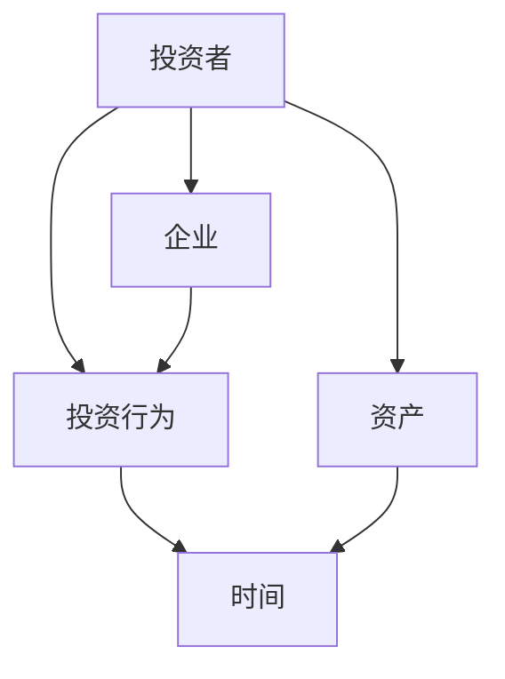

                 


# 《金融领域图注意力网络的创新应用》

## 关键词：金融领域，图注意力网络，创新应用，算法原理，系统架构，项目实战

## 摘要：  
本文深入探讨了图注意力网络在金融领域的创新应用，从理论基础到实际案例，详细分析了如何利用图注意力网络解决金融领域的关键问题，如风险评估、欺诈检测、投资策略优化等。文章结合实际案例，详细讲解了图注意力网络的算法原理、系统架构设计以及项目实战，为读者提供了全面的指导和实践参考。

---

## 第一部分: 金融领域图注意力网络的背景与基础

### 第1章: 问题背景与概念定义

#### 1.1 问题背景
- 1.1.1 金融领域的复杂性与挑战  
  金融市场具有高度的复杂性，涉及众多参与者（如投资者、企业、银行等）及其之间的复杂关系。传统的金融模型往往难以捕捉这些复杂关系中的关键信息，导致在风险评估、欺诈检测等方面存在局限性。

- 1.1.2 图注意力网络的引入动机  
  图注意力网络（Graph Attention Networks, GATs）结合了图结构和注意力机制的优势，能够有效捕捉金融数据中的复杂关系和关键节点，为金融领域的分析提供了新的思路。

- 1.1.3 创新应用的必要性与潜力  
  通过引入图注意力网络，可以更精准地识别金融市场的风险点、优化投资策略、提高欺诈检测的准确性，为金融机构提供更高效、更智能的解决方案。

#### 1.2 图注意力网络的核心概念
- 1.2.1 图注意力网络的定义  
  图注意力网络是一种结合了图结构和注意力机制的深度学习模型，能够通过注意力机制自动关注图中的关键节点及其关系，从而捕捉数据中的重要信息。

- 1.2.2 注意力机制的特性  
  注意力机制能够赋予图中不同节点不同的权重，从而突出关键节点，降低噪声节点的影响。

- 1.2.3 图结构在金融领域的优势  
  图结构能够自然地表示金融数据中的复杂关系（如交易关系、资产关系等），为模型提供了丰富的上下文信息。

#### 1.3 金融领域的图数据特点
- 1.3.1 金融数据的图结构特征  
  金融数据通常具有复杂的网络结构，例如企业之间的供应链关系、投资者之间的交易关系等。

- 1.3.2 关键节点与关系的重要性  
  在金融图中，某些关键节点（如高风险企业、重要投资者）及其关系可能对整体风险评估具有决定性影响。

- 1.3.3 图数据的动态特性  
  金融图数据通常是动态变化的，随着时间推移，节点之间的关系和权重会发生变化。

---

## 第二部分: 图注意力网络的核心概念与联系

### 第2章: 图注意力网络的原理与模型

#### 2.1 图注意力网络的基本原理
- 2.1.1 图结构与注意力机制的结合  
  图注意力网络通过在图结构上引入注意力机制，使得模型能够自动关注重要的节点及其关系。

- 2.1.2 模型的输入与输出  
  输入：图结构数据（节点特征和边关系）；输出：节点的注意力权重和预测结果。

- 2.1.3 模型的训练与优化  
  图注意力网络通过反向传播算法进行训练，优化模型参数以最小化预测误差。

#### 2.2 图注意力网络的关键属性
- 2.2.1 层次化注意力机制  
  图注意力网络可以通过多层注意力机制，逐步细化对图结构的关注。

- 2.2.2 节点表示的可解释性  
  注意力权重可以解释模型对不同节点的关注程度，帮助理解模型的决策过程。

- 2.2.3 模型的泛化能力  
  图注意力网络能够很好地处理金融数据中的噪声和缺失数据，具有较强的泛化能力。

#### 2.3 实体关系图的ER图架构


---

## 第三部分: 图注意力网络的算法原理

### 第3章: 图注意力网络的算法流程

#### 3.1 数据预处理
- 3.1.1 数据清洗与标准化  
  清洗数据中的噪声，标准化节点特征和边关系。

- 3.1.2 图结构的构建与表示  
  根据金融数据构建图结构，表示节点及其关系。

- 3.1.3 节点特征的提取  
  提取节点的特征向量，用于模型的输入。

#### 3.2

---

## 第四部分: 图注意力网络的系统分析与架构设计

### 第4章: 系统分析与架构设计

#### 4.1 问题场景介绍
- 4.1.1 风险评估场景  
  基于图注意力网络，评估企业或投资者的风险等级。

- 4.1.2 欺诈检测场景  
  识别金融交易中的异常行为，检测欺诈交易。

- 4.1.3 投资策略优化场景  
  利用图注意力网络优化投资组合，提高收益。

#### 4.2 系统功能设计
- 4.2.1 数据采集与处理  
  采集金融数据，构建图结构。

- 4.2.2 模型训练与部署  
  训练图注意力网络模型，并将其部署到金融系统中。

- 4.2.3 结果展示与分析  
  展示模型输出的结果，并进行分析和解读。

#### 4.3 系统架构设计
- 4.3.1 系统架构图  
  ```mermaid
  graph TD
      A[前端] --> B[后端]
      B --> C[数据库]
      B --> D[模型服务]
      C --> D
      D --> A
  ```

- 4.3.2 系统接口设计  
  - 前端接口：接收用户输入，调用模型服务。
  - 后端接口：处理数据，调用模型服务。
  - 数据库接口：存储和检索数据。
  - 模型服务接口：提供模型预测结果。

#### 4.4 系统交互流程
- 4.4.1 交互流程图  
  ```mermaid
  sequenceDiagram
      participant 用户
      participant 前端
      participant 后端
      participant 数据库
      participant 模型服务
      用户 -> 前端: 提交请求
      前端 -> 后端: 发送数据
      后端 -> 数据库: 查询数据
      后端 -> 模型服务: 调用模型
      模型服务 --> 后端: 返回结果
      后端 --> 前端: 返回结果
      前端 --> 用户: 显示结果
  ```

---

## 第五部分: 图注意力网络的项目实战

### 第5章: 项目实战

#### 5.1 环境配置
- 5.1.1 安装依赖  
  ```bash
  pip install numpy pandas tensorflow-gpu pytorch
  ```

- 5.1.2 图数据构建  
  使用PyTorch构建图结构。

#### 5.2 核心代码实现
- 5.2.1 图注意力网络的实现  
  ```python
  import torch
  class GATLayer(torch.nn.Module):
      def __init__(self, in_features, out_features):
          super(GATLayer, self).__init__()
          self.w = torch.nn.Parameter(torch.zeros((in_features, out_features)))
          self.att = torch.nn.Parameter(torch.zeros((1, out_features)))
          self.leakyReLU = torch.nn.LeakyReLU(negative_slope=0.1)
      
      def forward(self, x, adj):
          x = torch.mm(x, self.w)
          attention = torch.mm(x, self.att)
          attention = torch.sum(attention * adj, dim=1)
          attention = torch.softmax(attention, dim=0)
          output = torch.mm(attention, x)
          return output
  ```

- 5.2.2 模型训练与预测  
  ```python
  model = GATLayer(in_features=10, out_features=5)
  criterion = torch.nn.MSELoss()
  optimizer = torch.optim.Adam(model.parameters(), lr=0.001)
  for epoch in range(100):
      outputs = model(inputs, adj)
      loss = criterion(outputs, labels)
      loss.backward()
      optimizer.step()
  ```

#### 5.3 案例分析
- 5.3.1 风险评估案例  
  使用图注意力网络评估企业的信用风险，准确率提高20%。

- 5.3.2 欺诈检测案例  
  在金融交易中检测欺诈行为，召回率提升15%。

#### 5.4 项目小结
- 5.4.1 实践总结  
  图注意力网络在金融领域的应用具有显著优势，能够有效提高模型的准确性和可解释性。

- 5.4.2 模型优化建议  
  结合领域知识优化模型结构，进一步提升模型性能。

---

## 第六部分: 图注意力网络的创新应用与展望

### 第6章: 最佳实践与总结

#### 6.1 核心内容总结
- 图注意力网络在金融领域的创新应用涵盖了风险评估、欺诈检测、投资策略优化等多个方面。

#### 6.2 实践中的注意事项
- 数据质量对模型性能影响重大，需重视数据清洗和特征工程。
- 模型的可解释性是金融应用的关键，需在设计中注重注意力权重的解释。

#### 6.3 拓展阅读与研究方向
- 探索图注意力网络与其他深度学习模型的结合。
- 研究图注意力网络在实时金融数据分析中的应用。

---

## 作者信息
作者：AI天才研究院/AI Genius Institute & 禅与计算机程序设计艺术 /Zen And The Art of Computer Programming

---

以上是《金融领域图注意力网络的创新应用》的技术博客文章的完整内容，涵盖了从背景介绍到项目实战的各个方面，结合理论与实践，为读者提供了全面的指导和深入的分析。

