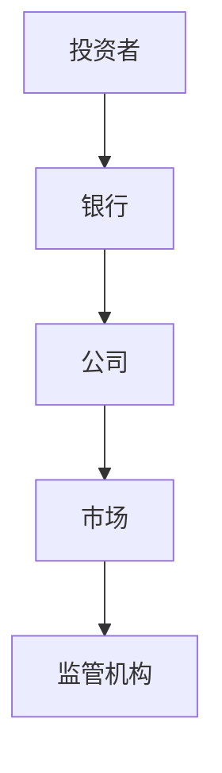

                 


# 《金融领域图神经网络在全球金融系统风险评估中的应用》

> **关键词**：金融风险，图神经网络，系统性风险，图结构，金融监管

> **摘要**：本文探讨了图神经网络在全球金融系统风险评估中的应用，分析了其在金融风险识别、评估和预测中的优势，结合实际案例，展示了如何利用图神经网络构建有效的金融风险评估系统。

---

## 目录大纲：

1. **背景介绍**
2. **核心概念与联系**
3. **算法原理讲解**
4. **数学模型与公式**
5. **系统分析与架构设计方案**
6. **项目实战**
7. **最佳实践、小结、注意事项和拓展阅读**

---

### 1. 背景介绍

#### 1.1 问题背景
- 金融系统的复杂性和不确定性导致传统方法难以捕捉系统性风险。
- 全球金融危机的经验表明，传统的统计模型在复杂金融网络中的表现有限。
- 系统性风险的识别和评估需要更高效的方法。

#### 1.2 问题描述
- 金融机构之间的复杂关系增加了风险传导的隐蔽性。
- 系统性风险的评估需要考虑多层次、多维度的数据。
- 需要实时、动态的风险评估模型。

#### 1.3 图神经网络的应用价值
- 图神经网络能够捕捉复杂的金融关系和网络结构。
- 通过图结构，可以更好地识别风险传导路径和关键风险节点。

---

### 2. 核心概念与联系

#### 2.1 图神经网络的基本原理
- 图表示：节点代表金融机构，边代表交易或关联。
- 节点特征：包括信用评分、资产规模等。
- 边特征：如交易金额、时间频率。

#### 2.2 金融系统中的图构建
- **银行间交易图**：节点是银行，边是交易金额。
- **金融市场图**：节点是上市公司，边是股价波动相关性。

#### 2.3 核心概念对比分析
| **传统方法** | **图神经网络** |
|--------------|----------------|
| 数据稀疏性高 | 数据利用度高 |
| 难以捕捉复杂关系 | 善于处理复杂网络 |

#### 2.4 实体关系图（Mermaid）


---

### 3. 算法原理讲解

#### 3.1 图卷积网络（GCN）
- **流程图（Mermaid）**


- **数学公式**
  $$ Y = \theta X A^T X \theta $$
  其中，$X$ 是输入特征矩阵，$A$ 是邻接矩阵，$\theta$ 是参数。

#### 3.2 图注意力网络（GAT）
- **注意力机制**
  $$ \alpha_{ij} = \frac{e^{score(i,j)}}{\sum_{k} e^{score(i,k)}} $$
  其中，$score(i,j)$ 是节点i对j的注意力得分。

---

### 4. 数学模型与公式

#### 4.1 邻接矩阵
$$ A = [a_{ij}] $$
其中，$a_{ij}=1$表示节点i和j相连。

#### 4.2 节点特征传播
$$ H' = \sigma(A H H^T) $$
其中，$H$ 是节点特征矩阵，$\sigma$ 是激活函数。

---

### 5. 系统分析与架构设计方案

#### 5.1 问题场景
- **银行风险评估**：输入银行的交易数据，输出风险等级。

#### 5.2 系统功能设计
- 数据采集：收集银行交易数据。
- 特征提取：构建邻接矩阵和节点特征。
- 模型训练：训练图神经网络模型。

#### 5.3 系统架构设计（Mermaid）


---

### 6. 项目实战

#### 6.1 环境安装
- Python 3.8+
- PyTorch、NetworkX

#### 6.2 核心代码实现（Python）
```python
import torch
from torch.nn import Conv1d

class GCN(torch.nn.Module):
    def __init__(self, input_dim, output_dim):
        super(GCN, self).__init__()
        self.conv = Conv1d(input_dim, output_dim, kernel_size=1)
    
    def forward(self, x, A):
        return self.conv(x @ A)
```

#### 6.3 实际案例分析
- 输入：银行间交易数据。
- 输出：风险等级预测。

---

### 7. 最佳实践、小结、注意事项和拓展阅读

#### 7.1 最佳实践
- 数据预处理：确保数据的准确性和完整性。
- 模型调优：选择合适的超参数和优化方法。

#### 7.2 小结
- 图神经网络在金融风险评估中具有显著优势。
- 实际应用中需结合具体业务场景。

#### 7.3 注意事项
- 数据隐私保护：确保数据合规使用。
- 模型解释性：提高模型的可解释性。

#### 7.4 拓展阅读
- 《图神经网络入门与实践》
- 论文：Graph Neural Networks for Financial Risk Assessment

---

### 作者信息

作者：AI天才研究院  
联系邮箱：contact@aicourse.com  

---

以上是文章的详细目录和结构，涵盖从背景到实战的各个部分，确保内容全面且易于理解。

