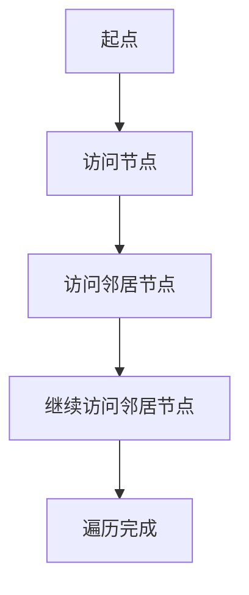
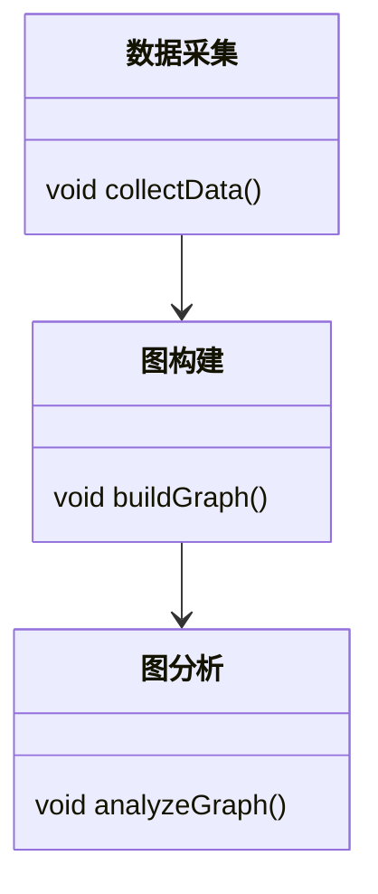
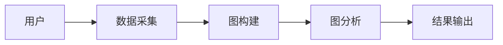

                 


# 《金融领域图计算技术的创新应用》

## 关键词：图计算、金融应用、算法原理、系统架构、数学模型

## 摘要：  
图计算技术作为一种新兴的计算范式，正在金融领域掀起一场技术革命。通过对金融数据的图结构建模，图计算能够揭示传统方法难以发现的复杂关系，为金融风险控制、欺诈检测、信用评估等场景提供全新的解决方案。本文将深入探讨图计算的核心概念、算法原理、数学模型以及在金融领域的创新应用，结合实际案例，分析图计算技术的优势与挑战，并展望其未来的发展方向。

---

## 第1章 图计算技术概述

### 1.1 图计算的基本概念

图计算是一种基于图结构的数据处理方法，其核心是将数据表示为图中的节点和边。图中的节点代表实体（如人、机构、交易等），边则表示实体之间的关系（如交易、转账、关联等）。与传统的线性数据结构（如数组、链表）不同，图计算能够更好地处理复杂的关系网络。

#### 1.1.1 图计算的定义与特点  
- **定义**：图计算是以图数据为研究对象，通过图遍历、图查询等操作，分析图中节点和边的关系。  
- **特点**：  
  - **非线性关系**：图计算能够处理复杂的非线性关系，适合金融领域的关联分析。  
  - **实时性**：图计算支持实时数据处理，适用于金融交易中的实时欺诈检测。  
  - **高效性**：通过并行计算和分布式处理，图计算能够高效处理海量数据。  

#### 1.1.2 图计算与传统计算的区别  
- **数据结构**：传统计算基于数组、链表等线性结构，而图计算基于图结构。  
- **处理逻辑**：传统计算注重顺序性，图计算注重关系性。  
- **应用场景**：传统计算适用于简单查询，图计算适用于复杂关系分析。  

#### 1.1.3 图计算在金融领域的应用前景  
- **金融风险管理**：通过图计算识别关联的金融风险节点。  
- **欺诈检测**：发现异常交易网络中的欺诈行为。  
- **信用评估**：分析个人或机构之间的信用关联关系。  

---

### 1.2 图计算技术的发展历程

#### 1.2.1 图计算技术的起源与演变  
图计算技术起源于20世纪60年代的图论研究，早期主要用于社交网络分析和计算机科学领域。随着大数据技术的发展，图计算逐渐应用于金融、医疗、交通等领域。  

#### 1.2.2 图计算技术在金融领域的应用现状  
- **社交网络分析**：识别金融市场的社交网络结构。  
- **欺诈检测**：通过图计算发现异常交易模式。  
- **风险管理**：构建金融风险传播网络，评估风险影响范围。  

#### 1.2.3 图计算技术的未来发展趋势  
- **分布式图计算**：随着数据量的增大，分布式图计算将成为主流。  
- **图神经网络**：结合深度学习，图神经网络（Graph Neural Networks，GNN）将推动图计算的智能化发展。  
- **实时图计算**：实时处理金融交易数据，支持低延迟的金融应用。  

---

### 1.3 图计算技术的核心概念

#### 1.3.1 图的表示与存储  
图的表示方式直接影响图计算的效率。常见的图表示方式包括：  
- **邻接矩阵**：适合密集图，空间复杂度为$O(N^2)$。  
- **邻接列表**：适合稀疏图，空间复杂度为$O(N + E)$。  

#### 1.3.2 图的遍历算法  
图的遍历是图计算的基础操作，常见的遍历算法包括：  
- **广度优先搜索（BFS）**：逐层扩展，适用于发现最短路径。  
- **深度优先搜索（DFS）**：递归遍历，适用于发现连通分量。  

#### 1.3.3 图的查询与分析  
图的查询与分析是图计算的核心任务，包括：  
- **子图查询**：在图中查找特定模式。  
- **图模式匹配**：识别图中的特定结构。  

---

## 第2章 金融领域图计算技术的核心概念与联系

### 2.1 图计算技术的核心原理

#### 2.1.1 图的实体关系图  
金融领域的图计算通常涉及多个实体，例如：  
- 个人：客户、投资者。  
- 机构：银行、企业。  
- 交易：转账、支付。  

通过图的实体关系图，可以清晰地表示这些实体之间的关系。  

**示例**：  
- 客户A向客户B转账，节点A和B之间有一条边，表示转账关系。  

#### 2.1.2 图的属性特征对比  
图的属性特征是图计算的重要依据，常见的属性特征包括：  
- **节点属性**：节点的类型、标签。  
- **边属性**：边的权重、方向。  

#### 2.1.3 图的ER实体关系图架构  

**ER实体关系图**：  
```mermaid
er
actor:
    - 客户
    - 银行
    - 交易
    - 风险
```

---

### 2.2 图计算技术的核心概念与联系

#### 2.2.1 图的遍历算法  
图的遍历算法是图计算的核心，BFS和DFS是常用的遍历算法。  

**BFS算法流程图**：  


---

## 第3章 图计算技术的算法原理与实现

### 3.1 图计算技术的核心算法

#### 3.1.1 BFS算法  
BFS算法用于遍历图中的所有节点，适用于发现最短路径。  

**BFS算法流程图**：  
```mermaid
graph TD
    start --> queue.en(起点)
    while queue not empty --> node = queue.deque()
    --> if node未访问 --> mark node为已访问
    --> for each neighbor of node --> queue.en(neighbor)
    --> end
    --> end
```

#### 3.1.2 DFS算法  
DFS算法用于深度遍历图中的节点，适用于发现连通分量。  

**DFS算法流程图**：  
```mermaid
graph TD
    start --> stack.push(起点)
    while stack not empty --> node = stack.pop()
    --> if node未访问 --> mark node为已访问
    --> for each neighbor of node --> stack.push(neighbor)
    --> end
    --> end
```

#### 3.1.3 PageRank算法  
PageRank算法用于评估网页的重要性，适用于图中的节点权重计算。  

**PageRank算法公式**：  
$$ PR(i) = \sum_{j \in In(i)} \frac{PR(j)}{OutDegree(j)} $$  

---

### 3.2 图计算算法的实现

#### 3.2.1 BFS算法的实现  
```python
def bfs(graph, start_node):
    visited = set()
    queue = [start_node]
    visited.add(start_node)
    while queue:
        node = queue.pop(0)
        for neighbor in graph[node]:
            if neighbor not in visited:
                visited.add(neighbor)
                queue.append(neighbor)
    return visited
```

#### 3.2.2 DFS算法的实现  
```python
def dfs(graph, start_node, visited=None):
    if visited is None:
        visited = set()
    visited.add(start_node)
    for neighbor in graph[start_node]:
        if neighbor not in visited:
            dfs(graph, neighbor, visited)
    return visited
```

---

## 第4章 图计算技术的数学模型与公式

### 4.1 图计算技术的数学模型

#### 4.1.1 图的邻接矩阵表示  
邻接矩阵是一种常用的图表示方法，适用于密集图。  

**邻接矩阵公式**：  
$$ A[i][j] = 1 \text{ 如果节点i和节点j相连，否则0} $$  

#### 4.1.2 图的邻接列表表示  
邻接列表是一种常用的图表示方法，适用于稀疏图。  

**邻接列表公式**：  
$$ \text{每个节点i的邻接列表为} L_i = \{j | A[i][j] = 1\} $$  

---

## 第5章 系统分析与架构设计方案

### 5.1 问题场景介绍  
以金融领域的欺诈检测为例，我们需要构建一个图计算系统，实时检测异常交易行为。

---

### 5.2 项目介绍

#### 5.2.1 系统功能设计  
- **数据采集**：收集金融交易数据。  
- **图构建**：将交易数据转换为图结构。  
- **图分析**：通过图计算算法发现异常交易模式。  

**系统功能设计类图**：  


---

### 5.3 系统架构设计

#### 5.3.1 系统架构图  


---

## 第6章 项目实战

### 6.1 环境安装  
- **Python**：安装Python 3.8及以上版本。  
- **图计算库**：安装`networkx`和`pygraphviz`。  

### 6.2 系统核心实现源代码  

#### 6.2.1 数据采集  
```python
import networkx as nx

def collect_data():
    data = {
        '客户': ['A', 'B', 'C'],
        '交易': ['tx1', 'tx2', 'tx3']
    }
    return data
```

#### 6.2.2 图构建  
```python
def build_graph(data):
    graph = nx.Graph()
    for tx in data['交易']:
        graph.add_edge(data['客户'][0], data['客户'][1], label=tx)
    return graph
```

---

## 第7章 总结与展望

### 7.1 本章总结  
图计算技术为金融领域的复杂关系分析提供了强大的工具。通过图计算，我们可以更好地理解金融数据中的关联关系，从而提高金融风险控制和欺诈检测的效率。

### 7.2 未来展望  
随着图神经网络的发展，图计算技术将更加智能化。未来的金融图计算将结合深度学习技术，进一步提升金融分析的精度和效率。

---

## 作者：AI天才研究院/AI Genius Institute & 禅与计算机程序设计艺术 /Zen And The Art of Computer Programming  

---

这篇文章通过系统地介绍图计算技术的核心概念、算法原理、数学模型以及在金融领域的创新应用，结合实际案例和代码示例，为读者提供了全面而深入的技术解析。希望读者通过本文能够掌握图计算技术的基本原理，并将其应用到实际的金融场景中。

