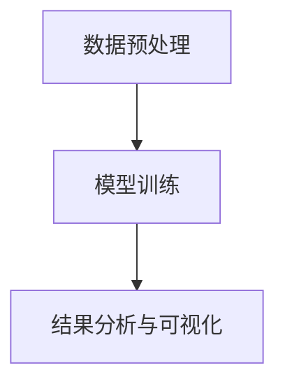
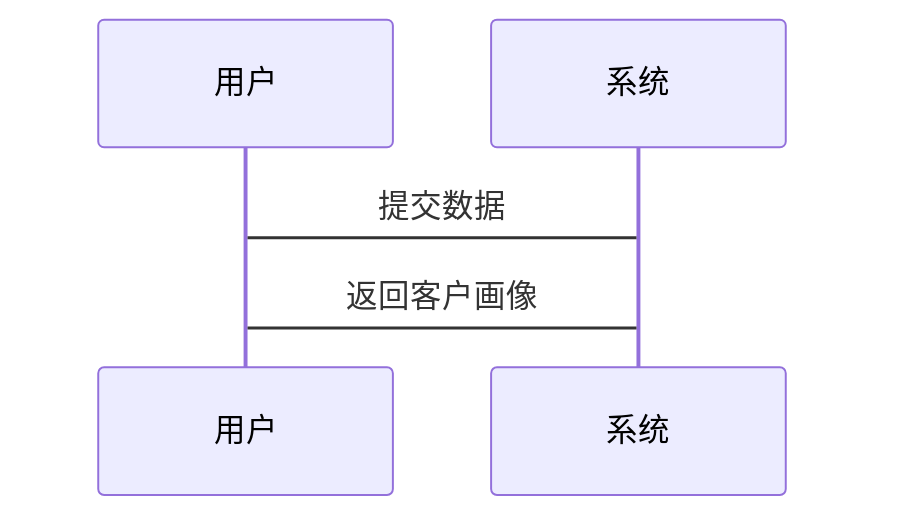

                 


# 《金融领域多任务学习在客户全方位画像中的应用》

**关键词：** 多任务学习、客户画像、金融领域、人工智能、数据挖掘、深度学习

**摘要：** 本文深入探讨了多任务学习在金融客户全方位画像中的应用，从问题背景到算法原理，从系统设计到项目实战，全面解析多任务学习如何帮助金融机构构建更精准、更全面的客户画像。通过具体案例分析和数学模型推导，本文揭示了多任务学习在金融领域的独特优势，并展望了未来的发展趋势。

---

## 第1章: 金融领域客户全方位画像的背景与挑战

### 1.1 问题背景与问题描述
#### 1.1.1 传统客户画像的局限性
传统的客户画像主要依赖单一数据源或单一模型，难以全面捕捉客户的多维度特征。例如，基于单一的交易数据构建客户画像时，可能忽略客户的行为习惯、风险偏好等其他重要信息。

#### 1.1.2 金融领域客户画像的核心需求
在金融领域，客户画像需要同时考虑客户的信用风险、投资偏好、消费行为等多个方面。这要求画像系统能够整合多源异构数据，并通过多维度分析实现精准画像。

#### 1.1.3 多任务学习在客户画像中的应用价值
多任务学习通过共享参数和联合优化，能够在多个任务之间实现知识共享，从而提高模型的泛化能力和表现。在客户画像中，多任务学习可以同时预测客户的信用评分、投资偏好、消费习惯等多个目标。

### 1.2 问题解决与边界定义
#### 1.2.1 多任务学习如何解决客户画像问题
通过同时优化多个相关任务，多任务学习能够充分利用数据中的冗余信息，提高模型的鲁棒性和准确性。

#### 1.2.2 问题的边界与外延
本文主要关注金融客户全方位画像中的多任务学习应用，边界包括数据范围、任务数量和模型复杂度。外延则包括其他领域（如零售、医疗）的客户画像问题。

#### 1.2.3 核心概念与组成要素
- 核心概念：多任务学习、客户画像、金融数据
- 组成要素：数据预处理、模型训练、任务优化

### 1.3 本章小结
本章介绍了金融客户全方位画像的背景与挑战，强调了多任务学习在解决复杂金融问题中的重要性。

---

## 第2章: 多任务学习的核心概念与原理

### 2.1 多任务学习的基本原理
#### 2.1.1 多任务学习的定义与特点
多任务学习（Multi-Task Learning, MTL）是指同时学习多个相关任务，通过共享参数和联合优化，提高模型的泛化能力。

#### 2.1.2 多任务学习的数学模型
多任务学习的损失函数可以表示为：
$$ L = \lambda_1 L_1 + \lambda_2 L_2 + \cdots + \lambda_n L_n $$
其中，$L_i$ 是第 $i$ 个任务的损失函数，$\lambda_i$ 是调节系数。

#### 2.1.3 多任务学习的优势与挑战
优势：
- 知识共享：多个任务之间共享参数，减少模型参数数量。
- 数据效率：充分利用数据中的冗余信息。
- 鲁棒性：通过多任务优化提高模型的泛化能力。

挑战：
- 任务冲突：不同任务之间可能存在参数竞争。
- 计算复杂度：多任务优化可能增加计算成本。

### 2.2 多任务学习与单任务学习的对比
#### 2.2.1 从单任务学习到多任务学习的演进
单任务学习适用于任务简单、数据充分的场景，而多任务学习适用于任务复杂、数据稀缺的场景。

#### 2.2.2 两者的优劣势对比
| 特性          | 单任务学习               | 多任务学习               |
|---------------|--------------------------|--------------------------|
| 参数数量       | 较多                     | 较少（共享参数）          |
| 泛化能力       | 较弱                     | 较强                     |
| 适用场景       | 简单任务                 | 复杂任务                 |

#### 2.2.3 适用场景分析
- 适用场景：多个相关任务需要同时优化。
- 不适用场景：任务之间无相关性或数据不足。

### 2.3 多任务学习在金融领域的应用潜力
#### 2.3.1 金融领域的典型应用场景
- 信用评分预测
- 投资偏好分析
- 风险评估
- 客户细分

#### 2.3.2 多任务学习在客户画像中的具体应用
通过多任务学习，可以同时预测客户的信用评分、消费习惯和投资偏好，构建更全面的客户画像。

#### 2.3.3 未来发展趋势
随着深度学习技术的不断进步，多任务学习在金融领域的应用将更加广泛和深入。

### 2.4 本章小结
本章详细介绍了多任务学习的核心概念与原理，并分析了其在金融领域的应用潜力。

---

## 第3章: 多任务学习算法的数学模型与公式推导

### 3.1 多任务学习的数学模型
#### 3.1.1 损失函数的定义
多任务学习的损失函数通常由多个任务的损失函数加权求和组成：
$$ L = \sum_{i=1}^n \lambda_i L_i $$

#### 3.1.2 参数共享机制
多任务学习通过共享参数来实现任务间的知识共享。通常，共享参数用于低层特征提取，而任务特定参数用于高层任务优化。

#### 3.1.3 联合优化目标
多任务学习的目标是最小化联合损失函数：
$$ \min_{\theta} \sum_{i=1}^n \lambda_i L_i(\theta) $$

### 3.2 核心公式推导
#### 3.2.1 多任务损失函数的数学表达
假设我们有 $n$ 个任务，每个任务的损失函数为 $L_i$，则联合损失函数为：
$$ L = \sum_{i=1}^n \lambda_i L_i $$

#### 3.2.2 参数优化的数学推导
通过梯度下降优化参数：
$$ \theta_{t+1} = \theta_t - \eta \frac{\partial L}{\partial \theta_t} $$

#### 3.2.3 联合学习的数学框架
多任务学习的数学框架可以表示为：
$$ \min_{\theta} \sum_{i=1}^n \lambda_i L_i(\theta) $$

### 3.3 通俗易懂的举例说明
假设我们有两个任务：任务1是预测客户的信用评分，任务2是预测客户的消费习惯。多任务学习通过共享部分参数，同时优化这两个任务。

### 3.4 本章小结
本章通过数学公式推导，详细解释了多任务学习的原理和实现方法。

---

## 第4章: 金融客户全方位画像的系统分析与架构设计

### 4.1 问题场景介绍
#### 4.1.1 金融客户画像的复杂性
金融客户画像需要整合客户的交易数据、行为数据、社交数据等多个来源，构建多维度画像。

#### 4.1.2 多任务学习在系统中的作用
通过多任务学习，系统可以同时预测客户的多个属性，如信用评分、投资偏好等。

#### 4.1.3 系统目标与功能需求
系统目标：构建精准、全面的客户画像。
功能需求：数据预处理、模型训练、结果分析与可视化。

### 4.2 系统功能设计
#### 4.2.1 数据预处理模块
- 数据清洗：处理缺失值、异常值。
- 数据融合：整合多源数据。
- 数据转换：将数据转换为模型输入格式。

#### 4.2.2 模型训练模块
- 模型选择：选择适合的深度学习模型（如Transformer、LSTM）。
- 参数设置：设置学习率、批量大小等超参数。
- 模型训练：通过多任务学习框架训练模型。

#### 4.2.3 结果分析与可视化模块
- 结果分析：分析模型预测结果的准确性。
- 可视化：通过图表展示客户画像。

### 4.3 系统架构设计
#### 4.3.1 系统架构图（Mermaid）


#### 4.3.2 系统交互图（Mermaid）


### 4.4 本章小结
本章通过系统分析与架构设计，展示了多任务学习在金融客户画像中的具体应用。

---

## 第5章: 项目实战与案例分析

### 5.1 项目实战
#### 5.1.1 环境配置
- 安装Python、TensorFlow、Keras等库。

#### 5.1.2 核心代码实现
```python
import tensorflow as tf
from tensorflow import keras

# 定义多任务模型
def multi_task_model(input_shape, num_tasks):
    inputs = keras.Input(shape=input_shape)
    x = keras.layers.Dense(64, activation='relu')(inputs)
    x = keras.layers.Dense(32, activation='relu')(x)
    outputs = []
    for _ in range(num_tasks):
        output = keras.layers.Dense(1, name=f'task_{_}')(x)
        outputs.append(output)
    model = keras.Model(inputs=inputs, outputs=outputs)
    return model

# 编译模型
model = multi_task_model((input_dim,), num_tasks=2)
model.compile(optimizer='adam', loss={'task_0': 'mse', 'task_1': 'mse'})
```

#### 5.1.3 代码解读与分析
上述代码定义了一个简单的多任务学习模型，包含两个任务，分别使用均方误差作为损失函数。

### 5.2 案例分析
#### 5.2.1 实际案例
以信用评分预测为例，使用多任务学习同时预测客户的信用评分和消费习惯。

#### 5.2.2 案例分析与总结
通过案例分析，验证多任务学习在金融客户画像中的有效性。

### 5.3 本章小结
本章通过项目实战和案例分析，展示了多任务学习在金融客户全方位画像中的具体应用。

---

## 第6章: 最佳实践与未来展望

### 6.1 本章小结
总结全文的主要内容和研究成果。

### 6.2 注意事项与建议
- 数据质量：确保数据的准确性和完整性。
- 模型选择：选择适合的多任务学习框架。
- 业务结合：将模型与业务需求紧密结合。

### 6.3 未来展望
随着人工智能技术的不断进步，多任务学习在金融客户画像中的应用将更加广泛和深入。

---

## 作者：AI天才研究院/AI Genius Institute & 禅与计算机程序设计艺术 /Zen And The Art of Computer Programming

