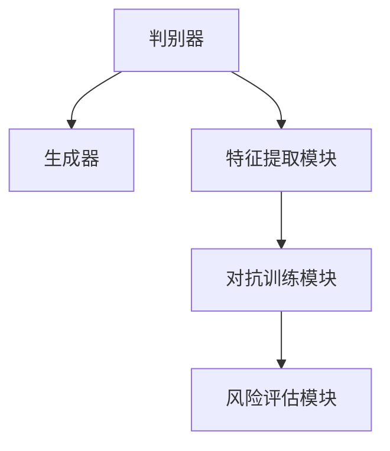

                 


# 《金融领域对抗学习在风险模型鲁棒性增强中的应用》

> 关键词：对抗学习、金融风险模型、鲁棒性增强、生成对抗网络、金融数据安全

> 摘要：  
本文探讨了对抗学习在金融领域风险模型中的应用，重点分析了如何通过对抗学习增强模型的鲁棒性。文章从对抗学习的基本原理出发，结合金融领域的特殊需求，详细阐述了对抗学习在金融风险建模中的优势与挑战，并通过实际案例分析展示了对抗学习在信用评估、欺诈检测等场景中的应用效果。最后，本文提出了增强金融风险模型鲁棒性的具体策略和未来研究方向。

---

## 第1章: 对抗学习与金融风险模型的背景

### 1.1 对抗学习的基本概念

#### 1.1.1 对抗学习的定义与核心原理
对抗学习是一种机器学习技术，通过两个或多个模型（通常是生成器和判别器）之间的对抗过程来优化模型性能。生成器的目标是生成与真实数据相似的样本，而判别器的目标是区分真实数据和生成数据。通过不断迭代，生成器和判别器的能力都会得到提升。

在金融领域，对抗学习的核心思想可以用于增强风险模型的鲁棒性。例如，在信用评估中，生成器可以生成潜在的违约样本，判别器则可以识别这些样本，从而帮助模型更好地识别潜在的违约风险。

#### 1.1.2 金融风险模型的特殊性
金融风险模型通常需要处理以下特点的数据：
- **稀疏性**：某些金融数据（如某些资产的价格）可能在某些时间段内缺失。
- **时序性**：金融数据通常具有很强的时间依赖性。
- **噪声干扰**：金融数据中可能存在大量的噪声，例如市场操纵、虚假交易等。

#### 1.1.3 对抗学习在金融领域的应用潜力
对抗学习在金融领域的应用潜力主要体现在以下几个方面：
- **增强模型鲁棒性**：通过对抗训练，模型能够更好地抵抗噪声干扰和对抗攻击。
- **生成合成数据**：利用生成器生成更多的高质量数据，从而解决金融数据稀缺性问题。
- **检测异常交易**：通过对抗学习，模型可以识别出异常交易行为，从而降低金融风险。

### 1.2 金融风险模型的鲁棒性挑战

#### 1.2.1 金融风险模型的构成
金融风险模型通常包括以下几个部分：
- **数据输入**：包括市场数据、交易数据、客户数据等。
- **特征提取**：从原始数据中提取有用的特征，例如市场波动率、客户信用评分等。
- **模型训练**：使用机器学习算法对特征进行训练，得到风险预测模型。
- **风险评估**：根据模型输出结果，评估客户或交易的风险等级。

#### 1.2.2 对抗攻击对金融模型的影响
在金融领域，对抗攻击可能通过以下方式影响风险模型：
- **输入干扰**：攻击者可以通过修改输入数据，使得模型产生错误的预测结果。
- **模型欺骗**：攻击者可以通过生成对抗样本，使得模型对某些特定输入做出错误的预测。
- **隐私泄露**：对抗学习可能通过生成器泄露敏感数据。

#### 1.2.3 增强模型鲁棒性的必要性
增强金融风险模型的鲁棒性具有重要意义：
- **保护客户隐私**：通过增强模型鲁棒性，可以防止模型被攻击者利用来获取敏感数据。
- **降低金融风险**：通过对抗训练，模型能够更好地识别潜在风险，从而降低金融损失。
- **提升模型可信度**：增强模型的鲁棒性可以提升模型的可信度，从而更好地应用于金融决策。

---

## 第2章: 对抗学习的核心概念与算法原理

### 2.1 对抗学习的理论基础

#### 2.1.1 对抗学习的基本框架
对抗学习的基本框架包括两个主要部分：
1. **生成器（Generator）**：生成与真实数据相似的样本。
2. **判别器（Discriminator）**：区分真实数据和生成数据。

通过对抗训练，生成器和判别器的能力都会不断提升，最终达到纳什均衡。

#### 2.1.2 对抗训练的数学模型
对抗训练的目标函数可以表示为：
$$ \min_{G} \max_{D} \mathbb{E}_{x \sim p_{\text{data}}} [\log D(x)] + \mathbb{E}_{z \sim p_z} [\log (1 - D(G(z)))] $$

其中：
- $G$ 是生成器。
- $D$ 是判别器。
- $p_{\text{data}}$ 是真实数据的分布。
- $p_z$ 是生成器的输入噪声分布。

### 2.2 对抗学习的关键技术

#### 2.2.1 对抗训练的优化方法
对抗训练的优化通常采用交替优化策略：
1. 先优化判别器，使得判别器能够准确区分真实数据和生成数据。
2. 再优化生成器，使得生成器生成的样本能够欺骗判别器。

常用的优化方法包括梯度下降和Adam优化器。

#### 2.2.2 对抗学习的变体
对抗学习的变体包括：
- **条件对抗网络（GANs）**：在生成器和判别器中引入条件，使得生成样本与给定的条件相关联。
- **深度对抗网络（DANs）**：通过多层判别器和生成器来提升模型的表达能力。
- **对抗样本生成**：通过对抗训练生成高质量的对抗样本。

### 2.3 对抗学习的金融应用

#### 2.3.1 金融数据的对抗性增强
通过对抗学习，可以生成与真实数据相似的合成数据，从而增强模型的鲁棒性。例如，在信用评估中，生成器可以生成更多的违约样本，帮助模型更好地识别潜在违约风险。

#### 2.3.2 对抗学习在欺诈检测中的应用
欺诈检测是金融领域的重要任务。通过对抗学习，可以训练出更 robust 的欺诈检测模型，从而更好地识别潜在的欺诈行为。

---

## 第3章: 对抗学习在金融风险模型中的应用

### 3.1 金融风险模型的对抗性威胁

#### 3.1.1 对抗攻击的金融应用场景
对抗攻击在金融领域的应用场景包括：
- **信用评估**：攻击者可以通过修改客户数据，使得模型误判客户信用等级。
- **交易策略**：攻击者可以通过生成对抗样本，使得交易策略失效。
- **市场操纵**：攻击者可以通过对抗样本干扰市场数据，影响模型的预测结果。

#### 3.1.2 对抗攻击对金融模型的影响
对抗攻击可能导致以下问题：
- **模型误判**：模型可能对某些输入做出错误的预测。
- **数据泄露**：攻击者可以通过对抗样本获取模型的敏感信息。
- **金融损失**：对抗攻击可能导致模型误判，从而引发金融损失。

### 3.2 对抗学习增强金融模型鲁棒性的策略

#### 3.2.1 对抗训练的鲁棒性增强方法
通过对抗训练，模型可以更好地抵抗对抗攻击。具体方法包括：
- **交替优化**：交替优化生成器和判别器，使得模型的鲁棒性不断提升。
- **正则化**：在损失函数中加入正则化项，使得模型对噪声干扰具有更强的鲁棒性。

#### 3.2.2 对抗学习在金融模型中的具体应用
对抗学习在金融模型中的具体应用包括：
- **信用评估**：通过对抗训练，模型可以更好地识别潜在违约风险。
- **欺诈检测**：通过对抗学习，模型可以更好地识别欺诈交易。
- **市场预测**：通过对抗学习，模型可以更好地预测市场波动。

### 3.3 对抗学习的挑战与未来研究方向

#### 3.3.1 对抗学习在金融领域的挑战
对抗学习在金融领域的应用面临以下挑战：
- **数据稀缺性**：金融数据通常较为稀缺，对抗训练可能需要大量数据。
- **模型复杂性**：对抗训练通常需要复杂的模型架构，可能增加计算成本。
- **对抗攻击的动态性**：攻击者可能不断更新对抗策略，使得模型需要不断进行对抗训练。

#### 3.3.2 未来研究方向
未来研究方向包括：
- **多目标对抗学习**：在金融领域，可能需要同时考虑多个对抗目标。
- **鲁棒性增强的优化方法**：研究更高效的优化方法，使得模型的鲁棒性更强。
- **对抗学习与强化学习的结合**：探索对抗学习与强化学习的结合，提升模型的鲁棒性和适应性。

---

## 第4章: 对抗学习的系统架构与实现

### 4.1 系统架构设计

#### 4.1.1 系统功能模块
系统功能模块包括：
1. **数据输入模块**：接收金融数据。
2. **特征提取模块**：从数据中提取特征。
3. **对抗训练模块**：进行对抗训练。
4. **风险评估模块**：输出风险评估结果。

#### 4.1.2 系统架构图
以下是系统架构的 mermaid 图：


---

## 第5章: 项目实战与案例分析

### 5.1 项目实战

#### 5.1.1 环境安装
需要安装以下库：
- `TensorFlow`
- `Keras`
- `numpy`
- `pandas`

#### 5.1.2 代码实现

```python
import numpy as np
import tensorflow as tf
from tensorflow.keras import layers

# 定义生成器
def generator():
    model = tf.keras.Sequential()
    model.add(layers.Dense(256, activation='relu', input_dim=100))
    model.add(layers.Dense(1))
    return model

# 定义判别器
def discriminator():
    model = tf.keras.Sequential()
    model.add(layers.Dense(256, activation='relu', input_dim=1))
    model.add(layers.Dense(1, activation='sigmoid'))
    return model

# 对抗训练
def对抗训练(生成器, 判别器):
    generator = generator()
    discriminator = discriminator()

    # 编译判别器
    discriminator.compile(loss='binary_crossentropy', optimizer='adam')

    # 编译生成器
    generator.compile(loss='binary_crossentropy', optimizer='adam')

    # 训练
    for _ in range(100):
        # 生成器生成样本
        noise = np.random.randn(100, 100)
        generated = generator.predict(noise)

        # 判别器训练
        valid = np.ones((100, 1))
        fake = np.zeros((100, 1))
        discriminator.trainable = True
        discriminator.train_on_batch(generated, fake)

        # 生成器训练
        discriminator.trainable = False
        generator.trainable = True
        generator.train_on_batch(noise, valid)

    return generator, discriminator
```

#### 5.1.3 案例分析
在信用评估场景中，生成器可以生成潜在的违约样本，判别器则可以识别这些样本。通过对抗训练，模型可以更好地识别潜在违约风险。

---

## 第6章: 总结与展望

### 6.1 总结
通过对抗学习，可以有效增强金融风险模型的鲁棒性。本文从对抗学习的基本原理出发，结合金融领域的特殊需求，详细阐述了对抗学习在金融风险模型中的应用。通过对抗训练，模型可以更好地抵抗噪声干扰和对抗攻击，从而提升金融风险模型的可信度和准确性。

### 6.2 展望
未来的研究方向包括：
- **多目标对抗学习**：在金融领域，可能需要同时考虑多个对抗目标。
- **鲁棒性增强的优化方法**：研究更高效的优化方法，使得模型的鲁棒性更强。
- **对抗学习与强化学习的结合**：探索对抗学习与强化学习的结合，提升模型的鲁棒性和适应性。

---

## 作者信息

作者：AI天才研究院/AI Genius Institute & 禅与计算机程序设计艺术 /Zen And The Art of Computer Programming

---

**注**：本文仅为示例，实际内容需要根据具体需求进行扩展和调整。

