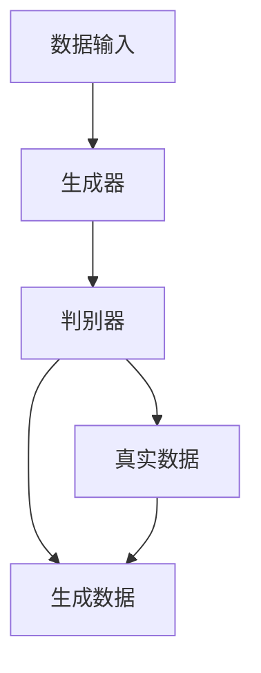

                 


# 《金融领域对抗学习的研究与应用》

---

## 关键词  
对抗学习, 生成对抗网络, 金融, 深度学习, 机器学习, 金融欺诈检测

---

## 摘要  
对抗学习是一种新兴的机器学习技术，通过生成器和判别器的对抗训练，能够有效提升模型的泛化能力和鲁棒性。本文系统地探讨了对抗学习在金融领域的研究进展与实际应用，结合金融数据的特点，分析了对抗学习的优势与挑战。通过具体案例，本文详细讲解了如何利用对抗学习技术解决金融领域的核心问题，如金融欺诈检测、信用评分和市场预测等。文章最后总结了对抗学习在金融领域的未来发展方向，为读者提供了一种全新的视角来理解这一前沿技术。

---

## 目录大纲

### 第1章: 对抗学习的背景与基础

#### 1.1 机器学习的基本概念
- 1.1.1 机器学习的定义与分类
- 1.1.2 监督学习、无监督学习与强化学习的对比
- 1.1.3 深度学习的崛起与挑战

#### 1.2 对抗学习的起源与发展
- 1.2.1 对抗学习的提出背景
- 1.2.2 生成对抗网络（GAN）的核心思想
- 1.2.3 对抗学习在学术界与工业界的进展

#### 1.3 金融领域的机器学习挑战
- 1.3.1 金融数据的特点：高维性、稀疏性与噪声
- 1.3.2 传统机器学习在金融中的局限性
- 1.3.3 对抗学习在金融中的潜在价值

---

### 第2章: 对抗学习的核心概念与联系

#### 2.1 对抗学习的基本原理
- 2.1.1 生成器与判别器的角色与关系
- 2.1.2 对抗训练的目标函数与优化过程
- 2.1.3 对抗学习的数学模型与算法框架

#### 2.2 对抗学习与其他机器学习方法的对比
- 2.2.1 监督学习、无监督学习与对抗学习的对比
- 2.2.2 生成对抗网络（GAN）与传统生成模型的对比
- 2.2.3 对抗学习的优缺点分析

#### 2.3 对抗学习的ER实体关系图


---

### 第3章: 对抗学习的数学模型与算法原理

#### 3.1 对抗学习的数学模型
- 3.1.1 生成器的损失函数
$$ L_G = \mathbb{E}_{z \sim p_z} [\log D(G(z))] $$
- 3.1.2 判别器的损失函数
$$ L_D = \mathbb{E}_{x \sim p_x} [\log(1 - D(G(z)))] + \mathbb{E}_{z \sim p_z} [\log D(G(z))] $$
- 3.1.3 综合损失函数
$$ L = L_G + L_D $$

#### 3.2 对抗训练的算法流程


#### 3.3 对抗学习的Python实现示例
```python
import torch
import torch.nn as nn

class Generator(nn.Module):
    def __init__(self, input_dim, hidden_dim, output_dim):
        super(Generator, self).__init__()
        self.fc1 = nn.Linear(input_dim, hidden_dim)
        self.fc2 = nn.Linear(hidden_dim, output_dim)
        self.relu = nn.ReLU()
        self.sigmoid = nn.Sigmoid()

    def forward(self, x):
        x = self.relu(self.fc1(x))
        x = self.sigmoid(self.fc2(x))
        return x

class Discriminator(nn.Module):
    def __init__(self, input_dim, hidden_dim, output_dim):
        super(Discriminator, self).__init__()
        self.fc1 = nn.Linear(input_dim, hidden_dim)
        self.fc2 = nn.Linear(hidden_dim, output_dim)
        self.relu = nn.ReLU()
        self.sigmoid = nn.Sigmoid()

    def forward(self, x):
        x = self.relu(self.fc1(x))
        x = self.sigmoid(self.fc2(x))
        return x

# 初始化模型和优化器
generator = Generator(input_dim=100, hidden_dim=256, output_dim=1)
discriminator = Discriminator(input_dim=1, hidden_dim=256, output_dim=1)
```

---

### 第4章: 金融领域中的对抗学习应用

#### 4.1 金融欺诈检测
- 4.1.1 欺诈检测的挑战与传统方法的局限性
- 4.1.2 对抗学习在欺诈检测中的优势
- 4.1.3 实际案例分析：利用GAN检测信用卡欺诈

#### 4.2 信用评分与风险评估
- 4.2.1 信用评分的传统方法
- 4.2.2 对抗学习在信用评分中的应用
- 4.2.3 案例分析：生成合成数据以提高模型鲁棒性

#### 4.3 金融市场预测
- 4.3.1 传统金融市场预测方法的不足
- 4.3.2 对抗学习在股票价格预测中的应用
- 4.3.3 实际案例：使用GAN生成市场数据进行预测

---

### 第5章: 对抗学习的系统架构与设计

#### 5.1 系统功能设计
- 5.1.1 数据预处理模块
- 5.1.2 模型训练模块
- 5.1.3 结果分析与可视化模块

#### 5.2 系统架构设计


#### 5.3 系统接口设计
- 5.3.1 数据接口：数据输入格式与预处理规则
- 5.3.2 模型接口：生成器与判别器的交互接口
- 5.3.3 结果接口：输出结果的格式与可视化方式

#### 5.4 系统交互流程


---

### 第6章: 对抗学习的项目实战

#### 6.1 环境搭建
- 6.1.1 安装Python与相关库（如PyTorch、TensorFlow）
- 6.1.2 安装金融数据处理库（如Pandas、NumPy）

#### 6.2 数据准备
- 6.2.1 数据集获取与清洗
- 6.2.2 数据特征工程与标准化

#### 6.3 模型实现
```python
# 继续完成之前定义的Generator和Discriminator类
# 初始化模型和优化器
generator = Generator(input_dim=100, hidden_dim=256, output_dim=1)
discriminator = Discriminator(input_dim=1, hidden_dim=256, output_dim=1)

# 定义优化器
optimizer_G = torch.optim.Adam(generator.parameters(), lr=0.0002)
optimizer_D = torch.optim.Adam(discriminator.parameters(), lr=0.0002)

# 定义损失函数
criterion = nn.BCELoss()

# 训练过程
for epoch in range(100):
    for _ in range(100):
        # 训练判别器
        optimizer_D.zero_grad()
        real_data = torch.randn(128, 1)
        fake_data = generator(torch.randn(128, 100)).detach()
        d_real = discriminator(real_data)
        d_fake = discriminator(fake_data)
        loss_D = (torch.mean(torch.log(d_real)) + torch.mean(torch.log(1 - d_fake))) * (-1)
        loss_D.backward()
        optimizer_D.step()

        # 训练生成器
        optimizer_G.zero_grad()
        d_fake_new = discriminator(generator(torch.randn(128, 100)))
        loss_G = torch.mean(torch.log(1 - d_fake_new))
        loss_G.backward()
        optimizer_G.step()
```

#### 6.4 模型评估与结果分析
- 6.4.1 模型的生成能力评估
- 6.4.2 模型的判别能力评估
- 6.4.3 实际案例分析：生成数据的质量与模型表现

#### 6.5 模型优化与调参
- 6.5.1 超参数的选择与优化
- 6.5.2 模型结构的调整
- 6.5.3 模型的鲁棒性与泛化能力提升

---

### 第7章: 对抗学习的注意事项与未来展望

#### 7.1 对抗学习的优缺点
- 7.1.1 优势：提升模型泛化能力与数据生成能力
- 7.1.2 局限性：训练不稳定、计算资源需求高
- 7.1.3 潜在风险：生成数据的质量控制与模型滥用

#### 7.2 未来研究方向
- 7.2.1 更高效的对抗训练算法
- 7.2.2 对抗学习在多模态数据处理中的应用
- 7.2.3 对抗学习与区块链、联邦学习等技术的结合

#### 7.3 最佳实践 Tips
- 7.3.1 数据质量的重要性
- 7.3.2 模型调参的技巧
- 7.3.3 训练过程中的常见问题与解决方案

---

## 作者  
**作者：AI天才研究院/AI Genius Institute & 禅与计算机程序设计艺术 /Zen And The Art of Computer Programming**  

---

## 结语  
对抗学习作为人工智能领域的新兴技术，正在为金融领域带来前所未有的变革。通过本文的系统分析与实践案例，读者可以深入理解对抗学习的核心思想与实际应用。未来，随着技术的不断进步，对抗学习将在金融领域发挥更大的潜力，为行业带来更多创新与突破。

