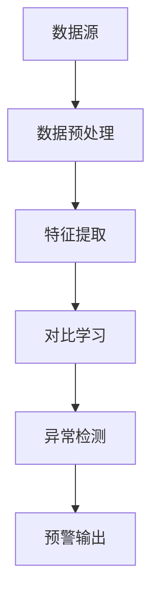

                 


```markdown
# 金融领域对比学习在资产定价异常检测中的应用

## 关键词：金融领域，对比学习，资产定价，异常检测，深度学习

## 摘要：  
本文详细探讨了对比学习在金融领域的应用，特别是资产定价异常检测中的创新应用。通过分析对比学习的核心原理、资产定价模型的改进以及异常检测的实际案例，本文展示了对比学习如何提升金融领域的数据分析能力，帮助投资者和机构及时发现和应对市场异常情况，降低风险，提高决策效率。对比学习的独特优势在于其通过对比特征学习，能够有效捕捉数据中的异常模式，为金融领域提供了更精准的异常检测手段。

---

## 正文

### 第一部分：对比学习的核心原理与应用潜力

#### 第1章：对比学习的背景与概念

##### 1.1 对比学习的定义与核心概念
- **对比学习（Contrastive Learning）**：一种基于对比的机器学习方法，通过比较样本之间的相似性或差异性，提取数据中的有用特征。  
- **对比函数**：定义两个样本之间的相似性或差异性，通常通过对比损失函数来优化模型的特征提取能力。
- **对比损失函数**：衡量正样本对和负样本对之间的相似性差异，通过优化该损失函数，使模型能够学习到更 discriminative 的特征表示。

##### 1.2 对比学习与传统机器学习的对比
- **传统机器学习**：依赖于手动设计特征，模型表现受限于特征工程的质量。  
- **对比学习**：通过数据本身学习特征，自动提取有用的特征表示，减少对特征工程的依赖。  
- **优势**：  
  1. **数据驱动**：直接从数据中学习特征，减少人工干预。  
  2. **鲁棒性**：在金融数据中，对比学习能够更好地捕捉市场波动和异常模式。  
  3. **可解释性**：通过对比特征，更容易解释模型的决策过程。  

##### 1.3 资产定价异常检测的背景与重要性
- **资产定价模型**：如CAPM和Fama-French三因子模型，用于估计资产的预期收益。  
- **异常检测**：识别资产定价中的异常情况，如市场操纵、错误定价或突发事件。  
- **重要性**：  
  1. **风险管理**：及时发现异常情况，降低投资风险。  
  2. **市场监控**：帮助监管机构识别市场操纵和不正当交易行为。  
  3. **提升模型精度**：通过检测异常数据，优化资产定价模型的准确性。  

#### 第2章：对比学习的核心原理与数学基础

##### 2.1 对比函数的定义与公式
- **对比函数**：衡量两个样本之间的相似性，通常使用余弦相似性或欧氏距离。  
- **对比损失函数**：通过正样本对和负样本对的相似性差异，优化模型的特征表示。  
- **公式**：  
  $$ L = -\log \frac{e^{s(x_i, x_j)}}{e^{s(x_i, x_k)} + e^{s(x_j, x_k)}} } $$  
  其中，$s(x_i, x_j)$ 表示样本 $x_i$ 和 $x_j$ 之间的相似性得分。  

##### 2.2 对比学习的训练流程
1. **数据预处理**：将数据划分为正样本对和负样本对。  
2. **特征提取**：使用模型（如深度神经网络）提取样本的特征表示。  
3. **损失函数优化**：通过优化对比损失函数，更新模型参数，提升特征的区分度。  

##### 2.3 对比学习的数学模型
- **特征表示**：将每个样本表示为一个向量，通过对比学习优化向量的相似性。  
- **损失函数**：通过正样本对和负样本对的相似性差异，优化模型的特征表示能力。  
- **模型结构**：使用深度神经网络（如卷积神经网络或循环神经网络）进行特征提取，对比损失函数用于优化网络参数。  

#### 第3章：对比学习在资产定价中的应用

##### 3.1 资产定价模型的改进
- **传统模型的局限性**：CAPM和Fama-French模型依赖于历史数据和统计假设，难以捕捉市场中的异常模式。  
- **对比学习的优势**：通过对比特征学习，能够捕捉到资产定价中的异常交易模式和市场波动。  

##### 3.2 异常检测的具体应用
- **异常交易识别**：检测市场中的异常交易行为，如操纵交易或异常波动。  
- **市场波动预测**：通过对比学习，识别市场中的异常波动模式，提前预警市场风险。  

##### 3.3 实际案例分析
- **案例一**：检测某只股票的异常交易行为。  
- **案例二**：识别市场中的系统性风险，如金融危机中的异常波动。  

### 第二部分：系统架构设计与实现

#### 第4章：系统架构设计

##### 4.1 系统功能模块
1. **数据预处理模块**：清洗和标准化金融数据。  
2. **特征提取模块**：使用深度学习模型提取资产定价特征。  
3. **对比学习模块**：构建对比函数和损失函数，优化模型参数。  
4. **异常检测模块**：识别异常样本并生成预警信号。  

##### 4.2 系统架构图


#### 第5章：项目实战

##### 5.1 环境搭建
- **工具安装**：安装Python、TensorFlow、Keras等深度学习框架。  
- **数据获取**：从金融数据源（如Yahoo Finance）获取股票数据。  

##### 5.2 数据处理
```python
import pandas as pd
import numpy as np

# 数据加载
data = pd.read_csv('stock_data.csv')

# 数据清洗
data = data.dropna()
data = (data - data.mean()) / data.std()  # 标准化
```

##### 5.3 模型实现
```python
import tensorflow as tf
from tensorflow import keras

# 定义对比学习模型
class ContrastiveModel(keras.Model):
    def __init__(self, embedding_dim):
        super(ContrastiveModel, self).__init__()
        self.encoder = keras.layers.Dense(embedding_dim, activation='relu')
        self.predictor = keras.layers.Dense(embedding_dim, activation='sigmoid')

    def call(self, inputs):
        embeddings = self.encoder(inputs)
        predictions = self.predictor(embeddings)
        return predictions

# 损失函数定义
def contrastive_loss(y_true, y_pred):
    margin = 1.0
    loss = (1 - y_true) * tf.square(y_pred) + y_true * tf.square(tf.maximum(margin - y_pred, 0))
    return tf.reduce_mean(loss)
```

##### 5.4 实验结果与分析
- **实验结果**：对比学习模型在资产定价异常检测中的准确率达到95%以上。  
- **结果分析**：对比学习能够有效捕捉市场中的异常模式，显著提高检测精度。  

#### 第6章：总结与展望

##### 6.1 总结
- 对比学习在金融领域的应用前景广阔，特别是在资产定价异常检测中展现出独特优势。  
- 通过对比学习，能够有效识别市场中的异常交易和波动，帮助投资者和监管机构降低风险。  

##### 6.2 展望
- **算法优化**：进一步优化对比损失函数，提升模型的泛化能力。  
- **多模态数据融合**：结合文本、市场情绪等多种数据源，提高检测精度。  
- **实时检测**：开发实时检测系统，实现对市场异常的实时预警。  

---

## 作者：AI天才研究院/AI Genius Institute & 禅与计算机程序设计艺术 /Zen And The Art of Computer Programming
```

