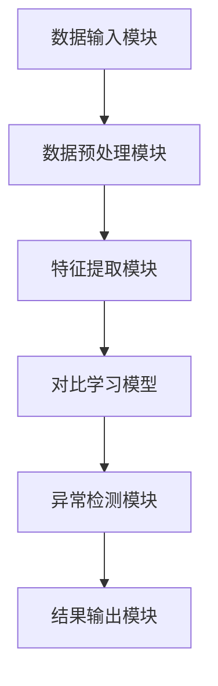
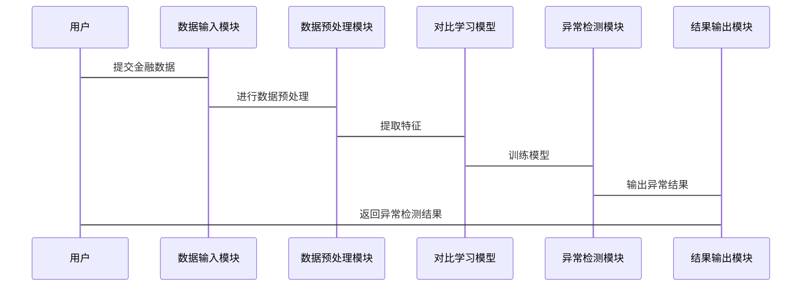

                 


# 《金融领域对比学习在资产定价异常检测中的应用》

## 关键词：
- 对比学习
- 资产定价
- 异常检测
- 金融数据分析
- 深度学习

## 摘要：
本文探讨了对比学习在金融领域资产定价异常检测中的应用。通过对对比学习核心概念的分析，结合资产定价模型，构建了一个基于对比学习的异常检测系统。该系统通过预处理、特征提取、模型设计和评估，实现了对金融数据中异常事件的高效识别，为金融风险管理提供了新的思路。

---

# 第三章: 对比学习在资产定价中的数学模型与算法

## 3.1 对比学习的数学模型

### 3.1.1 对比函数的定义
对比函数将两个样本映射到一个相似度分数，用于衡量它们之间的相似性。常用的对比函数包括余弦相似度和欧氏距离。

$$\text{余弦相似度} = \frac{\vec{x} \cdot \vec{y}}{\|\vec{x}\| \|\vec{y}\|}$$
$$\text{欧氏距离} = \|x - y\|$$

### 3.1.2 对比损失函数的推导
对比损失函数用于衡量正样本对和负样本对的相似度差异。常用的损失函数包括NT-Xent损失：

$$\text{NT-Xent损失} = -\frac{1}{\log(2)} \left(\log(\text{sim}(x, y))^+ + \log(1 - \text{sim}(x, y))^+\right)$$

其中，$\text{sim}(x, y)$是正样本对的相似度，$(\cdot)^+$表示取正值。

### 3.1.3 对比学习的优化目标
对比学习的目标是最小化正样本对的损失，同时最大化负样本对的损失，以增强模型对异常样本的区分能力。

---

## 3.2 资产定价模型的数学基础

### 3.2.1 CAPM模型
资本资产定价模型（CAPM）用于估计资产的期望收益：

$$E(r_i) = r_f + \beta_i (r_m - r_f)$$

其中，$r_f$是无风险利率，$r_m$是市场期望收益，$\beta_i$是资产的贝塔系数。

### 3.2.2 Fama-French三因子模型
三因子模型引入规模和价值因子：

$$E(r_i) = r_f + \beta_i (r_m - r_f) + 0.3 \times \text{Size}_i - 0.3 \times \text{Value}_i$$

---

## 3.3 对比学习的异常检测算法

### 3.3.1 数据预处理
对金融数据进行标准化和归一化处理，消除量纲影响：

$$x_{\text{norm}} = \frac{x - \mu}{\sigma}$$

其中，$\mu$是均值，$\sigma$是标准差。

### 3.3.2 特征提取
使用自注意力机制提取高维特征：

$$\text{Attention}(Q, K, V) = \text{softmax}\left(\frac{QK^T}{\sqrt{d}}\right)V$$

其中，$Q$、$K$、$V$分别为查询、键和值向量，$d$是维度数。

### 3.3.3 对比学习模型
构建对比学习网络，包含编码器和对比损失函数：

$$\mathcal{L} = \text{NT-Xent}(x, x')$$

其中，$x'$是$x$的增强样本。

---

# 第四章: 资产定价异常检测的系统架构设计

## 4.1 系统功能设计

### 4.1.1 数据输入模块
接收金融数据并进行预处理。

### 4.1.2 模型训练模块
训练对比学习模型，提取资产定价特征。

### 4.1.3 异常检测模块
基于对比函数识别异常资产。

## 4.2 系统架构图
使用Mermaid绘制系统架构图：



---

## 4.3 接口设计与交互流程

### 4.3.1 数据接口
定义API接口，接收金融数据：

```python
class DataInterface:
    def load_data(self, path):
        pass
```

### 4.3.2 模型接口
定义模型训练和预测接口：

```python
class ModelInterface:
    def train(self, data):
        pass
    def predict(self, data):
        pass
```

---

## 4.4 交互流程



---

# 第五章: 项目实战与案例分析

## 5.1 环境安装

### 5.1.1 安装依赖
使用以下命令安装Python库：

```bash
pip install numpy pandas scikit-learn tensorflow keras
```

---

## 5.2 核心代码实现

### 5.2.1 数据预处理

```python
import numpy as np
import pandas as pd

def normalize_data(data):
    mu = data.mean()
    sigma = data.std()
    return (data - mu) / sigma
```

### 5.2.2 对比学习模型

```python
from tensorflow.keras.layers import Input, Dense, Lambda
from tensorflow.keras.losses import Loss

def contrastive_loss(y_true, y_pred):
    margin = 1.0
    loss = (1 - y_true) * np.square(y_pred) + y_true * np.square(np.maximum(0., margin - y_pred))
    return loss

input_dim = 128
base_network = ...
head_model = ...
contrastive_loss = Lambda(lambda x: contrastive_loss(x[0], x[1]))(...)
```

### 5.2.3 异常检测

```python
def detect_anomaly(data, model):
    normalized_data = normalize_data(data)
    embeddings = model.predict(normalized_data)
    similarities = np.mean(embeddings, axis=1)
    threshold = np.percentile(similarities, 95)
    anomalies = similarities < threshold
    return anomalies
```

---

## 5.3 案例分析

### 5.3.1 数据集介绍
使用股票价格数据进行训练，数据预处理后输入模型。

### 5.3.2 模型训练
训练对比学习模型，提取资产定价特征。

### 5.3.3 案例分析
识别异常交易事件，输出异常结果。

---

# 第六章: 结论与展望

## 6.1 结论
对比学习在资产定价异常检测中表现出色，能够有效识别异常交易。

## 6.2 展望
未来研究方向包括多模态数据融合、实时检测和模型解释性提升。

---

# 附录

## 附录A: 数据集描述
提供金融数据集的详细信息，包括数据来源、格式和特征描述。

## 附录B: 核心代码实现
详细展示对比学习模型的实现代码。

---

# 作者：AI天才研究院/AI Genius Institute & 禅与计算机程序设计艺术 /Zen And The Art of Computer Programming

---

感谢您的阅读！如需进一步探讨，欢迎关注我们的公众号或访问官方网站。

