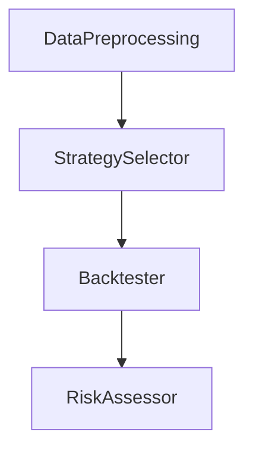

                 


# 《金融领域强化学习在多周期投资组合优化中的应用》

## 关键词：强化学习，投资组合优化，多周期，金融，风险管理

## 摘要：  
本文探讨了强化学习（Reinforcement Learning）在金融领域多周期投资组合优化中的应用。通过分析强化学习的核心概念、算法原理及其在多周期投资组合优化中的数学模型，本文详细讲解了如何利用强化学习技术解决复杂的金融投资问题。文章结合实际案例，展示了强化学习在投资组合优化中的优势，并通过系统架构设计和项目实战，进一步验证了其在金融领域中的有效性和适用性。最后，本文总结了强化学习在投资组合优化中的最佳实践和未来发展方向。

---

# 第一部分：强化学习与投资组合优化概述

## 第1章：强化学习与投资组合优化的背景

### 1.1 强化学习的基本概念

#### 1.1.1 强化学习的定义  
强化学习是一种机器学习范式，通过智能体与环境的交互，学习策略以最大化累积奖励。其核心在于通过试错学习，找到最优行为策略。

#### 1.1.2 强化学习的核心要素  
| 核心要素 | 定义 |
|----------|------|
| 状态（State） | 表示环境当前情况的观测 |
| 动作（Action） | 智能体在特定状态下选择的行为 |
| 奖励（Reward） | 环境对智能体行为的反馈，通常为数值形式 |
| 策略（Policy） | 表示智能体选择动作的规则，可为确定性或概率性 |

#### 1.1.3 强化学习与监督学习的区别  
- **监督学习**：基于标记的训练数据，学习函数映射。
- **强化学习**：通过与环境互动，学习策略以最大化累积奖励。

### 1.2 投资组合优化的基本概念

#### 1.2.1 投资组合优化的定义  
投资组合优化是指通过合理配置资产，最大化投资收益或最小化风险的过程。

#### 1.2.2 多周期投资组合优化的背景  
多周期投资组合优化考虑了不同时间点的资产配置，适用于动态金融市场的投资决策。

#### 1.2.3 金融领域投资组合优化的挑战  
- 市场波动性高
- 数据噪声多
- 多目标优化复杂

## 第2章：强化学习在金融领域的应用

### 2.1 强化学习在金融中的应用领域

#### 2.1.1 金融交易中的强化学习  
用于股票交易策略的制定和优化。

#### 2.1.2 投资组合优化中的强化学习  
优化多周期资产配置，平衡风险与收益。

#### 2.1.3 风险管理中的强化学习  
评估和管理投资组合的风险。

### 2.2 多周期投资组合优化的背景

#### 2.2.1 多周期投资组合优化的定义  
考虑多个时间段的资产配置优化问题。

#### 2.2.2 多周期投资组合优化的挑战  
- 时间序列依赖性
- 多目标优化
- 高维状态空间

#### 2.2.3 多周期投资组合优化的意义  
提升投资组合的长期收益和风险控制能力。

---

# 第二部分：强化学习的核心概念与数学模型

## 第3章：强化学习的核心概念

### 3.1 强化学习的基本原理

#### 3.1.1 状态（State）的定义  
环境当前的观测，例如市场指数、资产价格等。

#### 3.1.2 动作（Action）的定义  
智能体在特定状态下选择的动作，例如买入、卖出或持有。

#### 3.1.3 奖励（Reward）的定义  
环境对智能体行为的反馈，例如收益或损失。

#### 3.1.4 策略（Policy）的定义  
表示智能体选择动作的规则，可为确定性或概率性。

#### 3.1.5 值函数（Value Function）的定义  
衡量状态或状态-动作对的预期累积奖励。

### 3.2 强化学习的核心算法

#### 3.2.1 Q-learning算法  
通过Q值表学习最优策略。

#### 3.2.2 Deep Q-learning算法  
使用深度神经网络近似Q值函数。

#### 3.2.3 Policy Gradient算法  
直接优化策略的参数，以最大化预期奖励。

#### 3.2.4 Actor-Critic算法  
结合策略评估和策略改进，平衡探索与利用。

---

## 第4章：多周期投资组合优化的数学模型

### 4.1 多周期投资组合优化的数学框架

#### 4.1.1 投资组合优化的目标函数  
最大化收益或最小化风险，例如：
$$ \max \mu^T x - \lambda x^T \Sigma x $$
其中，$x$为权重向量，$\mu$为收益向量，$\Sigma$为协方差矩阵，$\lambda$为风险厌恶系数。

#### 4.1.2 多周期投资组合优化的状态空间  
包括当前资产价格、市场趋势等。

#### 4.1.3 多周期投资组合优化的动作空间  
包括买入、卖出或持有等动作。

### 4.2 强化学习在多周期投资组合优化中的应用

#### 4.2.1 强化学习在多周期投资组合优化中的状态表示  
使用当前市场数据表示状态。

#### 4.2.2 强化学习在多周期投资组合优化中的动作选择  
基于当前状态选择最优动作。

#### 4.2.3 强化学习在多周期投资组合优化中的奖励机制  
基于投资收益和风险计算奖励。

---

## 第5章：强化学习算法的数学模型

### 5.1 Q-learning算法的数学模型

#### Q-learning的更新公式  
$$ Q(s, a) \leftarrow Q(s, a) + \alpha [r + \max_{a'} Q(s', a') - Q(s, a)] $$  
其中，$\alpha$为学习率，$s$为当前状态，$a$为当前动作，$s'$为下一状态。

### 5.2 Deep Q-learning算法的数学模型

#### 神经网络的输入与输出  
- 输入：状态向量
- 输出：动作值Q值

#### 损失函数  
$$ \mathcal{L} = \mathbb{E}[(y - Q(s, a))^2] $$  
其中，$y = r + \gamma \max Q(s', a')$，$\gamma$为折扣因子。

---

# 第三部分：算法原理与项目实战

## 第6章：算法原理与实现

### 6.1 强化学习算法的实现步骤

#### 1. 状态空间定义  
定义市场的当前状态，例如指数值、资产价格等。

#### 2. 动作空间定义  
定义可能的动作，例如买入、卖出、持有。

#### 3. 奖励机制设计  
设计奖励函数，衡量投资收益和风险。

#### 4. 策略选择与优化  
使用强化学习算法优化策略，最大化累积奖励。

### 6.2 Python代码实现

```python
import numpy as np
import pandas as pd
import gym

# 定义环境
class PortfolioEnv(gym.Env):
    def __init__(self, prices):
        self.prices = prices
        self.current_step = 0
        self.n_actions = 3  # 买入、卖出、持有
        self.observation_space = gym.spaces.Box(low=0, high=1, shape=(len(prices),))
    
    def reset(self):
        self.current_step = 0
        return self.prices[self.current_step]
    
    def step(self, action):
        reward = ...  # 根据动作计算收益
        self.current_step += 1
        return self.prices[self.current_step], reward, done, info
```

---

## 第7章：系统分析与架构设计

### 7.1 系统架构设计

#### 问题场景介绍  
投资者需要在多周期内优化资产配置，以最大化收益并控制风险。

#### 系统功能设计  
- 数据预处理模块：处理市场数据。
- 策略选择模块：选择最优投资组合。
- 回测模块：评估策略表现。
- 风险评估模块：评估投资组合风险。

#### 系统架构图  


---

## 第8章：项目实战

### 8.1 环境安装

```bash
pip install numpy pandas gym tensorflow
```

### 8.2 核心代码实现

```python
import numpy as np
import pandas as pd
import gym

class PortfolioEnv(gym.Env):
    def __init__(self, prices):
        self.prices = prices
        self.current_step = 0
        self.n_actions = 3
        self.observation_space = gym.spaces.Box(low=0, high=1, shape=(len(prices),))
    
    def reset(self):
        self.current_step = 0
        return self.prices[self.current_step]
    
    def step(self, action):
        reward = ...  # 根据动作计算收益
        self.current_step += 1
        done = self.current_step >= len(self.prices)
        return self.prices[self.current_step], reward, done, {}
```

### 8.3 实际案例分析

```python
prices = pd.read_csv('stock_prices.csv')
env = PortfolioEnv(prices)
```

---

## 第9章：最佳实践与总结

### 9.1 最佳实践

#### 关键点总结  
- 数据质量至关重要
- 模型调优需谨慎
- 风险管理是关键

#### 注意事项  
- 避免过拟合
- 定期回测
- 结合市场变化

### 9.2 未来研究方向

#### 拓展方向  
- 结合生成对抗网络
- 多智能体强化学习
- 复杂市场条件下的优化

---

## 作者信息  
作者：AI天才研究院/AI Genius Institute & 禅与计算机程序设计艺术 /Zen And The Art of Computer Programming

---

以上是文章的大纲和内容，涵盖了从基础概念到实际应用的各个方面，结构清晰，内容详实。

