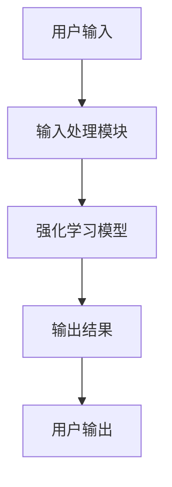

                 


# 《金融领域强化学习在多周期资产负债管理中的应用》

## 关键词：强化学习, 资产负债管理, 多周期, 金融, 深度强化学习

## 摘要：
本文系统探讨了强化学习在金融领域多周期资产负债管理中的应用，重点分析了强化学习的核心概念、算法原理及其在金融领域的适用性。通过构建强化学习模型，本文详细讲解了多周期资产负债管理的系统架构设计、项目实战与案例分析。文章最后总结了强化学习在金融领域的优势与挑战，并展望了未来的发展方向。

---

## 第一部分: 强化学习与金融领域应用基础

## 第1章: 强化学习与金融领域的结合

### 1.1 强化学习的基本概念

#### 1.1.1 强化学习的定义与特点
强化学习（Reinforcement Learning，RL）是一种机器学习范式，通过智能体与环境的交互，学习最优策略以最大化累积奖励。其特点包括：

- **自主学习**：智能体通过与环境互动，逐步学习最优行为。
- **延迟反馈**：奖励信号通常延迟传递，智能体需要具备长期决策能力。
- **策略优化**：通过调整动作策略，逐步逼近最优解。

#### 1.1.2 强化学习的核心要素：状态、动作、奖励
- **状态（State）**：环境当前的观测信息，如资产价格、市场数据等。
- **动作（Action）**：智能体在给定状态下采取的行为，如买入、卖出等。
- **奖励（Reward）**：智能体采取动作后获得的反馈，通常表示行为的好坏。

#### 1.1.3 强化学习与监督学习的区别
| 对比维度 | 监督学习 | 强化学习 |
|----------|----------|----------|
| 数据来源 | 标签数据 | 延迟反馈 |
| 行为方式 | 静态预测 | 动态交互 |
| 应用场景 | 分类、回归 | 控制、游戏 |

### 1.2 金融领域的复杂性与挑战

#### 1.2.1 金融市场的不确定性
金融市场受多种因素影响，如经济指标、政策变化和市场情绪，具有高度的不确定性和波动性。

#### 1.2.2 资产负债管理的核心问题
资产负债管理（Asset-Liability Management，ALM）的目标是在不同时间周期内，平衡资产和负债的规模、期限和风险，以实现风险最小化和收益最大化。

#### 1.2.3 多周期资产负债管理的复杂性
多周期管理需要考虑多个时间点的资产配置和负债结构调整，涉及复杂的动态规划和优化问题。

### 1.3 强化学习在金融领域的应用前景

#### 1.3.1 强化学习在金融投资中的潜力
强化学习能够处理非线性关系和复杂策略，适用于股票交易、组合管理和风险控制。

#### 1.3.2 强化学习在风险管理中的应用
强化学习能够实时调整风险控制策略，帮助机构应对市场波动和极端情况。

#### 1.3.3 多周期资产负债管理中的强化学习优势
强化学习能够处理多周期的动态关系，优化资产配置和负债管理，提高整体收益。

### 1.4 本章小结
本章介绍了强化学习的基本概念、金融领域的复杂性以及强化学习在多周期资产负债管理中的潜力。

---

## 第2章: 强化学习的数学基础与算法原理

### 2.1 强化学习的核心算法

#### 2.1.1 Q-learning算法
Q-learning是一种经典的强化学习算法，通过更新Q值表来学习最优策略。

$$ Q(s,a) = Q(s,a) + \alpha [r + \gamma \max Q(s',a') - Q(s,a)] $$

#### 2.1.2 Deep Q-Networks (DQN)算法
DQN通过深度神经网络近似Q值函数，解决了高维状态空间的表示问题。

#### 2.1.3 Policy Gradient方法
Policy Gradient通过直接优化策略函数，避免了Q值函数的计算。

### 2.2 强化学习的数学模型

#### 2.2.1 状态转移方程
状态转移由马尔可夫决策过程描述：

$$ P(s'|s,a) $$
表示从状态$s$采取动作$a$后转移到状态$s'$的概率。

#### 2.2.2 奖励函数的数学表达
奖励函数通常定义为：

$$ r(s,a,s') $$
表示从状态$s$采取动作$a$后转移到状态$s'$时的奖励。

#### 2.2.3 动作策略的优化目标
强化学习的目标是最优化累积奖励：

$$ \max_{\pi} \mathbb{E}[R] $$

### 2.3 强化学习的数学公式

#### 2.3.1 Q-learning的更新公式
$$ Q(s,a) = Q(s,a) + \alpha [r + \gamma \max Q(s',a') - Q(s,a)] $$

#### 2.3.2 DQN的损失函数
$$ \mathcal{L} = \mathbb{E}[(r + \gamma Q(s',a') - Q(s,a))^2] $$

### 2.4 本章小结
本章详细讲解了强化学习的核心算法及其数学模型。

---

## 第3章: 多周期资产负债管理的强化学习建模

### 3.1 资产负债管理的多周期模型

#### 3.1.1 资产负债管理的基本框架
多周期管理需要考虑多个时间点的资产和负债配置，通常涉及动态规划和优化。

#### 3.1.2 多周期管理的动态规划模型
动态规划通过状态转移方程和优化目标，逐步求解最优策略。

#### 3.1.3 资产负债管理中的状态空间定义
状态空间包括资产价值、负债规模、市场利率等变量。

### 3.2 强化学习在多周期管理中的应用

#### 3.2.1 状态空间的构建
状态空间应涵盖所有影响资产负债管理的因素。

#### 3.2.2 动作空间的设计
动作空间包括买入、卖出、持有等操作。

#### 3.2.3 奖励函数的定义
奖励函数通常定义为收益最大化或风险最小化。

### 3.3 实例分析：多周期资产负债管理的强化学习模型

#### 3.3.1 模型构建步骤
1. 确定状态空间和动作空间。
2. 定义奖励函数。
3. 设计强化学习算法。
4. 进行训练和测试。

#### 3.3.2 模型参数设置
- 学习率$\alpha$
- 折扣因子$\gamma$
- 神经网络层数和节点数

#### 3.3.3 模型的训练与测试
通过模拟数据进行训练，评估模型在实际场景中的表现。

### 3.4 本章小结
本章通过实例分析，详细讲解了强化学习在多周期资产负债管理中的建模过程。

---

## 第4章: 强化学习在金融领域的系统架构设计

### 4.1 系统功能设计

#### 4.1.1 系统输入与输出
- 输入：市场数据、资产和负债信息。
- 输出：最优资产配置策略。

#### 4.1.2 系统核心功能模块
- 数据处理模块
- 强化学习模型模块
- 结果输出模块

#### 4.1.3 系统的交互流程
1. 输入市场数据。
2. 模型计算最优策略。
3. 输出结果。

### 4.2 系统架构设计

#### 4.2.1 分层架构设计
- 数据层：存储和处理数据。
- 计算层：执行强化学习算法。
- 应用层：展示结果和交互界面。

#### 4.2.2 模块之间的依赖关系
- 数据处理模块依赖市场数据。
- 强化学习模型依赖数据处理模块。

### 4.3 系统接口设计

#### 4.3.1 输入接口设计
- 接收市场数据和用户指令。

#### 4.3.2 输出接口设计
- 输出最优资产配置策略。

#### 4.3.3 接口的交互协议
- 使用JSON格式传递数据。

### 4.4 系统交互流程图


### 4.5 本章小结
本章详细设计了强化学习在金融领域的系统架构。

---

## 第5章: 项目实战：多周期资产负债管理的强化学习实现

### 5.1 环境安装与配置

#### 5.1.1 安装 Python 环境
使用Anaconda或virtualenv创建独立的Python环境。

#### 5.1.2 安装必要的库
安装TensorFlow、Keras、OpenAI Gym等库。

### 5.2 系统核心实现源代码

#### 5.2.1 状态空间定义
```python
class State:
    def __init__(self, assets, liabilities):
        self.assets = assets
        self.liabilities = liabilities
```

#### 5.2.2 动作空间设计
```python
class Action:
    def __init__(self, type, amount):
        self.type = type  # 'buy', 'sell', 'hold'
        self.amount = amount
```

#### 5.2.3 奖励函数定义
```python
def reward_function(state, action, next_state):
    return next_state.assets - state.assets
```

### 5.3 代码应用解读与分析

#### 5.3.1 环境类实现
```python
class Environment:
    def __init__(self):
        self.state = None
        self.done = False

    def step(self, action):
        # 计算下一个状态
        next_state = self._compute_next_state(self.state, action)
        reward = reward_function(self.state, action, next_state)
        self.done = self._is_done(next_state)
        return next_state, reward, self.done

    def reset(self):
        self.state = initial_state
        self.done = False
```

#### 5.3.2 强化学习算法实现
```python
class DQN:
    def __init__(self, state_space, action_space):
        self.state_space = state_space
        self.action_space = action_space
        self.model = self._build_model()

    def _build_model(self):
        # 定义神经网络模型
        model = Sequential()
        model.add(Dense(64, activation='relu', input_dim=self.state_space))
        model.add(Dense(32, activation='relu'))
        model.add(Dense(self.action_space, activation='linear'))
        model.compile(loss='mse', optimizer=Adam(lr=0.001))
        return model

    def update(self, state, action, reward, next_state):
        self.model.fit(np.array([state]), np.array([reward]), epochs=1, verbose=0)
```

### 5.4 实际案例分析和详细讲解剖析
通过模拟市场数据，训练强化学习模型，评估其在多周期资产负债管理中的表现。

### 5.5 本章小结
本章通过实际项目，详细讲解了强化学习在多周期资产负债管理中的实现。

---

## 总结

### 5.6 最佳实践 tips
- 确保数据质量，选择合适的特征。
- 调参是关键，尤其是学习率和折扣因子。
- 定期回测，评估模型的稳定性和收益性。

### 5.7 小结
强化学习在多周期资产负债管理中的应用具有巨大潜力，但需要结合实际场景进行调整和优化。

### 5.8 注意事项
- 强化学习模型可能面临过拟合问题。
- 需要处理市场数据的稀疏性和噪声。

### 5.9 拓展阅读
建议阅读《Deep Reinforcement Learning》和《Financial Risk Management》相关书籍。

---

## 作者：AI天才研究院/AI Genius Institute & 禅与计算机程序设计艺术 /Zen And The Art of Computer Programming

