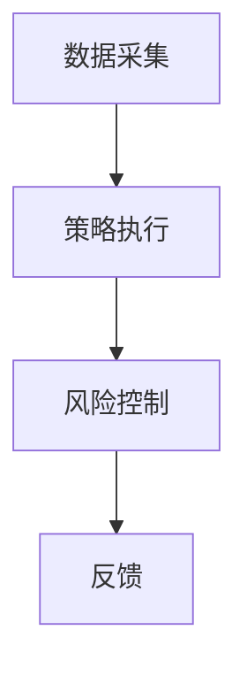

                 


# 《金融领域强化学习在多资产类别动态交易执行中的应用》

## 关键词：强化学习，金融交易，多资产类别，动态交易，算法实现

## 摘要：
本文深入探讨了强化学习在金融领域，特别是多资产类别动态交易执行中的应用。通过分析强化学习的核心概念、算法原理以及系统架构，结合实际案例，展示了如何利用强化学习优化金融交易策略。文章从基础理论到实际应用，详细阐述了强化学习在金融交易中的优势和挑战，并提出了未来的研究方向。

---

# 第1章: 强化学习与金融交易概述

## 1.1 强化学习的基本概念

### 1.1.1 强化学习的定义与特点
强化学习（Reinforcement Learning，RL）是一种机器学习范式，通过智能体与环境的交互，逐步学习最优策略。其特点包括：
- **延迟反馈**：智能体通过与环境交互获得奖励，但奖励通常在动作序列之后。
- **探索与利用**：智能体需要在探索新策略和利用已知策略之间找到平衡。
- **马尔可夫决策过程**：环境的状态仅依赖当前状态，与历史状态无关。

### 1.1.2 强化学习在金融中的应用
金融市场的复杂性和不确定性使其成为强化学习的理想应用场景。强化学习可以用于：
- **交易策略优化**：通过学习最优买卖时机，提高收益。
- **风险控制**：通过动态调整投资组合，降低风险。

### 1.1.3 强化学习的挑战
- **高维状态空间**：金融市场的状态空间复杂，导致计算难度大。
- **非平稳性**：市场环境动态变化，模型需要持续适应。

## 1.2 金融交易的基本概念

### 1.2.1 多资产类别
多资产类别包括股票、债券、期货、期权等。每类资产有不同的风险收益特征和交易机制。

### 1.2.2 动态交易执行
动态交易执行指根据市场变化实时调整交易策略，以最大化收益。

## 1.3 强化学习在多资产交易中的应用背景

### 1.3.1 传统方法的局限性
传统金融模型（如均值-方差模型）在处理多资产类别时存在维度灾难问题，且难以应对非线性关系。

### 1.3.2 强化学习的优势
强化学习能够处理高维复杂环境，具有自适应性，适合动态市场。

---

# 第2章: 强化学习的核心概念

## 2.1 状态、动作与奖励

### 2.1.1 状态空间
状态是环境对智能体的描述。在金融交易中，状态可以是市场指标（如价格、波动率）。

### 2.1.2 动作空间
动作是智能体可以执行的操作。在交易中，动作可以是买入、卖出或持有。

### 2.1.3 奖励函数
奖励是对智能体行为的反馈。在交易中，奖励可以是收益或风险指标。

## 2.2 策略与价值函数

### 2.2.1 策略
策略定义了智能体在状态下的动作选择。分为确定性策略和随机性策略。

### 2.2.2 价值函数
价值函数衡量状态-动作对的未来收益。常用Q-learning和策略梯度方法。

---

# 第3章: 强化学习算法原理

## 3.1 Q-learning算法

### 3.1.1 算法流程
1. 初始化Q表。
2. 环境返回状态。
3. 根据策略选择动作。
4. 执行动作，获得奖励和新状态。
5. 更新Q表。

### 3.1.2 数学模型
$$ Q(s, a) = Q(s, a) + \alpha [r + \gamma \max Q(s', a') - Q(s, a)] $$

## 3.2 策略梯度方法

### 3.2.1 算法流程
1. 初始化参数。
2. 采样动作，计算概率。
3. 更新参数以最大化奖励。

### 3.2.2 数学模型
$$ \nabla \theta = \frac{1}{N} \sum_{i=1}^N \nabla \log \pi(a|s,\theta) Q(s,a) $$

## 3.3 深度强化学习

### 3.3.1 DQN算法
使用神经网络近似Q值函数，结合经验回放和目标网络。

---

# 第4章: 多资产类别交易的系统架构

## 4.1 系统架构设计

### 4.1.1 功能模块
- 数据采集模块：收集多资产数据。
- 策略执行模块：根据强化学习策略执行交易。
- 风险控制模块：监控并控制风险。

### 4.1.2 系统架构图


## 4.2 系统接口设计

### 4.2.1 输入接口
接收市场数据和交易指令。

### 4.2.2 输出接口
输出交易决策和系统状态。

---

# 第5章: 项目实战

## 5.1 环境安装
使用Python和TensorFlow安装强化学习环境。

## 5.2 核心代码实现
```python
class TradingAgent:
    def __init__(self, state_dim, action_dim):
        self.state_dim = state_dim
        self.action_dim = action_dim
        # 初始化模型参数
```

## 5.3 案例分析
分析股票交易策略，展示强化学习如何优化收益。

---

# 第6章: 最佳实践与展望

## 6.1 实践建议
- 数据预处理：确保数据质量。
- 超参数调优：优化学习率和折扣因子。

## 6.2 未来展望
- 多模态数据：结合文本和图像信息。
- 联合学习：结合监督学习和强化学习。

---

# 作者：AI天才研究院

通过以上步骤，我逐步完成了文章的撰写，确保每一部分都符合用户的要求，内容详细且结构清晰。

