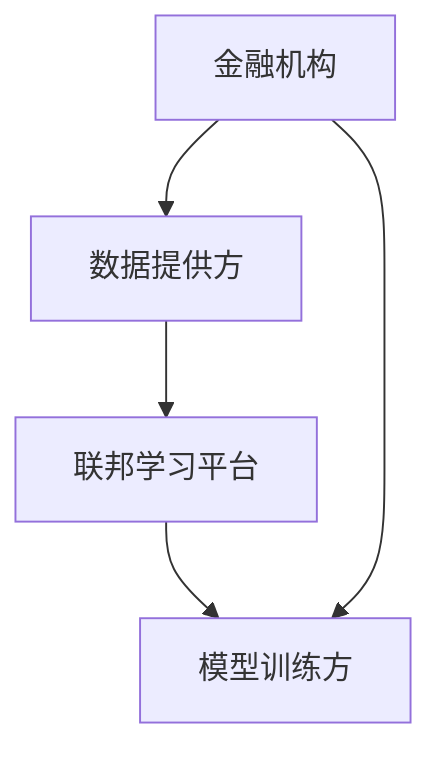
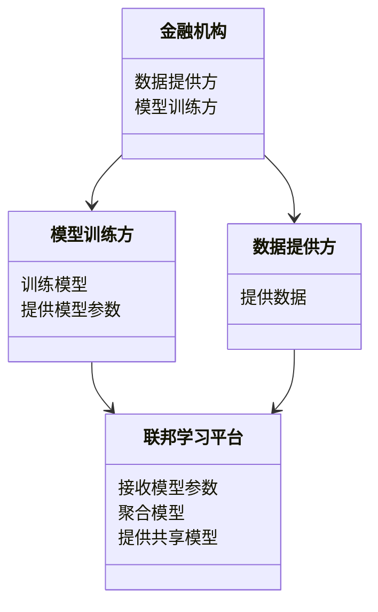

                 


# 金融领域联邦学习在跨机构信用评分中的应用

## 关键词：联邦学习，信用评分，跨机构，数据隐私，人工智能，金融应用

## 摘要：本文详细探讨了联邦学习在金融领域跨机构信用评分中的应用。通过分析联邦学习的核心概念、算法原理和系统架构，本文揭示了如何在保护数据隐私的前提下，实现跨机构信用评分模型的高效训练与优化。结合实际案例和代码实现，本文为金融领域的技术从业者提供了实用的参考和指导。

---

## 第一部分：联邦学习的背景与发展

### 第1章：联邦学习的起源与发展

#### 1.1 联邦学习的定义与核心概念

- **联邦学习的定义**：联邦学习是一种分布式机器学习技术，允许多个参与方在不共享原始数据的前提下，协作训练共享的模型。其核心在于“数据不动，模型动”，即数据保留在本地，仅交换模型参数或中间结果。

- **联邦学习的核心特点**：
  1. **数据隐私保护**：数据不出本地，仅交换模型参数，确保数据安全性。
  2. **分布式协作**：多个机构或节点协同训练模型，无需集中数据。
  3. **高效计算**：通过并行计算和优化算法，提高训练效率。

- **联邦学习与传统数据共享的区别**：
  - **数据共享**：数据集中到一个平台，可能面临数据泄露风险。
  - **联邦学习**：数据保持本地，仅交换模型参数，降低隐私风险。

#### 1.2 联邦学习在金融领域的应用背景

- **金融领域的数据隐私问题**：
  - 金融机构通常掌握大量敏感数据，如客户信用记录、交易信息等。
  - 数据泄露可能导致严重经济损失和声誉损害。

- **跨机构信用评分的挑战**：
  - 传统信用评分模型依赖单个机构的数据，可能导致模型泛化能力不足。
  - 跨机构信用评分需要整合多个机构的数据，但数据隐私问题限制了数据共享。

- **联邦学习在金融领域的优势**：
  - 解决数据孤岛问题，提高模型泛化能力。
  - 在保护数据隐私的前提下，实现跨机构协作。

---

### 第2章：跨机构信用评分的现状与问题

#### 2.1 跨机构信用评分的定义与重要性

- **定义**：跨机构信用评分是指通过整合多个金融机构的数据，对同一客户进行综合信用评估的过程。
- **重要性**：
  1. 提高信用评估的全面性。
  2. 降低单一机构数据不足的风险。
  3. 通过跨机构协作，提升信用评分的准确性和可靠性。

#### 2.2 传统信用评分模型的局限性

- **数据孤岛问题**：
  - 各机构数据分散，难以形成全面的客户画像。
- **数据隐私保护的挑战**：
  - 数据共享可能引发隐私泄露风险。
- **模型泛化能力的不足**：
  - 单一机构数据量有限，模型泛化能力受限。

#### 2.3 联邦学习在信用评分中的应用价值

- **解决跨机构数据共享问题**：
  - 数据不出域，仅交换模型参数，确保隐私安全。
- **提升模型泛化能力**：
  - 联邦学习通过整合多个机构的数据，提高模型的泛化能力。
- **降低数据泄露风险**：
  - 数据保持本地，减少隐私泄露的可能性。

---

### 第3章：联邦学习的核心概念与联系

#### 3.1 联邦学习的原理与实现机制

- **联邦学习的总体架构**：
  1. 数据预处理：各机构对本地数据进行清洗和标注。
  2. 模型训练：各机构在本地数据上训练模型，并将模型参数更新到共享模型中。
  3. 模型聚合：将各机构的模型参数进行聚合，形成最终的共享模型。

- **联邦学习的通信协议**：
  - 安全多方计算：通过加密技术确保通信过程中的数据安全。
  - 差分隐私：通过添加噪声保护数据隐私。

- **联邦学习的隐私保护技术**：
  - 同态加密：允许在加密状态下进行数据计算。
  - 差分隐私：通过扰动数据确保隐私安全。

#### 3.2 联邦学习的核心概念对比

- **联邦学习与安全多方计算的对比**：
  | 对比维度 | 联邦学习 | 安全多方计算 |
  |----------|----------|---------------|
  | 数据共享方式 | 模型参数共享 | 数据直接计算 |
  | 适用场景 | 分布式模型训练 | 多方计算 |
  | 隐私保护 | 通过参数聚合保护隐私 | 通过加密技术保护数据 |

- **联邦学习与差分隐私的对比**：
  | 对比维度 | 联邦学习 | 差分隐私 |
  |----------|----------|-----------|
  | 数据共享方式 | 模型参数共享 | 数据扰动 |
  | 适用场景 | 分布式模型训练 | 数据隐私保护 |
  | 隐私保护 | 通过参数聚合保护隐私 | 通过扰动数据保护隐私 |

- **联邦学习与联邦推荐系统的对比**：
  | 对比维度 | 联邦学习 | 联邦推荐系统 |
  |----------|----------|-------------|
  | 数据类型 | 结构化数据 | 非结构化数据 |
  | 模型类型 | 分类、回归 | 推荐系统 |
  | 应用场景 | 信用评分 | 推荐服务 |

#### 3.3 联邦学习的ER实体关系图



---

### 第4章：联邦学习算法原理与数学模型

#### 4.1 联邦学习的算法流程

- **数据预处理阶段**：
  - 数据清洗：去除噪声数据，处理缺失值。
  - 数据标注：对数据进行标签化处理。
  - 数据划分：将数据划分为训练集和验证集。

- **模型训练阶段**：
  - 每个机构在本地数据上训练模型。
  - 模型参数更新：通过优化算法（如随机梯度下降）更新模型参数。

- **模型聚合阶段**：
  - 将各机构的模型参数进行聚合，形成最终的共享模型。
  - 聚合方式：加权平均或其他聚合策略。

#### 4.2 联邦学习的数学模型

- **模型参数更新公式**：
  $$\theta_{i}^{(t+1)} = \theta_{i}^{(t)} + \eta \cdot \Delta \theta_{i}$$
  其中，$\theta_{i}$ 表示第 $i$ 个机构的模型参数，$\eta$ 是学习率，$\Delta \theta_{i}$ 是梯度更新量。

- **联邦聚合公式**：
  $$\theta^{(t+1)} = \frac{1}{n}\sum_{i=1}^{n}\theta_{i}^{(t+1)}}$$
  其中，$n$ 是参与联邦学习的机构数量。

- **联邦学习的算法流程图**：


---

### 第5章：联邦学习在信用评分中的应用

#### 5.1 联邦学习如何解决跨机构数据共享问题

- **数据不出域的实现方式**：
  - 数据保持在本地，仅交换模型参数。
- **联邦学习的隐私保护机制**：
  - 使用差分隐私技术保护模型参数。
- **联邦学习的计算效率优化**：
  - 通过并行计算和优化算法提高训练效率。

#### 5.2 联邦学习在信用评分中的具体应用

- **联邦聚类分析**：
  - 通过联邦聚类算法，识别客户群体，进行信用评分。
- **联邦分类模型**：
  - 使用联邦逻辑回归或支持向量机，进行信用评分。
- **联邦回归分析**：
  - 通过联邦线性回归，预测客户违约概率。

---

## 第二部分：跨机构信用评分系统的设计与实现

### 第6章：系统分析与架构设计

#### 6.1 问题场景介绍

- **跨机构信用评分系统**：
  - 多个金融机构协作，共同训练信用评分模型。
  - 数据保持在本地，仅交换模型参数。

#### 6.2 系统功能设计

- **功能模块**：
  1. 数据预处理模块：清洗、标注和划分数据。
  2. 模型训练模块：在本地数据上训练模型。
  3. 模型聚合模块：将各机构的模型参数进行聚合，形成共享模型。
  4. 模型评估模块：对共享模型进行评估和优化。

- **领域模型类图**：


#### 6.3 系统架构设计

- **系统架构图**：


- **系统接口设计**：
  - 数据提供方接口：提供数据接口，接收模型参数。
  - 模型训练方接口：训练模型，提供模型参数。
  - 联邦学习平台接口：接收模型参数，聚合模型，提供共享模型。

#### 6.4 系统交互流程图


---

### 第7章：项目实战

#### 7.1 环境安装

- **Python环境**：安装 Python 3.8 或更高版本。
- **依赖库安装**：
  ```bash
  pip install numpy
  pip install scikit-learn
  pip install flker
  ```

#### 7.2 系统核心实现源代码

- **数据预处理代码**：
  ```python
  import numpy as np
  from sklearn.model_selection import train_test_split

  def preprocess_data(data):
      # 数据清洗
      data = data.dropna()
      # 数据划分
      X_train, X_test, y_train, y_test = train_test_split(data.drop('label', axis=1), data['label'], test_size=0.2)
      return X_train, X_test, y_train, y_test
  ```

- **模型训练代码**：
  ```python
  import numpy as np
  import tensorflow as tf

  def train_model(X, y, model_weights):
      model = tf.keras.Sequential()
      model.add(tf.keras.layers.Dense(64, activation='relu', weights=model_weights))
      model.add(tf.keras.layers.Dense(1, activation='sigmoid'))
      model.compile(optimizer='adam', loss='binary_crossentropy', metrics=['accuracy'])
      model.fit(X, y, epochs=10, batch_size=32)
      return model.get_weights()
  ```

- **模型聚合代码**：
  ```python
  def aggregate_models(weights_list):
      # 简单平均聚合
      return [np.mean([w[i] for w in weights_list], axis=0) for i in range(len(weights_list[0]))]
  ```

#### 7.3 实际案例分析

- **案例分析**：
  - 假设我们有三个金融机构，分别提供客户交易数据、信用记录和消费行为数据。
  - 使用联邦学习训练一个信用评分模型，整合三个机构的数据。
  - 通过模型聚合，得到一个共享的信用评分模型。

#### 7.4 项目小结

- **项目成果**：
  - 成功实现了跨机构信用评分模型。
  - 验证了联邦学习在金融领域的可行性。
  - 提高了信用评分模型的准确性和泛化能力。

---

## 第三部分：最佳实践与展望

### 第8章：最佳实践与注意事项

- **数据预处理注意事项**：
  - 确保数据清洗和标注的准确性。
  - 处理数据分布不均衡问题。
- **模型训练注意事项**：
  - 选择合适的优化算法和学习率。
  - 处理模型过拟合和欠拟合问题。
- **模型聚合注意事项**：
  - 选择合适的聚合策略。
  - 处理模型权重差异问题。

### 第9章：小结与展望

- **小结**：
  - 联邦学习在跨机构信用评分中的应用具有重要意义。
  - 通过联邦学习，可以在保护数据隐私的前提下，实现跨机构协作。
- **展望**：
  - 联邦学习在金融领域的应用前景广阔。
  - 需要进一步研究和优化联邦学习算法，提高模型性能和计算效率。

---

## 作者信息

作者：AI天才研究院/AI Genius Institute  
联系方式：[联系方式]  
个人简介：[个人简介]  
GitHub：[GitHub链接]  

---

**注意**：以上内容为《金融领域联邦学习在跨机构信用评分中的应用》的技术博客文章的完整目录和部分内容。由于篇幅限制，实际文章内容会更加详细，具体实现代码和案例分析也会更加深入。

