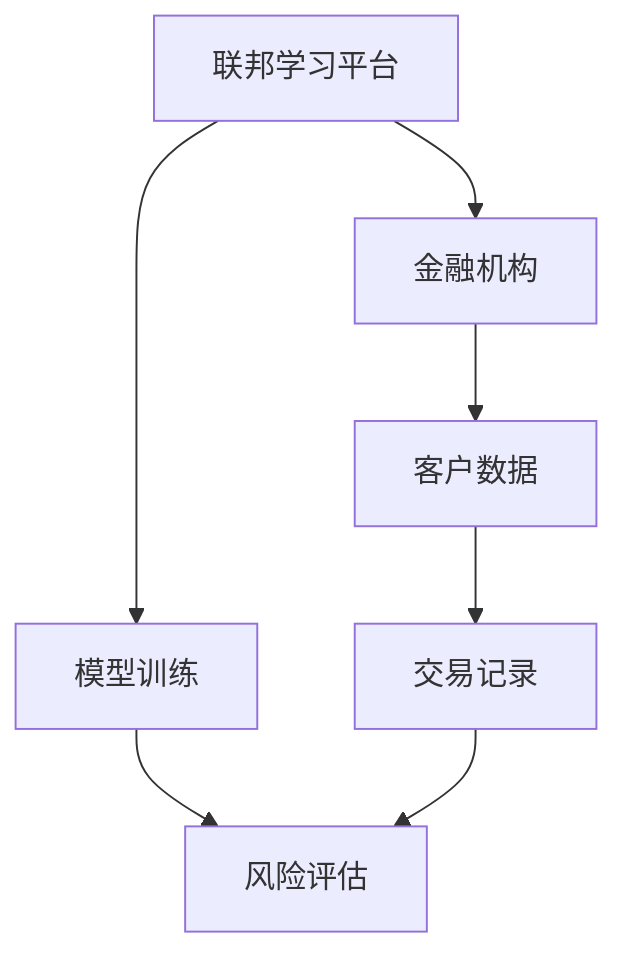
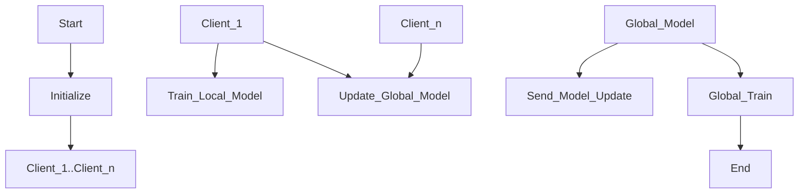
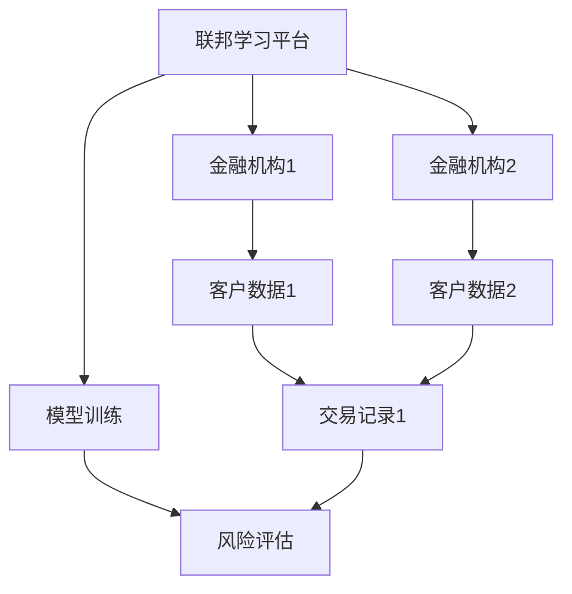
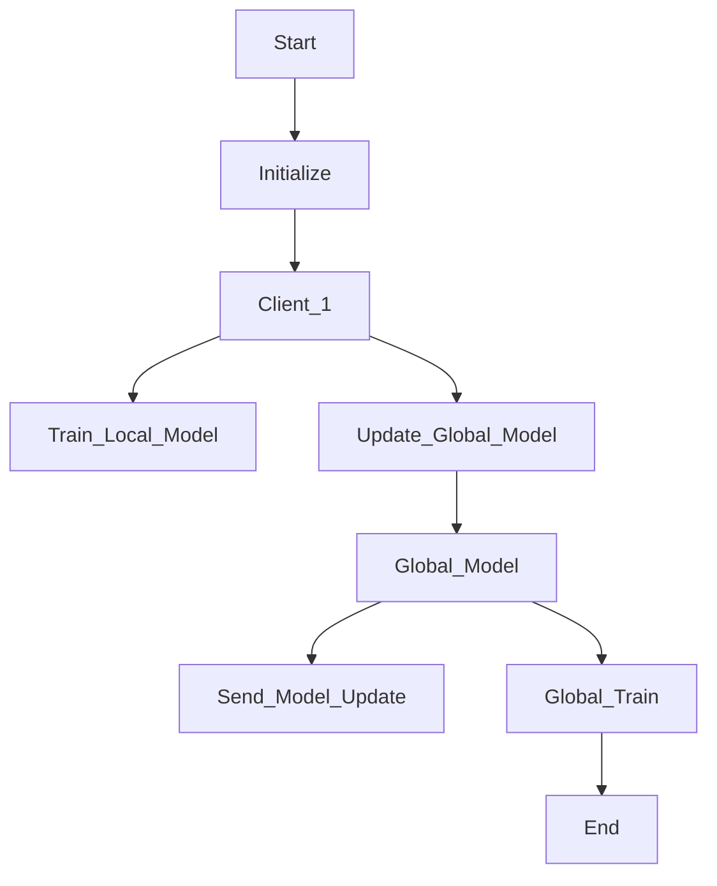

                 


# 《金融领域联邦学习的探索与实践》

> 关键词：联邦学习，金融领域，数据隐私，机器学习，分布式系统

> 摘要：本文深入探讨了联邦学习在金融领域的应用，从基本概念到实际案例，详细分析了其技术原理、系统架构和应用场景，展示了如何在保护数据隐私的前提下提升金融系统的智能化水平。

---

## 第一部分: 金融领域联邦学习的背景与概念

### 第1章: 联邦学习的定义与技术特点

#### 1.1 联邦学习的背景与问题背景
- 1.1.1 数据隐私的重要性：为什么数据隐私在金融领域至关重要？
- 1.1.2 传统数据共享的痛点：数据孤岛与隐私泄露的风险
- 1.1.3 联邦学习的提出：如何在不共享数据的情况下进行模型训练

#### 1.2 联邦学习的核心概念与问题解决
- 1.2.1 联邦学习的基本定义：分布式机器学习框架
- 1.2.2 联邦学习的目标：在数据不出域的前提下实现模型训练
- 1.2.3 联邦学习的关键技术：数据隐私保护、通信协议设计

#### 1.3 联邦学习在金融领域的应用
- 1.3.1 金融领域的数据隐私挑战：客户数据、交易记录的安全性
- 1.3.2 联邦学习在金融风控中的应用：如何通过联邦学习提升信用评估模型
- 1.3.3 联邦学习在金融推荐系统中的应用：个性化投资建议的协同建模

### 第2章: 联邦学习的核心概念与联系

#### 2.1 联邦学习的核心概念原理
- 2.1.1 联邦学习的联邦节点与数据分布：如何定义联邦节点和数据分布策略
- 2.1.2 联邦学习的通信机制与同步策略：加密通信与差分隐私
- 2.1.3 联邦学习的模型更新与聚合方法：FedAvg算法的原理与实现

#### 2.2 联邦学习的核心概念属性对比
- 2.2.1 联邦学习与分布式学习的对比：集中式与分布式模型训练的差异
- 2.2.2 联邦学习与横向联邦、纵向联邦的对比：数据分布的不同带来的算法差异
- 2.2.3 联邦学习与数据共享的对比：隐私保护与数据利用的平衡

#### 2.3 联邦学习的ER实体关系图


---

## 第二部分: 联邦学习的算法原理与数学模型

### 第3章: 联邦学习的算法原理

#### 3.1 联邦学习的核心算法选择
- 3.1.1 常见的联邦学习算法：FedAvg、FedSGD、FedPCA
- 3.1.2 算法选择的依据：模型复杂度、通信开销、隐私保护要求

#### 3.2 联邦学习的典型算法实现
- 3.2.1 FedAvg算法的原理与实现
  - 3.2.1.1 算法流程：本地模型训练、参数更新、参数聚合
  - 3.2.1.2 代码实现：使用Python和TensorFlow框架
  - 3.2.1.3 算法的优缺点：收敛速度快但可能面临数据异质性问题

#### 3.3 联邦学习的算法流程图


### 第4章: 联邦学习的数学模型与公式

#### 4.1 联邦学习的数学模型
- 4.1.1 参数更新的公式推导
  - 全局参数更新公式：
    $$\theta_{t+1} = \theta_t + \sum_{i=1}^{n} \frac{1}{n}\Delta\theta_i$$
  - 本地参数更新公式：
    $$\theta_i^{(t+1)} = \theta_i^{(t)} - \eta \nabla J_i(\theta_i^{(t)})$$

- 4.1.2 模型聚合的数学表达
  - 联邦平均（FedAvg）：
    $$\theta_{t+1} = \frac{1}{n}\sum_{i=1}^{n} \theta_i^{(t+1)}}$$

#### 4.2 算法的收敛性分析
- 4.2.1 联邦学习的收敛条件
- 4.2.2 模型收敛速度的理论分析
- 4.2.3 数据异质性对收敛的影响

---

## 第三部分: 联邦学习的系统分析与架构设计

### 第5章: 系统分析与架构设计方案

#### 5.1 问题场景介绍
- 5.1.1 金融风控系统的数据隐私挑战
- 5.1.2 联邦学习在风控系统中的应用目标

#### 5.2 项目介绍
- 5.2.1 项目目标：构建基于联邦学习的风控模型
- 5.2.2 项目范围：多家金融机构联合训练客户信用评估模型
- 5.2.3 项目参与者：金融机构、数据科学家、联邦学习平台

#### 5.3 系统功能设计
- 5.3.1 系统功能模块：数据预处理模块、模型训练模块、模型评估模块
- 5.3.2 系统功能流程：数据采集、模型训练、模型部署

#### 5.4 系统架构设计


#### 5.5 系统接口设计
- 5.5.1 接口定义：API接口设计文档
- 5.5.2 接口交互流程：数据上传、模型训练、结果查询

#### 5.6 系统交互设计


---

## 第四部分: 项目实战与案例分析

### 第6章: 项目实战

#### 6.1 环境安装与配置
- 6.1.1 安装必要的Python库：TensorFlow、Flask、 requests
- 6.1.2 配置联邦学习平台：搭建服务器和客户端环境

#### 6.2 系统核心实现源代码
- 6.2.1 联邦学习平台的代码实现
  ```python
  import tensorflow as tf
  from tensorflow.keras import layers

  class Model:
      def __init__(self):
          self.model = tf.keras.Sequential([
              layers.Dense(64, activation='relu'),
              layers.Dense(1, activation='sigmoid')
          ])
          self.model.compile(optimizer='adam', loss='binary_crossentropy')

      def train(self, x, y):
          self.model.fit(x, y, epochs=1, batch_size=32)

      def get_weights(self):
          return self.model.get_weights()

      def set_weights(self, weights):
          self.model.set_weights(weights)
  ```

- 6.2.2 客户端代码实现
  ```python
  import requests

  def main():
      # 获取模型参数
      response = requests.get("http://server:8080/weights")
      model.set_weights(response.json())
      
      # 本地训练
      model.train(x_local, y_local)
      
      # 发送更新参数
      response = requests.post("http://server:8080/update", json=model.get_weights())

  if __name__ == "__main__":
      main()
  ```

#### 6.3 代码应用解读与分析
- 6.3.1 代码的功能分析：模型训练、参数更新
- 6.3.2 代码的优化建议：如何优化通信开销和模型收敛速度

#### 6.4 实际案例分析
- 6.4.1 案例背景：某银行的信用评估系统
- 6.4.2 案例实施过程：数据预处理、模型训练、模型评估
- 6.4.3 案例结果：模型准确率提升、数据隐私保护

#### 6.5 项目小结
- 6.5.1 项目实施的关键点：数据预处理、模型选择、通信机制设计
- 6.5.2 项目实施的挑战：数据异质性、通信延迟、模型收敛速度
- 6.5.3 项目实施的经验：如何平衡模型性能与隐私保护

---

## 第五部分: 未来展望与最佳实践

### 第7章: 未来展望

#### 7.1 联邦学习与金融领域的技术融合
- 7.1.1 联邦学习与人工智能的进一步结合
- 7.1.2 联邦学习与区块链的结合：数据隐私保护的新方向

#### 7.2 联邦学习在金融领域的监管与合规
- 7.2.1 数据隐私的法律合规要求
- 7.2.2 联邦学习在金融领域的监管挑战

#### 7.3 联邦学习的行业标准与生态构建
- 7.3.1 联邦学习的标准化建设
- 7.3.2 联邦学习生态的构建：产业链协同

---

## 小结

### 致谢

### 参考文献

### 作者简介

---

作者：AI天才研究院/AI Genius Institute & 禅与计算机程序设计艺术 /Zen And The Art of Computer Programming

