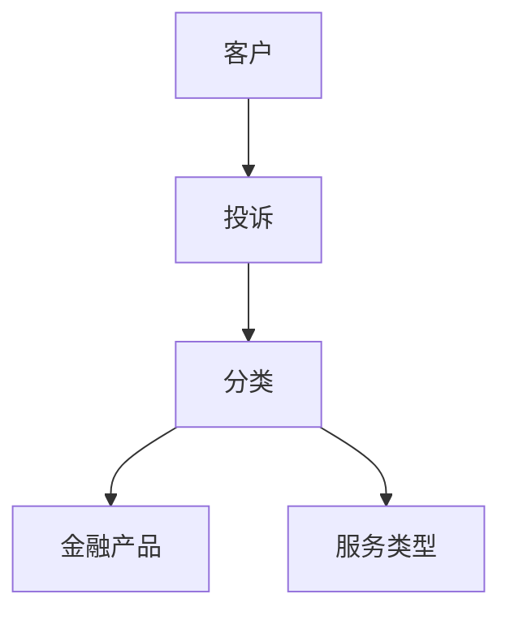
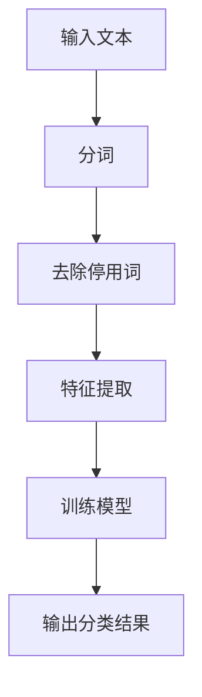
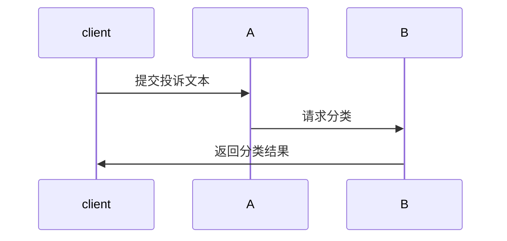

                 


```markdown
# 金融领域自然语言处理在客户投诉分类中的应用

> 关键词：金融领域，自然语言处理，客户投诉，文本分类，机器学习，深度学习

> 摘要：本文探讨了自然语言处理（NLP）技术在金融客户投诉分类中的应用，分析了问题背景、核心概念、算法原理、系统架构设计以及项目实战，最后提出了最佳实践建议。

---

## 第一部分: 金融领域自然语言处理背景与基础

### 第1章: 问题背景与描述

#### 1.1 问题背景
- **金融领域客户投诉的现状**：客户投诉是金融机构了解客户需求和改进服务的重要途径。然而，随着投诉量的增加，人工分类效率低下且容易出错。
- **自然语言处理技术的应用潜力**：NLP能够自动分析和分类文本，提高处理效率和准确性。
- **客户投诉分类的业务价值**：准确分类有助于快速响应客户问题，提升客户满意度和品牌形象。

#### 1.2 问题描述
- **客户投诉文本的特点**：文本多样性强，包含情感、专业术语和噪声。
- **投诉分类的挑战**：需要处理文本的歧义性和多样性。
- **业务目标与技术目标**：业务目标是提高客户满意度，技术目标是实现高精度的分类系统。

#### 1.3 问题解决方法
- **自然语言处理技术的解决方案**：利用NLP技术提取文本特征，构建分类模型。
- **机器学习在分类中的应用**：使用传统的机器学习算法（如SVM、随机森林）进行分类。
- **深度学习模型的优势**：如LSTM和Transformer在处理复杂文本结构中的优势。

#### 1.4 边界与外延
- **问题的边界条件**：仅处理文本信息，不考虑其他数据源。
- **相关领域的外延**：涉及情感分析、实体识别等NLP任务。
- **技术实现的限制与扩展**：模型性能受限于数据质量和数量，未来可扩展至多语言处理。

#### 1.5 概念结构与核心要素
- **核心概念的层次结构**：客户→投诉→分类→金融产品或服务。
- **核心要素的属性特征对比**：见下表。
- **ER实体关系图**：客户投诉与分类实体的关系。

---

## 第二部分: 自然语言处理核心概念与原理

### 第2章: 自然语言处理核心原理

#### 2.1 核心概念原理
- **词向量表示**：将单词映射为向量，如Word2Vec。
- **文本特征提取**：使用TF-IDF提取关键词。
- **分类算法原理**：监督学习算法的工作流程。

#### 2.2 概念属性特征对比表
| 特征               | 描述                                                         |
|--------------------|--------------------------------------------------------------|
| 文本长度           | 投诉文本的字符数                                             |
| 词汇多样性         | 不同词汇的数量占比                                           |
| 专业术语           | 金融领域特定术语的出现频率                                   |
| 情感倾向           | 文本的情感色彩分析                                           |

#### 2.3 ER实体关系图


#### 2.4 本章小结
本章介绍了NLP在金融客户投诉分类中的核心概念，包括词向量、特征提取和分类算法的基本原理。

---

## 第三部分: 算法原理与数学模型

### 第3章: 算法原理与流程

#### 3.1 算法原理
- **文本预处理流程**：分词、去除停用词、处理标点。
- **特征提取方法**：TF-IDF、Word2Vec。
- **分类算法选择**：比较SVM、随机森林和深度学习模型的优缺点。

#### 3.2 算法流程图


#### 3.3 算法数学模型
- **TF-IDF计算公式**：
  $$ TF_{word} = \frac{\text{词在文档中的出现次数}}{\text{文档总词数}} $$
  $$ IDF_{word} = \log\left(\frac{\text{总文档数}}{\text{词出现的文档数}}\right) $$
  $$ TF-IDF = TF_{word} \times IDF_{word} $$

- **SVM分类模型**：使用线性SVM进行分类，目标函数为最小化 hinge loss。

---

## 第四部分: 系统分析与架构设计

### 第4章: 系统分析与架构设计

#### 4.1 问题场景介绍
- **项目介绍**：构建一个金融客户投诉分类系统，解决人工分类效率低的问题。

#### 4.2 系统功能设计
- **领域模型**：客户→投诉→分类→金融产品。
- **系统架构图**：展示数据预处理、模型训练、结果展示模块。

#### 4.3 系统架构设计


#### 4.4 系统接口设计
- **输入接口**：接收投诉文本。
- **输出接口**：返回分类结果。

#### 4.5 系统交互流程


---

## 第五部分: 项目实战

### 第5章: 项目实战

#### 5.1 环境安装
- **Python库**：nltk、scikit-learn、transformers。

#### 5.2 核心实现代码
```python
from sklearn.feature_extraction.text import TfidfVectorizer
from sklearn.svm import SVC

# 文本预处理
def preprocess(text):
    return text.lower().replace(',', '')

# 特征提取
vectorizer = TfidfVectorizer(max_features=500)
X = vectorizer.fit_transform(corpus)

# 模型训练
model = SVC()
model.fit(X, labels)
```

#### 5.3 代码解读与分析
- **文本预处理**：将文本转为小写并去除标点。
- **特征提取**：使用TF-IDF提取关键词。
- **模型训练**：训练SVM分类器。

#### 5.4 案例分析
- **实际案例**：客户投诉文本分类为“交易问题”。
- **详细分析**：展示特征提取和分类过程。

#### 5.5 项目小结
本章通过实际案例展示了NLP技术在金融客户投诉分类中的应用。

---

## 第六部分: 最佳实践与总结

### 第6章: 最佳实践

#### 6.1 小结
本文详细介绍了NLP在金融客户投诉分类中的应用，涵盖了从背景分析到系统实现的全过程。

#### 6.2 注意事项
- 数据质量对模型性能影响大。
- 选择合适的特征提取方法和模型。
- 模型部署后的持续优化。

#### 6.3 拓展阅读
- 推荐书籍：《自然语言处理实战：基于Python的机器学习与深度学习》。
- 推荐论文：相关领域的研究论文。

---

## 作者：AI天才研究院/AI Genius Institute & 禅与计算机程序设计艺术/Zen And The Art of Computer Programming

---

通过以上思考和分析，我设计了一个详细的目录结构和内容安排，确保文章逻辑清晰、内容全面。接下来，我将根据这个结构撰写完整的文章内容，涵盖每个部分的具体细节和示例。
```

