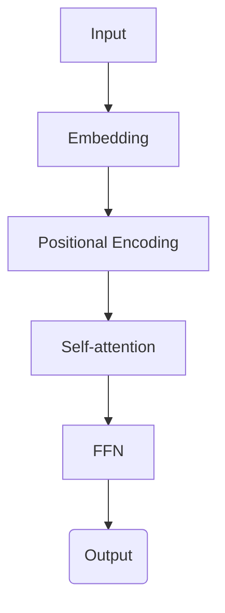
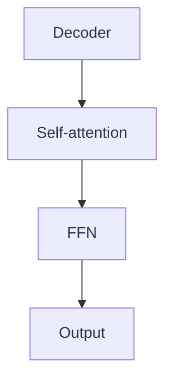
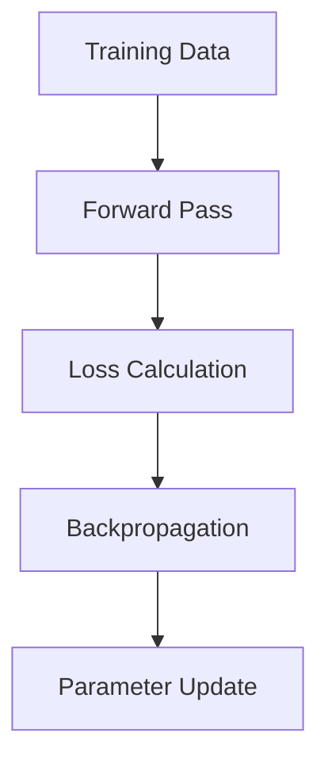
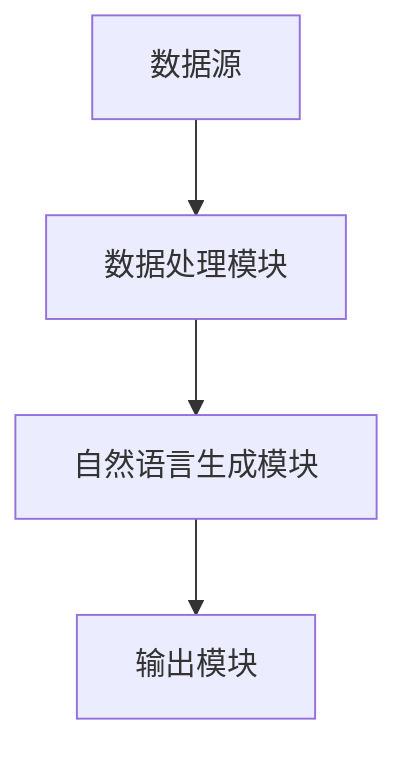
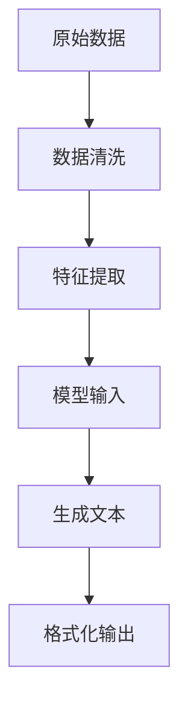
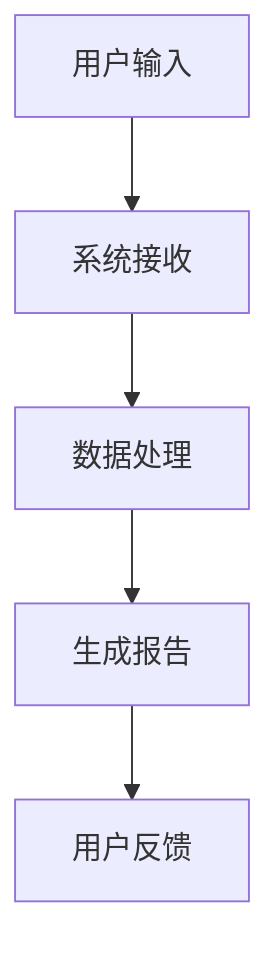
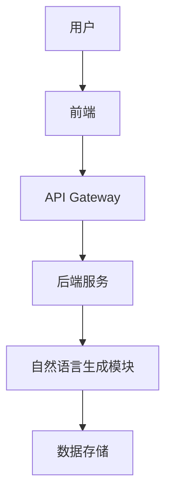

                 


# 《金融领域自然语言生成在投资报告中的应用》

---

## 关键词：
- 自然语言生成
- 投资报告
- 金融领域
- 人工智能
- Transformer模型
- 投资分析
- 金融科技

---

## 摘要：
本文系统探讨了自然语言生成（NLP）技术在金融领域，特别是投资报告中的应用。通过分析NLP的核心概念、算法原理、系统设计以及实际案例，本文揭示了如何利用NLP技术提高投资报告的生成效率、准确性和个性化。从预训练模型到生成机制，从系统架构到项目实战，本文全面覆盖了NLP在金融投资中的关键环节，并提出了最佳实践和未来研究方向。

---

# 第一部分: 金融领域自然语言生成的背景与基础

## 第1章: 自然语言生成概述

### 1.1 自然语言生成的定义与特点
#### 1.1.1 自然语言生成的定义
自然语言生成（NLP）是指将结构化的数据转化为自然语言文本的技术。其核心目标是让计算机能够“理解”数据并生成符合人类语言习惯的文本内容。

#### 1.1.2 自然语言生成的核心特点
- **生成性**：能够根据输入数据生成新的文本内容。
- **多样性**：生成的文本可以有不同的表达方式。
- **可定制性**：可以根据具体需求调整生成的风格和内容。

#### 1.1.3 自然语言生成与自然语言理解的区别
- **理解**：将自然语言文本转化为结构化数据，如情感分析、实体识别。
- **生成**：将结构化数据转化为自然语言文本，如报告撰写、对话生成。

### 1.2 金融领域的自然语言生成应用
#### 1.2.1 金融领域的数据特点
- 数据量大：金融市场的数据种类繁多，包括股票价格、新闻、财务报表等。
- 数据复杂性：数据涉及多个维度，如时间序列、市场情绪等。
- 数据动态性：市场环境和数据实时变化。

#### 1.2.2 自然语言生成在金融中的应用场景
- **投资报告生成**：根据市场数据自动生成分析报告。
- **实时市场评论**：基于实时数据生成市场动态分析。
- **风险提示**：通过分析新闻文本生成风险预警。

#### 1.2.3 投资报告中的自然语言生成需求
- **高效性**：快速生成报告以应对市场变化。
- **准确性**：确保生成内容的可靠性和专业性。
- **个性化**：根据用户需求定制报告内容和风格。

---

## 第2章: 投资报告的生成需求与挑战

### 2.1 投资报告的基本结构与内容
#### 2.1.1 投资报告的典型结构
- 标题
- 引言
- 市场分析
- 投资策略
- 风险提示
- 结论

#### 2.1.2 投资报告的内容要素
- 市场趋势分析
- 财务数据解读
- 投资策略建议
- 风险因素评估

#### 2.1.3 不同类型的投资报告特点
- 短期报告：侧重于短期市场波动。
- 长期报告：关注长期投资策略。
- 行业报告：聚焦于特定行业分析。

### 2.2 自然语言生成在投资报告中的优势
#### 2.2.1 提高报告生成效率
- 自动化生成报告，减少人工干预。
- 快速响应市场变化。

#### 2.2.2 增强报告的客观性与准确性
- 减少人为情绪干扰。
- 提供基于数据的客观分析。

#### 2.2.3 个性化报告生成的可能性
- 根据用户需求定制报告内容。
- 支持多种语言和风格输出。

### 2.3 自然语言生成在投资报告中的挑战
#### 2.3.1 数据质量与多样性问题
- 数据偏差可能导致生成内容不准确。
- 数据多样性不足会影响模型的泛化能力。

#### 2.3.2 模型的可解释性问题
- 生成内容的可追溯性和解释性不足。
- 难以验证生成结果的合理性。

#### 2.3.3 生成内容的合规性与风险控制
- 需符合金融监管要求。
- 需防范生成虚假或误导性信息。

---

# 第二部分: 自然语言生成的核心概念与算法原理

## 第3章: 自然语言生成的核心概念

### 3.1 预训练模型与生成机制
#### 3.1.1 预训练模型的概述
- 预训练模型通过大量通用数据进行训练，具备良好的语言理解和生成能力。
- 常见的预训练模型包括GPT、BERT等。

#### 3.1.2 生成式模型的工作原理
- 基于概率生成模型，通过最大化生成概率来生成文本。
- 解码器结构负责将输入转化为输出序列。

#### 3.1.3 不同模型的生成特点对比
- **GPT系列**：基于解码器结构，擅长生成连贯的文本。
- **BERT系列**：基于编码器结构，主要用于理解和生成任务。

### 3.2 自然语言生成的关键技术
#### 3.2.1 Transformer架构
- **自注意力机制**：捕捉文本中的长距离依赖关系。
- **位置编码**：引入位置信息以保持文本顺序。

#### 3.2.2 注意力机制
- 通过权重分配，聚焦于输入中的重要部分。
- 提高模型的语义理解和生成能力。

#### 3.2.3 解码器结构
- 用于将输入转化为输出序列。
- 支持生成式任务，如文本生成和机器翻译。

## 第4章: 自然语言生成的算法原理

### 4.1 基于Transformer的生成模型
#### 4.1.1 Transformer模型的结构


#### 4.1.2 解码器的生成过程


#### 4.1.3 模型训练的流程


### 4.2 概率生成模型
#### 4.2.1 最大似然估计
- 通过最大化训练数据的概率来估计模型参数。

#### 4.2.2 贝叶斯推断
- 基于概率推理，计算生成文本的后验概率。

#### 4.2.3 生成模型的评估指标
- **困惑度（Perplexity）**：衡量模型生成文本的能力。
- **BLEU**：基于词汇重合度的评估指标。
- **ROUGE**：基于摘要质量的评估指标。

### 4.3 模型调优与优化
#### 4.3.1 参数优化方法
- **Adam优化器**：结合动量和自适应学习率。
- **学习率调度器**：动态调整学习率以提高训练效果。

#### 4.3.2 模型的可伸缩性设计
- **分布式训练**：利用多GPU加速训练。
- **模型剪枝**：减少模型复杂度以降低计算成本。

#### 4.3.3 模型的鲁棒性提升
- **数据增强**：通过数据变换提高模型的泛化能力。
- **对抗训练**：通过生成对抗网络（GAN）提高模型的生成质量。

---

# 第三部分: 金融领域自然语言生成的系统设计与实现

## 第5章: 金融领域自然语言生成系统的架构设计

### 5.1 系统整体架构


#### 5.1.1 系统模块划分
- **数据处理模块**：负责数据的清洗、预处理和特征提取。
- **自然语言生成模块**：基于预训练模型生成投资报告。
- **输出模块**：将生成的报告进行格式化输出，并提供用户反馈接口。

#### 5.1.2 数据流设计


#### 5.1.3 系统交互流程


### 5.2 系统功能设计
#### 5.2.1 数据处理模块
- **数据清洗**：去除噪声数据，确保数据质量。
- **特征提取**：提取关键特征，如市场趋势、财务指标。

#### 5.2.2 自然语言生成模块
- **模型选择**：选择适合金融领域的预训练模型。
- **生成过程**：根据输入数据生成投资报告。

#### 5.2.3 输出模块
- **格式化输出**：将生成的文本转化为报告格式。
- **用户反馈**：收集用户反馈，优化生成内容。

## 第6章: 系统架构设计

### 6.1 项目介绍
- 本项目旨在利用自然语言生成技术，构建一个智能化的投资报告生成系统。

### 6.2 系统架构图


### 6.3 系统功能模块
#### 6.3.1 数据存储模块
- 负责存储市场数据、用户反馈等信息。

#### 6.3.2 自然语言生成模块
- 负责生成投资报告，支持多种语言和风格。

#### 6.3.3 前端模块
- 提供用户交互界面，展示生成的报告。

---

## 第7章: 项目实战

### 7.1 环境配置
- **Python版本**：Python 3.8+
- **框架选择**：使用Hugging Face的Transformers库。
- **依赖安装**：
  ```bash
  pip install transformers torch
  ```

### 7.2 核心代码实现
#### 7.2.1 数据处理模块
```python
import pandas as pd
from transformers import AutoTokenizer, AutoModelForCausalLM

# 加载预训练模型
tokenizer = AutoTokenizer.from_pretrained('gpt2')
model = AutoModelForCausalLM.from_pretrained('gpt2')

# 数据处理
def preprocess_data(data):
    # 数据清洗和特征提取
    pass
```

#### 7.2.2 模型训练与生成
```python
def generate_report(input_data):
    inputs = tokenizer(input_data, return_tensors='np')
    outputs = model.generate(**inputs, max_length=500)
    report = tokenizer.decode(outputs[0], skip_special_tokens=True)
    return report
```

### 7.3 案例分析
#### 7.3.1 案例背景
- 假设市场数据包括股票价格、财务报表等。

#### 7.3.2 生成过程
- 输入市场数据，生成投资报告。

#### 7.3.3 生成结果
- 自动生成的报告包括市场分析、投资策略等内容。

---

## 第8章: 系统优化与展望

### 8.1 系统优化
- **模型优化**：引入更先进的预训练模型，如GPT-3、GPT-4。
- **数据优化**：增加多样化的数据源，提升模型的泛化能力。
- **性能优化**：优化系统架构，提高生成效率。

### 8.2 技术展望
- **多模态生成**：结合图像、音频等多模态数据进行生成。
- **可解释性增强**：提高生成内容的可解释性和透明度。
- **风险管理**：结合风险控制机制，确保生成内容的合规性。

---

## 第9章: 最佳实践与注意事项

### 9.1 最佳实践
- **数据质量**：确保输入数据的准确性和完整性。
- **模型选择**：根据具体需求选择合适的预训练模型。
- **系统安全**：确保系统的数据安全和运行稳定。

### 9.2 注意事项
- **合规性**：遵守金融领域的相关法律法规。
- **用户隐私**：保护用户数据的隐私和安全。
- **模型更新**：定期更新模型，保持生成内容的时效性。

---

## 第10章: 拓展阅读与深入学习

### 10.1 拓展阅读
- 推荐阅读相关领域的最新论文和书籍。
- 关注自然语言生成技术的最新进展。

### 10.2 深入学习
- 参与开源项目，积累实际经验。
- 探索自然语言生成技术的更多应用场景。

---

## 作者：AI天才研究院/AI Genius Institute & 禅与计算机程序设计艺术 /Zen And The Art of Computer Programming

