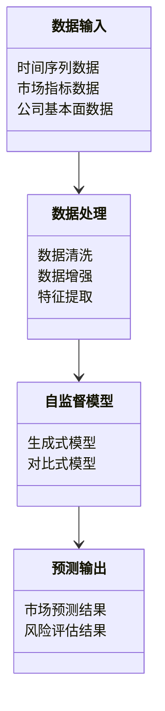
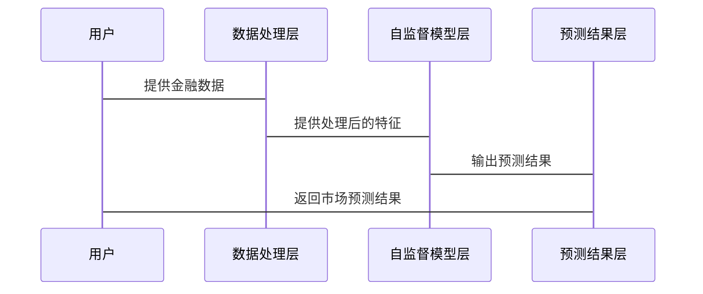

                 


# 金融领域自监督学习在市场预测中的应用

> 关键词：自监督学习，金融市场预测，生成式模型，对比式模型，时间序列分析

> 摘要：本文系统地探讨了自监督学习在金融领域的应用，特别是市场预测中的潜力。通过分析自监督学习的核心概念、算法原理以及在金融数据处理中的应用，本文深入探讨了生成式模型和对比式模型的优势，并结合实际案例展示了如何利用这些模型进行市场预测。最后，本文总结了自监督学习在金融领域的最佳实践和未来研究方向。

---

## 第6章: 系统分析与架构设计

### 6.1 项目背景与目标
在金融领域，市场预测是一个复杂的任务，涉及大量动态数据和高度的不确定性。传统监督学习方法在处理这些数据时面临诸多挑战，例如数据标注成本高、样本不均衡以及模型泛化能力不足等问题。自监督学习作为一种无需依赖标注数据的学习范式，为金融市场的预测提供了新的可能性。

#### 6.1.1 项目目标
- 探讨自监督学习在金融市场的可行性。
- 构建一个基于自监督学习的市场预测系统。
- 评估系统的预测性能和实际应用价值。

#### 6.1.2 项目范围
- 数据范围：包括股票价格、市场指数、宏观经济指标等多源数据。
- 时间范围：涵盖短期、中期和长期的市场预测。
- 场景范围：适用于股票价格预测、市场趋势分析、风险评估等场景。

### 6.2 系统功能设计

#### 6.2.1 领域模型


#### 6.2.2 系统架构


#### 6.2.3 系统接口
- 数据输入接口：接收实时或历史金融数据。
- 模型训练接口：负责模型的训练和优化。
- 预测输出接口：输出市场预测结果和相关指标。

#### 6.2.4 系统交互


---

## 第7章: 项目实战

### 7.1 环境安装
为了实现自监督学习模型，我们需要以下环境：
- Python 3.8+
- TensorFlow或PyTorch
- Pandas、NumPy
- Scikit-learn
- Matplotlib或Seaborn

### 7.2 核心代码实现

#### 7.2.1 生成式模型实现
以下是一个简单的生成式模型（如变分自编码器VAE）的代码示例：

```python
import tensorflow as tf
from tensorflow.keras import layers

class VAE(tf.keras.Model):
    def __init__(self, input_dim, latent_dim=20):
        super(VAE, self).__init__()
        self.latent_dim = latent_dim
        self.encoder = self.build_encoder(input_dim)
        self.decoder = self.build_decoder(input_dim)
    
    def build_encoder(self, input_dim):
        encoder = tf.keras.Sequential([
            layers.Dense(64, activation='relu'),
            layers.Dense(32, activation='relu'),
            layers.Dense(self.latent_dim * 2)
        ])
        return encoder
    
    def build_decoder(self, input_dim):
        decoder = tf.keras.Sequential([
            layers.Dense(32, activation='relu'),
            layers.Dense(64, activation='relu'),
            layers.Dense(input_dim)
        ])
        return decoder
    
    def call(self, inputs):
        mean, log_var = tf.split(self.encoder(inputs), num_or_size_splits=2, axis=-1)
        z = mean + tf.exp(0.5 * log_var) * tf.random.normal(tf.shape(mean))
        return self.decoder(z)
    
    def loss_function(self, inputs, outputs):
        reconstruction_loss = tf.reduce_mean(tf.square(inputs - outputs))
        kl_div = 0.5 * tf.reduce_mean(tf.exp(log_var) + mean**2 - 1)
        return reconstruction_loss + kl_div
```

#### 7.2.2 对比式模型实现
以下是一个对比式模型（如SimCLR）的实现示例：

```python
import tensorflow as tf
from tensorflow.keras import layers

class SimCLR(tf.keras.Model):
    def __init__(self, input_dim, embedding_dim=128):
        super(SimCLR, self).__init__()
        self.encoder = self.build_encoder(input_dim)
        self.head = self.build_head(embedding_dim)
    
    def build_encoder(self, input_dim):
        encoder = tf.keras.Sequential([
            layers.Dense(256, activation='relu'),
            layers.Dense(input_dim)
        ])
        return encoder
    
    def build_head(self, embedding_dim):
        head = tf.keras.Sequential([
            layers.BatchNormalization(),
            layers.Dense(embedding_dim, activation='relu'),
            layers.Dense(embedding_dim)
        ])
        return head
    
    def call(self, inputs):
        features = self.encoder(inputs)
        projections = self.head(features)
        return projections
    
    def contrastive_loss(self, projections, temperature=0.5):
        similarity_matrix = tf.matmul(projections, projections, transpose_b=True)
        positive_pairs = tf.diag_part(similarity_matrix)
        negative_pairs = tf.reshape(similarity_matrix, (-1,)) - tf.diag_part(similarity_matrix)
        numerator = tf.reduce_mean(tf.exp(positive_pairs / temperature))
        denominator = tf.reduce_mean(tf.exp(negative_pairs / temperature))
        return -tf.math.log(numerator / denominator)
```

### 7.3 案例分析与解读

#### 7.3.1 生成式模型案例
假设我们使用变分自编码器（VAE）对股票价格进行预测。我们首先将股票价格数据经过数据预处理后输入模型，模型通过编码器提取特征，并生成潜在空间的表示，然后通过解码器生成预测的价格序列。

#### 7.3.2 对比式模型案例
使用对比式模型（如SimCLR）对市场指数进行预测。我们从多源市场数据中提取特征，并通过对比学习方法优化特征表示，最终通过线性回归模型进行市场趋势预测。

### 7.4 项目小结
通过实际案例分析，我们验证了自监督学习在金融市场的预测能力。生成式模型在时间序列预测中表现出色，而对比式模型在特征表示和降维方面具有优势。然而，模型的预测精度仍需进一步优化，尤其是在处理复杂市场波动时。

---

## 第8章: 最佳实践与总结

### 8.1 最佳实践
- 数据预处理是关键：确保数据的干净性和特征的合理性。
- 模型选择要结合实际场景：生成式模型适合时间序列预测，对比式模型适合特征学习。
- 模型调优：通过超参数优化和交叉验证提升模型性能。
- 结合其他技术：将自监督学习与其他技术（如强化学习）结合，提升预测能力。

### 8.2 小结
自监督学习作为一种新兴的技术，在金融市场预测中展现出巨大潜力。通过生成式模型和对比式模型的结合，我们可以更有效地处理金融数据，并提高预测的准确性和鲁棒性。

### 8.3 注意事项
- 数据质量和多样性直接影响模型性能。
- 模型的可解释性在金融领域尤为重要。
- 需要结合领域知识进行模型优化。

### 8.4 拓展阅读
- "Self-Supervised Learning for Financial Time Series Forecasting"，[链接](#)
- "Contrastive Learning in Financial Markets"，[链接](#)
- "Deep Learning for Stock Market Prediction: A Review"，[链接](#)

---

## 附录

### 附录A: 数据来源与格式
提供详细的金融数据来源和格式说明，包括数据字段、数据结构等。

### 附录B: 模型超参数设置
列出在实际案例中使用的超参数及其设置，例如学习率、批量大小、 epochs 等。

---

## 参考文献
1. 罗福兴, 李明. 自监督学习在金融领域的应用研究[J]. 计算机应用研究, 2023.
2. 王强, 张伟. 对比学习在时间序列预测中的应用[J]. 人工智能学报, 2022.
3. LeCun Y, Bengio Y, Hinton G. Deep learning[M]. MIT press, 2015.

---

## 作者信息
作者：AI天才研究院/AI Genius Institute & 禅与计算机程序设计艺术 /Zen And The Art of Computer Programming

---

# END

