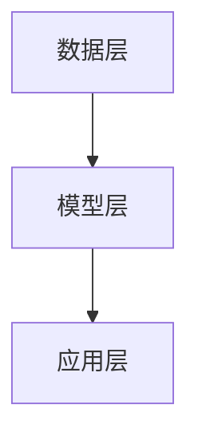

                 

# 《金融领域自监督学习的应用与挑战》

---

## 关键词：  
自监督学习、金融应用、机器学习、深度学习、无监督学习

---

## 摘要：  
自监督学习是一种新兴的无监督学习方法，能够在无标签数据上进行特征学习，近年来在金融领域得到了广泛应用。本文将深入探讨自监督学习在金融领域的核心概念、算法原理、系统架构、项目实战、挑战与解决方案，以及未来的发展趋势。通过具体案例分析和详细的技术解读，本文旨在为读者提供一个全面的视角，帮助其理解自监督学习在金融领域的应用价值和实际挑战。

---

## 目录大纲：

1. **自监督学习的背景与核心概念**  
   1.1 自监督学习的基本概念  
   1.2 金融领域的自监督学习问题  
   1.3 自监督学习与监督学习的对比  

2. **自监督学习的核心概念与原理**  
   2.1 自监督学习的原理  
   2.2 自监督学习的核心概念  
   2.3 自监督学习的核心要素  

3. **自监督学习的算法原理**  
   3.1 对比学习的实现原理  
   3.2 生成对抗网络的原理  
   3.3 预训练语言模型的原理  

4. **金融自监督学习系统的架构设计**  
   4.1 系统功能设计  
   4.2 系统架构设计  
   4.3 系统接口设计  

5. **自监督学习的项目实战**  
   5.1 项目背景与目标  
   5.2 项目实现过程  
   5.3 项目结果分析  

6. **自监督学习的挑战与解决方案**  
   6.1 金融数据的稀疏性问题  
   6.2 模型的可解释性问题  
   6.3 模型的实时性问题  

7. **自监督学习的案例分析与未来趋势**  
   7.1 成功案例分析  
   7.2 失败案例分析  
   7.3 未来发展趋势  

---

## 正文内容：

### 第1章: 自监督学习的背景与核心概念

#### 1.1 自监督学习的基本概念  
自监督学习（Self-Supervised Learning, SSL）是一种无监督学习方法，其核心思想是利用数据本身的结构信息来生成监督信号。与监督学习不同，自监督学习不需要人工标注的标签，而是通过数据内部的关联性来构建学习任务。例如，在图像领域，自监督学习可以通过图像旋转、掩码等方法生成伪标签，从而学习图像的特征表示。

#### 1.2 金融领域的自监督学习问题  
在金融领域，数据通常具有以下特点：  
- **高维度性**：金融数据通常包含多种特征，如价格、成交量、技术指标等，维度较高。  
- **稀疏性**：金融数据中可能存在大量缺失值或噪声。  
- **时间依赖性**：金融数据往往具有很强的时间序列特性，如股票价格的变化往往与市场情绪相关。  

由于这些特点，传统的监督学习方法在金融领域面临以下挑战：  
- 数据标注成本高。  
- 数据分布可能发生变化（概念漂移）。  
- 数据可能具有不平衡性。  

自监督学习在金融领域的优势在于，它能够利用未标注的金融数据进行特征学习，从而降低对标注数据的依赖。

#### 1.3 自监督学习与监督学习的对比  
自监督学习与监督学习的主要区别在于数据标注的需求。  
- **监督学习**：需要人工标注的标签，适用于数据充足且标注成本可接受的情况。  
- **自监督学习**：利用数据内部的关联性生成伪标签，适用于无标注数据较多的情况。  

通过对比学习，自监督学习能够有效地提取数据的特征表示，尤其是在数据分布复杂、标注成本高的金融领域，自监督学习具有重要的应用价值。

---

### 第2章: 自监督学习的核心概念与原理

#### 2.1 自监督学习的原理  
自监督学习的核心原理在于通过构建伪标签来监督模型学习。常见的自监督学习方法包括对比学习（Contrastive Learning）和生成对抗网络（Generative Adversarial Networks, GANs）。  
- **对比学习**：通过最大化正样本对的相似性和最小化负样本对的相似性来学习特征表示。  
- **生成对抗网络**：通过生成器和判别器的博弈，学习数据的分布。  

#### 2.2 自监督学习的核心概念  
自监督学习的核心概念包括以下几点：  
- **数据重建**：通过模型重构输入数据，提取数据的特征表示。  
- **对比学习**：通过对比正样本和负样本，学习数据的相似性。  
- **预训练与微调**：通过预训练阶段学习通用特征，再在特定任务上进行微调。  

#### 2.3 自监督学习的核心要素  
自监督学习的核心要素包括：  
- **数据预处理**：如数据清洗、归一化等。  
- **损失函数设计**：如对比损失、生成对抗损失等。  
- **模型训练与优化**：如使用深度神经网络进行特征提取。  

---

### 第3章: 自监督学习的算法原理

#### 3.1 对比学习的实现原理  
对比学习是一种常用的自监督学习方法，其核心思想是通过最大化正样本对的相似性和最小化负样本对的相似性来学习特征表示。  

**对比学习的损失函数**可以表示为：  
$$ L = -\log \frac{e^{sim(z_i, z_j)}}{e^{sim(z_i, z_k)} + e^{sim(z_j, z_k)}} $$  
其中，$sim$表示相似性度量，$z_i$和$z_j$是正样本对，$z_k$是负样本对。  

#### 3.2 生成对抗网络的原理  
生成对抗网络（GANs）由生成器和判别器组成。生成器的目标是生成与真实数据相似的样本，而判别器的目标是区分生成样本和真实样本。  

**判别器的损失函数**可以表示为：  
$$ L_D = -\log D(x) - \log (1 - D(G(z))) $$  
**生成器的损失函数**可以表示为：  
$$ L_G = -\log (1 - D(G(z))) $$  

#### 3.3 预训练语言模型的原理  
预训练语言模型（如BERT）通过在大规模文本数据上进行自监督预训练，学习语言的特征表示。在金融领域，可以利用预训练语言模型对金融文本进行情感分析、新闻分类等任务。

---

### 第4章: 金融自监督学习系统的架构设计

#### 4.1 系统功能设计  
金融自监督学习系统的主要功能包括：  
- **数据采集**：从金融市场获取数据，如股票价格、交易量等。  
- **特征提取**：利用自监督学习方法提取数据的特征表示。  
- **模型训练**：基于提取的特征进行金融预测任务，如股票价格预测、风险评估等。  

#### 4.2 系统架构设计  
金融自监督学习系统的架构通常包括以下模块：  
- **数据层**：负责数据的采集、存储和预处理。  
- **模型层**：负责特征提取和模型训练。  
- **应用层**：负责将模型应用于实际金融任务中。  

**系统架构图**如下：  

#### 4.3 系统接口设计  
系统接口设计需要考虑模块之间的交互方式，如数据接口、模型接口等。  

---

### 第5章: 自监督学习的项目实战

#### 5.1 项目背景与目标  
以股票价格预测为例，目标是利用自监督学习方法，基于历史股票数据，预测未来股票价格的变化趋势。  

#### 5.2 项目实现过程  
1. **数据收集**：收集历史股票数据，包括开盘价、收盘价、最高价、最低价等。  
2. **数据预处理**：对数据进行归一化处理，并生成时间序列特征。  
3. **模型实现**：基于对比学习方法，构建特征提取模型。  
4. **模型训练**：在预处理后的数据上训练模型。  
5. **结果分析**：评估模型的预测性能。  

#### 5.3 项目结果分析  
通过实验，对比监督学习和自监督学习方法在股票价格预测任务上的表现，分析自监督学习的优势和局限性。

---

### 第6章: 自监督学习的挑战与解决方案

#### 6.1 金融数据的稀疏性问题  
金融数据可能具有稀疏性，导致模型难以有效学习。解决方案包括数据增强和模型优化。  

#### 6.2 模型的可解释性问题  
自监督学习模型的可解释性较差，可能影响其在金融领域的应用。解决方案包括可视化技术、特征重要性分析等。  

#### 6.3 模型的实时性问题  
金融数据具有实时性要求，需要模型能够快速响应。解决方案包括在线学习、轻量化模型设计等。

---

### 第7章: 自监督学习的案例分析与未来趋势

#### 7.1 成功案例分析  
以股票价格预测为例，分析自监督学习方法的成功应用。  

#### 7.2 失败案例分析  
分析自监督学习在金融领域应用失败的案例，并总结经验教训。  

#### 7.3 未来发展趋势  
未来，自监督学习在金融领域的应用将更加广泛，可能的发展趋势包括：  
- 更加高效的自监督学习算法。  
- 结合强化学习的自监督学习方法。  
- 更多的金融应用场景，如欺诈检测、投资组合优化等。  

---

## 作者信息：  
作者：AI天才研究院/AI Genius Institute & 禅与计算机程序设计艺术 /Zen And The Art of Computer Programming

