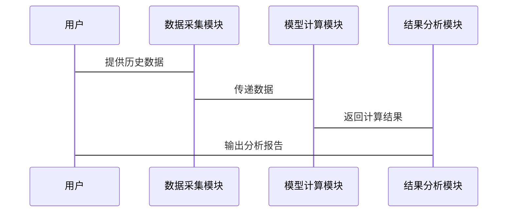

                 


# 金融风险压力测试模型设计

> 关键词：金融风险，压力测试，蒙特卡洛模拟，VaR，CVaR，系统架构

> 摘要：本文详细探讨了金融风险压力测试模型的设计，从背景介绍到系统架构，再到项目实战，全面解析了压力测试模型的核心概念、算法原理和实现方法。文章通过丰富的图表和代码示例，帮助读者理解压力测试模型的构建过程，并通过实际案例分析，展示了如何在实际中应用这些模型进行风险管理。

---

# 第1章: 金融风险压力测试概述

## 1.1 金融风险的基本概念

### 1.1.1 金融风险的定义
金融风险是指在金融活动中，由于各种不确定因素的影响，导致资金损失或收益减少的可能性。金融风险主要包括市场风险、信用风险、流动性风险和操作风险等。

### 1.1.2 金融风险的主要类型
- **市场风险**：由于市场价格波动引起的风险，包括利率风险、汇率风险和股票价格风险。
- **信用风险**：由于债务人或交易对手违约而引起的损失。
- **流动性风险**：无法及时以合理价格买卖资产而产生的风险。
- **操作风险**：由于内部流程、人员或系统的缺陷导致的损失。

### 1.1.3 金融风险的衡量指标
常用的金融风险衡量指标包括波动率、VaR（Value at Risk）、CVaR（Conditional Value at Risk）等。

## 1.2 压力测试的定义与作用

### 1.2.1 压力测试的定义
压力测试是一种评估模型在极端市场条件下表现的方法，通过模拟极端情况下的资产价值变化，来评估模型的稳健性和风险敞口。

### 1.2.2 压力测试的目的与意义
压力测试的主要目的是评估金融资产在极端情况下的表现，帮助机构识别潜在风险，制定应对策略。

### 1.2.3 压力测试的实施流程
压力测试的实施流程包括数据收集、模型选择、情景设置、结果分析和报告撰写等步骤。

## 1.3 金融风险压力测试的应用场景

### 1.3.1 银行与金融机构的风险管理
银行和金融机构通过压力测试评估其资产组合在极端情况下的表现，确保其资本充足性。

### 1.3.2 投资组合风险评估
投资者通过压力测试评估其投资组合在极端市场条件下的风险敞口。

### 1.3.3 企业财务稳健性分析
企业通过压力测试评估其财务状况在极端情况下的稳健性。

## 1.4 本章小结
本章介绍了金融风险的基本概念、压力测试的定义与作用，以及压力测试在不同场景下的应用。

---

# 第2章: 压力测试模型的核心概念

## 2.1 压力测试模型的基本结构

### 2.1.1 模型输入
模型输入包括历史数据、市场假设、情景设定等。

### 2.1.2 模型处理
模型处理包括数据预处理、模型参数估计、情景模拟等步骤。

### 2.1.3 模型输出
模型输出包括资产价值变化、风险指标（如VaR、CVaR）等。

## 2.2 压力测试模型的关键要素

### 2.2.1 风险因素的选取
选择影响资产价格的主要风险因素，如利率、汇率、股票价格等。

### 2.2.2 模型假设与限制
假设资产价格的变化服从某种概率分布，如正态分布或对数正态分布。

### 2.2.3 模型的适用范围
压力测试模型适用于评估资产在极端情况下的表现。

## 2.3 压力测试模型的分类

### 2.3.1 情景分析法
情景分析法通过设定不同的市场情景，评估资产在不同情景下的表现。

### 2.3.2 蒙特卡洛模拟法
蒙特卡洛模拟法通过随机抽样模拟资产价格的变化，评估资产在极端情况下的表现。

### 2.3.3 方差-协方差法
方差-协方差法通过计算资产价格的变化的方差和协方差，评估资产组合的风险。

## 2.4 本章小结
本章详细介绍了压力测试模型的基本结构、关键要素和分类。

---

# 第3章: 压力测试模型的算法原理

## 3.1 蒙特卡洛模拟法

### 3.1.1 蒙特卡洛模拟的基本原理
蒙特卡洛模拟通过随机抽样模拟资产价格的变化，评估资产在极端情况下的表现。

### 3.1.2 蒙特卡洛模拟的实现步骤
1. 确定资产价格的变化模型。
2. 生成随机数，模拟资产价格的变化。
3. 计算资产在不同情景下的价值。
4. 统计分析模拟结果，评估风险。

### 3.1.3 蒙特卡洛模拟的优缺点
优点：能够模拟复杂市场情景，计算结果准确。
缺点：计算量大，需要大量计算资源。

## 3.2 方差-协方差法

### 3.2.1 方差-协方差法的原理
方差-协方差法通过计算资产价格变化的方差和协方差，评估资产组合的风险。

### 3.2.2 方差-协方差法的计算步骤
1. 计算各资产收益率的方差和协方差。
2. 构建资产组合的方差-协方差矩阵。
3. 计算资产组合的风险指标。

### 3.2.3 方差-协方差法的适用场景
适用于资产数量较少，市场情景较为简单的场景。

## 3.3 线性回归模型

### 3.3.1 线性回归模型的定义
线性回归模型通过建立资产价格与风险因素的线性关系，预测资产价格的变化。

### 3.3.2 线性回归模型的实现步骤
1. 收集历史数据。
2. 建立回归模型。
3. 计算回归系数。
4. 预测资产价格变化。

### 3.3.3 线性回归模型的优缺点
优点：简单易懂，计算效率高。
缺点：假设资产价格变化服从线性关系，可能与实际市场不符。

## 3.4 本章小结
本章详细介绍了蒙特卡洛模拟法、方差-协方差法和线性回归模型的原理和实现步骤。

---

# 第4章: 压力测试模型的系统架构

## 4.1 问题场景介绍
本文设计的金融风险压力测试系统用于评估资产在极端市场条件下的表现。

## 4.2 系统功能设计

### 4.2.1 领域模型


### 4.2.2 系统架构设计


### 4.2.3 系统接口设计
系统接口包括数据输入接口、模型参数设置接口和结果输出接口。

### 4.2.4 系统交互设计


## 4.3 本章小结
本章详细介绍了金融风险压力测试系统的架构设计，包括领域模型、系统架构、接口设计和交互流程。

---

# 第5章: 项目实战

## 5.1 环境安装
安装Python、NumPy、Pandas和Matplotlib等库。

## 5.2 核心代码实现

### 5.2.1 蒙特卡洛模拟代码
```python
import numpy as np
import matplotlib.pyplot as plt

def monte_carlo_simulation(prices, days, iterations):
    # 计算资产收益率
    returns = np.log(prices / prices.shift(1)).dropna()
    mu = returns.mean()
    sigma = returns.std()
    # 生成随机数
    random_numbers = np.random.normal(mu, sigma, (iterations, days))
    # 计算资产价格变化
    simulated_prices = prices[-1] * np.exp(random_numbers.cumsum(axis=1))
    return simulated_prices

prices = [100, 105, 98, 110, 108]  # 示例数据
days = 5
iterations = 1000
simulated_prices = monte_carlo_simulation(prices, days, iterations)
print(simulated_prices)
```

### 5.2.2 VaR计算代码
```python
import numpy as np

def calculate VaR(returns, alpha=0.05):
    return np.quantile(returns, alpha)

returns = [0.01, -0.02, 0.03, -0.01, 0.005]
VaR = calculate VaR(returns)
print(f"VaR at {1-alpha} quantile: {VaR}")
```

## 5.3 代码解读与分析
代码实现包括蒙特卡洛模拟和VaR计算，展示了如何通过代码实现压力测试模型的核心算法。

## 5.4 案例分析
以某资产组合为例，通过代码实现压力测试模型，评估其在极端情况下的表现。

## 5.5 项目小结
本章通过实际案例展示了如何通过代码实现压力测试模型，并分析了模型的优缺点。

---

# 第6章: 最佳实践

## 6.1 小结
本文详细介绍了金融风险压力测试模型的设计与实现，包括核心概念、算法原理和系统架构。

## 6.2 注意事项
在实际应用中，需要注意模型的假设和限制，确保数据的准确性和模型的适用性。

## 6.3 拓展阅读
推荐进一步阅读关于蒙特卡洛模拟、VaR和CVaR的文献，深入理解压力测试模型的理论与应用。

---

# 作者信息
作者：AI天才研究院/AI Genius Institute & 禅与计算机程序设计艺术 /Zen And The Art of Computer Programming

---

以上是文章的完整目录和内容结构，确保每个部分都详细讲解了压力测试模型的核心概念和实现方法。

